::: {style="DISPLAY: none"}
{#d2h_url_template}{#d2h_package_url style="WIDTH: 0px; DISPLAY: none; HEIGHT: 0px"}
:::

::: {.d2h_secondary_topic style="PADDING-BOTTOM: 10pt; MARGIN: 0pt; PADDING-LEFT: 0pt; PADDING-RIGHT: 0pt; PADDING-TOP: 0pt"}
#### Appearance {#appearance style="tab-stops: 0pt"}

[The GalleryView control supports fourteen built-in themes which enhance the look and feel of the control.]{style="FONT-WEIGHT: normal"}

 

Properties

+-------------+--------------------------------------+------------------+--------------------------------------------------+-------------+
| Name        | Description                          | Type of property | Value it accepts                                 | Dependency  |
+-------------+--------------------------------------+------------------+--------------------------------------------------+-------------+
| AutoFormat  | Used to define the syncfusion themes | enum             | [Skins]{style="COLOR: #2b91af"}.Office2007Blue   | NA          |
|             |                                      |                  |                                                  |             |
|             |                                      |                  | [Skins]{style="COLOR: #2b91af"}.Office2007Silver |             |
|             |                                      |                  |                                                  |             |
|             |                                      |                  | [Skins]{style="COLOR: #2b91af"}.Office2007Black  |             |
|             |                                      |                  |                                                  |             |
|             |                                      |                  | [Skins]{style="COLOR: #2b91af"}.Vista            |             |
|             |                                      |                  |                                                  |             |
|             |                                      |                  | [Skins]{style="COLOR: #2b91af"}.Almond           |             |
|             |                                      |                  |                                                  |             |
|             |                                      |                  | [Skins]{style="COLOR: #2b91af"}.Blueberry        |             |
|             |                                      |                  |                                                  |             |
|             |                                      |                  | [Skins]{style="COLOR: #2b91af"}.Blend            |             |
|             |                                      |                  |                                                  |             |
|             |                                      |                  | [Skins]{style="COLOR: #2b91af"}.Olive            |             |
|             |                                      |                  |                                                  |             |
|             |                                      |                  | [Skins]{style="COLOR: #2b91af"}.Turquoise        |             |
|             |                                      |                  |                                                  |             |
|             |                                      |                  | [Skins]{style="COLOR: #2b91af"}.Monochrome       |             |
|             |                                      |                  |                                                  |             |
|             |                                      |                  | [Skins]{style="COLOR: #2b91af"}.Sandune          |             |
|             |                                      |                  |                                                  |             |
|             |                                      |                  | [Skins]{style="COLOR: #2b91af"}.VS2010           |             |
|             |                                      |                  |                                                  |             |
|             |                                      |                  | [Skins]{style="COLOR: #2b91af"}.Marble           |             |
|             |                                      |                  |                                                  |             |
|             |                                      |                  | [Skins]{style="COLOR: #2b91af"}.Midnight         |             |
+-------------+--------------------------------------+------------------+--------------------------------------------------+-------------+

 

Using Builder

1.   In the **view**, invoke the **GalleryView** helper with the control ID as an argument.**[]{style="FONT-SIZE: 8pt"}**

 

+------------------------------------------------------------------------------------------------------------------------------------------------------------------------------------------------------------------------------------------------------------------------------------------------------------------------------+
| **[\[ASPX\]]{style="FONT-FAMILY: 'Courier New'"}**                                                                                                                                                                                                                                                                           |
|                                                                                                                                                                                                                                                                                                                              |
| [  ]{style="FONT-FAMILY: Consolas; FONT-SIZE: 9.5pt"}                                                                                                                                                                                                                                                                        |
|                                                                                                                                                                                                                                                                                                                              |
| [\<%]{style="FONT-FAMILY: Consolas; BACKGROUND: yellow; FONT-SIZE: 9.5pt"}[=]{style="FONT-FAMILY: Consolas; COLOR: blue; FONT-SIZE: 9.5pt"}[Html.Syncfusion().GalleryView([\"gallery1\"]{style="COLOR: #a31515"}).AutoFormat(Skins.Vista)[%\>]{style="BACKGROUND: yellow"}]{style="FONT-FAMILY: Consolas; FONT-SIZE: 9.5pt"} |
|                                                                                                                                                                                                                                                                                                                              |
| **[]{style="FONT-FAMILY: 'Courier New'"}**                                                                                                                                                                                                                                                                                   |
+------------------------------------------------------------------------------------------------------------------------------------------------------------------------------------------------------------------------------------------------------------------------------------------------------------------------------+

 

+-------------------------------------------------------------------------------------------------------------------------------------------------------------------------------------------------------------------------------------+
| **[\[Razor\]]{style="FONT-FAMILY: 'Courier New'"}**                                                                                                                                                                                 |
|                                                                                                                                                                                                                                     |
| [  ]{style="FONT-FAMILY: Consolas; FONT-SIZE: 9.5pt"}                                                                                                                                                                               |
|                                                                                                                                                                                                                                     |
| [@]{style="FONT-FAMILY: Consolas; BACKGROUND: yellow; FONT-SIZE: 9.5pt"}[{]{style="FONT-FAMILY: Consolas; BACKGROUND: yellow; FONT-SIZE: 9.5pt"}                                                                                    |
|                                                                                                                                                                                                                                     |
| [ Html.Syncfusion().GalleryView([\"gallery1\"]{style="COLOR: #a31515"}).AutoFormat(Skins.Vista).Render();]{style="FONT-FAMILY: Consolas; FONT-SIZE: 9.5pt"}[}]{style="FONT-FAMILY: Consolas; BACKGROUND: yellow; FONT-SIZE: 9.5pt"} |
|                                                                                                                                                                                                                                     |
| []{style="FONT-FAMILY: Consolas; FONT-SIZE: 9.5pt"}                                                                                                                                                                                 |
|                                                                                                                                                                                                                                     |
| []{style="FONT-FAMILY: 'Courier New'"}                                                                                                                                                                                              |
+-------------------------------------------------------------------------------------------------------------------------------------------------------------------------------------------------------------------------------------+

 

2.   Build and run the application.

 

Using Model

1.   In the controller, create an instance of **GalleryViewModel**.

[]{style="FONT-FAMILY: Consolas; FONT-SIZE: 9.5pt"} 

+----------------------------------------------------------------------------------------------------------------------------------------------------------------------------------+
| **[Controller]{style="FONT-FAMILY: 'Courier New'"}**                                                                                                                             |
|                                                                                                                                                                                  |
| [public]{style="FONT-FAMILY: 'Courier New'; COLOR: blue"}[ [ActionResult]{style="COLOR: #2b91af"} Index()]{style="FONT-FAMILY: 'Courier New'"}                                   |
|                                                                                                                                                                                  |
| [        {]{style="FONT-FAMILY: 'Courier New'"}                                                                                                                                  |
|                                                                                                                                                                                  |
| [            [//Create an instance of GalleryViewModel.]{style="COLOR: green"}]{style="FONT-FAMILY: 'Courier New'"}                                                              |
|                                                                                                                                                                                  |
| [            [GalleryViewModel]{style="COLOR: #2b91af"} myModel = [new]{style="COLOR: blue"} [GalleryViewModel]{style="COLOR: #2b91af"} ();]{style="FONT-FAMILY: 'Courier New'"} |
|                                                                                                                                                                                  |
| [            myModel.AutoFormat = Skins.Vista;]{style="FONT-FAMILY: 'Courier New'"}                                                                                              |
|                                                                                                                                                                                  |
| **[            ]{style="FONT-FAMILY: 'Courier New'"}**[]{style="FONT-FAMILY: 'Courier New'"}                                                                                     |
|                                                                                                                                                                                  |
| [            [//Pass the instance through view data to the view.]{style="COLOR: green"}]{style="FONT-FAMILY: 'Courier New'"}                                                     |
|                                                                                                                                                                                  |
| [            ViewData\[[\"myGalleryView\"]{style="COLOR: #a31515"}\] = myModel;]{style="FONT-FAMILY: 'Courier New'"}                                                             |
|                                                                                                                                                                                  |
| [            [return]{style="COLOR: blue"} View();]{style="FONT-FAMILY: 'Courier New'"}                                                                                          |
|                                                                                                                                                                                  |
| [        }]{style="FONT-FAMILY: 'Courier New'"}                                                                                                                                  |
|                                                                                                                                                                                  |
| []{style="FONT-FAMILY: 'Courier New'"}                                                                                                                                           |
+----------------------------------------------------------------------------------------------------------------------------------------------------------------------------------+

[]{style="FONT-FAMILY: Consolas; FONT-SIZE: 9.5pt"} 

2.   In the **view**, invoke the **GalleryView** helper with the view data key as the control ID.**

[]{style="FONT-FAMILY: Consolas; BACKGROUND: yellow; FONT-SIZE: 9.5pt"} 

+---------------------------------------------------------------------------------------------------------------------------------------------------------------------------------------------------------------------------------------------------------------------+
| **[\[ASPX\]]{style="FONT-FAMILY: 'Courier New'"}**                                                                                                                                                                                                                  |
|                                                                                                                                                                                                                                                                     |
| [\<%]{style="FONT-FAMILY: 'Courier New'; BACKGROUND: yellow"}[=]{style="FONT-FAMILY: 'Courier New'; COLOR: blue"}[Html.Syncfusion().GalleryView ([\"myGalleryView\"]{style="COLOR: #a31515"})[%\>]{style="BACKGROUND: yellow"}]{style="FONT-FAMILY: 'Courier New'"} |
|                                                                                                                                                                                                                                                                     |
| **[]{style="FONT-FAMILY: 'Times New Roman','serif'; FONT-SIZE: 12pt"}**                                                                                                                                                                                             |
|                                                                                                                                                                                                                                                                     |
| **[\[Razor\]]{style="FONT-FAMILY: 'Courier New'"}**                                                                                                                                                                                                                 |
|                                                                                                                                                                                                                                                                     |
| [       [@]{style="BACKGROUND: yellow"}]{style="FONT-FAMILY: 'Courier New'"}[{]{style="FONT-FAMILY: Consolas; BACKGROUND: yellow; FONT-SIZE: 9.5pt"}                                                                                                                |
|                                                                                                                                                                                                                                                                     |
| [ Html.Syncfusion().GalleryView ([\"myGalleryView\").Render();]{style="COLOR: #a31515"}]{style="FONT-FAMILY: 'Courier New'"}[}]{style="FONT-FAMILY: Consolas; BACKGROUND: yellow; FONT-SIZE: 9.5pt"}                                                                |
|                                                                                                                                                                                                                                                                     |
| []{style="FONT-FAMILY: 'Courier New'; BACKGROUND: yellow"}                                                                                                                                                                                                          |
+---------------------------------------------------------------------------------------------------------------------------------------------------------------------------------------------------------------------------------------------------------------------+

[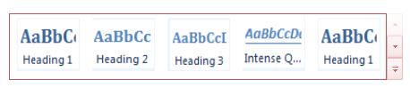{border="0"}]{style="FONT-FAMILY: 'Times New Roman','serif'; FONT-SIZE: 12pt"}

[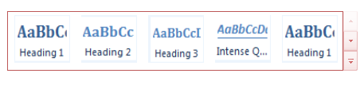{border="0"}]{style="FONT-FAMILY: 'Times New Roman','serif'; FONT-SIZE: 12pt"}

Fourteen built-in skins of the GalleryView control:

**[]{style="FONT-SIZE: 12pt"}** 

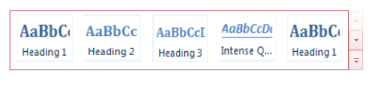{border="0"}  

Figure 123: Gallery View---Almond Skin    

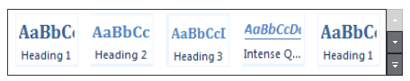{border="0"}

Figure 124: Gallery View---Blend Skin

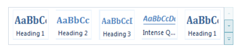{border="0"}

Figure 125: Gallery View---BlueBerry Skin

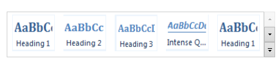{border="0"}

Figure 126: Gallery View---Marble Skin

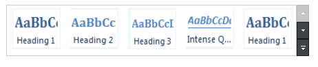{border="0"}

Figure 127: Gallery View---MidNight Skin

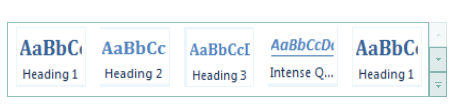{border="0"}

Figure 128: Gallery View---Monochrome Skin

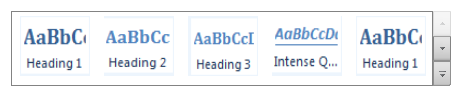{border="0"}

Figure 129: Gallery View---Office2007Black Skin

  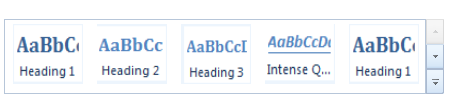{border="0"}

Figure 6: Gallery View---Office2007Blue Skin

 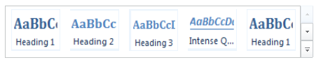{border="0"}

Figure 130: Gallery View---Office2007Silver Skin

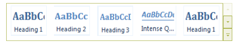{border="0"}

Figure 131: Gallery View---Olive Skin

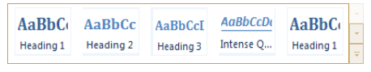{border="0"}

Figure 132: Gallery View---Sandune Skin

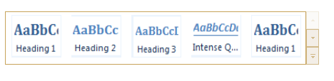{border="0"}

Figure 133: Gallery View---Turqoise Skin

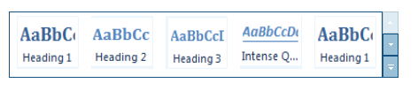{border="0"}

Figure 134: Gallery View---Vista Skin

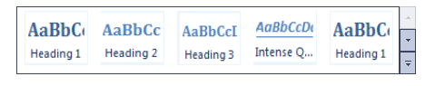{border="0"}

Figure 135: Gallery View---VS2010 Skin

 

[]{#related-topics}
:::
