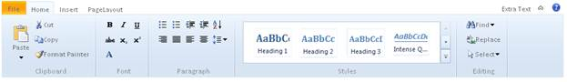

::: {style="DISPLAY: none"}
{#d2h_url_template}{#d2h_package_url style="WIDTH: 0px; DISPLAY: none; HEIGHT: 0px"}
:::

::: {.d2h_secondary_topic style="PADDING-BOTTOM: 10pt; MARGIN: 0pt; PADDING-LEFT: 0pt; PADDING-RIGHT: 0pt; PADDING-TOP: 0pt"}
#### Appearance {#appearance style="tab-stops: 0pt"}

The Ribbon control supports fourteen predefined skins to enhance the look and feel.**[]{style="FONT-SIZE: 12pt"}**

 

Properties

+-------------+---------------------------------------+----------------------------------+-------------------------+-------------+
| Name        | Description                           | Type of property                 | Value it accepts        | Dependency  |
+-------------+---------------------------------------+----------------------------------+-------------------------+-------------+
| AutoFormat  | Used to define the Syncfusion themes. | [enum]{style="FONT-SIZE: 9.5pt"} | Skins.Office2007Blue,   | NA          |
|             |                                       |                                  |                         |             |
|             |                                       |                                  | Skins.Office2007Silver, |             |
|             |                                       |                                  |                         |             |
|             |                                       |                                  | Skins.Office2007Black,  |             |
|             |                                       |                                  |                         |             |
|             |                                       |                                  | Skins.Vista,            |             |
|             |                                       |                                  |                         |             |
|             |                                       |                                  | Skins.Almond,           |             |
|             |                                       |                                  |                         |             |
|             |                                       |                                  | Skins.Blueberry,        |             |
|             |                                       |                                  |                         |             |
|             |                                       |                                  | Skins.Blend,            |             |
|             |                                       |                                  |                         |             |
|             |                                       |                                  | Skins.Olive,            |             |
|             |                                       |                                  |                         |             |
|             |                                       |                                  | Skins.Turquoise,        |             |
|             |                                       |                                  |                         |             |
|             |                                       |                                  | Skins.Monochrome,       |             |
|             |                                       |                                  |                         |             |
|             |                                       |                                  | Skins.Sandune,          |             |
|             |                                       |                                  |                         |             |
|             |                                       |                                  | Skins.VS2010,           |             |
|             |                                       |                                  |                         |             |
|             |                                       |                                  | Skins.Marble,           |             |
|             |                                       |                                  |                         |             |
|             |                                       |                                  | Skins.Midnight          |             |
+-------------+---------------------------------------+----------------------------------+-------------------------+-------------+

 

Using Builder

The following steps explain how to set Syncfusion themes through the builder.

1.   In the **view**, invoke the **Ribbon** helper followed by the **AutoFormat** method with the desired theme as an argument.

[]{style="FONT-FAMILY: Consolas; FONT-SIZE: 9.5pt"} 

+-----------------------------------------------------------------------------------------------------------------------------------------------------------------------------------------------------------------------------------------------------------------------------------------------------------------------------------------------------------------------------------------------------------------------------------------------------------------------------------------------------------------------------------------------------------------------------------------------------------------------------------------------------------------------------+
| **[\[ASPX\]]{style="FONT-FAMILY: 'Courier New'"}**                                                                                                                                                                                                                                                                                                                                                                                                                                                                                                                                                                                                                          |
|                                                                                                                                                                                                                                                                                                                                                                                                                                                                                                                                                                                                                                                                             |
| [\<%]{style="FONT-FAMILY: Consolas; BACKGROUND: yellow; FONT-SIZE: 9.5pt"}[=]{style="FONT-FAMILY: Consolas; COLOR: blue; FONT-SIZE: 9.5pt"}[Html.Syncfusion().Ribbon([\"ribbon1\"]{style="COLOR: #a31515"})**.**]{style="FONT-FAMILY: Consolas; FONT-SIZE: 9.5pt"}**[AutoFormat]{style="FONT-FAMILY: 'Courier New'"}[(]{style="FONT-FAMILY: Consolas; FONT-SIZE: 9.5pt"}[Skins]{style="FONT-FAMILY: 'Courier New'; COLOR: #2b91af"}[.Office2007Blue]{style="FONT-FAMILY: 'Courier New'"}[)]{style="FONT-FAMILY: Consolas; FONT-SIZE: 9.5pt"}**[%\>]{style="FONT-FAMILY: Consolas; BACKGROUND: yellow; FONT-SIZE: 9.5pt"}[]{style="FONT-FAMILY: Consolas; FONT-SIZE: 9.5pt"} |
|                                                                                                                                                                                                                                                                                                                                                                                                                                                                                                                                                                                                                                                                             |
|                                                                                                                                                                                                                                                                                                                                                                                                                                                                                                                                                                                                                                                                             |
|                                                                                                                                                                                                                                                                                                                                                                                                                                                                                                                                                                                                                                                                             |
| **[\[Razor\]]{style="FONT-FAMILY: 'Courier New'"}**                                                                                                                                                                                                                                                                                                                                                                                                                                                                                                                                                                                                                         |
|                                                                                                                                                                                                                                                                                                                                                                                                                                                                                                                                                                                                                                                                             |
| [@]{style="FONT-FAMILY: Consolas; BACKGROUND: yellow; FONT-SIZE: 9.5pt"}[Html.Syncfusion().Ribbon([\"ribbon1]{style="COLOR: #a31515"}]{style="FONT-FAMILY: Consolas; FONT-SIZE: 9.5pt"}[\"]{style="FONT-FAMILY: Consolas; COLOR: #a31515; FONT-SIZE: 9.5pt"}[)**.**]{style="FONT-FAMILY: Consolas; FONT-SIZE: 9.5pt"}**[AutoFormat]{style="FONT-FAMILY: 'Courier New'"}[(]{style="FONT-FAMILY: Consolas; FONT-SIZE: 9.5pt"}[Skins]{style="FONT-FAMILY: 'Courier New'; COLOR: #2b91af"}[.Office2007Blue)]{style="FONT-FAMILY: 'Courier New'"}**                                                                                                                              |
|                                                                                                                                                                                                                                                                                                                                                                                                                                                                                                                                                                                                                                                                             |
| []{style="FONT-FAMILY: Consolas; FONT-SIZE: 9.5pt"}                                                                                                                                                                                                                                                                                                                                                                                                                                                                                                                                                                                                                         |
+-----------------------------------------------------------------------------------------------------------------------------------------------------------------------------------------------------------------------------------------------------------------------------------------------------------------------------------------------------------------------------------------------------------------------------------------------------------------------------------------------------------------------------------------------------------------------------------------------------------------------------------------------------------------------------+

 

2.   Build and run the application.

{border="0"}

Figure 197: Ribbon with Office2007Blue Theme

[]{#related-topics}
:::
