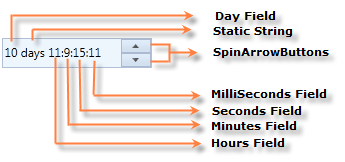

::: {style="DISPLAY: none"}
{#d2h_url_template}{#d2h_package_url style="WIDTH: 0px; DISPLAY: none; HEIGHT: 0px"}
:::

::: {.d2h_secondary_topic style="PADDING-BOTTOM: 10pt; MARGIN: 0pt; PADDING-LEFT: 0pt; PADDING-RIGHT: 0pt; PADDING-TOP: 0pt"}
#### Appearance and Structure {#appearance-and-structure style="tab-stops: 0pt"}

 

{border="0"}

Figure 1095: Structure of the Control

 

The themes for TimeSpanEdit Control:

[·      ]{style="FONT-FAMILY: Symbol"}Office2007Blue

[·      ]{style="FONT-FAMILY: Symbol"}Office2007Black

[·      ]{style="FONT-FAMILY: Symbol"}Office2007Silver

[·      ]{style="FONT-FAMILY: Symbol"}Office2010Blue

[·      ]{style="FONT-FAMILY: Symbol"}Office2010Black

[·      ]{style="FONT-FAMILY: Symbol"}Office2010Silver

[·      ]{style="FONT-FAMILY: Symbol"}Blend

[·      ]{style="FONT-FAMILY: Symbol"}VS2010

[]{#related-topics}
:::
