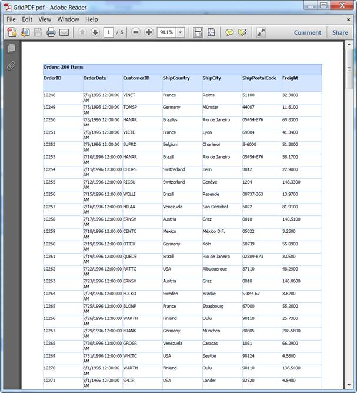
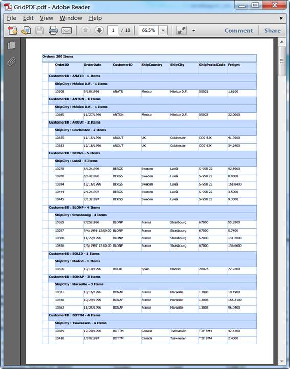

::: {style="DISPLAY: none"}
{#d2h_url_template}{#d2h_package_url style="WIDTH: 0px; DISPLAY: none; HEIGHT: 0px"}
:::

::: {.d2h_secondary_topic style="PADDING-BOTTOM: 10pt; MARGIN: 0pt; PADDING-LEFT: 0pt; PADDING-RIGHT: 0pt; PADDING-TOP: 0pt"}
#### Appearance and Structure of PDF Export[]{style="FONT-SIZE: 14pt"} {#appearance-and-structure-of-pdf-export style="tab-stops: 0pt"}

The following figures give you a basic idea of the appearance and structure of the feature.

This feature allows you to export normal and nested grids to PDF formats, as you can see in the following screenshots:

 

 

{border="0"}

Figure 200: Normal Grid in PDF

 

{border="0"}

Figure 201: Hierarchical (Nested) Grid in PDF

[]{style="FONT-FAMILY: 'Calibri','sans-serif'; FONT-SIZE: 11pt"} 

[]{#related-topics}
:::
