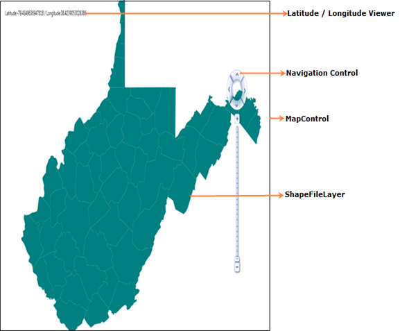

::: {style="DISPLAY: none"}
{#d2h_url_template}{#d2h_package_url style="WIDTH: 0px; DISPLAY: none; HEIGHT: 0px"}
:::

::::: {#nsbanner .d2h_main_nsbanner style="BORDER-BOTTOM: #999999 1px solid; POSITION: relative; PADDING-BOTTOM: 0px; BACKGROUND-COLOR: transparent; PADDING-LEFT: 0px; PADDING-RIGHT: 0px; DISPLAY: none; BORDER-TOP: #999999 1px solid; PADDING-TOP: 0px; LEFT: 0px"}
:::: {#TitleRow .d2h_main_titlerow style="PADDING-BOTTOM: 4px; BACKGROUND-COLOR: transparent; PADDING-LEFT: 22px; WIDTH: 100%; PADDING-RIGHT: 10px; DISPLAY: none; PADDING-TOP: 4px"}
::: {#ienav .d2h_main_ienav style="DISPLAY: none"}
{#D2HPrevious .D2HPreviousEnabled}  {#D2HNext .D2HNextEnabled}
:::
::::
:::::

:::: {#nstext .d2h_main_nstext style="PADDING-BOTTOM: 10px; BACKGROUND-COLOR: transparent; PADDING-LEFT: 22px; PADDING-RIGHT: 10px; HEIGHT: 100%; OVERFLOW: auto; PADDING-TOP: 5px" hasuserbackground="true" valign="bottom"}
::: {#d2h_breadcrumbs .d2h_breadcrumbs}
[Essential Studio User Guide Documentation](ms-xhelp:///?Id=12457748-09e3-4d74-a240-8e049cedf030){.d2h_breadcrumbsNormal}[ \> ]{.d2h_breadcrumbsLinkSeparator}[User Interface Edition](ms-xhelp:///?Id=c29296b7-531c-413b-a0ec-488ca1f7f669){.d2h_breadcrumbsNormal}[ \> ]{.d2h_breadcrumbsLinkSeparator}[Essential Silverlight](ms-xhelp:///?Id=66221bd1-ba2e-43c2-94a7-618f50e01d24){.d2h_breadcrumbsNormal}[ \> ]{.d2h_breadcrumbsLinkSeparator}[Essential Maps]{.d2h_breadcrumbsContentsOnly}[ \> ]{.d2h_breadcrumbsLinkSeparator}[Getting Started](ms-xhelp:///?Id=e404910c-2467-4653-8e4c-f06b69265d53){.d2h_breadcrumbsNormal}
:::

## Appearance and Structure of the Control {#appearance-and-structure-of-the-control style="tab-stops: 0pt"}

 

Essential Map Control contains the following structures:

 

{border="0"}

Figure 7: Maps Control Structure

{border="0"}

Figure 8: Essential Maps Control's Structure

 

 

Map Control:

MapControl is the base class, which consists of several layers namely the Navigation Layer that contains the Navigation control, the ShapeFileLayer that loads the shape files and the Latitude and Longitude Viewer that displays the corresponding co-ordinates. It receives user inputs [and translates them into actions and commands on other layers.]{style="COLOR: black"}

 

ShapeFileLayers:

ShapeFileLayer is the most important component of MapControl. It provides a mechanism to upload the shape files, which essentially form the content of the Maps. A shapefile is a digital vector storage format for storing geometric location and associated attribute information. Shapefiles spatially describe geometries such as points, polylines[, and polygons.]{style="COLOR: black"}

 

Latitude Longitude Viewer:

The Latitude/Longitude Viewer is useful to determine the latitude and the longitude coordinates of the portion of the map, which is being pointed to by the mouse. It will usually be displayed on the top left corner of the control.

 

Navigation Control:

Navigation control is used to Zoom and Pan the Map Control. With Navigation Control, the map can be navigated in all directions. With Navigation control, ZoomLevel can also be set. Navigation Control can be set to Top, Right, Bottom or Left of the MapControl

 

 

[]{#related-topics}
::::
