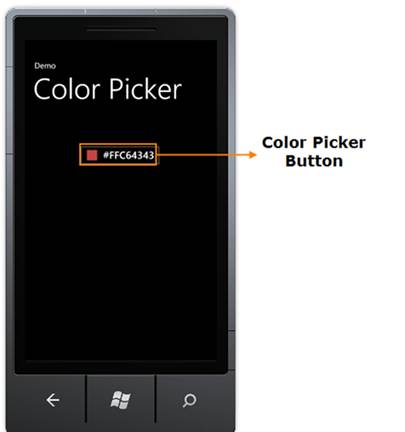
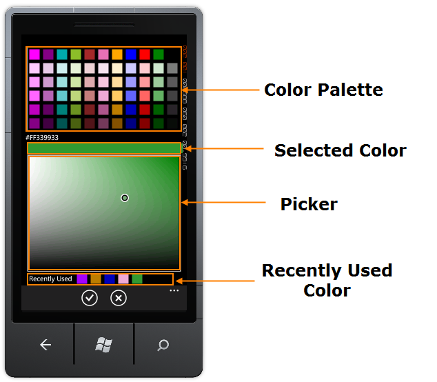

::: {style="DISPLAY: none"}
{#d2h_url_template}{#d2h_package_url style="WIDTH: 0px; DISPLAY: none; HEIGHT: 0px"}
:::

::: {.d2h_secondary_topic style="PADDING-BOTTOM: 10pt; MARGIN: 0pt; PADDING-LEFT: 0pt; PADDING-RIGHT: 0pt; PADDING-TOP: 0pt"}
#### Appearance and Structure of the Control {#appearance-and-structure-of-the-control style="tab-stops: 0pt"}

 

{border="0"}

Figure 71: Color Picker Button

 

[·      ]{style="FONT-FAMILY: Symbol"}**Color Picker Button -** Tap this button to display Color Picker.

{border="0"}

Figure 72: Color Picker Control

 

[·      ]{style="FONT-FAMILY: Symbol"}**Color Palette --**This consists of ten phone accent colors and five variations of each color.

[·      ]{style="FONT-FAMILY: Symbol"}**Selected Color** -- This displays the selected color.

[·      ]{style="FONT-FAMILY: Symbol"}**Picker** -- This displays various shades of the selected color. You can select the desired shade using a pointer.

[·      ]{style="FONT-FAMILY: Symbol"}**Recently Used Color** -- Five last selected colors will be listed for later use.  When you select the sixth color first color will be removed from the list.

 

[]{#related-topics}
:::
