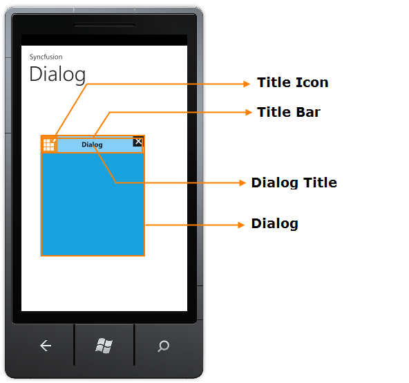

::: {style="DISPLAY: none"}
{#d2h_url_template}{#d2h_package_url style="WIDTH: 0px; DISPLAY: none; HEIGHT: 0px"}
:::

::: {.d2h_secondary_topic style="PADDING-BOTTOM: 10pt; MARGIN: 0pt; PADDING-LEFT: 0pt; PADDING-RIGHT: 0pt; PADDING-TOP: 0pt"}
#### Appearance and Structure of the Control {#appearance-and-structure-of-the-control style="tab-stops: 0pt"}

[ {border="0"}]{style="COLOR: #4f6228"}

Figure 86:Dialog Control[]{style="FONT-FAMILY: 'Times New Roman','serif'; FONT-SIZE: 12pt"}

[]{style="COLOR: #4f6228"} 

[]{#related-topics}
:::
