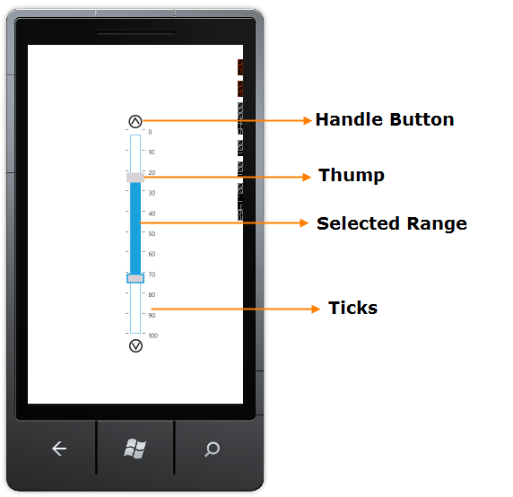

::: {style="DISPLAY: none"}
{#d2h_url_template}{#d2h_package_url style="WIDTH: 0px; DISPLAY: none; HEIGHT: 0px"}
:::

::: {.d2h_secondary_topic style="PADDING-BOTTOM: 10pt; MARGIN: 0pt; PADDING-LEFT: 0pt; PADDING-RIGHT: 0pt; PADDING-TOP: 0pt"}
#### Appearance and Structure of the Control {#appearance-and-structure-of-the-control style="tab-stops: 0pt"}

 

 {border="0"}

Figure 115: Structure of the Control

 

 

[·      ]{style="FONT-FAMILY: Symbol"}**Thump -** Enables you to select a range as input using the thumbs**.**

[·      ]{style="FONT-FAMILY: Symbol"}**Selected Range --** Enabled you to highlight the selected input range.

[·      ]{style="FONT-FAMILY: Symbol"}**Handle Button -** Enables you to move the thump by clicking the Hndle Button.

[·      ]{style="FONT-FAMILY: Symbol"}**Ticks -** Allows you to display the value intervals along the Range Slider scale.

 

 

 

[]{#related-topics}
:::
