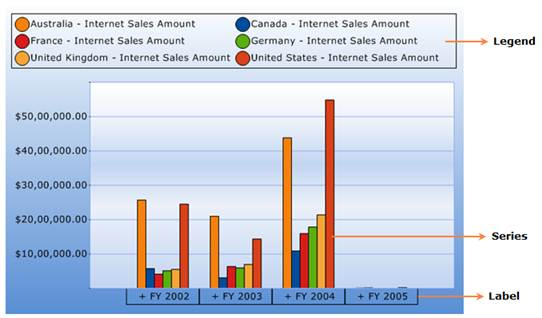

::: {style="DISPLAY: none"}
{#d2h_url_template}{#d2h_package_url style="WIDTH: 0px; DISPLAY: none; HEIGHT: 0px"}
:::

::::: {#nsbanner .d2h_main_nsbanner style="BORDER-BOTTOM: #999999 1px solid; POSITION: relative; PADDING-BOTTOM: 0px; BACKGROUND-COLOR: transparent; PADDING-LEFT: 0px; PADDING-RIGHT: 0px; DISPLAY: none; BORDER-TOP: #999999 1px solid; PADDING-TOP: 0px; LEFT: 0px"}
:::: {#TitleRow .d2h_main_titlerow style="PADDING-BOTTOM: 4px; BACKGROUND-COLOR: transparent; PADDING-LEFT: 22px; WIDTH: 100%; PADDING-RIGHT: 10px; DISPLAY: none; PADDING-TOP: 4px"}
::: {#ienav .d2h_main_ienav style="DISPLAY: none"}
{#D2HPrevious .D2HPreviousEnabled}  {#D2HNext .D2HNextEnabled}
:::
::::
:::::

:::: {#nstext .d2h_main_nstext style="PADDING-BOTTOM: 10px; BACKGROUND-COLOR: transparent; PADDING-LEFT: 22px; PADDING-RIGHT: 10px; HEIGHT: 100%; OVERFLOW: auto; PADDING-TOP: 5px" hasuserbackground="true" valign="bottom"}
::: {#d2h_breadcrumbs .d2h_breadcrumbs}
[Essential Studio User Guide Documentation](ms-xhelp:///?Id=12457748-09e3-4d74-a240-8e049cedf030){.d2h_breadcrumbsNormal}[ \> ]{.d2h_breadcrumbsLinkSeparator}[Business Intelligence Edition](ms-xhelp:///?Id=fdf33dd8-62b2-47b9-ad7b-fc50e590bca5){.d2h_breadcrumbsNormal}[ \> ]{.d2h_breadcrumbsLinkSeparator}[Essential BI ASP.NET](ms-xhelp:///?Id=99c6694e-59c3-4c59-abb5-ce9ce9a948bc){.d2h_breadcrumbsNormal}[ \> ]{.d2h_breadcrumbsLinkSeparator}[Essential BI Chart]{.d2h_breadcrumbsContentsOnly}[ \> ]{.d2h_breadcrumbsLinkSeparator}[Getting Started](ms-xhelp:///?Id=0805e396-dbf2-432a-8c85-ab30e3bf5765){.d2h_breadcrumbsNormal}
:::

## Appearance and Structure of the Control {#appearance-and-structure-of-the-control style="tab-stops: 0pt"}

This section contains a pictorial representation of the OLAP Chart control as well as the detailed explanation of the components present within the control.

{border="0"}

 

Figure 8: Parts of OLAP Chart control

The components present within the control are:

[[·      ]{style="FONT-FAMILY: Symbol; TEXT-DECORATION: none; text-underline: none"}]{.UGHyperlink}[[Label]{.UGHyperlink}](ms-xhelp:///?Id=189414e8-3e9f-45ee-8740-dcb0936fd21c)[]{.UGHyperlink}

[[·      ]{style="FONT-FAMILY: Symbol; TEXT-DECORATION: none; text-underline: none"}]{.UGHyperlink}[[Series]{.UGHyperlink}](ms-xhelp:///?Id=becdfa46-f1bf-4b7b-9d54-87c6f185b693)[]{.UGHyperlink}

[[·      ]{style="FONT-FAMILY: Symbol; TEXT-DECORATION: none; text-underline: none"}]{.UGHyperlink}[[Legend]{.UGHyperlink}](ms-xhelp:///?Id=369f84c1-be25-48c9-beb7-8035edac4c59)[]{.UGHyperlink}

More:

[ ]{#related-topics}

[{border="0" align="absMiddle"}Labels](ms-xhelp:///?Id=189414e8-3e9f-45ee-8740-dcb0936fd21c){style="TEXT-DECORATION: none"}

[{border="0" align="absMiddle"}Series](ms-xhelp:///?Id=becdfa46-f1bf-4b7b-9d54-87c6f185b693){style="TEXT-DECORATION: none"}

[{border="0" align="absMiddle"}Legend](ms-xhelp:///?Id=369f84c1-be25-48c9-beb7-8035edac4c59){style="TEXT-DECORATION: none"}
::::
