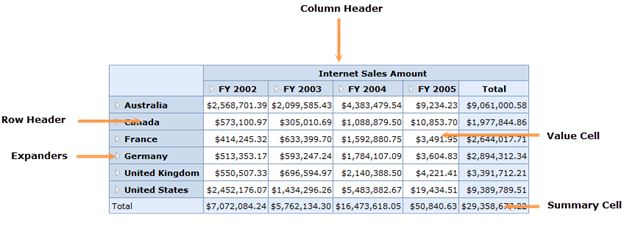

::: {style="DISPLAY: none"}
{#d2h_url_template}{#d2h_package_url style="WIDTH: 0px; DISPLAY: none; HEIGHT: 0px"}
:::

::::: {#nsbanner .d2h_main_nsbanner style="BORDER-BOTTOM: #999999 1px solid; POSITION: relative; PADDING-BOTTOM: 0px; BACKGROUND-COLOR: transparent; PADDING-LEFT: 0px; PADDING-RIGHT: 0px; DISPLAY: none; BORDER-TOP: #999999 1px solid; PADDING-TOP: 0px; LEFT: 0px"}
:::: {#TitleRow .d2h_main_titlerow style="PADDING-BOTTOM: 4px; BACKGROUND-COLOR: transparent; PADDING-LEFT: 22px; WIDTH: 100%; PADDING-RIGHT: 10px; DISPLAY: none; PADDING-TOP: 4px"}
::: {#ienav .d2h_main_ienav style="DISPLAY: none"}
{#D2HPrevious .D2HPreviousEnabled}  {#D2HNext .D2HNextEnabled}
:::
::::
:::::

:::: {#nstext .d2h_main_nstext style="PADDING-BOTTOM: 10px; BACKGROUND-COLOR: transparent; PADDING-LEFT: 22px; PADDING-RIGHT: 10px; HEIGHT: 100%; OVERFLOW: auto; PADDING-TOP: 5px" hasuserbackground="true" valign="bottom"}
::: {#d2h_breadcrumbs .d2h_breadcrumbs}
[Essential Studio User Guide Documentation](ms-xhelp:///?Id=12457748-09e3-4d74-a240-8e049cedf030){.d2h_breadcrumbsNormal}[ \> ]{.d2h_breadcrumbsLinkSeparator}[Business Intelligence Edition](ms-xhelp:///?Id=fdf33dd8-62b2-47b9-ad7b-fc50e590bca5){.d2h_breadcrumbsNormal}[ \> ]{.d2h_breadcrumbsLinkSeparator}[Essential BI ASP.NET](ms-xhelp:///?Id=99c6694e-59c3-4c59-abb5-ce9ce9a948bc){.d2h_breadcrumbsNormal}[ \> ]{.d2h_breadcrumbsLinkSeparator}[Essential BI Grid]{.d2h_breadcrumbsContentsOnly}[ \> ]{.d2h_breadcrumbsLinkSeparator}[Getting Started](ms-xhelp:///?Id=7213cf0b-9621-4eea-985e-a939044d4013){.d2h_breadcrumbsNormal}
:::

## Appearance and Structure of the Control {#appearance-and-structure-of-the-control style="tab-stops: 0pt"}

This section contains a pictorial representation of the OlapGrid control.

{border="0"}

Figure 8: Parts of the OlapGrid Control

 

[·      ]{style="FONT-FAMILY: Symbol"}**Column Header:** The column header cell contains captions of measures, dimensions, hierarchies, level elements, and members according to their presence in the column axis.

[·      ]{style="FONT-FAMILY: Symbol"}**Row Header:** The row header cell contains captions of measures, dimensions, hierarchies, level elements, and members according to their presence in the row axis.

[·      ]{style="FONT-FAMILY: Symbol"}**Value Cell:** The value cell contains the figure respective to the measures, dimensions, hierarchies, level elements, and members placed in different axes.

[·      ]{style="FONT-FAMILY: Symbol"}**Summary Cell:** The summary cell contains the total value of those figures present in the entire column and row.

[]{#related-topics}
::::
