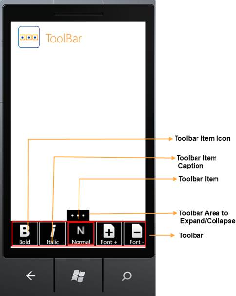
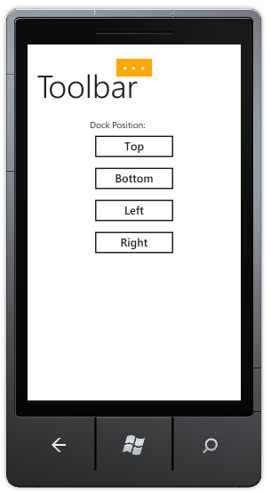

::: {style="DISPLAY: none"}
{#d2h_url_template}{#d2h_package_url style="WIDTH: 0px; DISPLAY: none; HEIGHT: 0px"}
:::

::: {.d2h_secondary_topic style="PADDING-BOTTOM: 10pt; MARGIN: 0pt; PADDING-LEFT: 0pt; PADDING-RIGHT: 0pt; PADDING-TOP: 0pt"}
#### Appearance and Structure of the Control {#appearance-and-structure-of-the-control style="tab-stops: 0pt"}

 {border="0"}

Figure 61: Toolbar Appearance**[]{style="COLOR: red"}**

**[]{style="COLOR: red"}** 

**[]{style="COLOR: red"}** 

**[]{style="COLOR: red"}** 

**[]{style="COLOR: red"}** 

{border="0"}

Figure 62: Toolbar Expaned

 

{border="0"}

Figure 63: Toolbar Collapsed

 

[]{#related-topics}
:::
