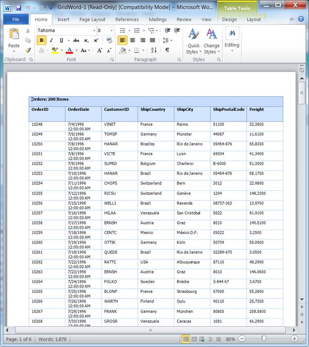
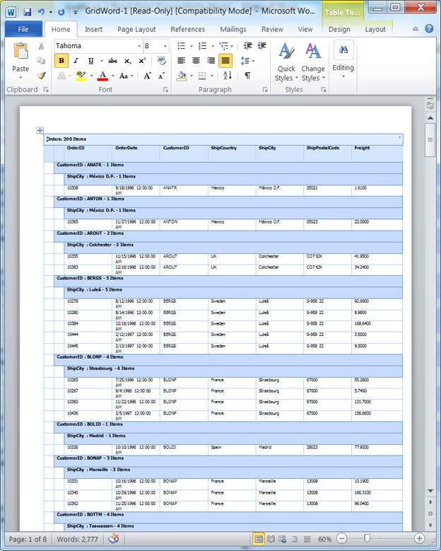
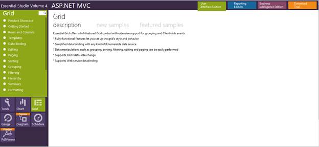

::: {style="DISPLAY: none"}
{#d2h_url_template}{#d2h_package_url style="WIDTH: 0px; DISPLAY: none; HEIGHT: 0px"}
:::

::: {.d2h_secondary_topic style="PADDING-BOTTOM: 10pt; MARGIN: 0pt; PADDING-LEFT: 0pt; PADDING-RIGHT: 0pt; PADDING-TOP: 0pt"}
#### Appearance and Structure of the Word Export []{style="FONT-SIZE: 14pt"} {#appearance-and-structure-of-the-word-export style="tab-stops: 0pt"}

The following figures give you a basic idea of the appearance and structure of the feature.

This feature allows you to export normal and nested grids to Word formats, as you can see in the screenshots below:

 

{border="0"}

Figure 202: Normal Grid in Word

 

 

{border="0"}

Figure 203: Hierarchical Grid in Word

 

Using this feature, you can export the grid to Word and PDF formats, and can format the cells of the exported grid.

This feature supports the export of both normal and nested (hierarchical) grids as well.

 

Where do I find installed samples?[]{style="FONT-SIZE: 14pt"}

To view the samples:

1.   Click Dashboard. The Essential Studio Enterprise Edition window is displayed.

2.   Click the drop-down button of MVC platform.

3.   Click the Run Locally Installed Samples link. The Essential Studio MVC Edition sample browser is displayed.

 

{border="0"}

Figure 204: MVC Grid Sample Browser

[]{style="FONT-SIZE: 11pt"} 

4.   Select Grid from the drop-down.[]{style="FONT-SIZE: 11pt"}

5.   Select any sample from the **Exporting** tab provided and browse through the features.

 

[]{#related-topics}
:::
