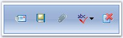
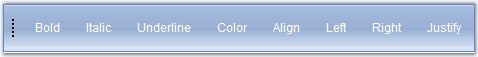

::: {style="DISPLAY: none"}
{#d2h_url_template}{#d2h_package_url style="WIDTH: 0px; DISPLAY: none; HEIGHT: 0px"}
:::

::::::: {.d2h_secondary_topic style="PADDING-BOTTOM: 10pt; MARGIN: 0pt; PADDING-LEFT: 0pt; PADDING-RIGHT: 0pt; PADDING-TOP: 0pt"}
##### Appearance Mode Settings {#appearance-mode-settings style="tab-stops: 0pt"}

[]{style="FONT-FAMILY: 'Trebuchet MS','sans-serif'; COLOR: #15428b; FONT-SIZE: 9pt"} 

Appearance Mode

[]{style="FONT-FAMILY: 'Trebuchet MS','sans-serif'; COLOR: #15428b; FONT-SIZE: 9pt"} 

The **AppearanceMode** property defines the ability to customize the buttons displayed in the toolbar. Every button on the toolbar can be customized independently to display either text or image or both.

 

This property can be set for the control, enabling all the items to inherit the value, else can be set for individual items using the Toolbar Designer dialog.

[]{style="FONT-FAMILY: 'Trebuchet MS','sans-serif'; COLOR: #15428b; FONT-SIZE: 9pt"} 

::: {align="center"}
+-----------------------------------+--------------------------------------------------------------------------------------------------------+
| Property                          | Description                                                                                            |
+-----------------------------------+--------------------------------------------------------------------------------------------------------+
| AppearanceMode                    | Specifies to either display text, image or both on toolbar items. The options included are as follows: |
|                                   |                                                                                                        |
|                                   | [·      ]{style="FONT-FAMILY: Symbol"}ImageOnly                                                        |
|                                   |                                                                                                        |
|                                   | [·      ]{style="FONT-FAMILY: Symbol"}Text                                                             |
|                                   |                                                                                                        |
|                                   | [·      ]{style="FONT-FAMILY: Symbol"}ImageandText                                                     |
+-----------------------------------+--------------------------------------------------------------------------------------------------------+
:::

[]{style="FONT-FAMILY: 'Trebuchet MS','sans-serif'; COLOR: #15428b; FONT-SIZE: 9pt"} 

+---------------------------------------------------------------------------------------------------------------------------------+
| **[\[C#\]]{style="FONT-FAMILY: 'Courier New'; FONT-SIZE: 9pt"}**                                                                |
|                                                                                                                                 |
| []{style="FONT-FAMILY: 'Courier New'; FONT-SIZE: 9pt"}                                                                          |
|                                                                                                                                 |
| [ToolBar1.AppearanceMode = [AppearanceMode]{style="COLOR: teal"}.TextOnly;]{style="FONT-FAMILY: 'Courier New'; FONT-SIZE: 9pt"} |
+---------------------------------------------------------------------------------------------------------------------------------+

[]{style="FONT-FAMILY: 'Trebuchet MS','sans-serif'; COLOR: #15428b; FONT-SIZE: 9pt"} 

+------------------------------------------------------------------------------------------------------------------------------------------------------------------------------------+
| **[\[VB\]]{style="FONT-FAMILY: 'Courier New'; FONT-SIZE: 9pt"}**                                                                                                                   |
|                                                                                                                                                                                    |
| []{style="FONT-FAMILY: 'Courier New'; COLOR: blue; FONT-SIZE: 9pt"}                                                                                                                |
|                                                                                                                                                                                    |
| [Private]{style="FONT-FAMILY: 'Courier New'; COLOR: blue; FONT-SIZE: 9pt"}[ ToolBar1.AppearanceMode = AppearanceMode.TextOnly]{style="FONT-FAMILY: 'Courier New'; FONT-SIZE: 9pt"} |
+------------------------------------------------------------------------------------------------------------------------------------------------------------------------------------+

[]{style="FONT-FAMILY: 'Trebuchet MS','sans-serif'; COLOR: #15428b; FONT-SIZE: 9pt"} 

The options to set the appearance mode of the toolbar items are as follows.

[]{style="FONT-FAMILY: 'Trebuchet MS','sans-serif'; COLOR: #15428b; FONT-SIZE: 9pt"} 

ImageOnly

[]{style="FONT-FAMILY: 'Trebuchet MS','sans-serif'; COLOR: #15428b; FONT-SIZE: 9pt"} 

This option displays only the image on toolbar items.

[]{style="FONT-FAMILY: 'Trebuchet MS','sans-serif'; COLOR: #15428b; FONT-SIZE: 9pt"} 

{border="0"}

**[]{style="FONT-FAMILY: 'Trebuchet MS','sans-serif'; COLOR: #15428b; FONT-SIZE: 9pt"}** 

Figure 258: ImageOnly set for the toolbar items

**[]{style="FONT-FAMILY: 'Trebuchet MS','sans-serif'; COLOR: #15428b; FONT-SIZE: 9pt"}** 

ImageAndText

[]{style="FONT-FAMILY: 'Trebuchet MS','sans-serif'; COLOR: #15428b; FONT-SIZE: 9pt"} 

This option displays both the image and the text for a toolbar item. The image and text can be customized to be displayed using the following properties.

[]{style="FONT-FAMILY: 'Trebuchet MS','sans-serif'; COLOR: #15428b; FONT-SIZE: 9pt"} 

[·      ]{style="FONT-FAMILY: Symbol"}ImageOverText

[·      ]{style="FONT-FAMILY: Symbol"}TextOverImage

[·      ]{style="FONT-FAMILY: Symbol"}TextLeftImageRight

[·      ]{style="FONT-FAMILY: Symbol"}ImageLeftTextRight

*[]{style="FONT-SIZE: 8pt"}* 

{border="0"}

**[]{style="FONT-FAMILY: 'Trebuchet MS','sans-serif'; COLOR: #15428b; FONT-SIZE: 9pt"}** 

Figure 259: ImageAndText set for the toolbar items

[]{style="FONT-FAMILY: 'Trebuchet MS','sans-serif'; COLOR: #15428b; FONT-SIZE: 9pt"} 

Text

[]{style="FONT-FAMILY: 'Trebuchet MS','sans-serif'; COLOR: #15428b; FONT-SIZE: 9pt"} 

This option displays only the text on the toolbar items.

[]{style="FONT-FAMILY: 'Trebuchet MS','sans-serif'; COLOR: #15428b; FONT-SIZE: 9pt"} 

{border="0"}

**[]{style="FONT-FAMILY: 'Trebuchet MS','sans-serif'; COLOR: #15428b; FONT-SIZE: 9pt"}** 

Figure 260:TextOnly set for the toolbar items

[]{style="FONT-FAMILY: 'Trebuchet MS','sans-serif'; COLOR: #15428b; FONT-SIZE: 9pt"} 

Text and Image Position Settings

[]{style="FONT-FAMILY: 'Trebuchet MS','sans-serif'; COLOR: #15428b; FONT-SIZE: 9pt"} 

The image and text can be arranged respective to each other by setting the **TextPosition** property. This property can be set for the control, enabling all the items to inherit the value, else can be set for individual items using the Toolbar Designer dialog.

[]{style="FONT-FAMILY: 'Trebuchet MS','sans-serif'; COLOR: #15428b; FONT-SIZE: 9pt"} 

::: {align="center"}
+-----------------------------------+-------------------------------------------------------------------------------------+
|                                   |                                                                                     |
|                                   |                                                                                     |
| Property                          | Description                                                                         |
+-----------------------------------+-------------------------------------------------------------------------------------+
| TextPosition                      | Specifies the text position for toolbar items. The options included are as follows: |
|                                   |                                                                                     |
|                                   | [·      ]{style="FONT-FAMILY: Symbol"}ImageOverText                                 |
|                                   |                                                                                     |
|                                   | [·      ]{style="FONT-FAMILY: Symbol"}TextOverImage                                 |
|                                   |                                                                                     |
|                                   | [·      ]{style="FONT-FAMILY: Symbol"}TextLeftImageRight                            |
|                                   |                                                                                     |
|                                   | [·      ]{style="FONT-FAMILY: Symbol"}ImageLeftTextRight                            |
+-----------------------------------+-------------------------------------------------------------------------------------+
:::

[]{style="FONT-FAMILY: 'Trebuchet MS','sans-serif'; COLOR: #15428b; FONT-SIZE: 9pt"} 

+----------------------------------------------------------------------------------------------------------------------------------+
| **[\[C#\]]{style="FONT-FAMILY: 'Courier New'; FONT-SIZE: 9pt"}**                                                                 |
|                                                                                                                                  |
| []{style="FONT-FAMILY: 'Courier New'; FONT-SIZE: 9pt"}                                                                           |
|                                                                                                                                  |
| [ToolBar1.TextPosition = [TextPosition]{style="COLOR: teal"}.TextOverImage;]{style="FONT-FAMILY: 'Courier New'; FONT-SIZE: 9pt"} |
+----------------------------------------------------------------------------------------------------------------------------------+

[]{style="FONT-FAMILY: 'Trebuchet MS','sans-serif'; COLOR: #15428b; FONT-SIZE: 9pt"} 

+-------------------------------------------------------------------------------------------------------------------------------------------------------------------------------------+
| **[\[VB\]]{style="FONT-FAMILY: 'Courier New'; FONT-SIZE: 9pt"}**                                                                                                                    |
|                                                                                                                                                                                     |
| []{style="FONT-FAMILY: 'Courier New'; COLOR: blue; FONT-SIZE: 9pt"}                                                                                                                 |
|                                                                                                                                                                                     |
| [Private]{style="FONT-FAMILY: 'Courier New'; COLOR: blue; FONT-SIZE: 9pt"}[ ToolBar1.TextPosition = TextPosition.TextOverImage]{style="FONT-FAMILY: 'Courier New'; FONT-SIZE: 9pt"} |
+-------------------------------------------------------------------------------------------------------------------------------------------------------------------------------------+

[]{style="FONT-FAMILY: 'Trebuchet MS','sans-serif'; COLOR: #15428b; FONT-SIZE: 9pt"} 

Appearance Settings

[]{style="FONT-FAMILY: 'Trebuchet MS','sans-serif'; COLOR: #15428b; FONT-SIZE: 9pt"} 

A toolbar item can be disabled by setting the **Disabled** property. By doing so, the item will be impervious to the user actions.

[]{style="FONT-FAMILY: 'Trebuchet MS','sans-serif'; COLOR: #15428b; FONT-SIZE: 9pt"} 

::: {align="center"}
+-----------------------------------+------------------------------------------------------------------------------------------------------------------------+
|                                   |                                                                                                                        |
|                                   |                                                                                                                        |
| ToolBar Item Property             | Description                                                                                                            |
+-----------------------------------+------------------------------------------------------------------------------------------------------------------------+
| Disabled                          | Gets/sets the boolean value, whether to disable a toolbar item. When set to true, it does not respond to user actions. |
+-----------------------------------+------------------------------------------------------------------------------------------------------------------------+
:::

[]{style="FONT-FAMILY: 'Trebuchet MS','sans-serif'; COLOR: #15428b; FONT-SIZE: 9pt"} 

Programmatically when the item is created the disabled property can be set as follows.

[]{style="FONT-FAMILY: 'Trebuchet MS','sans-serif'; COLOR: #15428b; FONT-SIZE: 9pt"} 

+-----------------------------------------------------------------------------------------------------+
| **[\[C#\]]{style="FONT-FAMILY: 'Courier New'; FONT-SIZE: 9pt"}**                                    |
|                                                                                                     |
| []{style="FONT-FAMILY: 'Courier New'; FONT-SIZE: 9pt"}                                              |
|                                                                                                     |
| [item.Disabled = [false]{style="COLOR: blue"};]{style="FONT-FAMILY: 'Courier New'; FONT-SIZE: 9pt"} |
+-----------------------------------------------------------------------------------------------------+

[]{style="FONT-FAMILY: 'Trebuchet MS','sans-serif'; COLOR: #15428b; FONT-SIZE: 9pt"} 

+-------------------------------------------------------------------------------------------------------------------------------------------------------------------------------+
| **[\[VB\]]{style="FONT-FAMILY: 'Courier New'; FONT-SIZE: 9pt"}**                                                                                                              |
|                                                                                                                                                                               |
| []{style="FONT-FAMILY: 'Courier New'; COLOR: blue; FONT-SIZE: 9pt"}                                                                                                           |
|                                                                                                                                                                               |
| [Private]{style="FONT-FAMILY: 'Courier New'; COLOR: blue; FONT-SIZE: 9pt"}[ item.Disabled = [False]{style="COLOR: blue"}]{style="FONT-FAMILY: 'Courier New'; FONT-SIZE: 9pt"} |
+-------------------------------------------------------------------------------------------------------------------------------------------------------------------------------+

[]{style="FONT-FAMILY: 'Trebuchet MS','sans-serif'; COLOR: #15428b; FONT-SIZE: 9pt"} 

::: {style="BORDER-BOTTOM: windowtext 1pt solid; BORDER-LEFT: medium none; PADDING-BOTTOM: 1pt; MARGIN-TOP: 9pt; PADDING-LEFT: 0pt; PADDING-RIGHT: 0pt; MARGIN-BOTTOM: 9pt; BORDER-TOP: windowtext 1pt solid; BORDER-RIGHT: medium none; PADDING-TOP: 1pt"}
{border="0"}Note: The disabled item\'s appearance can be customized using ItemLooks. To know more about the look settings, refer [ItemLook Properties]{.UGHyperlink}[ ]{style="COLOR: black; FONT-SIZE: 8pt"}topic.
:::

[]{style="FONT-FAMILY: 'Trebuchet MS','sans-serif'; COLOR: #15428b; FONT-SIZE: 9pt"} 

See Also

[]{style="FONT-FAMILY: 'Trebuchet MS','sans-serif'; COLOR: #15428b; FONT-SIZE: 9pt"} 

[CSS applicable segments in ToolBar]{.UGHyperlink}[, ]{.UGHyperlink}[Image Settings]{.UGHyperlink}[, ]{.UGHyperlink}[Behavior Settings]{.UGHyperlink}[, ]{.UGHyperlink}[Button Type Settings]{.UGHyperlink}[]{.UGHyperlink}

[]{#related-topics}
:::::::
