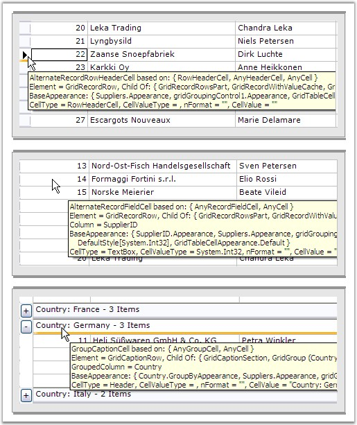
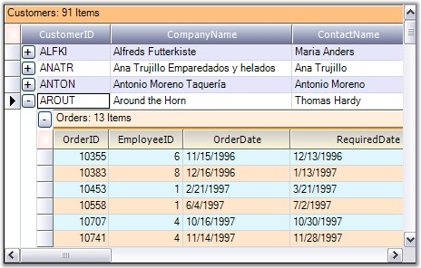
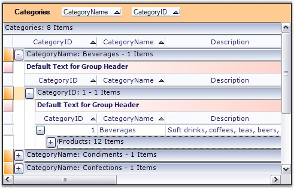
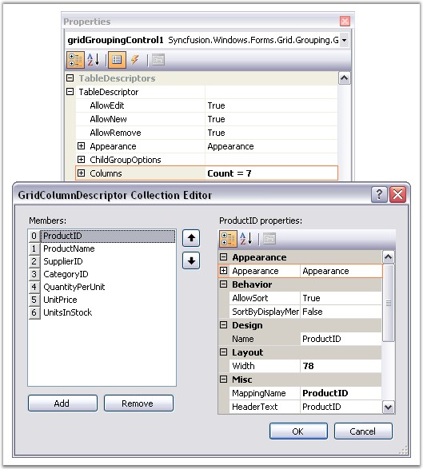
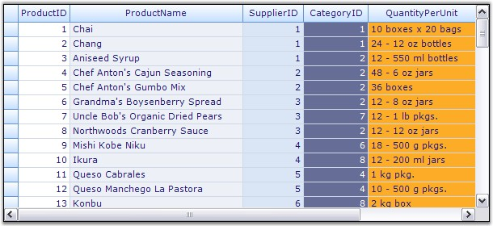

::: {style="DISPLAY: none"}
{#d2h_url_template}{#d2h_package_url style="WIDTH: 0px; DISPLAY: none; HEIGHT: 0px"}
:::

:::::::: {.d2h_secondary_topic style="PADDING-BOTTOM: 10pt; MARGIN: 0pt; PADDING-LEFT: 0pt; PADDING-RIGHT: 0pt; PADDING-TOP: 0pt"}
##### Appearance Options {#appearance-options style="tab-stops: 0pt"}

[]{style="FONT-FAMILY: 'Trebuchet MS','sans-serif'; COLOR: #15428b; FONT-SIZE: 9pt"} 

The simplest way to check exactly which cells are affected by setting one of these properties is to use the Preview and Edit verb to display a Grid Grouping control and then set the property to view the effect.

 

When using the Preview tool at design-time, there is a cell tip that is displayed over each cell which, gives information regarding that cell. In particular, the first line of the tip will give the exact **Appearance** property that this cell is based on. In addition, it will also list the Appearance properties that the cell inherits. Here is a graphic showing some cell tip samples.

[]{style="FONT-FAMILY: 'Trebuchet MS','sans-serif'; COLOR: #15428b; FONT-SIZE: 9pt"} 

{border="0"}

[]{style="FONT-FAMILY: 'Trebuchet MS','sans-serif'; COLOR: #15428b; FONT-SIZE: 9pt"} 

*[Figure ]{style="FONT-SIZE: 9pt"}[318]{style="FONT-SIZE: 9pt"}[: Cell Tips Listing Appearance Inheritances Using Preview at Design-Time]{style="FONT-SIZE: 9pt"}*

[]{style="FONT-FAMILY: 'Trebuchet MS','sans-serif'; COLOR: #15428b; FONT-SIZE: 9pt"} 

::: {style="BORDER-BOTTOM: windowtext 1pt solid; BORDER-LEFT: medium none; PADDING-BOTTOM: 1pt; MARGIN-TOP: 9pt; PADDING-LEFT: 0pt; PADDING-RIGHT: 0pt; MARGIN-BOTTOM: 9pt; BORDER-TOP: windowtext 1pt solid; BORDER-RIGHT: medium none; PADDING-TOP: 1pt"}
 

{border="0"}Note:

When using Preview, make sure that you set ThemesEnabled to False, if you want to see the effect of setting the property on a header cell or a button type cell. If you do not, then the theme appearance will supersede the appearance properties you set here.

Some of the properties are not applicable unless the item they affect is used in the grid. For example, properties that affect nested tables or summaries will not change the appearance of a Grid Grouping control that does not have either of these items. In later tutorials, you will be able to test such properties.
:::

[]{style="FONT-FAMILY: 'Trebuchet MS','sans-serif'; COLOR: #15428b; FONT-SIZE: 9pt"} 

[]{style="FONT-FAMILY: 'Trebuchet MS','sans-serif'; COLOR: #15428b; FONT-SIZE: 9pt"} 

List of Appearance Properties

[]{style="FONT-FAMILY: 'Trebuchet MS','sans-serif'; COLOR: #15428b; FONT-SIZE: 9pt"} 

::: {align="center"}
  ------------------------------ ----------------------------------------------------------------------------------
  Appearance Property            Description
  AddNewRecordFieldCell          Style information for any cell in a new record row.
  AddNewRecordRowHeaderCell      Style information for header cell for any new record.
  AlternateRecordFieldCell       Style information for any cell in alternate record rows.
  AlternateRecordRowHeaderCell   Style information for any header cell in alternate record rows.
  AnyCell                        Style information for any cell in the Grid.
  AnyGroupCell                   Style information for any cell in a Group item.
  AnyHeaderCell                  Style information for any header cell.
  AnyIndentCell                  Style information for any indent cell.
  AnyNestedTableCell             Style information for any nested table cell.
  AnyPreviewCell                 Style information for any preview cell.
  AnyRecordFieldCell             Style information for any record cell.
  AnySummaryCell                 Style information for any summary cell.
  ColumnHeaderCell               Style information for any column header cell.
  ColumnHeaderWithFilterCell     Style information for any column header cell with filter.
  EmptyCell                      Style information for any empty cell.
  EmptySectionRowHeaderCell      Style information for any row header cell in an empty section.
  FilterBarCell                  Style information for any filter bar cell.
  FilterBarRowHeaderCell         Style information for any filter bar rowheader cell.
  GroupCaptionCell               Style information for any cell in a group caption.
  GroupCaptionPlusMinusCell      Style information for any plus-minus cell in a group caption.
  GroupCaptionRowHeaderCell      Style information for any row header cell in a group caption.
  GroupCaptionSummaryCell        Style information for any summary cell in a group caption.
  GroupFooterIndentCell          Style information for any indent cell in a group footer.
  GroupFooterRowHeaderCell       Style information for any header cell in a group footer.
  GroupFooterSectionCell         Style information for any section cell in a group footer.
  GroupHeaderIndentCell          Style information for any indent cell in a group.
  GroupHeaderRowHeaderCell       Style information for any cell in a group header.
  GroupHeaderSectionCell         Style information for any section cell in a group header.
  GroupIndentCell                Style information for any indent cell in a group.
  GroupIndentICell               Style information for any indent cell with no connected item.
  GroupIndentLCell               Style information for any indent cell with a bottom connected item.
  GroupIndentTCell               Style information for any indent cell with a middle connected item.
  GroupPreviewCell               Style information for any preview cell.
  GroupPreviewRowHeaderCell      Style information for any header cell in a preview row.
  NestedTableCell                Style information for any cell in a nested table.
  NestedTableIndentCell          Style information for any indent cell in a nested table.
  NestedTableIndentICell         Style information for any nested table indent cell with a bottom connected item.
  NestedTableIndentLCell         Style information for any nested table indent cell with a middle connected item.
  NestedTableIndentTCell         Style information for any nested table indent cell with no connected item.
  NestedTableRowHeaderCell       Style information for any row header cell in a nested table.
  RecordFieldCell                Style information for any field cell in a record row.
  RecordPlusMinusCell            Style information for any plus-minus cell in a record row.
  RecordPreviewCell              Style information for any preview cell in a record row.
  RecordPreviewRowHeaderCell     Style information for any header cell in a record preview row
  RecordRowHeaderCell            Style information for any header cell in a record row.
  RowHeaderCell                  Style information for any row header cell.
  SummaryEmptyCell               Style information for any empty cell in a summary row.
  SummaryFieldCell               Style information for any field cell in a summary row.
  SummaryFillRowCell             Style information for any fill cell in a summary row.
  SummaryRowHeaderCell           Style information for any header cell in a summary row.
  SummaryTitleCell               Style information for any title cell in a summary row.
  TopLeftHeaderCell              Style information for any top left header cell.
  ------------------------------ ----------------------------------------------------------------------------------
:::

 

[]{#p448} 

 

###### 4.3.4.4.1.1 Styles At Table Level {#styles-at-table-level style="tab-stops: 0pt"}

 

This section demonstrates how to provide different appearances to the tables at different levels. Properties set through grid.**TableDescriptor.Appearance** property will be applied to the top level table(parent). To control the appearance of individual child tables, you need to first get the TableDescriptor of the desired Child Table. You can then use **ChildTableDescriptor.Appearance** property to provide the appearances to the respective child table.

 

**Example**

**[]{style="FONT-FAMILY: 'Verdana','sans-serif'; COLOR: #4a5c8c"}** 

This implementation applies unique styles to the tables at different levels (Parent and Child). The grouping grid is bound to an hierarchical dataset with two tables. Below is the code to customize the appearance of these tables.

[]{style="FONT-FAMILY: 'Trebuchet MS','sans-serif'; COLOR: #15428b; FONT-SIZE: 9pt"} 

1.   Set styles to the Parent Table.

[]{style="FONT-FAMILY: 'Trebuchet MS','sans-serif'; COLOR: #15428b; FONT-SIZE: 9pt"} 

+--------------------------------------------------------------------------------------------------------------------------------------------------------------------------------------------------------------------------------------------------------------------------------------------------------------------------------------------------------------------------------------------------------------------------+
| **[\[C#\]]{style="FONT-FAMILY: 'Courier New'; COLOR: black"}**                                                                                                                                                                                                                                                                                                                                                           |
|                                                                                                                                                                                                                                                                                                                                                                                                                          |
| []{style="FONT-FAMILY: 'Courier New'; COLOR: black"}                                                                                                                                                                                                                                                                                                                                                                     |
|                                                                                                                                                                                                                                                                                                                                                                                                                          |
| [// Column Header Cell styles.]{style="FONT-FAMILY: 'Courier New'; COLOR: green"}                                                                                                                                                                                                                                                                                                                                        |
|                                                                                                                                                                                                                                                                                                                                                                                                                          |
| [this]{style="FONT-FAMILY: 'Courier New'; COLOR: blue"}[.gridGroupingControl1.Appearance.ColumnHeaderCell.CellTipText = [\"ColumnHeader\"]{style="COLOR: #a31515"};]{style="FONT-FAMILY: 'Courier New'"}                                                                                                                                                                                                                 |
|                                                                                                                                                                                                                                                                                                                                                                                                                          |
| [this]{style="FONT-FAMILY: 'Courier New'; COLOR: blue"}[.gridGroupingControl1.Appearance.ColumnHeaderCell.Interior = [new]{style="COLOR: blue"} BrushInfo(GradientStyle.Vertical, [Color]{style="COLOR: #2b91af"}.FromArgb(214, 220, 232), [Color]{style="COLOR: #2b91af"}.FromArgb(106, 111, 151));]{style="FONT-FAMILY: 'Courier New'"}                                                                                |
|                                                                                                                                                                                                                                                                                                                                                                                                                          |
| [this]{style="FONT-FAMILY: 'Courier New'; COLOR: blue"}[.gridGroupingControl1.Appearance.ColumnHeaderCell.TextColor = System.Drawing.[Color]{style="COLOR: #2b91af"}.White;]{style="FONT-FAMILY: 'Courier New'"}                                                                                                                                                                                                         |
|                                                                                                                                                                                                                                                                                                                                                                                                                          |
| []{style="FONT-FAMILY: 'Courier New'"}                                                                                                                                                                                                                                                                                                                                                                                   |
|                                                                                                                                                                                                                                                                                                                                                                                                                          |
| [// Record Field Cell style.]{style="FONT-FAMILY: 'Courier New'; COLOR: green"}                                                                                                                                                                                                                                                                                                                                          |
|                                                                                                                                                                                                                                                                                                                                                                                                                          |
| [this]{style="FONT-FAMILY: 'Courier New'; COLOR: blue"}[.gridGroupingControl1.Appearance.RecordFieldCell.Interior = [new]{style="COLOR: blue"} BrushInfo([Color]{style="COLOR: #2b91af"}.Lavender);]{style="FONT-FAMILY: 'Courier New'"}                                                                                                                                                                                 |
|                                                                                                                                                                                                                                                                                                                                                                                                                          |
| []{style="FONT-FAMILY: 'Courier New'"}                                                                                                                                                                                                                                                                                                                                                                                   |
|                                                                                                                                                                                                                                                                                                                                                                                                                          |
| [// Row Header Cell styles.]{style="FONT-FAMILY: 'Courier New'; COLOR: green"}                                                                                                                                                                                                                                                                                                                                           |
|                                                                                                                                                                                                                                                                                                                                                                                                                          |
| [this]{style="FONT-FAMILY: 'Courier New'; COLOR: blue"}[.gridGroupingControl1.Appearance.RowHeaderCell.Interior = [new]{style="COLOR: blue"} Syncfusion.Drawing.[BrushInfo]{style="COLOR: #2b91af"}(Syncfusion.Drawing.[GradientStyle]{style="COLOR: #2b91af"}.Horizontal, [SystemColors]{style="COLOR: #2b91af"}.Window, [Color]{style="COLOR: #2b91af"}.FromArgb(206, 213, 231));]{style="FONT-FAMILY: 'Courier New'"} |
|                                                                                                                                                                                                                                                                                                                                                                                                                          |
| [this]{style="FONT-FAMILY: 'Courier New'; COLOR: blue"}[.gridGroupingControl1.Appearance.RowHeaderCell.Themed = [false]{style="COLOR: blue"};]{style="FONT-FAMILY: 'Courier New'"}                                                                                                                                                                                                                                       |
|                                                                                                                                                                                                                                                                                                                                                                                                                          |
| []{style="FONT-FAMILY: 'Courier New'"}                                                                                                                                                                                                                                                                                                                                                                                   |
|                                                                                                                                                                                                                                                                                                                                                                                                                          |
| [// Top Left Header Cell style.]{style="FONT-FAMILY: 'Courier New'; COLOR: green"}                                                                                                                                                                                                                                                                                                                                       |
|                                                                                                                                                                                                                                                                                                                                                                                                                          |
| [this]{style="FONT-FAMILY: 'Courier New'; COLOR: blue"}[.gridGroupingControl1.Appearance.TopLeftHeaderCell.Interior = [new]{style="COLOR: blue"} BrushInfo(GradientStyle.PathRectangle, [SystemColors]{style="COLOR: #2b91af"}.Window, [Color]{style="COLOR: #2b91af"}.FromArgb(255, 228, 221));]{style="FONT-FAMILY: 'Courier New'"}                                                                                    |
+--------------------------------------------------------------------------------------------------------------------------------------------------------------------------------------------------------------------------------------------------------------------------------------------------------------------------------------------------------------------------------------------------------------------------+

[]{style="FONT-FAMILY: 'Trebuchet MS','sans-serif'; COLOR: #15428b; FONT-SIZE: 9pt"} 

+-----------------------------------------------------------------------------------------------------------------------------------------------------------------------------------------------------------------------------------------------------------------------------------+
| **[\[VB.NET\]]{style="FONT-FAMILY: 'Courier New'; COLOR: black"}**                                                                                                                                                                                                                |
|                                                                                                                                                                                                                                                                                   |
| []{style="FONT-FAMILY: 'Courier New'; COLOR: black"}                                                                                                                                                                                                                              |
|                                                                                                                                                                                                                                                                                   |
| [\' Column Header Cell styles.]{style="FONT-FAMILY: 'Courier New'; COLOR: green"}                                                                                                                                                                                                 |
|                                                                                                                                                                                                                                                                                   |
| [Me]{style="FONT-FAMILY: 'Courier New'; COLOR: blue"}[.gridGroupingControl1.Appearance.ColumnHeaderCell.CellTipText = [\"ColumnHeader\"]{style="COLOR: #a31515"}]{style="FONT-FAMILY: 'Courier New'"}                                                                             |
|                                                                                                                                                                                                                                                                                   |
| [Me]{style="FONT-FAMILY: 'Courier New'; COLOR: blue"}[.gridGroupingControl1.Appearance.ColumnHeaderCell.Interior = [new]{style="COLOR: blue"} BrushInfo(GradientStyle.Vertical, Color.FromArgb(214, 220, 232),Color.FromArgb(106, 111, 151))]{style="FONT-FAMILY: 'Courier New'"} |
|                                                                                                                                                                                                                                                                                   |
| [Me]{style="FONT-FAMILY: 'Courier New'; COLOR: blue"}[.gridGroupingControl1.Appearance.ColumnHeaderCell.TextColor = Color.White]{style="FONT-FAMILY: 'Courier New'"}                                                                                                              |
|                                                                                                                                                                                                                                                                                   |
| []{style="FONT-FAMILY: 'Courier New'; COLOR: green"}                                                                                                                                                                                                                              |
|                                                                                                                                                                                                                                                                                   |
| [\' Record Field Cell style.]{style="FONT-FAMILY: 'Courier New'; COLOR: green"}                                                                                                                                                                                                   |
|                                                                                                                                                                                                                                                                                   |
| [Me]{style="FONT-FAMILY: 'Courier New'; COLOR: blue"}[.gridGroupingControl1.Appearance.RecordFieldCell.Interior = [new]{style="COLOR: blue"} BrushInfo(Color.Lavender)]{style="FONT-FAMILY: 'Courier New'"}                                                                       |
|                                                                                                                                                                                                                                                                                   |
| []{style="FONT-FAMILY: 'Courier New'; COLOR: green"}                                                                                                                                                                                                                              |
|                                                                                                                                                                                                                                                                                   |
| [\' Row Header Cell styles.]{style="FONT-FAMILY: 'Courier New'; COLOR: green"}                                                                                                                                                                                                    |
|                                                                                                                                                                                                                                                                                   |
| [Me]{style="FONT-FAMILY: 'Courier New'; COLOR: blue"}[.gridGroupingControl1.Appearance.RowHeaderCell.Interior = [new]{style="COLOR: blue"} BrushInfo(GradientStyle.Horizontal, SystemColors.Window, Color.FromArgb(206, 213, 231))]{style="FONT-FAMILY: 'Courier New'"}           |
|                                                                                                                                                                                                                                                                                   |
| [Me]{style="FONT-FAMILY: 'Courier New'; COLOR: blue"}[.gridGroupingControl1.Appearance.RowHeaderCell.Themed = [false]{style="COLOR: blue"}]{style="FONT-FAMILY: 'Courier New'"}                                                                                                   |
|                                                                                                                                                                                                                                                                                   |
| []{style="FONT-FAMILY: 'Courier New'; COLOR: green"}                                                                                                                                                                                                                              |
|                                                                                                                                                                                                                                                                                   |
| [\' Top Left Header Cell style.]{style="FONT-FAMILY: 'Courier New'; COLOR: green"}                                                                                                                                                                                                |
|                                                                                                                                                                                                                                                                                   |
| [Me]{style="FONT-FAMILY: 'Courier New'; COLOR: blue"}[.gridGroupingControl1.Appearance.TopLeftHeaderCell.Interior = [new]{style="COLOR: blue"} BrushInfo(GradientStyle.PathRectangle, SystemColors.Window, Color.FromArgb(255, 228, 221))]{style="FONT-FAMILY: 'Courier New'"}    |
+-----------------------------------------------------------------------------------------------------------------------------------------------------------------------------------------------------------------------------------------------------------------------------------+

[]{style="FONT-FAMILY: 'Trebuchet MS','sans-serif'; COLOR: #15428b; FONT-SIZE: 9pt"} 

2.   Apply styles to the Child Table.

[]{style="FONT-FAMILY: 'Trebuchet MS','sans-serif'; COLOR: #15428b; FONT-SIZE: 9pt"} 

+---------------------------------------------------------------------------------------------------------------------------------------------------------------------------------------------------------------------------------------------------------------------------------------------------------------------+
| **[\[C#\]]{style="FONT-FAMILY: 'Courier New'; COLOR: black"}**                                                                                                                                                                                                                                                      |
|                                                                                                                                                                                                                                                                                                                     |
| []{style="FONT-FAMILY: 'Courier New'; COLOR: black"}                                                                                                                                                                                                                                                                |
|                                                                                                                                                                                                                                                                                                                     |
| [GridTableDescriptor]{style="FONT-FAMILY: 'Courier New'; COLOR: #2b91af"}[ gtd = [this]{style="COLOR: blue"}.gridGroupingControl1.GetTableDescriptor([\"Orders\"]{style="COLOR: #a31515"});]{style="FONT-FAMILY: 'Courier New'"}                                                                                    |
|                                                                                                                                                                                                                                                                                                                     |
| []{style="FONT-FAMILY: 'Courier New'"}                                                                                                                                                                                                                                                                              |
|                                                                                                                                                                                                                                                                                                                     |
| [// Record Field Cell styles.]{style="FONT-FAMILY: 'Courier New'; COLOR: green"}                                                                                                                                                                                                                                    |
|                                                                                                                                                                                                                                                                                                                     |
| [gtd.Appearance.AnyRecordFieldCell.BackColor = [Color]{style="COLOR: #2b91af"}.FromArgb(223, 247, 252);]{style="FONT-FAMILY: 'Courier New'"}                                                                                                                                                                        |
|                                                                                                                                                                                                                                                                                                                     |
| [gtd.Appearance.AlternateRecordFieldCell.BackColor = [Color]{style="COLOR: #2b91af"}.FromArgb(255, 229, 201);]{style="FONT-FAMILY: 'Courier New'"}                                                                                                                                                                  |
|                                                                                                                                                                                                                                                                                                                     |
| []{style="FONT-FAMILY: 'Courier New'"}                                                                                                                                                                                                                                                                              |
|                                                                                                                                                                                                                                                                                                                     |
| [// Column Header Cell styles.]{style="FONT-FAMILY: 'Courier New'; COLOR: green"}                                                                                                                                                                                                                                   |
|                                                                                                                                                                                                                                                                                                                     |
| [gtd.Appearance.ColumnHeaderCell.Interior = [new]{style="COLOR: blue"} BrushInfo(GradientStyle.Vertical, [Color]{style="COLOR: #2b91af"}.FromArgb(203, 201, 202), [Color]{style="COLOR: #2b91af"}.FromArgb(253, 247, 215));]{style="FONT-FAMILY: 'Courier New'"}                                                    |
|                                                                                                                                                                                                                                                                                                                     |
| [gtd.Appearance.ColumnHeaderCell.TextColor = [Color]{style="COLOR: #2b91af"}.Black;]{style="FONT-FAMILY: 'Courier New'"}                                                                                                                                                                                            |
|                                                                                                                                                                                                                                                                                                                     |
| []{style="FONT-FAMILY: 'Courier New'"}                                                                                                                                                                                                                                                                              |
|                                                                                                                                                                                                                                                                                                                     |
| [// Group Caption Cell styles.]{style="FONT-FAMILY: 'Courier New'; COLOR: green"}                                                                                                                                                                                                                                   |
|                                                                                                                                                                                                                                                                                                                     |
| [gtd.Appearance.GroupCaptionCell.Interior = [new]{style="COLOR: blue"} BrushInfo([Color]{style="COLOR: #2b91af"}.FromArgb(255, 238, 220));]{style="FONT-FAMILY: 'Courier New'"}                                                                                                                                     |
|                                                                                                                                                                                                                                                                                                                     |
| [gtd.Appearance.GroupCaptionCell.Borders.Bottom = [new]{style="COLOR: blue"} [GridBorder]{style="COLOR: #2b91af"}([GridBorderStyle]{style="COLOR: #2b91af"}.Solid, [Color]{style="COLOR: #2b91af"}.FromArgb(242, 158, 32), [GridBorderWeight]{style="COLOR: #2b91af"}.Medium);]{style="FONT-FAMILY: 'Courier New'"} |
+---------------------------------------------------------------------------------------------------------------------------------------------------------------------------------------------------------------------------------------------------------------------------------------------------------------------+

[]{style="FONT-FAMILY: 'Trebuchet MS','sans-serif'; COLOR: #15428b; FONT-SIZE: 9pt"} 

+----------------------------------------------------------------------------------------------------------------------------------------------------------------------------------------------------------------------------------------------------------+
| **[\[VB.NET\]]{style="FONT-FAMILY: 'Courier New'; COLOR: black"}**                                                                                                                                                                                       |
|                                                                                                                                                                                                                                                          |
| []{style="FONT-FAMILY: 'Courier New'; COLOR: black"}                                                                                                                                                                                                     |
|                                                                                                                                                                                                                                                          |
| [Dim]{style="FONT-FAMILY: 'Courier New'; COLOR: blue"}[ gtd [As]{style="COLOR: blue"} GridTableDescriptor = [Me]{style="COLOR: blue"}.gridGroupingControl1.GetTableDescriptor([\"Orders\"]{style="COLOR: #a31515"})]{style="FONT-FAMILY: 'Courier New'"} |
|                                                                                                                                                                                                                                                          |
| []{style="FONT-FAMILY: 'Courier New'"}                                                                                                                                                                                                                   |
|                                                                                                                                                                                                                                                          |
| [\' Record Field Cell styles.]{style="FONT-FAMILY: 'Courier New'; COLOR: green"}                                                                                                                                                                         |
|                                                                                                                                                                                                                                                          |
| [gtd.Appearance.AnyRecordFieldCell.BackColor = Color.FromArgb(223, 247, 252)]{style="FONT-FAMILY: 'Courier New'"}                                                                                                                                        |
|                                                                                                                                                                                                                                                          |
| [gtd.Appearance.AlternateRecordFieldCell.BackColor = Color.FromArgb(255, 229, 201)]{style="FONT-FAMILY: 'Courier New'"}                                                                                                                                  |
|                                                                                                                                                                                                                                                          |
| []{style="FONT-FAMILY: 'Courier New'"}                                                                                                                                                                                                                   |
|                                                                                                                                                                                                                                                          |
| [\' Column Header Cell styles.]{style="FONT-FAMILY: 'Courier New'; COLOR: green"}                                                                                                                                                                        |
|                                                                                                                                                                                                                                                          |
| [gtd.Appearance.ColumnHeaderCell.Interior = [New]{style="COLOR: blue"} BrushInfo(GradientStyle.Vertical, Color.FromArgb(203, 201, 202), Color.FromArgb(253, 247, 215))]{style="FONT-FAMILY: 'Courier New'"}                                              |
|                                                                                                                                                                                                                                                          |
| [gtd.Appearance.ColumnHeaderCell.TextColor = Color.Black]{style="FONT-FAMILY: 'Courier New'"}                                                                                                                                                            |
|                                                                                                                                                                                                                                                          |
| []{style="FONT-FAMILY: 'Courier New'"}                                                                                                                                                                                                                   |
|                                                                                                                                                                                                                                                          |
| [\' Group Caption Cell styles.]{style="FONT-FAMILY: 'Courier New'; COLOR: green"}                                                                                                                                                                        |
|                                                                                                                                                                                                                                                          |
| [gtd.Appearance.GroupCaptionCell.Interior = [New]{style="COLOR: blue"} BrushInfo(Color.FromArgb(255, 238, 220))]{style="FONT-FAMILY: 'Courier New'"}                                                                                                     |
|                                                                                                                                                                                                                                                          |
| [gtd.Appearance.GroupCaptionCell.Borders.Bottom = [New]{style="COLOR: blue"} GridBorder(GridBorderStyle.Solid, Color.FromArgb(242, 158, 32), GridBorderWeight.Medium)]{style="FONT-FAMILY: 'Courier New'"}                                               |
+----------------------------------------------------------------------------------------------------------------------------------------------------------------------------------------------------------------------------------------------------------+

[]{style="FONT-FAMILY: 'Trebuchet MS','sans-serif'; COLOR: #15428b; FONT-SIZE: 9pt"} 

Here is a sample screenshot.

[]{style="FONT-FAMILY: 'Trebuchet MS','sans-serif'; COLOR: #15428b; FONT-SIZE: 9pt"} 

{border="0"}

[]{style="FONT-FAMILY: 'Trebuchet MS','sans-serif'; COLOR: #15428b; FONT-SIZE: 9pt"} 

*[Figure ]{style="FONT-SIZE: 9pt"}[319]{style="FONT-SIZE: 9pt"}[: Customized Appearance of Tables at Different Levels]{style="FONT-SIZE: 9pt"}*

[]{style="FONT-FAMILY: 'Trebuchet MS','sans-serif'; COLOR: #15428b; FONT-SIZE: 9pt"} 

::: {style="BORDER-BOTTOM: windowtext 1pt solid; BORDER-LEFT: medium none; PADDING-BOTTOM: 1pt; MARGIN-TOP: 9pt; PADDING-LEFT: 0pt; PADDING-RIGHT: 0pt; MARGIN-BOTTOM: 9pt; BORDER-TOP: windowtext 1pt solid; BORDER-RIGHT: medium none; PADDING-TOP: 1pt"}
{border="0"}Note: For more details, refer the following browser sample:

 

\<Install Location\>\\Syncfusion\\EssentialStudio\\\[Version Number\]\\Windows\\Grid.Grouping.Windows\\Samples\\2.0\\Appearance\\Table Style Demo
:::

 

[]{#p449} 

 

###### 4.3.4.4.1.2 Styles At Group Level {#styles-at-group-level style="tab-stops: 0pt"}

[]{style="FONT-FAMILY: 'Trebuchet MS','sans-serif'; COLOR: #15428b; FONT-SIZE: 9pt"} 

This section lets you customize the appearances of different group elements. You can provide unique appearances to every element of a group such as GroupCaptionCell and Group Header / Footer Cells by setting the following properties under Appearance section: **GroupCaptionCell**, **GroupCaptionPlusMinusCell, GroupHeaderSectionCell, GroupIndentCell, GroupFooterSectionCell, GroupPreviewCell** and the like.

 

**Example**

**[]{style="FONT-FAMILY: 'Verdana','sans-serif'; COLOR: #4a5c8c"}** 

Below is the code to apply different styles to various group members.

[]{style="FONT-FAMILY: 'Trebuchet MS','sans-serif'; COLOR: #15428b; FONT-SIZE: 9pt"} 

+-------------------------------------------------------------------------------------------------------------------------------------------------------------------------------------------------------------------------------------------------------------------------------------------------------------------------------------+
| **[\[C#\]]{style="FONT-FAMILY: 'Courier New'; COLOR: black"}**                                                                                                                                                                                                                                                                      |
|                                                                                                                                                                                                                                                                                                                                     |
| []{style="FONT-FAMILY: 'Courier New'; COLOR: black"}                                                                                                                                                                                                                                                                                |
|                                                                                                                                                                                                                                                                                                                                     |
| [this]{style="FONT-FAMILY: 'Courier New'; COLOR: blue"}[.gridGroupingControl1.Appearance.AnyGroupCell.Interior = [new]{style="COLOR: blue"} BrushInfo([Color]{style="COLOR: #2b91af"}.White);]{style="FONT-FAMILY: 'Courier New'"}                                                                                                  |
|                                                                                                                                                                                                                                                                                                                                     |
| [this]{style="FONT-FAMILY: 'Courier New'; COLOR: blue"}[.gridGroupingControl1.Appearance.AnyGroupCell.Themed = [false]{style="COLOR: blue"};]{style="FONT-FAMILY: 'Courier New'"}                                                                                                                                                   |
|                                                                                                                                                                                                                                                                                                                                     |
| [this]{style="FONT-FAMILY: 'Courier New'; COLOR: blue"}[.gridGroupingControl1.Appearance.GroupCaptionCell.Borders.Bottom = GridBorder([GridBorderStyle]{style="COLOR: #2b91af"}.Solid, [Color]{style="COLOR: #2b91af"}.FromArgb(157, 179, 200));]{style="FONT-FAMILY: 'Courier New'"}                                               |
|                                                                                                                                                                                                                                                                                                                                     |
| [this]{style="FONT-FAMILY: 'Courier New'; COLOR: blue"}[.gridGroupingControl1.Appearance.GroupCaptionRowHeaderCell.Interior = [new]{style="COLOR: blue"} BrushInfo(GradientStyle.BackwardDiagonal, [SystemColors]{style="COLOR: #2b91af"}.Window, [Color]{style="COLOR: #2b91af"}.DarkOrange);]{style="FONT-FAMILY: 'Courier New'"} |
|                                                                                                                                                                                                                                                                                                                                     |
| [this]{style="FONT-FAMILY: 'Courier New'; COLOR: blue"}[.gridGroupingControl1.Appearance.GroupFooterSectionCell.Interior = [new]{style="COLOR: blue"} BrushInfo(GradientStyle.Horizontal, [Color]{style="COLOR: #2b91af"}.White, [Color]{style="COLOR: #2b91af"}.FromArgb(192, 255, 192));]{style="FONT-FAMILY: 'Courier New'"}     |
|                                                                                                                                                                                                                                                                                                                                     |
| [this]{style="FONT-FAMILY: 'Courier New'; COLOR: blue"}[.gridGroupingControl1.Appearance.GroupHeaderRowHeaderCell.Interior = [new]{style="COLOR: blue"} BrushInfo(GradientStyle.Vertical, [SystemColors]{style="COLOR: #2b91af"}.Window, [Color]{style="COLOR: #2b91af"}.LightPink);]{style="FONT-FAMILY: 'Courier New'"}           |
|                                                                                                                                                                                                                                                                                                                                     |
| [this]{style="FONT-FAMILY: 'Courier New'; COLOR: blue"}[.gridGroupingControl1.Appearance.GroupHeaderSectionCell.Interior = [new]{style="COLOR: blue"} BrushInfo(GradientStyle.Horizontal, [Color]{style="COLOR: #2b91af"}.White, [Color]{style="COLOR: #2b91af"}.FromArgb(255, 199, 190);]{style="FONT-FAMILY: 'Courier New'"}      |
+-------------------------------------------------------------------------------------------------------------------------------------------------------------------------------------------------------------------------------------------------------------------------------------------------------------------------------------+

[]{style="FONT-FAMILY: 'Trebuchet MS','sans-serif'; COLOR: #15428b; FONT-SIZE: 9pt"} 

+------------------------------------------------------------------------------------------------------------------------------------------------------------------------------------------------------------------------+
| **[\[VB.NET\]]{style="FONT-FAMILY: 'Courier New'; COLOR: black"}**                                                                                                                                                     |
|                                                                                                                                                                                                                        |
| []{style="FONT-FAMILY: 'Courier New'; COLOR: black"}                                                                                                                                                                   |
|                                                                                                                                                                                                                        |
| [gridGroupingControl1.Appearance.AnyGroupCell.Interior = [New]{style="COLOR: blue"} BrushInfo(Color.White)]{style="FONT-FAMILY: 'Courier New'"}                                                                        |
|                                                                                                                                                                                                                        |
| [gridGroupingControl1.Appearance.AnyGroupCell.Themed = [False]{style="COLOR: blue"}]{style="FONT-FAMILY: 'Courier New'"}                                                                                               |
|                                                                                                                                                                                                                        |
| [gridGroupingControl1.Appearance.GroupCaptionCell.Borders.Bottom = GridBorder(GridBorderStyle.Solid, Color.FromArgb(157, 179, 200))]{style="FONT-FAMILY: 'Courier New'"}                                               |
|                                                                                                                                                                                                                        |
| [gridGroupingControl1.Appearance.GroupCaptionRowHeaderCell.Interior = [New]{style="COLOR: blue"} BrushInfo(GradientStyle.BackwardDiagonal, SystemColors.Window, Color.DarkOrange)]{style="FONT-FAMILY: 'Courier New'"} |
|                                                                                                                                                                                                                        |
| [gridGroupingControl1.Appearance.GroupFooterSectionCell.Interior = [New]{style="COLOR: blue"} BrushInfo(GradientStyle.Horizontal, Color.White, Color.FromArgb(192, 255, 192))]{style="FONT-FAMILY: 'Courier New'"}     |
|                                                                                                                                                                                                                        |
| [gridGroupingControl1.Appearance.GroupHeaderRowHeaderCell.Interior = [New]{style="COLOR: blue"} BrushInfo(GradientStyle.Vertical, SystemColors.Window, Color.LightPink)]{style="FONT-FAMILY: 'Courier New'"}           |
|                                                                                                                                                                                                                        |
| [gridGroupingControl1.Appearance.GroupHeaderSectionCell.Interior = [New]{style="COLOR: blue"} BrushInfo(GradientStyle.Horizontal, Color.White, Color.FromArgb(255, 199, 190)]{style="FONT-FAMILY: 'Courier New'"}      |
+------------------------------------------------------------------------------------------------------------------------------------------------------------------------------------------------------------------------+

[]{style="FONT-FAMILY: 'Trebuchet MS','sans-serif'; COLOR: #15428b; FONT-SIZE: 9pt"} 

Here is a sample screen shot.

[]{style="FONT-FAMILY: 'Trebuchet MS','sans-serif'; COLOR: #15428b; FONT-SIZE: 9pt"} 

[{border="0"}]{style="FONT-FAMILY: 'Trebuchet MS','sans-serif'; COLOR: #15428b; FONT-SIZE: 9pt"}[]{style="FONT-FAMILY: 'Trebuchet MS','sans-serif'; COLOR: #15428b; FONT-SIZE: 9pt"}

[]{style="FONT-FAMILY: 'Trebuchet MS','sans-serif'; COLOR: #15428b; FONT-SIZE: 9pt"} 

*[Figure ]{style="FONT-SIZE: 9pt"}[320]{style="FONT-SIZE: 9pt"}[: Customized Appearance of Groups at Different Levels]{style="FONT-SIZE: 9pt"}*

[]{style="FONT-FAMILY: 'Trebuchet MS','sans-serif'; COLOR: #15428b; FONT-SIZE: 9pt"} 

::: {style="BORDER-BOTTOM: windowtext 1pt solid; BORDER-LEFT: medium none; PADDING-BOTTOM: 1pt; MARGIN-TOP: 9pt; PADDING-LEFT: 0pt; PADDING-RIGHT: 0pt; MARGIN-BOTTOM: 9pt; BORDER-TOP: windowtext 1pt solid; BORDER-RIGHT: medium none; PADDING-TOP: 1pt"}
{border="0"}Note: For more details, refer the following browser sample:

 

\<Install Location\>\\Syncfusion\\EssentialStudio\\\[Version Number\]\\Windows\\Grid.Grouping.Windows\\Samples\\2.0\\Appearance\\Group Style Demo
:::

 

[]{#p450} 

 

###### 4.3.4.4.1.3 ColumnStyles {#columnstyles style="tab-stops: 0pt"}

[]{style="FONT-FAMILY: 'Trebuchet MS','sans-serif'; COLOR: #15428b; FONT-SIZE: 9pt"} 

Grid Grouping control allows you to do **Column-Based formatting**. With this feature, you can provide an unique appearance to different grid columns. Grid columns can be customized by setting the **GridColumnDescriptor.Appearance** property.

 

ColumnFormatting can be done at design time. Once the data source is set, select TableDescriptor.Columns property in the property window of the grid grouping control. This will open the GridColumnDescriptor collection editor that is populated with the columns in the datasource. You can modify the appearance of the desired column by setting the Appearance property of that column in this editor. The following picture shows this process.

[]{style="FONT-FAMILY: 'Trebuchet MS','sans-serif'; COLOR: #15428b; FONT-SIZE: 9pt"} 

{border="0"}

[]{style="FONT-FAMILY: 'Trebuchet MS','sans-serif'; COLOR: #15428b; FONT-SIZE: 9pt"} 

*[Figure ]{style="FONT-SIZE: 9pt"}[321]{style="FONT-SIZE: 9pt"}[: GridColumnDescriptor Collection Editor]{style="FONT-SIZE: 9pt"}*

 

**Programmatically**

**[]{style="FONT-FAMILY: 'Verdana','sans-serif'; COLOR: #4a5c8c"}** 

You can control the appearance of the columns through code also. Below is the code that applies different styles to the various columns in the grid.

[]{style="FONT-SIZE: 8pt"} 

+-------------------------------------------------------------------------------------------------------------------------------------------------------------------------------------------------------+
| **[\[C#\]]{style="FONT-FAMILY: 'Courier New'; COLOR: black"}**                                                                                                                                        |
|                                                                                                                                                                                                       |
| []{style="FONT-FAMILY: 'Courier New'; COLOR: black"}                                                                                                                                                  |
|                                                                                                                                                                                                       |
| [GridColumnDescriptor]{style="FONT-FAMILY: 'Courier New'; COLOR: #2b91af"}[ desc1 = [new]{style="COLOR: blue"} [GridColumnDescriptor]{style="COLOR: #2b91af"}();]{style="FONT-FAMILY: 'Courier New'"} |
|                                                                                                                                                                                                       |
| [desc1.MappingName = [\"ProductName\"]{style="COLOR: #a31515"};]{style="FONT-FAMILY: 'Courier New'"}                                                                                                  |
|                                                                                                                                                                                                       |
| [desc1.Appearance.RecordFieldCell.Interior = [new]{style="COLOR: blue"} BrushInfo([Color]{style="COLOR: #2b91af"}.FromArgb(237, 240, 246));]{style="FONT-FAMILY: 'Courier New'"}                      |
|                                                                                                                                                                                                       |
| []{style="FONT-FAMILY: 'Courier New'"}                                                                                                                                                                |
|                                                                                                                                                                                                       |
| [GridColumnDescriptor]{style="FONT-FAMILY: 'Courier New'; COLOR: #2b91af"}[ desc2 = [new]{style="COLOR: blue"} [GridColumnDescriptor]{style="COLOR: #2b91af"}();]{style="FONT-FAMILY: 'Courier New'"} |
|                                                                                                                                                                                                       |
| [desc2.MappingName = [\"SupplierID\"]{style="COLOR: #a31515"};]{style="FONT-FAMILY: 'Courier New'"}                                                                                                   |
|                                                                                                                                                                                                       |
| [desc2.Appearance.RecordFieldCell.Interior = [new]{style="COLOR: blue"} BrushInfo([Color]{style="COLOR: #2b91af"}.FromArgb(218, 229, 245));]{style="FONT-FAMILY: 'Courier New'"}                      |
|                                                                                                                                                                                                       |
| []{style="FONT-FAMILY: 'Courier New'"}                                                                                                                                                                |
|                                                                                                                                                                                                       |
| [GridColumnDescriptor]{style="FONT-FAMILY: 'Courier New'; COLOR: #2b91af"}[ desc3 = [new]{style="COLOR: blue"} [GridColumnDescriptor]{style="COLOR: #2b91af"}();]{style="FONT-FAMILY: 'Courier New'"} |
|                                                                                                                                                                                                       |
| [desc3.MappingName = [\"CategoryID\"]{style="COLOR: #a31515"};]{style="FONT-FAMILY: 'Courier New'"}                                                                                                   |
|                                                                                                                                                                                                       |
| [desc3.Appearance.RecordFieldCell.Interior = [new]{style="COLOR: blue"} BrushInfo([Color]{style="COLOR: #2b91af"}.FromArgb(102, 110, 152));]{style="FONT-FAMILY: 'Courier New'"}                      |
|                                                                                                                                                                                                       |
| []{style="FONT-FAMILY: 'Courier New'"}                                                                                                                                                                |
|                                                                                                                                                                                                       |
| [GridColumnDescriptor]{style="FONT-FAMILY: 'Courier New'; COLOR: #2b91af"}[ desc4 = [new]{style="COLOR: blue"} [GridColumnDescriptor]{style="COLOR: #2b91af"}();]{style="FONT-FAMILY: 'Courier New'"} |
|                                                                                                                                                                                                       |
| [desc4.MappingName = [\"QuantityPerUnit\"]{style="COLOR: #a31515"};]{style="FONT-FAMILY: 'Courier New'"}                                                                                              |
|                                                                                                                                                                                                       |
| [desc4.Appearance.RecordFieldCell.Interior = [new]{style="COLOR: blue"} BrushInfo([Color]{style="COLOR: #2b91af"}.FromArgb(252, 172, 38));]{style="FONT-FAMILY: 'Courier New'"}                       |
+-------------------------------------------------------------------------------------------------------------------------------------------------------------------------------------------------------+

[]{style="FONT-FAMILY: 'Trebuchet MS','sans-serif'; COLOR: #15428b; FONT-SIZE: 9pt"} 

+-----------------------------------------------------------------------------------------------------------------------------------------------------------------------------------------------------+
| **[\[VB.NET\]]{style="FONT-FAMILY: 'Courier New'; COLOR: black"}**                                                                                                                                  |
|                                                                                                                                                                                                     |
| []{style="FONT-FAMILY: 'Courier New'; COLOR: blue"}                                                                                                                                                 |
|                                                                                                                                                                                                     |
| [Dim]{style="FONT-FAMILY: 'Courier New'; COLOR: blue"}[ desc1 [As]{style="COLOR: blue"} GridColumnDescriptor = [New]{style="COLOR: blue"} GridColumnDescriptor]{style="FONT-FAMILY: 'Courier New'"} |
|                                                                                                                                                                                                     |
| [desc1.MappingName = [\"ProductName\"]{style="COLOR: #a31515"}]{style="FONT-FAMILY: 'Courier New'"}                                                                                                 |
|                                                                                                                                                                                                     |
| [desc1.Appearance.RecordFieldCell.Interior = [New]{style="COLOR: blue"} BrushInfo(Color.FromArgb(237, 240, 246))]{style="FONT-FAMILY: 'Courier New'"}                                               |
|                                                                                                                                                                                                     |
| []{style="FONT-FAMILY: 'Courier New'"}                                                                                                                                                              |
|                                                                                                                                                                                                     |
| [Dim]{style="FONT-FAMILY: 'Courier New'; COLOR: blue"}[ desc1 [As]{style="COLOR: blue"} GridColumnDescriptor = [New]{style="COLOR: blue"} GridColumnDescriptor]{style="FONT-FAMILY: 'Courier New'"} |
|                                                                                                                                                                                                     |
| [desc1.MappingName = [\"ProductName\"]{style="COLOR: #a31515"}]{style="FONT-FAMILY: 'Courier New'"}                                                                                                 |
|                                                                                                                                                                                                     |
| [desc1.Appearance.RecordFieldCell.Interior = [New]{style="COLOR: blue"} BrushInfo(Color.FromArgb(218, 229, 245))]{style="FONT-FAMILY: 'Courier New'"}                                               |
|                                                                                                                                                                                                     |
| []{style="FONT-FAMILY: 'Courier New'"}                                                                                                                                                              |
|                                                                                                                                                                                                     |
| [Dim]{style="FONT-FAMILY: 'Courier New'; COLOR: blue"}[ desc1 [As]{style="COLOR: blue"} GridColumnDescriptor = [New]{style="COLOR: blue"} GridColumnDescriptor]{style="FONT-FAMILY: 'Courier New'"} |
|                                                                                                                                                                                                     |
| [desc1.MappingName = [\"SupplierID\"]{style="COLOR: #a31515"}]{style="FONT-FAMILY: 'Courier New'"}                                                                                                  |
|                                                                                                                                                                                                     |
| [desc1.Appearance.RecordFieldCell.Interior = [New]{style="COLOR: blue"} BrushInfo(Color.FromArgb(102, 110, 152))]{style="FONT-FAMILY: 'Courier New'"}                                               |
|                                                                                                                                                                                                     |
| []{style="FONT-FAMILY: 'Courier New'"}                                                                                                                                                              |
|                                                                                                                                                                                                     |
| [Dim]{style="FONT-FAMILY: 'Courier New'; COLOR: blue"}[ desc1 [As]{style="COLOR: blue"} GridColumnDescriptor = [New]{style="COLOR: blue"} GridColumnDescriptor]{style="FONT-FAMILY: 'Courier New'"} |
|                                                                                                                                                                                                     |
| [desc1.MappingName = [\"QuantityPerUnit\"]{style="COLOR: #a31515"}]{style="FONT-FAMILY: 'Courier New'"}                                                                                             |
|                                                                                                                                                                                                     |
| [desc1.Appearance.RecordFieldCell.Interior = [New]{style="COLOR: blue"} BrushInfo(Color.FromArgb(252, 172, 38))]{style="FONT-FAMILY: 'Courier New'"}                                                |
+-----------------------------------------------------------------------------------------------------------------------------------------------------------------------------------------------------+

[]{style="FONT-FAMILY: 'Trebuchet MS','sans-serif'; COLOR: #15428b; FONT-SIZE: 9pt"} 

Given below is a sample screen shot.

[]{style="FONT-FAMILY: 'Trebuchet MS','sans-serif'; COLOR: #15428b; FONT-SIZE: 9pt"} 

{border="0"}

***[]{style="FONT-FAMILY: 'Trebuchet MS','sans-serif'; COLOR: #15428b; FONT-SIZE: 9pt"}*** 

*[Figure ]{style="FONT-SIZE: 9pt"}[322]{style="FONT-SIZE: 9pt"}[: Customized Appearance of Grid Columns]{style="FONT-SIZE: 9pt"}*

::: {style="BORDER-BOTTOM: windowtext 1pt solid; BORDER-LEFT: medium none; PADDING-BOTTOM: 1pt; MARGIN-TOP: 9pt; PADDING-LEFT: 0pt; PADDING-RIGHT: 0pt; MARGIN-BOTTOM: 9pt; BORDER-TOP: windowtext 1pt solid; BORDER-RIGHT: medium none; PADDING-TOP: 1pt"}
 

\\{border="0"}Note: For more details, refer the following browser sample:

 

\<Install Location\>\\Syncfusion\\EssentialStudio\\\[Version Number\]\\Windows\\Grid.Grouping.Windows\\Samples\\2.0\\Appearance\\Column Style Demo
:::

 

[]{#p451} 

 

[]{#related-topics}
::::::::
