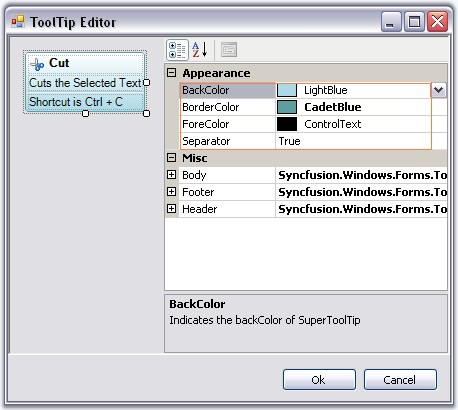
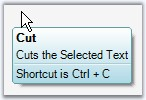
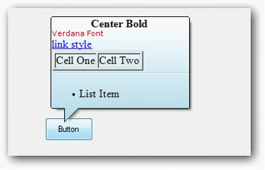

::: {style="DISPLAY: none"}
{#d2h_url_template}{#d2h_package_url style="WIDTH: 0px; DISPLAY: none; HEIGHT: 0px"}
:::

::::: {.d2h_secondary_topic style="PADDING-BOTTOM: 10pt; MARGIN: 0pt; PADDING-LEFT: 0pt; PADDING-RIGHT: 0pt; PADDING-TOP: 0pt"}
##### Appearance Settings {#appearance-settings style="tab-stops: 0pt"}

[]{style="COLOR: #15428b"} 

The appearance of the Super ToolTip can be customized using the below properties. This properties can be edited during design time using ToolTip Editor.

[]{style="COLOR: #15428b"} 

::: {align="center"}
  ------------- ---------------------------------------------------------------------------
  Property      Description
  BackColor     Sets the background gradient color.
  BorderColor   Sets the border color for the control.
  ForeColor     Sets the fore color for the control.
  Separator     Shows or hides a separator between the Body and the Footer tooltip items.
  ------------- ---------------------------------------------------------------------------
:::

**[]{style="COLOR: #15428b"}** 

{border="0"}

**[]{style="COLOR: #15428b"}** 

Figure 1447: Appearance Properties in ToolTip Editor

**[]{style="COLOR: #15428b"}** 

+-----------------------------------------------------------------------------------------------------------------------------------------------------------------------------------------------------------------------------------------------+
| **[\[C#\]]{style="FONT-FAMILY: 'Courier New'; COLOR: black"}**                                                                                                                                                                                |
|                                                                                                                                                                                                                                               |
| []{style="COLOR: #15428b"}                                                                                                                                                                                                                    |
|                                                                                                                                                                                                                                               |
| [toolTipInfo2.BackColor = System.Drawing.SystemColors.LightBlue;]{style="FONT-FAMILY: 'Courier New'; COLOR: black"}                                                                                                                           |
|                                                                                                                                                                                                                                               |
| [toolTipInfo1.BorderColor = System.Drawing.[Color]{style="COLOR: teal"}.CadetBlue;]{style="FONT-FAMILY: 'Courier New'"}                                                                                                                       |
|                                                                                                                                                                                                                                               |
| [toolTipInfo1.ForeColor = System.Drawing.[SystemColors]{style="COLOR: teal"}.ControlText;]{style="FONT-FAMILY: 'Courier New'"}                                                                                                                |
|                                                                                                                                                                                                                                               |
| [toolTipInfo2.Separator = ]{style="FONT-FAMILY: 'Courier New'; COLOR: black"}[true]{style="FONT-FAMILY: 'Courier New'; COLOR: blue"}[;]{style="FONT-FAMILY: 'Courier New'; COLOR: black"}[]{style="FONT-FAMILY: 'Courier New'; COLOR: black"} |
+-----------------------------------------------------------------------------------------------------------------------------------------------------------------------------------------------------------------------------------------------+

[]{style="COLOR: #15428b"} 

+-----------------------------------------------------------------------------------------------------------------------------------------------------------------------------------------+
| **[\[VB.NET\]]{style="FONT-FAMILY: 'Courier New'; COLOR: black"}**                                                                                                                      |
|                                                                                                                                                                                         |
| []{style="COLOR: #15428b"}                                                                                                                                                              |
|                                                                                                                                                                                         |
| [toolTipInfo2.BackColor = System.Drawing.SystemColors.LightBlue]{style="FONT-FAMILY: 'Courier New'; COLOR: black"}                                                                      |
|                                                                                                                                                                                         |
| [toolTipInfo1.BorderColor = System.Drawing.[Color]{style="COLOR: teal"}.CadetBlue]{style="FONT-FAMILY: 'Courier New'"}                                                                  |
|                                                                                                                                                                                         |
| [toolTipInfo1.ForeColor = System.Drawing.[SystemColors]{style="COLOR: teal"}.ControlText]{style="FONT-FAMILY: 'Courier New'"}                                                           |
|                                                                                                                                                                                         |
| [toolTipInfo2.Separator = ]{style="FONT-FAMILY: 'Courier New'; COLOR: black"}[True]{style="FONT-FAMILY: 'Courier New'; COLOR: blue"}[]{style="FONT-FAMILY: 'Courier New'; COLOR: blue"} |
+-----------------------------------------------------------------------------------------------------------------------------------------------------------------------------------------+

**[]{style="COLOR: #15428b"}** 

{border="0"}

**[]{style="COLOR: #15428b"}** 

Figure 1448: SuperToolTip with Customized Appearance

 

Behavior Settings

 

The below properties controls the behavior of the SuperToolTip control.

[]{style="COLOR: #15428b"} 

::: {align="center"}
  ----------------- ---------------------------------------------------------------------------------------------------------------------------------------
  Property          Description
  InitialDelay      Indicates the time (ms) before the tooltip is shown.
  MaxWidth          Sets the maximum width for the tooltip to be shown. If the text of the tooltip exceeds the maxwidth, the text wraps to the next line.
  ToolTipDuration   Indicates the duration of the ToolTip (in sec) when the mouse hovers over a control.
  UseFading         Specifies the fading effect for the SuperToolTip. The options are System and Blend.
  RightToLeft       When set to true will display the tooltip in RightToLeft fashion. Default value is false.
  ----------------- ---------------------------------------------------------------------------------------------------------------------------------------
:::

[]{#p1196}**[]{style="COLOR: #15428b"}** 

+----------------------------------------------------------------------------------------------------------------------------------------------------------------------------------------------------------------------------------------------------------------------------+
| **[\[C#\]]{style="FONT-FAMILY: 'Courier New'; COLOR: black"}**                                                                                                                                                                                                             |
|                                                                                                                                                                                                                                                                            |
| []{style="COLOR: #15428b"}                                                                                                                                                                                                                                                 |
|                                                                                                                                                                                                                                                                            |
| [this]{style="FONT-FAMILY: 'Courier New'; COLOR: blue"}[.superToolTip1.InitialDelay = 750;]{style="FONT-FAMILY: 'Courier New'; COLOR: black"}                                                                                                                              |
|                                                                                                                                                                                                                                                                            |
| [this]{style="FONT-FAMILY: 'Courier New'; COLOR: blue"}[.superToolTip1.MaxWidth = 500;]{style="FONT-FAMILY: 'Courier New'; COLOR: black"}                                                                                                                                  |
|                                                                                                                                                                                                                                                                            |
| [this]{style="FONT-FAMILY: 'Courier New'; COLOR: blue"}[.superToolTip1.ToolTipDuration = 3;]{style="FONT-FAMILY: 'Courier New'; COLOR: black"}                                                                                                                             |
|                                                                                                                                                                                                                                                                            |
| [this]{style="FONT-FAMILY: 'Courier New'; COLOR: blue"}[.superToolTip1.UseFading = Syncfusion.Windows.Forms.Tools.SuperToolTip.FadingType.System;]{style="FONT-FAMILY: 'Courier New'; COLOR: black"}                                                                       |
|                                                                                                                                                                                                                                                                            |
| [this]{style="FONT-FAMILY: 'Courier New'; COLOR: blue"}[.superToolTip1.RightToLeft = ]{style="FONT-FAMILY: 'Courier New'; COLOR: black"}[RightToLeft.Yes[;]{style="COLOR: black"}]{style="FONT-FAMILY: 'Courier New'"}[]{style="FONT-FAMILY: 'Courier New'; COLOR: black"} |
+----------------------------------------------------------------------------------------------------------------------------------------------------------------------------------------------------------------------------------------------------------------------------+

[]{style="COLOR: #15428b"} 

+---------------------------------------------------------------------------------------------------------------------------------------------------------------------------------------------------+
| **[\[VB.NET\]]{style="FONT-FAMILY: 'Courier New'; COLOR: black"}**                                                                                                                                |
|                                                                                                                                                                                                   |
| []{style="COLOR: black"}                                                                                                                                                                          |
|                                                                                                                                                                                                   |
| [Me]{style="FONT-FAMILY: 'Courier New'; COLOR: blue"}[.superToolTip1.InitialDelay = 750]{style="FONT-FAMILY: 'Courier New'; COLOR: black"}                                                        |
|                                                                                                                                                                                                   |
| [Me]{style="FONT-FAMILY: 'Courier New'; COLOR: blue"}[.superToolTip1.MaxWidth = 500]{style="FONT-FAMILY: 'Courier New'"}                                                                          |
|                                                                                                                                                                                                   |
| [Me]{style="FONT-FAMILY: 'Courier New'; COLOR: blue"}[.superToolTip1.ToolTipDuration = 3]{style="FONT-FAMILY: 'Courier New'; COLOR: black"}                                                       |
|                                                                                                                                                                                                   |
| [Me]{style="FONT-FAMILY: 'Courier New'; COLOR: blue"}[.superToolTip1.UseFading = Syncfusion.Windows.Forms.Tools.SuperToolTip.FadingType.System]{style="FONT-FAMILY: 'Courier New'; COLOR: black"} |
|                                                                                                                                                                                                   |
| [this]{style="FONT-FAMILY: 'Courier New'; COLOR: blue"}[.superToolTip1.RightToLeft = ]{style="FONT-FAMILY: 'Courier New'; COLOR: black"}[RightToLeft.Yes]{style="FONT-FAMILY: 'Courier New'"}     |
+---------------------------------------------------------------------------------------------------------------------------------------------------------------------------------------------------+

[]{style="COLOR: #15428b"} 

 

**Balloon Style Appearance in SuperToolTip**

**Style** property is added to set Balloon style for **SuperTooltip**. ** SuperToolTipStyle** enumeration contains Balloon and Normal value.

Set **Style** property to **Balloon** to change the **SuperToolTip** appearance as balloon.

{border="0"}

Figure 1449: Balloon ToolTip

The following code illustrates how to set **SuperToolTipStyle**[.]{style="FONT-FAMILY: 'Calibri','sans-serif'"}

+------------------------------------------------------------------------------------------------------------------------------------------------------------------------------------------------+
| **[\[C# .Net\]]{style="FONT-FAMILY: 'Courier New'"}**                                                                                                                                          |
|                                                                                                                                                                                                |
| **[]{style="FONT-FAMILY: 'Courier New'"}**                                                                                                                                                     |
|                                                                                                                                                                                                |
| [this.superToolTip1.Style = Syncfusion.Windows.Forms.Tools.SuperToolTip.SuperToolTipStyle.Balloon;]{style="FONT-FAMILY: 'Courier New'"}[]{style="FONT-FAMILY: 'Courier New'; FONT-SIZE: 11pt"} |
+------------------------------------------------------------------------------------------------------------------------------------------------------------------------------------------------+

[]{#p1197}[]{style="FONT-FAMILY: 'Times New Roman','serif'; FONT-SIZE: 11pt"} 

+---------------------------------------------------------------------------------------------------------------------------------------------------------------------------------------------+
| **[\[VB .Net\]]{style="FONT-FAMILY: 'Courier New'"}**                                                                                                                                       |
|                                                                                                                                                                                             |
| **[]{style="FONT-FAMILY: 'Courier New'"}**                                                                                                                                                  |
|                                                                                                                                                                                             |
| [Me.superToolTip1.Style = Syncfusion.Windows.Forms.Tools.SuperToolTip.SuperToolTipStyle.Balloon]{style="FONT-FAMILY: 'Courier New'"}[]{style="FONT-FAMILY: 'Courier New'; FONT-SIZE: 11pt"} |
+---------------------------------------------------------------------------------------------------------------------------------------------------------------------------------------------+

 

[]{#related-topics}
:::::
