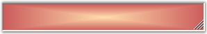
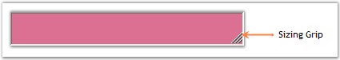

::: {style="DISPLAY: none"}
{#d2h_url_template}{#d2h_package_url style="WIDTH: 0px; DISPLAY: none; HEIGHT: 0px"}
:::

::::: {.d2h_secondary_topic style="PADDING-BOTTOM: 10pt; MARGIN: 0pt; PADDING-LEFT: 0pt; PADDING-RIGHT: 0pt; PADDING-TOP: 0pt"}
##### Appearance Settings {#appearance-settings style="MARGIN-LEFT: 18pt; tab-stops: 18.0pt"}

[]{style="COLOR: #15428b"} 

The appearance of the StatusBarAdv control can be enhanced using the properties given below.

[]{style="COLOR: #15428b"} 

Background Settings

[]{style="COLOR: #15428b"} 

The StatusBarAdv control\'s background can be customized using the various options provided in the BackgroundColor property given below.

[]{style="COLOR: #15428b"} 

::: {align="center"}
+-----------------------------------+-------------------------------------------------------------------------------------------------------------------------------------+
| StatusBarAdv Property             | Description                                                                                                                         |
+-----------------------------------+-------------------------------------------------------------------------------------------------------------------------------------+
| BackgroundColor                   | Gets / sets the background gradient and other styles.                                                                               |
+-----------------------------------+-------------------------------------------------------------------------------------------------------------------------------------+
| Style                             | Specifies the brush style.                                                                                                          |
|                                   |                                                                                                                                     |
|                                   |                                                                                                                                     |
|                                   |                                                                                                                                     |
|                                   | [·      ]{style="FONT-FAMILY: Symbol"}Solid,                                                                                        |
|                                   |                                                                                                                                     |
|                                   | [·      ]{style="FONT-FAMILY: Symbol"}Pattern and                                                                                   |
|                                   |                                                                                                                                     |
|                                   | [·      ]{style="FONT-FAMILY: Symbol"}Gradient.                                                                                     |
+-----------------------------------+-------------------------------------------------------------------------------------------------------------------------------------+
| BackColor                         | Specifies the backcolor of the control.                                                                                             |
+-----------------------------------+-------------------------------------------------------------------------------------------------------------------------------------+
| ForeColor                         | Specifies the forecolor for any text or graphics in the control.                                                                    |
+-----------------------------------+-------------------------------------------------------------------------------------------------------------------------------------+
| PatternStyle                      | Specifies the pattern style of the control.                                                                                         |
+-----------------------------------+-------------------------------------------------------------------------------------------------------------------------------------+
| GradientBackground                | Indicates whether the background will be drawn with the gradient.                                                                   |
+-----------------------------------+-------------------------------------------------------------------------------------------------------------------------------------+
| GradientStyle                     | Specifies the gradient style of the background.                                                                                     |
|                                   |                                                                                                                                     |
|                                   |                                                                                                                                     |
|                                   |                                                                                                                                     |
|                                   | [·      ]{style="FONT-FAMILY: Symbol"}ForwardDiagonal,                                                                              |
|                                   |                                                                                                                                     |
|                                   | [·      ]{style="FONT-FAMILY: Symbol"}BackwardDiagonal,                                                                             |
|                                   |                                                                                                                                     |
|                                   | [·      ]{style="FONT-FAMILY: Symbol"}Horizontal,                                                                                   |
|                                   |                                                                                                                                     |
|                                   | [·      ]{style="FONT-FAMILY: Symbol"}Vertical,                                                                                     |
|                                   |                                                                                                                                     |
|                                   | [·      ]{style="FONT-FAMILY: Symbol"}PathRectangle and                                                                             |
|                                   |                                                                                                                                     |
|                                   | [·      ]{style="FONT-FAMILY: Symbol"}PathEllipse.                                                                                  |
+-----------------------------------+-------------------------------------------------------------------------------------------------------------------------------------+
| VerticalGradient                  | Indicates whether the gradient is vertical.                                                                                         |
+-----------------------------------+-------------------------------------------------------------------------------------------------------------------------------------+
| GradientColors                    | Specifies the gradient colors.                                                                                                      |
|                                   |                                                                                                                                     |
|                                   |                                                                                                                                     |
|                                   |                                                                                                                                     |
|                                   | The first entry in this list will be the same as the BackColor property, the last entry will be the same as the ForeColor property. |
+-----------------------------------+-------------------------------------------------------------------------------------------------------------------------------------+
:::

[]{style="COLOR: #15428b"} 

+------------------------------------------------------------------------------------------------------------------------------------------------------------------------------------------------------------------------------------------------------------------------------------------------------------------------------------------------------------------------------------------------------+
| **[\[C#\]]{style="FONT-FAMILY: 'Courier New'; COLOR: black"}**                                                                                                                                                                                                                                                                                                                                       |
|                                                                                                                                                                                                                                                                                                                                                                                                      |
| []{style="FONT-FAMILY: 'Courier New'"}                                                                                                                                                                                                                                                                                                                                                               |
|                                                                                                                                                                                                                                                                                                                                                                                                      |
| [this]{style="FONT-FAMILY: 'Courier New'; COLOR: blue"}[.statusBarAdv1.BackgroundColor = [new]{style="COLOR: blue"} Syncfusion.Drawing.[BrushInfo]{style="COLOR: teal"}(Syncfusion.Drawing.[GradientStyle]{style="COLOR: teal"}.PathRectangle, System.Drawing.[Color]{style="COLOR: teal"}.NavajoWhite, System.Drawing.[Color]{style="COLOR: teal"}.IndianRed);]{style="FONT-FAMILY: 'Courier New'"} |
+------------------------------------------------------------------------------------------------------------------------------------------------------------------------------------------------------------------------------------------------------------------------------------------------------------------------------------------------------------------------------------------------------+

[]{style="COLOR: #15428b"} 

+-------------------------------------------------------------------------------------------------------------------------------------------------------------------------------------------------------------------------------------------------------------------------------------------------------+
| **[\[VB.NET\]]{style="FONT-FAMILY: 'Courier New'; COLOR: black"}**                                                                                                                                                                                                                                    |
|                                                                                                                                                                                                                                                                                                       |
| []{style="FONT-FAMILY: 'Courier New'"}                                                                                                                                                                                                                                                                |
|                                                                                                                                                                                                                                                                                                       |
| [Me]{style="FONT-FAMILY: 'Courier New'; COLOR: blue"}[.statusBarAdv1.BackgroundColor = [New]{style="COLOR: blue"} Syncfusion.Drawing.BrushInfo(Syncfusion.Drawing.GradientStyle.PathRectangle, System.Drawing.Color.NavajoWhite, System.Drawing.Color.IndianRed)]{style="FONT-FAMILY: 'Courier New'"} |
+-------------------------------------------------------------------------------------------------------------------------------------------------------------------------------------------------------------------------------------------------------------------------------------------------------+

[]{style="COLOR: #15428b"} 

{border="0"}

[]{style="COLOR: #15428b"} 

Figure 1009: StatusBarAdv with BackgroundColor Set

[]{style="COLOR: #15428b"} 

Sizing Grip

[]{style="COLOR: #15428b"} 

A sizing grip can be displayed for the StatusBarAdv control using the property given below.

[]{style="COLOR: #15428b"} 

::: {align="center"}
  ----------------------- ------------------------------------------
  StatusBarAdv Property   Description
  SizingGrip              Indicates if the sizing grip is visible.
  ----------------------- ------------------------------------------
:::

[]{style="COLOR: #15428b"} 

+-------------------------------------------------------------------------------------------------------------------------------------------------------+
| **[\[C#\]]{style="FONT-FAMILY: 'Courier New'; COLOR: black"}**                                                                                        |
|                                                                                                                                                       |
| []{style="FONT-FAMILY: 'Courier New'; COLOR: black"}                                                                                                  |
|                                                                                                                                                       |
| [this]{style="FONT-FAMILY: 'Courier New'; COLOR: blue"}[.statusBarAdv1.SizingGrip = [true]{style="COLOR: blue"};]{style="FONT-FAMILY: 'Courier New'"} |
+-------------------------------------------------------------------------------------------------------------------------------------------------------+

[]{style="COLOR: #15428b"} 

+----------------------------------------------------------------------------------------------------------------------------------------------------+
| **[\[VB.NET\]]{style="FONT-FAMILY: 'Courier New'; COLOR: black"}**                                                                                 |
|                                                                                                                                                    |
| []{style="FONT-FAMILY: 'Courier New'; COLOR: black"}                                                                                               |
|                                                                                                                                                    |
| [Me]{style="FONT-FAMILY: 'Courier New'; COLOR: blue"}[.statusBarAdv1.SizingGrip = [True]{style="COLOR: blue"}]{style="FONT-FAMILY: 'Courier New'"} |
+----------------------------------------------------------------------------------------------------------------------------------------------------+

[]{style="COLOR: #15428b"} 

**SizingGrip** property when set will display a grip at the bottom right of the control as displayed in the below image.

[]{style="COLOR: #15428b"} 

{border="0"}

[]{style="COLOR: #15428b"} 

Figure 1010: SizingGrip property set to \"True\"

 

 

 

 

[]{#related-topics}
:::::
