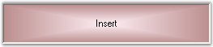

::: {style="DISPLAY: none"}
{#d2h_url_template}{#d2h_package_url style="WIDTH: 0px; DISPLAY: none; HEIGHT: 0px"}
:::

::::: {.d2h_secondary_topic style="PADDING-BOTTOM: 10pt; MARGIN: 0pt; PADDING-LEFT: 0pt; PADDING-RIGHT: 0pt; PADDING-TOP: 0pt"}
##### Appearance Settings {#appearance-settings style="MARGIN-LEFT: 18pt; tab-stops: 18.0pt"}

[]{style="COLOR: #15428b"} 

The appearance of the StatusBarAdvPanel control can be enhanced using the properties given below.

[]{style="COLOR: #15428b"} 

Background Settings

 

The StatusBarAdvPanel control\'s background can be customized using the various options provided in the BackgroundColor property given below.

[]{style="COLOR: #15428b"} 

::: {align="center"}
+-----------------------------------+-------------------------------------------------------------------------------------------------------------------------------------+
| StatusBarAdvPanel Property        | Description                                                                                                                         |
+-----------------------------------+-------------------------------------------------------------------------------------------------------------------------------------+
| BackgroundColor                   | Gets / sets the background gradient and other styles.                                                                               |
+-----------------------------------+-------------------------------------------------------------------------------------------------------------------------------------+
| Style                             | Specifies the brush style.                                                                                                          |
|                                   |                                                                                                                                     |
|                                   |                                                                                                                                     |
|                                   |                                                                                                                                     |
|                                   | [·      ]{style="FONT-FAMILY: Symbol"}*Solid,*                                                                                      |
|                                   |                                                                                                                                     |
|                                   | [·      ]{style="FONT-FAMILY: Symbol"}*Pattern and*                                                                                 |
|                                   |                                                                                                                                     |
|                                   | [·      ]{style="FONT-FAMILY: Symbol"}*Gradient.*                                                                                   |
+-----------------------------------+-------------------------------------------------------------------------------------------------------------------------------------+
| BackColor                         | Specifies the backcolor of the control.                                                                                             |
+-----------------------------------+-------------------------------------------------------------------------------------------------------------------------------------+
| ForeColor                         | Specifies the forecolor for any text or graphics in the control.                                                                    |
+-----------------------------------+-------------------------------------------------------------------------------------------------------------------------------------+
| PatternStyle                      | Specifies the pattern style of the control.                                                                                         |
+-----------------------------------+-------------------------------------------------------------------------------------------------------------------------------------+
| GradientBackground                | Indicates whether the background will be drawn with the gradient.                                                                   |
+-----------------------------------+-------------------------------------------------------------------------------------------------------------------------------------+
| GradientStyle                     | Specifies the gradient style of the background.                                                                                     |
|                                   |                                                                                                                                     |
|                                   |                                                                                                                                     |
|                                   |                                                                                                                                     |
|                                   | [·      ]{style="FONT-FAMILY: Symbol"}ForwardDiagonal,                                                                              |
|                                   |                                                                                                                                     |
|                                   | [·      ]{style="FONT-FAMILY: Symbol"}BackwardDiagonal,                                                                             |
|                                   |                                                                                                                                     |
|                                   | [·      ]{style="FONT-FAMILY: Symbol"}Horizontal,                                                                                   |
|                                   |                                                                                                                                     |
|                                   | [·      ]{style="FONT-FAMILY: Symbol"}Vertical,                                                                                     |
|                                   |                                                                                                                                     |
|                                   | [·      ]{style="FONT-FAMILY: Symbol"}PathRectangle and                                                                             |
|                                   |                                                                                                                                     |
|                                   | [·      ]{style="FONT-FAMILY: Symbol"}PathEllipse.                                                                                  |
+-----------------------------------+-------------------------------------------------------------------------------------------------------------------------------------+
| GradientColors                    | Specifies the gradient colors.                                                                                                      |
|                                   |                                                                                                                                     |
|                                   |                                                                                                                                     |
|                                   |                                                                                                                                     |
|                                   | The first entry in this list will be the same as the BackColor property, the last entry will be the same as the ForeColor property. |
+-----------------------------------+-------------------------------------------------------------------------------------------------------------------------------------+
:::

[]{style="COLOR: #15428b"} 

+-------------------------------------------------------------------------------------------------------------------------------------------------------------------------------------------------------------------------------------------------------------------------------------------------------------------------------------------------------------------------------------------------------------+
| **[\[C#\]]{style="FONT-FAMILY: 'Courier New'; COLOR: black"}**                                                                                                                                                                                                                                                                                                                                              |
|                                                                                                                                                                                                                                                                                                                                                                                                             |
| []{style="FONT-FAMILY: 'Courier New'"}                                                                                                                                                                                                                                                                                                                                                                      |
|                                                                                                                                                                                                                                                                                                                                                                                                             |
| [this]{style="FONT-FAMILY: 'Courier New'; COLOR: blue"}[.statusBarAdvPanel1.BackgroundColor = [new]{style="COLOR: blue"} Syncfusion.Drawing.[BrushInfo]{style="COLOR: teal"}(Syncfusion.Drawing.[GradientStyle]{style="COLOR: teal"}.PathRectangle, System.Drawing.[Color]{style="COLOR: teal"}.LavenderBlush, System.Drawing.[Color]{style="COLOR: teal"}.RosyBrown);]{style="FONT-FAMILY: 'Courier New'"} |
+-------------------------------------------------------------------------------------------------------------------------------------------------------------------------------------------------------------------------------------------------------------------------------------------------------------------------------------------------------------------------------------------------------------+

[]{style="COLOR: #15428b"} 

+--------------------------------------------------------------------------------------------------------------------------------------------------------------------------------------------------------------------------------------------------------------------------------------------------------------+
| **[\[VB.NET\]]{style="FONT-FAMILY: 'Courier New'; COLOR: black"}**                                                                                                                                                                                                                                           |
|                                                                                                                                                                                                                                                                                                              |
| []{style="FONT-FAMILY: 'Courier New'"}                                                                                                                                                                                                                                                                       |
|                                                                                                                                                                                                                                                                                                              |
| [Me]{style="FONT-FAMILY: 'Courier New'; COLOR: blue"}[.statusBarAdvPanel1.BackgroundColor = [New]{style="COLOR: blue"} Syncfusion.Drawing.BrushInfo(Syncfusion.Drawing.GradientStyle.PathRectangle, System.Drawing.Color.LavenderBlush, System.Drawing.Color.RosyBrown)]{style="FONT-FAMILY: 'Courier New'"} |
+--------------------------------------------------------------------------------------------------------------------------------------------------------------------------------------------------------------------------------------------------------------------------------------------------------------+

[]{style="COLOR: #15428b"} 

{border="0"}

[]{style="COLOR: #15428b"} 

Figure 1022: StatusBarAdvPanel with Background Color Set

[]{style="COLOR: #15428b"} 

Icon Settings

[]{style="FONT-FAMILY: 'Verdana','sans-serif'; COLOR: #4a5c8c; FONT-SIZE: 8pt"} 

Icons can be added to the StatusBarAdvPanels using the property given below.

[]{style="FONT-SIZE: 8pt"} 

::: {align="center"}
  ---------------------------- ----------------------------------
  StatusBarAdvPanel Property   Description
  Icon                         Indicates the icon of the panel.
  ---------------------------- ----------------------------------
:::

[]{style="FONT-FAMILY: 'Courier New'"} 

+---------------------------------------------------------------------------------------------------------------------------------------------------------------------------------------------------------------------+
| **[\[C#\]]{style="FONT-FAMILY: 'Courier New'; COLOR: black"}**                                                                                                                                                      |
|                                                                                                                                                                                                                     |
| []{style="FONT-FAMILY: 'Courier New'"}                                                                                                                                                                              |
|                                                                                                                                                                                                                     |
| [this]{style="FONT-FAMILY: 'Courier New'; COLOR: blue"}[.Icon = ((System.Drawing.[Icon]{style="COLOR: teal"})(resources.GetObject([\"\$this.Icon\"]{style="COLOR: maroon"})));]{style="FONT-FAMILY: 'Courier New'"} |
+---------------------------------------------------------------------------------------------------------------------------------------------------------------------------------------------------------------------+

[]{style="COLOR: #15428b"} 

+----------------------------------------------------------------------------------------------------------------------------------------------------------------------------------------------------------------------------+
| **[\[VB.NET\]]{style="FONT-FAMILY: 'Courier New'; COLOR: black"}**                                                                                                                                                         |
|                                                                                                                                                                                                                            |
| []{style="FONT-FAMILY: 'Courier New'"}                                                                                                                                                                                     |
|                                                                                                                                                                                                                            |
| [Me]{style="FONT-FAMILY: 'Courier New'; COLOR: blue"}[.Icon = [DirectCast]{style="COLOR: blue"}((resources.GetObject([\"\$this.Icon\"]{style="COLOR: maroon"})), System.Drawing.Icon)]{style="FONT-FAMILY: 'Courier New'"} |
+----------------------------------------------------------------------------------------------------------------------------------------------------------------------------------------------------------------------------+

[]{style="COLOR: #15428b"} 

{border="0"}

[]{style="COLOR: #15428b"} 

Figure 1023: Icon displayed for the StatusBarAdvPanel

 

 

 

 

[]{#related-topics}
:::::
