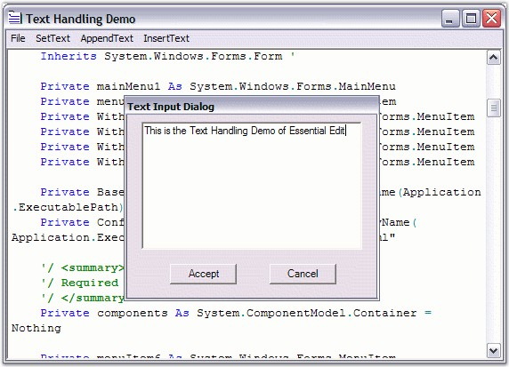

::: {style="DISPLAY: none"}
{#d2h_url_template}{#d2h_package_url style="WIDTH: 0px; DISPLAY: none; HEIGHT: 0px"}
:::

:::::::: {.d2h_secondary_topic style="PADDING-BOTTOM: 10pt; MARGIN: 0pt; PADDING-LEFT: 0pt; PADDING-RIGHT: 0pt; PADDING-TOP: 0pt"}
#### Appending, Deleting and Inserting Multiple Lines of Text {#appending-deleting-and-inserting-multiple-lines-of-text style="tab-stops: 0pt"}

 

Edit Control offers support for text manipulation operations like append, delete and insertion of multiple lines of text, through the use of the following APIs.

 

**Appending Text**

[]{style="COLOR: #4a5c8c"} 

Text can be appended to the Edit Control by using the below given method.

 

::: {align="center"}
  --------------------- -------------------------------------------------------------------------------------
  Edit Control Method   Description
  AppendText            Appends the specified text to the end of the existing contents of the Edit Control.
  --------------------- -------------------------------------------------------------------------------------
:::

[]{style="FONT-FAMILY: 'Trebuchet MS','sans-serif'; COLOR: #4a5c8c; FONT-SIZE: 9pt"} 

+----------------------------------------------------------------------------------------------------------------------------------------------------------------------------+
| **[\[C#\]]{style="FONT-FAMILY: 'Courier New'; COLOR: black"}**                                                                                                             |
|                                                                                                                                                                            |
| []{style="FONT-FAMILY: 'Courier New'; COLOR: black"}                                                                                                                       |
|                                                                                                                                                                            |
| [// Appends the given string to the end of the text in Edit Control.]{style="FONT-FAMILY: 'Courier New'; COLOR: green"}                                                    |
|                                                                                                                                                                            |
| [this]{style="FONT-FAMILY: 'Courier New'; COLOR: blue"}[.editControl1.AppendText([\" text to be appended \"]{style="COLOR: maroon"});]{style="FONT-FAMILY: 'Courier New'"} |
+----------------------------------------------------------------------------------------------------------------------------------------------------------------------------+

[]{style="FONT-FAMILY: 'Trebuchet MS','sans-serif'; COLOR: #15428b; FONT-SIZE: 9pt"} 

+-------------------------------------------------------------------------------------------------------------------------------------------------------------------------+
| **[\[VB.NET\]]{style="FONT-FAMILY: 'Courier New'; COLOR: black"}**                                                                                                      |
|                                                                                                                                                                         |
| []{style="FONT-FAMILY: 'Courier New'; COLOR: black"}                                                                                                                    |
|                                                                                                                                                                         |
| [\' Appends the given string to the end of the text in the Edit Control.]{style="FONT-FAMILY: 'Courier New'; COLOR: green"}                                             |
|                                                                                                                                                                         |
| [Me]{style="FONT-FAMILY: 'Courier New'; COLOR: blue"}[.editControl1.AppendText([\" text to be appended \"]{style="COLOR: maroon"})]{style="FONT-FAMILY: 'Courier New'"} |
+-------------------------------------------------------------------------------------------------------------------------------------------------------------------------+

[]{style="FONT-FAMILY: 'Trebuchet MS','sans-serif'; COLOR: #4a5c8c; FONT-SIZE: 9pt"} 

Inserting Text

 

The Insert mode can be enabled in the Edit Control by setting the **InsertMode** property to True.

 

Text can be inserted anywhere inside the Edit Control by using the **InsertText** method given below.

 

::: {align="center"}
  --------------------- ----------------------------------------------------------------------
  Edit Control Method   Description
  InsertText            Inserts a piece of text at any desired position in the Edit Control.
  --------------------- ----------------------------------------------------------------------
:::

 

Inserting Multiple Lines

 

Collection of text lines can be inserted by using the property given below.

 

::: {align="center"}
  ---------------------------------------- ------------------------------------------------------------------------------------------------------------------------------------------------------------
           Edit Control Property           Description
  Lines                                    Lets you specify multiple lines of text to the Edit Control in the form of a string array. This feature is similar to the one in .NET RichTextBox control.
  ---------------------------------------- ------------------------------------------------------------------------------------------------------------------------------------------------------------
:::

 

Inserting Text based on Conditions

 

The below given properties can be used to insert text based on conditions which have been described below.

 

::: {align="center"}
+-----------------------------------+-------------------------------------------------------------------------------------------------------------------------+
| Edit Control Property             | Description                                                                                                             |
+-----------------------------------+-------------------------------------------------------------------------------------------------------------------------+
| AllowInsertBeforeReadOnlyNewLine  | Specifies whether inserting text should be allowed at the beginning of readonly region at the start of new line.        |
+-----------------------------------+-------------------------------------------------------------------------------------------------------------------------+
| InsertDroppedFileIntoText         | Specifies whether the outer file dragged and dropped onto the Edit Control should be inserted into the current content. |
|                                   |                                                                                                                         |
|                                   |                                                                                                                         |
|                                   |                                                                                                                         |
|                                   | When this property is set to \'False\', the current file is closed, and the dropped outer file is opened.               |
+-----------------------------------+-------------------------------------------------------------------------------------------------------------------------+
| RespectTabStopsOnInsertingText    | Specifies whether tab stops should be respected on inserting blocks of text.                                            |
+-----------------------------------+-------------------------------------------------------------------------------------------------------------------------+
:::

[]{style="FONT-FAMILY: 'Trebuchet MS','sans-serif'; COLOR: #4a5c8c; FONT-SIZE: 9pt"} 

+---------------------------------------------------------------------------------------------------------------------------------------------------------------------------------------------------------------------------------------------------------------------------------------------------------------------+
| **[\[C#\]]{style="FONT-FAMILY: 'Courier New'; COLOR: black"}**                                                                                                                                                                                                                                                      |
|                                                                                                                                                                                                                                                                                                                     |
| []{style="FONT-FAMILY: 'Courier New'"}                                                                                                                                                                                                                                                                              |
|                                                                                                                                                                                                                                                                                                                     |
| [// Set the Insert mode.]{style="FONT-FAMILY: 'Courier New'; COLOR: green"}                                                                                                                                                                                                                                         |
|                                                                                                                                                                                                                                                                                                                     |
| [this]{style="FONT-FAMILY: 'Courier New'; COLOR: blue"}[.editControl1.InsertMode = [true]{style="COLOR: blue"};]{style="FONT-FAMILY: 'Courier New'"}                                                                                                                                                                |
|                                                                                                                                                                                                                                                                                                                     |
| []{style="FONT-FAMILY: 'Courier New'"}                                                                                                                                                                                                                                                                              |
|                                                                                                                                                                                                                                                                                                                     |
| [// Inserts a string at the given line and column.]{style="FONT-FAMILY: 'Courier New'; COLOR: green"}                                                                                                                                                                                                               |
|                                                                                                                                                                                                                                                                                                                     |
| [this]{style="FONT-FAMILY: 'Courier New'; COLOR: blue"}[.editControl1.InsertText(1, 1, [\" text to be inserted \"]{style="COLOR: maroon"});]{style="FONT-FAMILY: 'Courier New'"}                                                                                                                                    |
|                                                                                                                                                                                                                                                                                                                     |
| []{style="FONT-FAMILY: 'Courier New'"}                                                                                                                                                                                                                                                                              |
|                                                                                                                                                                                                                                                                                                                     |
| [// Specifies multiple lines of text to the EditControl in the form of a string array. ]{style="FONT-FAMILY: 'Courier New'; COLOR: green"}                                                                                                                                                                          |
|                                                                                                                                                                                                                                                                                                                     |
| [this]{style="FONT-FAMILY: 'Courier New'; COLOR: blue"}[.editControl1.Lines = [new]{style="COLOR: blue"} [string]{style="COLOR: blue"}\[\] {[\" first line \"]{style="COLOR: maroon"}, [\" second line \"]{style="COLOR: maroon"}, [\" third line \"]{style="COLOR: maroon"}};]{style="FONT-FAMILY: 'Courier New'"} |
|                                                                                                                                                                                                                                                                                                                     |
| []{style="FONT-FAMILY: 'Courier New'"}                                                                                                                                                                                                                                                                              |
|                                                                                                                                                                                                                                                                                                                     |
| [// Allows text insertion only at the beginning of the readonly region at the start of a new line.]{style="FONT-FAMILY: 'Courier New'; COLOR: green"}                                                                                                                                                               |
|                                                                                                                                                                                                                                                                                                                     |
| [this]{style="FONT-FAMILY: 'Courier New'; COLOR: blue"}[.editControl1.AllowInsertBeforeReadonlyNewLine = [true]{style="COLOR: blue"};]{style="FONT-FAMILY: 'Courier New'"}                                                                                                                                          |
|                                                                                                                                                                                                                                                                                                                     |
| []{style="FONT-FAMILY: 'Courier New'"}                                                                                                                                                                                                                                                                              |
|                                                                                                                                                                                                                                                                                                                     |
| [// Specifies whether the outer file dragged and dropped onto the editcontrol should be inserted into the current content.]{style="FONT-FAMILY: 'Courier New'; COLOR: green"}                                                                                                                                       |
|                                                                                                                                                                                                                                                                                                                     |
| [this]{style="FONT-FAMILY: 'Courier New'; COLOR: blue"}[.editControl1.InsertDroppedFileIntoText = [true]{style="COLOR: blue"};]{style="FONT-FAMILY: 'Courier New'"}                                                                                                                                                 |
+---------------------------------------------------------------------------------------------------------------------------------------------------------------------------------------------------------------------------------------------------------------------------------------------------------------------+

[]{style="FONT-FAMILY: 'Trebuchet MS','sans-serif'; COLOR: #15428b; FONT-SIZE: 9pt"} 

+----------------------------------------------------------------------------------------------------------------------------------------------------------------------------------------------------------------------------------------------------------------------------------------------------------------+
| **[\[VB.NET\]]{style="FONT-FAMILY: 'Courier New'; COLOR: black"}**                                                                                                                                                                                                                                             |
|                                                                                                                                                                                                                                                                                                                |
| []{style="FONT-FAMILY: 'Courier New'; COLOR: green"}                                                                                                                                                                                                                                                           |
|                                                                                                                                                                                                                                                                                                                |
| [\' Set the Insert mode.]{style="FONT-FAMILY: 'Courier New'; COLOR: green"}                                                                                                                                                                                                                                    |
|                                                                                                                                                                                                                                                                                                                |
| [Me]{style="FONT-FAMILY: 'Courier New'; COLOR: blue"}[.editControl1.InsertMode = [True]{style="COLOR: blue"}]{style="FONT-FAMILY: 'Courier New'"}                                                                                                                                                              |
|                                                                                                                                                                                                                                                                                                                |
| []{style="FONT-FAMILY: 'Courier New'; COLOR: green"}                                                                                                                                                                                                                                                           |
|                                                                                                                                                                                                                                                                                                                |
| [\' Inserts a string at the given line and column.]{style="FONT-FAMILY: 'Courier New'; COLOR: green"}                                                                                                                                                                                                          |
|                                                                                                                                                                                                                                                                                                                |
| [Me]{style="FONT-FAMILY: 'Courier New'; COLOR: blue"}[.editControl1.InsertText(1, 1, [\" text to be inserted \"]{style="COLOR: maroon"})]{style="FONT-FAMILY: 'Courier New'"}                                                                                                                                  |
|                                                                                                                                                                                                                                                                                                                |
| []{style="FONT-FAMILY: 'Courier New'"}                                                                                                                                                                                                                                                                         |
|                                                                                                                                                                                                                                                                                                                |
| [\' Specifies multiple lines of text to the EditControl in the form of a string array. ]{style="FONT-FAMILY: 'Courier New'; COLOR: green"}                                                                                                                                                                     |
|                                                                                                                                                                                                                                                                                                                |
| [Me]{style="FONT-FAMILY: 'Courier New'; COLOR: blue"}[.editControl1.Lines = [New]{style="COLOR: blue"} [String]{style="COLOR: blue"}() {[\" first line \"]{style="COLOR: maroon"}, [\" second line \"]{style="COLOR: maroon"}, [\" third line \"]{style="COLOR: maroon"}}]{style="FONT-FAMILY: 'Courier New'"} |
|                                                                                                                                                                                                                                                                                                                |
| []{style="FONT-FAMILY: 'Courier New'"}                                                                                                                                                                                                                                                                         |
|                                                                                                                                                                                                                                                                                                                |
| [\' Allows text insertion only at the beginning of the readonly region at the start of a new line.]{style="FONT-FAMILY: 'Courier New'; COLOR: green"}                                                                                                                                                          |
|                                                                                                                                                                                                                                                                                                                |
| [Me]{style="FONT-FAMILY: 'Courier New'; COLOR: blue"}[.editControl1.AllowInsertBeforeReadonlyNewLine = [True]{style="COLOR: blue"}]{style="FONT-FAMILY: 'Courier New'"}                                                                                                                                        |
|                                                                                                                                                                                                                                                                                                                |
| []{style="FONT-FAMILY: 'Courier New'; COLOR: blue"}                                                                                                                                                                                                                                                            |
|                                                                                                                                                                                                                                                                                                                |
| [\' Specifies whether the outer file dragged and dropped onto the editcontrol should be inserted into the current content.]{style="FONT-FAMILY: 'Courier New'; COLOR: green"}                                                                                                                                  |
|                                                                                                                                                                                                                                                                                                                |
| [Me]{style="FONT-FAMILY: 'Courier New'; COLOR: blue"}[.editControl1.InsertDroppedFileIntoText = [True]{style="COLOR: blue"}]{style="FONT-FAMILY: 'Courier New'"}                                                                                                                                               |
+----------------------------------------------------------------------------------------------------------------------------------------------------------------------------------------------------------------------------------------------------------------------------------------------------------------+

 

Deleting Text

 

Text can be deleted in the Edit Control by using the below given methods.

 

::: {align="center"}
  --------------------- ------------------------------------------------------------------
  Edit Control Method   Description
  DeleteChar            Deletes a character to the right of the current cursor position.
  DeleteCharLeft        Deletes a character to the left of the current cursor position.
  DeleteWord            Deletes a word to the right of the current cursor position.
  DeleteWordLeft        Deletes a word to the left of the current cursor position.
  DeleteAll             Deletes all text in the document.
  DeleteText            Deletes the specified text.
  --------------------- ------------------------------------------------------------------
:::

[]{style="FONT-FAMILY: 'Trebuchet MS','sans-serif'; COLOR: #15428b; FONT-SIZE: 9pt"} 

+-------------------------------------------------------------------------------------------------------------------------------------------------------------------------------------------------------------------------------------------+
| **[\[C#\]]{style="FONT-FAMILY: 'Courier New'; COLOR: black"}**                                                                                                                                                                            |
|                                                                                                                                                                                                                                           |
| []{style="FONT-FAMILY: 'Courier New'"}                                                                                                                                                                                                    |
|                                                                                                                                                                                                                                           |
| [// Deletes the character to the right of the cursor.]{style="FONT-FAMILY: 'Courier New'; COLOR: green"}                                                                                                                                  |
|                                                                                                                                                                                                                                           |
| [this]{style="FONT-FAMILY: 'Courier New'; COLOR: blue"}[.editControl1.DeleteChar();]{style="FONT-FAMILY: 'Courier New'"}                                                                                                                  |
|                                                                                                                                                                                                                                           |
| []{style="FONT-FAMILY: 'Courier New'"}                                                                                                                                                                                                    |
|                                                                                                                                                                                                                                           |
| [// Deletes the character to the left of the cursor.]{style="FONT-FAMILY: 'Courier New'; COLOR: green"}                                                                                                                                   |
|                                                                                                                                                                                                                                           |
| [this]{style="FONT-FAMILY: 'Courier New'; COLOR: blue"}[.editControl1.DeleteCharLeft();]{style="FONT-FAMILY: 'Courier New'"}                                                                                                              |
|                                                                                                                                                                                                                                           |
| []{style="FONT-FAMILY: 'Courier New'"}                                                                                                                                                                                                    |
|                                                                                                                                                                                                                                           |
| [// Deletes a word to the right of the current cursor position.]{style="FONT-FAMILY: 'Courier New'; COLOR: green"}                                                                                                                        |
|                                                                                                                                                                                                                                           |
| [this]{style="FONT-FAMILY: 'Courier New'; COLOR: blue"}[.editControl1.DeleteWord();]{style="FONT-FAMILY: 'Courier New'"}                                                                                                                  |
|                                                                                                                                                                                                                                           |
| []{style="FONT-FAMILY: 'Courier New'"}                                                                                                                                                                                                    |
|                                                                                                                                                                                                                                           |
| [// Deletes a word to the left of the current cursor position.]{style="FONT-FAMILY: 'Courier New'; COLOR: green"}                                                                                                                         |
|                                                                                                                                                                                                                                           |
| [this]{style="FONT-FAMILY: 'Courier New'; COLOR: blue"}[.editControl1.DeleteWordLeft();]{style="FONT-FAMILY: 'Courier New'"}                                                                                                              |
|                                                                                                                                                                                                                                           |
| []{style="FONT-FAMILY: 'Courier New'"}                                                                                                                                                                                                    |
|                                                                                                                                                                                                                                           |
| [// To delete all the text.]{style="FONT-FAMILY: 'Courier New'; COLOR: green"}                                                                                                                                                            |
|                                                                                                                                                                                                                                           |
| [this]{style="FONT-FAMILY: 'Courier New'; COLOR: blue"}[.editControl1.DeleteAll();]{style="FONT-FAMILY: 'Courier New'"}                                                                                                                   |
|                                                                                                                                                                                                                                           |
| []{style="FONT-FAMILY: 'Courier New'"}                                                                                                                                                                                                    |
|                                                                                                                                                                                                                                           |
| [// To delete a selection.]{style="FONT-FAMILY: 'Courier New'; COLOR: green"}                                                                                                                                                             |
|                                                                                                                                                                                                                                           |
| [this]{style="FONT-FAMILY: 'Courier New'; COLOR: blue"}[.editControl1.DeleteText([this]{style="COLOR: blue"}.editControl1.Selection.Top, [this]{style="COLOR: blue"}.editControl1.Selection.Bottom);]{style="FONT-FAMILY: 'Courier New'"} |
+-------------------------------------------------------------------------------------------------------------------------------------------------------------------------------------------------------------------------------------------+

[]{style="FONT-FAMILY: 'Trebuchet MS','sans-serif'; COLOR: #15428b; FONT-SIZE: 9pt"} 

+------------------------------------------------------------------------------------------------------------------------------------------------------------------------------------------------------------------------------------+
| **[\[VB.NET\]]{style="FONT-FAMILY: 'Courier New'; COLOR: black"}**                                                                                                                                                                 |
|                                                                                                                                                                                                                                    |
| []{style="FONT-FAMILY: 'Courier New'; COLOR: black"}                                                                                                                                                                               |
|                                                                                                                                                                                                                                    |
| [\' Deletes the character to the right of the cursor.]{style="FONT-FAMILY: 'Courier New'; COLOR: green"}                                                                                                                           |
|                                                                                                                                                                                                                                    |
| [Me]{style="FONT-FAMILY: 'Courier New'; COLOR: blue"}[.editControl1.DeleteChar()]{style="FONT-FAMILY: 'Courier New'"}                                                                                                              |
|                                                                                                                                                                                                                                    |
| []{style="FONT-FAMILY: 'Courier New'; COLOR: green"}                                                                                                                                                                               |
|                                                                                                                                                                                                                                    |
| [\' Deletes the character to the left of the cursor.]{style="FONT-FAMILY: 'Courier New'; COLOR: green"}                                                                                                                            |
|                                                                                                                                                                                                                                    |
| [Me]{style="FONT-FAMILY: 'Courier New'; COLOR: blue"}[.editControl1.DeleteCharLeft()]{style="FONT-FAMILY: 'Courier New'"}                                                                                                          |
|                                                                                                                                                                                                                                    |
| []{style="FONT-FAMILY: 'Courier New'"}                                                                                                                                                                                             |
|                                                                                                                                                                                                                                    |
| [\' Deletes a word to the right of the current cursor position.]{style="FONT-FAMILY: 'Courier New'; COLOR: green"}                                                                                                                 |
|                                                                                                                                                                                                                                    |
| [Me]{style="FONT-FAMILY: 'Courier New'; COLOR: blue"}[.editControl1.DeleteWord()]{style="FONT-FAMILY: 'Courier New'"}                                                                                                              |
|                                                                                                                                                                                                                                    |
| []{style="FONT-FAMILY: 'Courier New'"}                                                                                                                                                                                             |
|                                                                                                                                                                                                                                    |
| [\' Deletes a word to the left of the current cursor position.]{style="FONT-FAMILY: 'Courier New'; COLOR: green"}                                                                                                                  |
|                                                                                                                                                                                                                                    |
| [Me]{style="FONT-FAMILY: 'Courier New'; COLOR: blue"}[.editControl1.DeleteWordLeft()]{style="FONT-FAMILY: 'Courier New'"}                                                                                                          |
|                                                                                                                                                                                                                                    |
| []{style="FONT-FAMILY: 'Courier New'"}                                                                                                                                                                                             |
|                                                                                                                                                                                                                                    |
| [\' Deletes all the text.]{style="FONT-FAMILY: 'Courier New'; COLOR: green"}                                                                                                                                                       |
|                                                                                                                                                                                                                                    |
| [Me]{style="FONT-FAMILY: 'Courier New'; COLOR: blue"}[.editControl1.DeleteAll()]{style="FONT-FAMILY: 'Courier New'"}                                                                                                               |
|                                                                                                                                                                                                                                    |
| []{style="FONT-FAMILY: 'Courier New'"}                                                                                                                                                                                             |
|                                                                                                                                                                                                                                    |
| [\' Deletes a selection.]{style="FONT-FAMILY: 'Courier New'; COLOR: green"}                                                                                                                                                        |
|                                                                                                                                                                                                                                    |
| [Me]{style="FONT-FAMILY: 'Courier New'; COLOR: blue"}[.editControl1.DeleteText([Me]{style="COLOR: blue"}.editControl1.Selection.Top, [Me]{style="COLOR: blue"}.editControl1.Selection.Bottom)]{style="FONT-FAMILY: 'Courier New'"} |
+------------------------------------------------------------------------------------------------------------------------------------------------------------------------------------------------------------------------------------+

[]{style="FONT-FAMILY: 'Trebuchet MS','sans-serif'; COLOR: #15428b; FONT-SIZE: 9pt"} 

{border="0"}

Figure 20: Input entered for Handling Text

 

A sample which demonstrates the above features is available in the below sample installation path.

 

..\\My Documents\\Syncfusion\\EssentialStudio\\***Version Number***\\Windows\\Edit.Windows\\Samples\\2.0\\Advanced Editor Functions\\TextHandlingDemo

 

[]{#p39} 

[]{#related-topics}
::::::::
