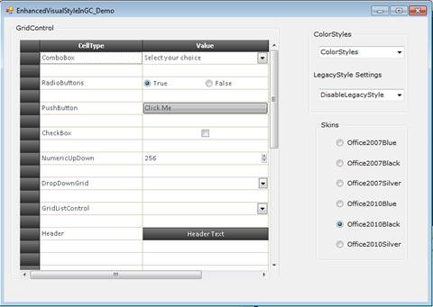

::: {style="DISPLAY: none"}
{#d2h_url_template}{#d2h_package_url style="WIDTH: 0px; DISPLAY: none; HEIGHT: 0px"}
:::

::::: {#nsbanner .d2h_main_nsbanner style="BORDER-BOTTOM: #999999 1px solid; POSITION: relative; PADDING-BOTTOM: 0px; BACKGROUND-COLOR: transparent; PADDING-LEFT: 0px; PADDING-RIGHT: 0px; DISPLAY: none; BORDER-TOP: #999999 1px solid; PADDING-TOP: 0px; LEFT: 0px"}
:::: {#TitleRow .d2h_main_titlerow style="PADDING-BOTTOM: 4px; BACKGROUND-COLOR: transparent; PADDING-LEFT: 22px; WIDTH: 100%; PADDING-RIGHT: 10px; DISPLAY: none; PADDING-TOP: 4px"}
::: {#ienav .d2h_main_ienav style="DISPLAY: none"}
{#D2HPrevious .D2HPreviousEnabled}  {#D2HNext .D2HNextEnabled}
:::
::::
:::::

:::: {#nstext .d2h_main_nstext style="PADDING-BOTTOM: 10px; BACKGROUND-COLOR: transparent; PADDING-LEFT: 22px; PADDING-RIGHT: 10px; HEIGHT: 100%; OVERFLOW: auto; PADDING-TOP: 5px" hasuserbackground="true" valign="bottom"}
::: {#d2h_breadcrumbs .d2h_breadcrumbs}
[Essential Studio User Guide Documentation](ms-xhelp:///?Id=12457748-09e3-4d74-a240-8e049cedf030){.d2h_breadcrumbsNormal}[ \> ]{.d2h_breadcrumbsLinkSeparator}[User Interface Edition](ms-xhelp:///?Id=c29296b7-531c-413b-a0ec-488ca1f7f669){.d2h_breadcrumbsNormal}[ \> ]{.d2h_breadcrumbsLinkSeparator}[Essential Windows](ms-xhelp:///?Id=e60759d8-47a4-4570-9d7a-16a68d63f2ea){.d2h_breadcrumbsNormal}[ \> ]{.d2h_breadcrumbsLinkSeparator}[Essential Grid]{.d2h_breadcrumbsContentsOnly}[ \> ]{.d2h_breadcrumbsLinkSeparator}[Grid Controls](ms-xhelp:///?Id=bf2d70d7-33dc-4c67-a55d-4fcf8d51dc2b){.d2h_breadcrumbsNormal}[ \> ]{.d2h_breadcrumbsLinkSeparator}[Enhanced Visual Styles for the Syncfusion Windows Grids](ms-xhelp:///?Id=54146630-d209-4d9f-9c0f-5e20d8cf44b7){.d2h_breadcrumbsNormal}
:::

### Applying Color Style to the Application {#applying-color-style-to-the-application style="tab-stops: 0pt"}

To apply enhanced visual style to the entire control, you have to enable the *ColorStyle*. You can enable this using the *EnableLegacyStyle* property. To enable the *ColorStyle*, set *EnableLegacyStyle* to *false*. To enable the *GridVisualStyle*, set this to *true*. By default this is set to *true*.

                                          

The following code illustrates how to enable *ColorStyle:*

 

+----------------------------------------------------------------------------------------------------------------------------------------------------------------------------------------------+
| **[\[C#\]]{style="FONT-FAMILY: Consolas; FONT-SIZE: 9.5pt"}**                                                                                                                                |
|                                                                                                                                                                                              |
| []{style="FONT-FAMILY: Consolas; COLOR: blue; FONT-SIZE: 9.5pt"}                                                                                                                             |
|                                                                                                                                                                                              |
| [this]{style="FONT-FAMILY: Consolas; COLOR: blue; FONT-SIZE: 9.5pt"}[.gridControl1.Model.EnableLegacyStyle = [false]{style="COLOR: blue"};]{style="FONT-FAMILY: Consolas; FONT-SIZE: 9.5pt"} |
+----------------------------------------------------------------------------------------------------------------------------------------------------------------------------------------------+

[]{style="COLOR: #c00000"} 

[]{style="COLOR: #c00000"} 

+-------------------------------------------------------------------------------------------------------------------------------------------------------------------------------------------+
| **[\[VB\]]{style="FONT-FAMILY: Consolas; FONT-SIZE: 9.5pt"}**                                                                                                                             |
|                                                                                                                                                                                           |
| [Me]{style="FONT-FAMILY: Consolas; COLOR: blue; FONT-SIZE: 9.5pt"}[.gridControl1.Model.EnableLegacyStyle = [False]{style="COLOR: blue"}]{style="FONT-FAMILY: Consolas; FONT-SIZE: 9.5pt"} |
+-------------------------------------------------------------------------------------------------------------------------------------------------------------------------------------------+

[]{style="COLOR: #c00000"} 

[]{style="COLOR: #c00000"} 

**ColorStyle**

You can apply one of the following skins for the control using the ColorStyle property:

 

[·      ]{style="FONT-FAMILY: Symbol"}Office2003

[·      ]{style="FONT-FAMILY: Symbol"}Office2007Blue

[·      ]{style="FONT-FAMILY: Symbol"}Office2007Black

[·      ]{style="FONT-FAMILY: Symbol"}Office2007Silver

[·      ]{style="FONT-FAMILY: Symbol"}Office2010Blue

[·      ]{style="FONT-FAMILY: Symbol"}Office2010Black

[·      ]{style="FONT-FAMILY: Symbol"}Office2010Silver

[·      ]{style="FONT-FAMILY: Symbol"}SystemTheme

 

SystemTheme is the default skin.

 

The following code illustrated how to customize the skin for the control:

[]{style="COLOR: #c00000"} 

+------------------------------------------------------------------------------------------------------------------------------------------------------------------------------------------------------------------------------------+
| **[\[C#\]]{style="FONT-FAMILY: Consolas; FONT-SIZE: 9.5pt"}**                                                                                                                                                                      |
|                                                                                                                                                                                                                                    |
| []{style="FONT-FAMILY: Consolas; COLOR: blue; FONT-SIZE: 9.5pt"}                                                                                                                                                                   |
|                                                                                                                                                                                                                                    |
| [this]{style="FONT-FAMILY: Consolas; COLOR: blue; FONT-SIZE: 9.5pt"}[.gridControl1.ColorStyles = Syncfusion.Windows.Forms.[ColorStyles]{style="COLOR: #2b91af"}.Office2007Black;]{style="FONT-FAMILY: Consolas; FONT-SIZE: 9.5pt"} |
+------------------------------------------------------------------------------------------------------------------------------------------------------------------------------------------------------------------------------------+

[]{style="COLOR: #c00000"} 

+---------------------------------------------------------------------------------------------------------------------------------------------------------------------------------------------------------------------------------+
| **[\[VB\]]{style="FONT-FAMILY: Consolas; FONT-SIZE: 9.5pt"}**                                                                                                                                                                   |
|                                                                                                                                                                                                                                 |
| []{style="FONT-FAMILY: Consolas; COLOR: blue; FONT-SIZE: 9.5pt"}                                                                                                                                                                |
|                                                                                                                                                                                                                                 |
| [Me]{style="FONT-FAMILY: Consolas; COLOR: blue; FONT-SIZE: 9.5pt"}[.gridControl1.ColorStyles = Syncfusion.Windows.Forms.[ColorStyles]{style="COLOR: #2b91af"}.Office2007Black]{style="FONT-FAMILY: Consolas; FONT-SIZE: 9.5pt"} |
+---------------------------------------------------------------------------------------------------------------------------------------------------------------------------------------------------------------------------------+

[]{style="COLOR: #c00000"} 

{border="0"}

Figure 488: Visual Style Office2010Black

 

[]{#related-topics}
::::
