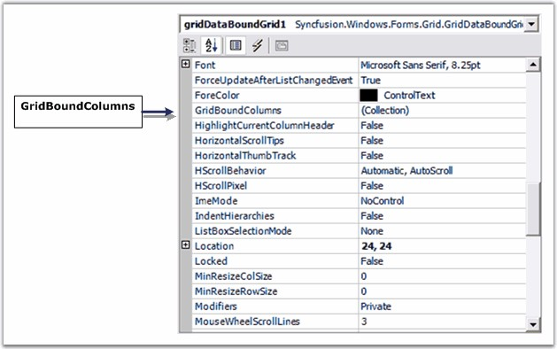
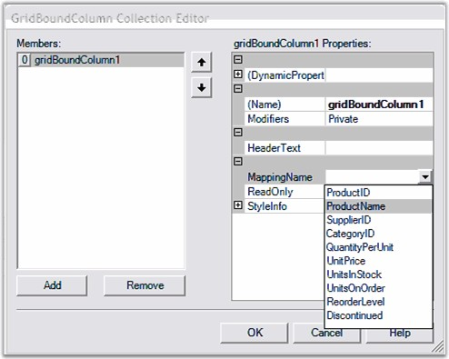
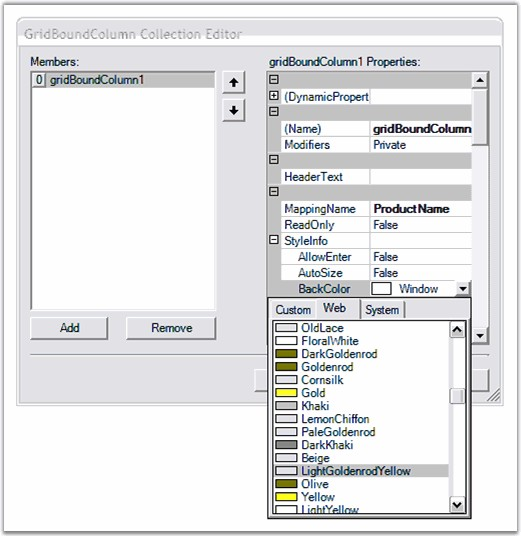
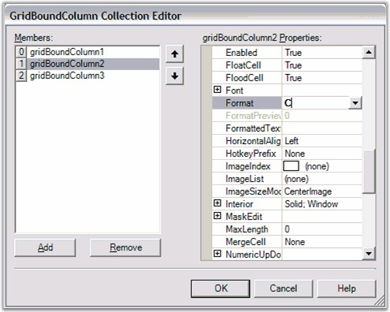
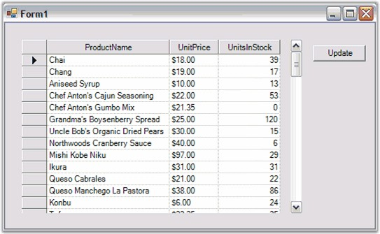

::: {style="DISPLAY: none"}
{#d2h_url_template}{#d2h_package_url style="WIDTH: 0px; DISPLAY: none; HEIGHT: 0px"}
:::

::: {.d2h_secondary_topic style="PADDING-BOTTOM: 10pt; MARGIN: 0pt; PADDING-LEFT: 0pt; PADDING-RIGHT: 0pt; PADDING-TOP: 0pt"}
#### Applying Special Column Formats {#applying-special-column-formats style="tab-stops: 0pt"}

[]{style="FONT-FAMILY: 'Trebuchet MS','sans-serif'; COLOR: #15428b; FONT-SIZE: 9pt"} 

The **GridBoundColumn** collection property of the Grid Data Bound Grid is used to set column properties. This collection will let you control the columns that are displayed as well as their order. For each column that you want displayed, add a Grid Bound Column. In this Grid Bound Column, you must set the **MappingName** property; the other properties such as **HeaderText** and the **Style** are optional. Under the Style property, you will have access to the normal **GridStyleInfo** properties that you can apply to this column such as **BackColor**, **CellType** and **Font**.

[]{style="FONT-FAMILY: 'Trebuchet MS','sans-serif'; COLOR: #15428b; FONT-SIZE: 9pt"} 

{border="0"}

[]{style="FONT-FAMILY: 'Trebuchet MS','sans-serif'; COLOR: #15428b; FONT-SIZE: 9pt"} 

Figure 56: GridBoundColumns Collection in the Grid Data Bound Grid\'s PropertyGrid

[]{style="FONT-FAMILY: 'Trebuchet MS','sans-serif'; COLOR: #15428b; FONT-SIZE: 9pt"} 

1.   Open the **GridBoundColumns** collection editor by using the property grid.

 

2.   Click the **Add** button to add a grid bound column, and then set **MappingName** property of that grid bound column to *ProductName*.

[]{style="FONT-FAMILY: 'Trebuchet MS','sans-serif'; COLOR: #15428b; FONT-SIZE: 9pt"} 

{border="0"}

[]{style="FONT-FAMILY: 'Trebuchet MS','sans-serif'; COLOR: #15428b; FONT-SIZE: 9pt"} 

Figure 57: Adding a GridBoundColumn to hold the ProductName Column

[]{style="FONT-FAMILY: 'Trebuchet MS','sans-serif'; COLOR: #15428b; FONT-SIZE: 9pt"} 

[]{style="FONT-FAMILY: 'Trebuchet MS','sans-serif'; COLOR: #15428b; FONT-SIZE: 9pt"} 

3.   Select **StyleInfo** property and set the back color for the column as shown in the following screen shot.

[]{style="FONT-FAMILY: 'Trebuchet MS','sans-serif'; COLOR: #15428b; FONT-SIZE: 9pt"} 

{border="0"}

[]{style="FONT-FAMILY: 'Trebuchet MS','sans-serif'; COLOR: #15428b; FONT-SIZE: 9pt"} 

Figure 58: Setting StyleInfo.BackColor for the Column

[]{style="FONT-FAMILY: 'Trebuchet MS','sans-serif'; COLOR: #15428b; FONT-SIZE: 9pt"} 

[]{style="FONT-FAMILY: 'Trebuchet MS','sans-serif'; COLOR: #15428b; FONT-SIZE: 9pt"} 

4.   Repeat the above steps to add Grid Bound Columns for \'UnitPrice\' and \'UnitsInStock\'. For the \'UnitPrice\' Grid Bound Column, set **StyleInfo.Format** to *C*.

[]{style="FONT-FAMILY: 'Trebuchet MS','sans-serif'; COLOR: #15428b; FONT-SIZE: 9pt"} 

{border="0"}

[]{style="FONT-FAMILY: 'Trebuchet MS','sans-serif'; COLOR: #15428b; FONT-SIZE: 9pt"} 

Figure 59: Setting the StyleInfo.Format Property on Column 2

[]{style="FONT-FAMILY: 'Trebuchet MS','sans-serif'; COLOR: #15428b; FONT-SIZE: 9pt"} 

[]{style="FONT-FAMILY: 'Trebuchet MS','sans-serif'; COLOR: #15428b; FONT-SIZE: 9pt"} 

5.   Compile and run the project to see the formatted Grid Data Bound Grid. In the following screen shot, you will be able to see the grid with the columns that you specified and in the order that you specified them. Notice that the \'UnitPrice\' column shows the price in the specified currency format.

[]{style="FONT-FAMILY: 'Trebuchet MS','sans-serif'; COLOR: #15428b; FONT-SIZE: 9pt"} 

{border="0"}

[]{style="FONT-FAMILY: 'Trebuchet MS','sans-serif'; COLOR: #15428b; FONT-SIZE: 9pt"} 

Figure 60: Formatted Grid Data Bound Grid

 

[]{#p19} 

 

[]{#related-topics}
:::
