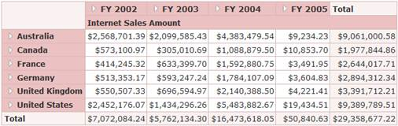

::: {style="DISPLAY: none"}
{#d2h_url_template}{#d2h_package_url style="WIDTH: 0px; DISPLAY: none; HEIGHT: 0px"}
:::

::::: {#nsbanner .d2h_main_nsbanner style="BORDER-BOTTOM: #999999 1px solid; POSITION: relative; PADDING-BOTTOM: 0px; BACKGROUND-COLOR: transparent; PADDING-LEFT: 0px; PADDING-RIGHT: 0px; DISPLAY: none; BORDER-TOP: #999999 1px solid; PADDING-TOP: 0px; LEFT: 0px"}
:::: {#TitleRow .d2h_main_titlerow style="PADDING-BOTTOM: 4px; BACKGROUND-COLOR: transparent; PADDING-LEFT: 22px; WIDTH: 100%; PADDING-RIGHT: 10px; DISPLAY: none; PADDING-TOP: 4px"}
::: {#ienav .d2h_main_ienav style="DISPLAY: none"}
{#D2HPrevious .D2HPreviousEnabled}  {#D2HNext .D2HNextEnabled}
:::
::::
:::::

::: {#nstext .d2h_main_nstext style="PADDING-BOTTOM: 10px; BACKGROUND-COLOR: transparent; PADDING-LEFT: 22px; PADDING-RIGHT: 10px; HEIGHT: 100%; OVERFLOW: auto; PADDING-TOP: 5px" hasuserbackground="true" valign="bottom"}
### Applying Styles to OLAPGrid Control {#applying-styles-to-olapgrid-control style="TEXT-ALIGN: justify; tab-stops: 0pt"}

These styles can be applied to the OLAPGrid control using the **AutoFormat** property. The following code example illustrates how to apply the Almond style to the OLAPGrid control.

[]{style="COLOR: #333333"} 

+----------------------------------------------------------------------------------------------------------------------------------------------------------------------------------------------------------------------------------------------------------------------------------------------------------------------------------------------------------------------------------------------------------------------------------------------------------------------------------------------------------------------------------------------------------------------------------------------------------------------------------------------------------------------------------------------------+
| **[\[ASPX\]]{style="FONT-FAMILY: 'Courier New'; COLOR: #333333"}**[]{style="FONT-FAMILY: 'Courier New'; COLOR: #333333"}                                                                                                                                                                                                                                                                                                                                                                                                                                                                                                                                                                           |
|                                                                                                                                                                                                                                                                                                                                                                                                                                                                                                                                                                                                                                                                                                    |
| [ [\<%]{style="BACKGROUND: yellow"}]{style="FONT-FAMILY: 'Courier New'; COLOR: #333333"}[=]{style="FONT-FAMILY: 'Courier New'; COLOR: blue"}[Html.Syncfusion().Olap().OlapGrid(]{style="FONT-FAMILY: 'Courier New'; COLOR: #333333"}[\"olapgrid\"]{style="FONT-FAMILY: 'Courier New'; COLOR: #a31515"}[,(]{style="FONT-FAMILY: 'Courier New'; COLOR: #333333"}[OlapDataManager]{style="FONT-FAMILY: 'Courier New'; COLOR: #2b91af"}[)ViewData\[]{style="FONT-FAMILY: 'Courier New'; COLOR: #333333"}[\"DataManager\"]{style="FONT-FAMILY: 'Courier New'; COLOR: #a31515"}[\]).AutoFormat(AutoFormat.Almond) [%\>]{style="BACKGROUND: yellow"}]{style="FONT-FAMILY: 'Courier New'; COLOR: #333333"} |
+----------------------------------------------------------------------------------------------------------------------------------------------------------------------------------------------------------------------------------------------------------------------------------------------------------------------------------------------------------------------------------------------------------------------------------------------------------------------------------------------------------------------------------------------------------------------------------------------------------------------------------------------------------------------------------------------------+

 

+--------------------------------------------------------------------------------------------------------------------------------------------------------------------------------------------------------------------------------------------------------------------------------------------------------------------------------------------------------------------------------------------------------------------------------------------------------------------------------------------------------------------------------------------------------------------------------------------------------------------------------------------------------------------------------------------------------------------------------------------------------------------------------------------------+
| **[\[Razor\]]{style="FONT-FAMILY: 'Courier New'; COLOR: #333333"}**                                                                                                                                                                                                                                                                                                                                                                                                                                                                                                                                                                                                                                                                                                                              |
|                                                                                                                                                                                                                                                                                                                                                                                                                                                                                                                                                                                                                                                                                                                                                                                                  |
| [@]{style="FONT-FAMILY: 'Courier New'; BACKGROUND: yellow; COLOR: #333333"}[(]{style="FONT-FAMILY: 'Courier New'; COLOR: blue"}[Html.Syncfusion().Olap().OlapGrid(]{style="FONT-FAMILY: 'Courier New'; COLOR: #333333"}[\"olapgrid\"]{style="FONT-FAMILY: 'Courier New'; COLOR: #a31515"}[,(]{style="FONT-FAMILY: 'Courier New'; COLOR: #333333"}[OlapDataManager]{style="FONT-FAMILY: 'Courier New'; COLOR: #2b91af"}[)ViewData\[]{style="FONT-FAMILY: 'Courier New'; COLOR: #333333"}[\"DataManager\"]{style="FONT-FAMILY: 'Courier New'; COLOR: #a31515"}[\]).AutoFormat(AutoFormat.Almond).]{style="FONT-FAMILY: 'Courier New'; COLOR: #333333"}[ToMvcHtmlString]{style="FONT-FAMILY: 'Courier New'; COLOR: #404040"}[()[)]{style="BACKGROUND: yellow"}]{style="FONT-FAMILY: 'Courier New'"} |
+--------------------------------------------------------------------------------------------------------------------------------------------------------------------------------------------------------------------------------------------------------------------------------------------------------------------------------------------------------------------------------------------------------------------------------------------------------------------------------------------------------------------------------------------------------------------------------------------------------------------------------------------------------------------------------------------------------------------------------------------------------------------------------------------------+

 

{border="0"}

Figure 14: OLAPGrid Control Applied with Almond Style**[]{style="FONT-FAMILY: 'Times New Roman','serif'; COLOR: #333333"}**

**[]{style="FONT-FAMILY: 'Times New Roman','serif'; COLOR: #333333"}** 

[]{#related-topics}
:::
