::: {style="DISPLAY: none"}
{#d2h_url_template}{#d2h_package_url style="WIDTH: 0px; DISPLAY: none; HEIGHT: 0px"}
:::

::::: {#nsbanner .d2h_main_nsbanner style="BORDER-BOTTOM: #999999 1px solid; POSITION: relative; PADDING-BOTTOM: 0px; BACKGROUND-COLOR: transparent; PADDING-LEFT: 0px; PADDING-RIGHT: 0px; DISPLAY: none; BORDER-TOP: #999999 1px solid; PADDING-TOP: 0px; LEFT: 0px"}
:::: {#TitleRow .d2h_main_titlerow style="PADDING-BOTTOM: 4px; BACKGROUND-COLOR: transparent; PADDING-LEFT: 22px; WIDTH: 100%; PADDING-RIGHT: 10px; DISPLAY: none; PADDING-TOP: 4px"}
::: {#ienav .d2h_main_ienav style="DISPLAY: none"}
{#D2HPrevious .D2HPreviousEnabled}  {#D2HNext .D2HNextEnabled}
:::
::::
:::::

:::: {#nstext .d2h_main_nstext style="PADDING-BOTTOM: 10px; BACKGROUND-COLOR: transparent; PADDING-LEFT: 22px; PADDING-RIGHT: 10px; HEIGHT: 100%; OVERFLOW: auto; PADDING-TOP: 5px" hasuserbackground="true" valign="bottom"}
### Applying Styles to the Chart {#applying-styles-to-the-chart style="tab-stops: 0pt"}

To apply styles to the chart:

1.   Right-click on the chart and select the **Chart Properties** from the context menu.

 

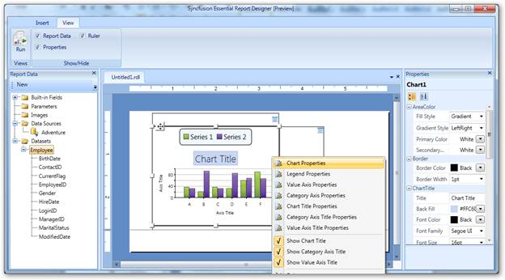{border="0"}

Figure 55: Chart Properties

 

2.   In the **Chart Properties** dialog, select any of the following:

 

[·      ]{style="FONT-FAMILY: Symbol"}**General** to change the chart type and ToolTip of the chart.

[·      ]{style="FONT-FAMILY: Symbol"}**Border** to change the border style and border width of the chart.

[·      ]{style="FONT-FAMILY: Symbol"}**Fill** to set background color of the chart.

[·      ]{style="FONT-FAMILY: Symbol"}**AreaColor** to set color of the chart area color.

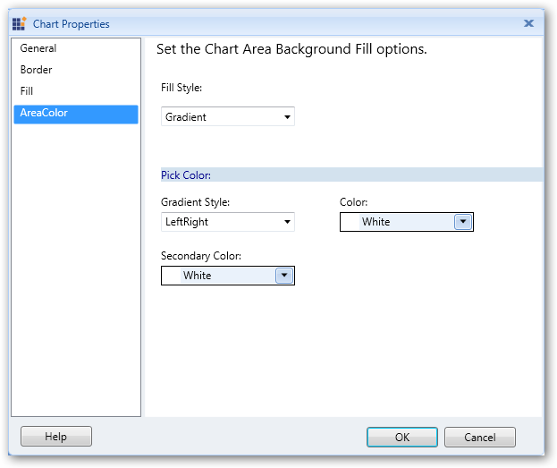{border="0"}

Figure 56: Chart Properties Dialog

 

3.   Click **OK**.

4.   To apply legend styles to the chart, right-click on the chart and choose **Legend Properties**.

 

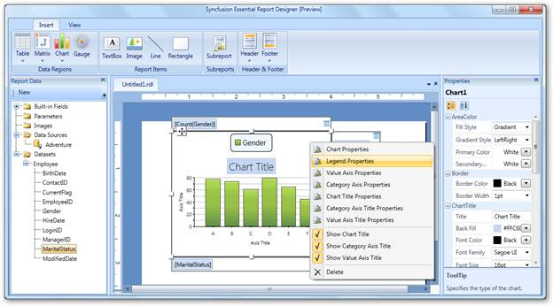{border="0"}

Figure 57: Legend Properties

 

5.   The **Legend Properties** dialog will open. Select any of the following:

 

[·      ]{style="FONT-FAMILY: Symbol"}**General** to change the position, color, or visibility of the legend when the chart is initially run.

[·      ]{style="FONT-FAMILY: Symbol"}**Font** to set the font color, font family, font size, and font style of the legend.

[·      ]{style="FONT-FAMILY: Symbol"}**Border** to set the border color and border width of the legend.

 

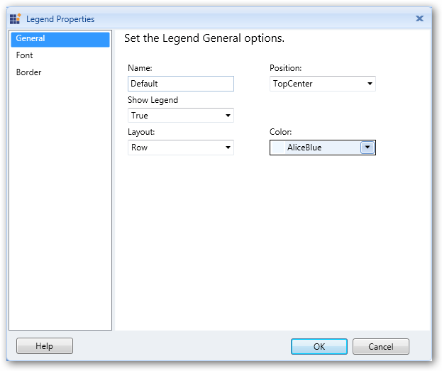{border="0"}

Figure 58: Legend Properties Dialog

 

6.   Click **OK**.

7.   To apply styles to the value axis of the chart, right-click on the chart and choose **Value Axis Properties**.

 

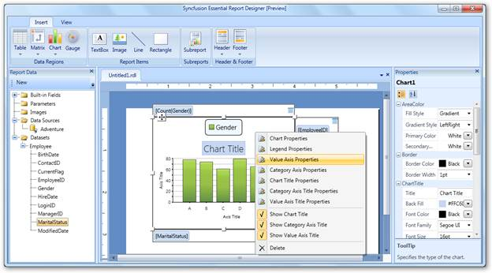{border="0"}

Figure 59: Value Axis Properties

 

8.   The **Value Axis Properties** dialog will open. Select any of the following:

 

[·      ]{style="FONT-FAMILY: Symbol"}**General** to change the direction, line style, line width, and line color of the value axis.

[·      ]{style="FONT-FAMILY: Symbol"}**Label** to set the font family, font size, font angle, font style, font color, and visibility of the value axis label.

[·      ]{style="FONT-FAMILY: Symbol"}**Tick** to set the style, width, color, and length of the value axis tick, and set the visibility of major and minor tick marks.

 

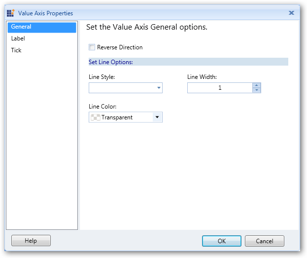{border="0"}

Figure 60: Value Axis Properties Dialog

 

9.   Click **OK**.

10.  To apply category axis styles to the chart, right-click on the chart and select **Category Axis Properties**.

 

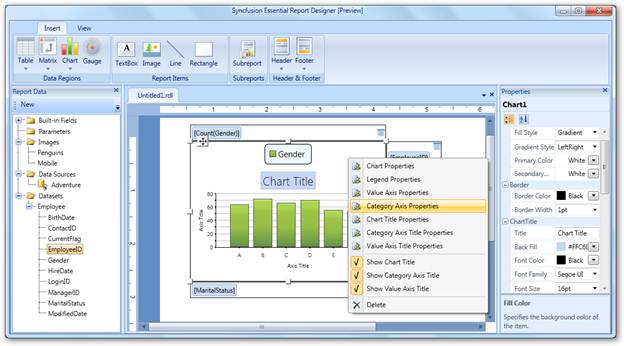{border="0"}

Figure 61: Category Axis Properties

 

11.  The **Category Axis Properties** dialog will open. Select any of the following options:

 

[·      ]{style="FONT-FAMILY: Symbol"}**General** to change the direction, line style, line width, and line color of the category axis.

[·      ]{style="FONT-FAMILY: Symbol"}**Label** to set the font family, font size, font angle, font style, font color, and visibility of the category axis label.

[·      ]{style="FONT-FAMILY: Symbol"}**Tick** to set style, width, color, and length of the ticks in the category axis, and set the visibility of the major and minor tick marks.

 

 

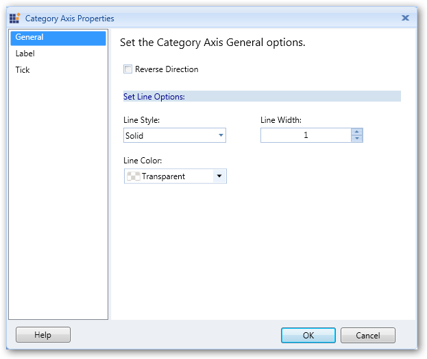{border="0"}

Figure 62: Chart Category Axis Properties Dialog

 

12.  Click **OK**.

13.  To apply title styles to the chart, right-click on the chart and select **Chart Title Properties**.

 

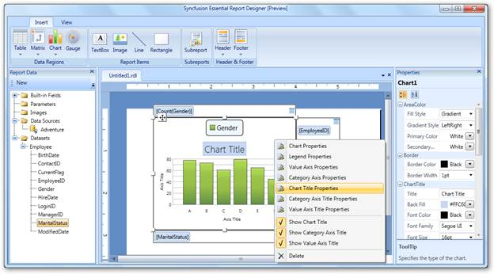{border="0"}

Figure 63: Chart Title Properties

 

14.  In the **Chart Title Properties** dialog, select **General**, and set title, font family, font size, font color, font style, and background color for the chart as needed.

 

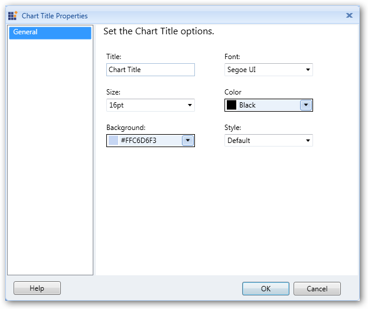{border="0"}

Figure 64: Chart Title Properties Dialog

 

15.  Click **OK**.

16.  To apply styles to the category axis title, right-click on the chart and select **Category Axis Title Properties**.

 

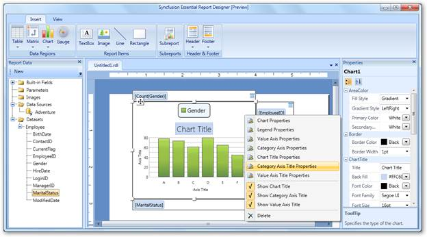{border="0"}

Figure 65: Category Axis Title Properties

 

17.  In the **Category Axis Title Properties** dialog, select **General** and set the title, font family, font size, font color, font style, and alignment for the category axis title as needed.

 

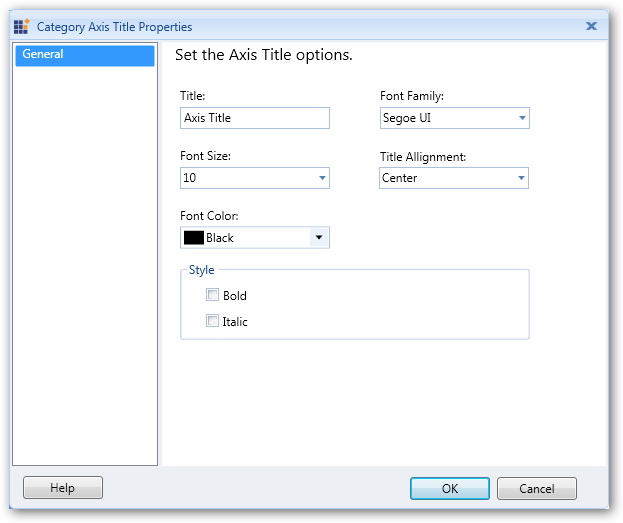{border="0"}

Figure 66: Category Axis Title Dialog Properties Dialog

 

18.  Click **OK**.

19.  To apply styles to the value axis title, right-click on the chart and select **Value Axis Title Properties**.

 

 

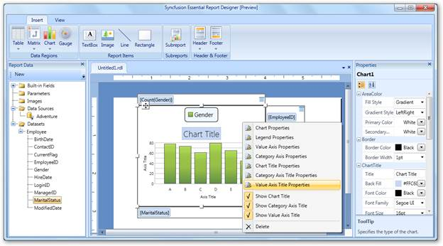{border="0"}

Figure 67: Value Axis Title Properties

 

20.  In the **Value Axis Title Properties** dialog, Click **General** and set the title, font family, font size, font color, font style, and alignment for the value axis title.

 

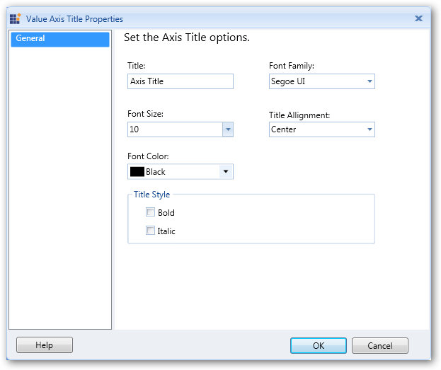{border="0"}

Figure 68: Chart Value Axis Title Properties Dialog

 

21.  Click **OK**.

 

::: {style="BORDER-BOTTOM: windowtext 1pt solid; BORDER-LEFT: medium none; PADDING-BOTTOM: 1pt; MARGIN-TOP: 9pt; PADDING-LEFT: 0pt; PADDING-RIGHT: 0pt; MARGIN-BOTTOM: 9pt; BORDER-TOP: windowtext 1pt solid; BORDER-RIGHT: medium none; PADDING-TOP: 1pt"}
{border="0"}Note: You can also change the Chart Properties via the Properties grid by clicking on the chart. It will display the Properties grid at the right of the Report Designer.
:::

 

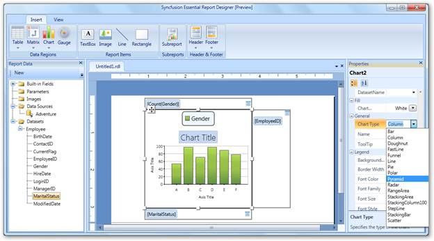{border="0"}

Figure 69: Seting Chart Properties via the Properties Grid

 

The following screenshot is a sample output for the pyramid chart type. You can get this by setting the chart type as **Pyramid** through the **Properties** grid.

 

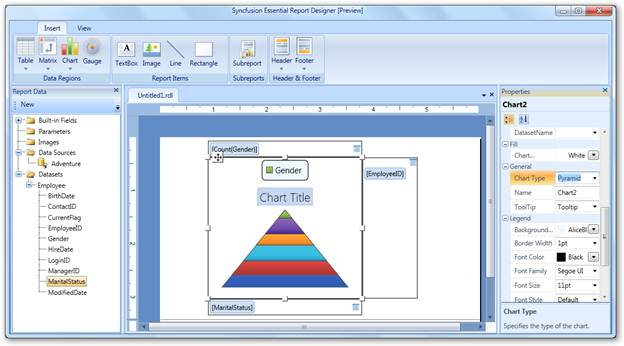{border="0"}

Figure 70: Seting Chart Type through the Properties Grid

 

 

[]{#related-topics}
::::
