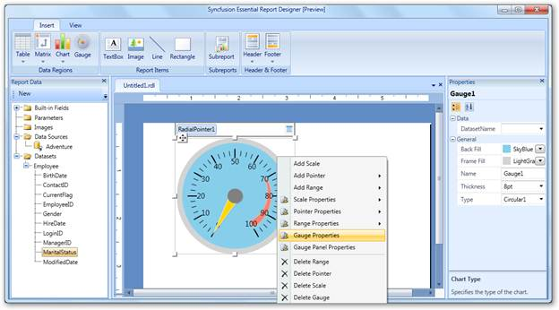
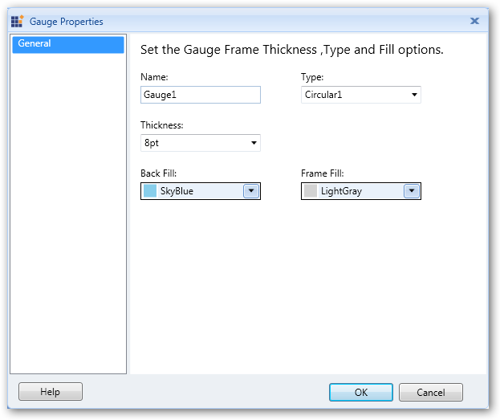
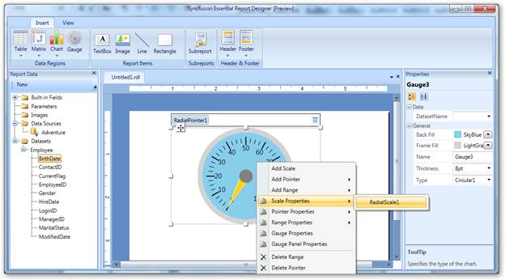
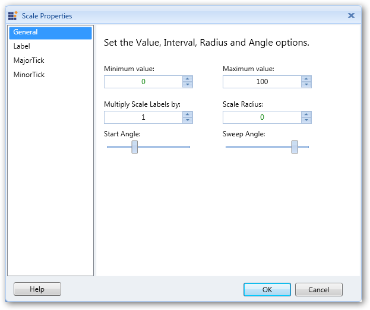
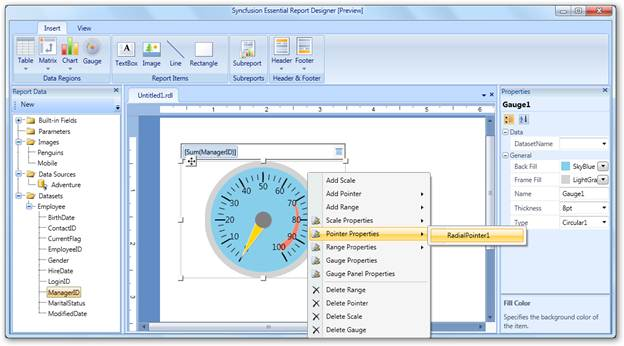
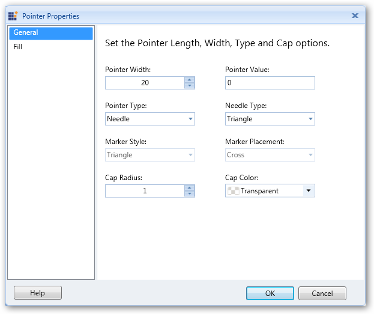
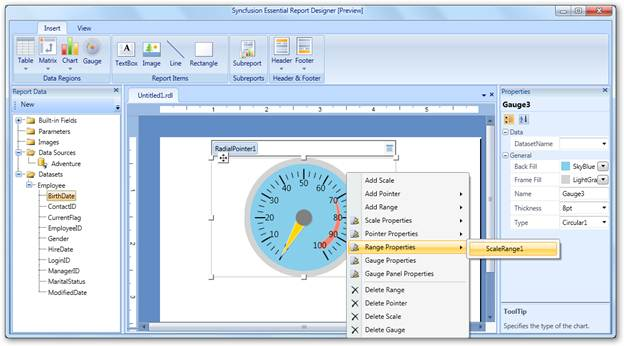
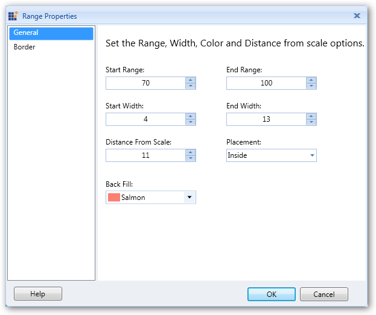
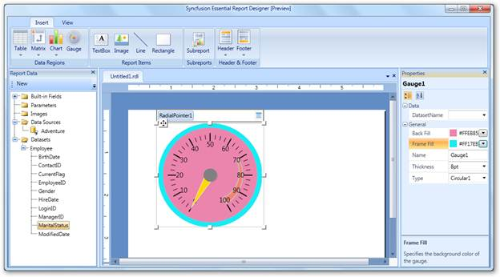

::: {style="DISPLAY: none"}
{#d2h_url_template}{#d2h_package_url style="WIDTH: 0px; DISPLAY: none; HEIGHT: 0px"}
:::

::::: {#nsbanner .d2h_main_nsbanner style="BORDER-BOTTOM: #999999 1px solid; POSITION: relative; PADDING-BOTTOM: 0px; BACKGROUND-COLOR: transparent; PADDING-LEFT: 0px; PADDING-RIGHT: 0px; DISPLAY: none; BORDER-TOP: #999999 1px solid; PADDING-TOP: 0px; LEFT: 0px"}
:::: {#TitleRow .d2h_main_titlerow style="PADDING-BOTTOM: 4px; BACKGROUND-COLOR: transparent; PADDING-LEFT: 22px; WIDTH: 100%; PADDING-RIGHT: 10px; DISPLAY: none; PADDING-TOP: 4px"}
::: {#ienav .d2h_main_ienav style="DISPLAY: none"}
{#D2HPrevious .D2HPreviousEnabled}  {#D2HNext .D2HNextEnabled}
:::
::::
:::::

:::: {#nstext .d2h_main_nstext style="PADDING-BOTTOM: 10px; BACKGROUND-COLOR: transparent; PADDING-LEFT: 22px; PADDING-RIGHT: 10px; HEIGHT: 100%; OVERFLOW: auto; PADDING-TOP: 5px" hasuserbackground="true" valign="bottom"}
### Applying Styles to the Gauge {#applying-styles-to-the-gauge style="tab-stops: 0pt"}

The following are the steps to apply styles to the gauge:

 

1.   Right-click on the gauge and select **Gauge Properties**.

 

{border="0"}

Figure 73: Gauge Properties

 

2.   In the **Gauge Properties** dialog, click **General** and set the desired values to the fields.

 

{border="0"}

Figure 74: Gauge Properties Dialog

 

3.   Click **OK**.

4.   To change the scale properties of gauge, right-click on the gauge and navigate to **Scale Properties** \> **RadialScale1**.

 

{border="0"}

Figure 75: Scale Properties

 

5.   In the **Scale Properties** dialog, select any of the following:

 

[·      ]{style="FONT-FAMILY: Symbol"}**General** to change minimum value, maximum value, radius, start angle, and sweep angle of the scale.

[·      ]{style="FONT-FAMILY: Symbol"}**Label** to set the placement of the label, label distance from the scale, font size, font color, and font angle of the labels.

[·      ]{style="FONT-FAMILY: Symbol"}**MajorTick** to set length, width, shape, color, and placement of the major ticks.

[·      ]{style="FONT-FAMILY: Symbol"}**MinorTick** to set length, width, shape, color, and placement of the minor ticks.

 

{border="0"}

Figure 76: Scale Properties Dialog

 

6.   Click **OK**.

7.   To change the pointer properties of the gauge, right-click on the gauge and navigate to **Pointer Properties** \> **RadialPointer1**.

 

{border="0"}

Figure 77: Pointer Properties

 

8.   In the **Pointer Properties** dialog, select any of the following:

 

[·      ]{style="FONT-FAMILY: Symbol"}**General** to change the width, value, pointer type, needle type, marker style, marker placement, cap radius, and cap color of the pointer.

[·      ]{style="FONT-FAMILY: Symbol"}**Fill** to set the background color, border color, and border width of the pointer.

 

{border="0"}

Figure 78: Pointer Properties Dialog

 

9.   Click **OK**.

10.  To change the range properties of the gauge, right-click on the gauge and navigate to **Range Properties** \> **ScaleRange1**.

 

{border="0"}

Figure 79: Range Properties

 

11.  In the **Range Properties** dialog, select any of the following:

 

[·      ]{style="FONT-FAMILY: Symbol"}**General** to change the start range, end range, start width, end width, placement, and background color of the gauge range.

[·      ]{style="FONT-FAMILY: Symbol"}**Border** to set the border width and border color of the gauge range.

 

 

{border="0"}

Figure 80: Range Properties Dialog

 

12.  Click **OK**.

 

::: {style="BORDER-BOTTOM: windowtext 1pt solid; BORDER-LEFT: medium none; PADDING-BOTTOM: 1pt; MARGIN-TOP: 9pt; PADDING-LEFT: 0pt; PADDING-RIGHT: 0pt; MARGIN-BOTTOM: 9pt; BORDER-TOP: windowtext 1pt solid; BORDER-RIGHT: medium none; PADDING-TOP: 1pt"}
{border="0"}Note: You can also change the gauge properties via the Properties grid by clicking on the gauge. It will display the Properties grid at the right of the Report Designer.

 
:::

After setting the **Back Fill** and **Frame Fill** properties with the following values through the **Properties** grid, the gauge will look like this:

 

{border="0"}

Figure 81: Seting Styles to Gauge through Properties Grid

[]{#related-topics}
::::
