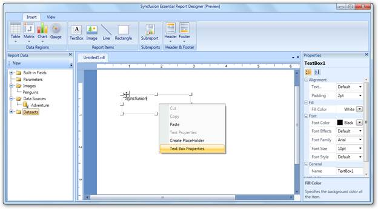
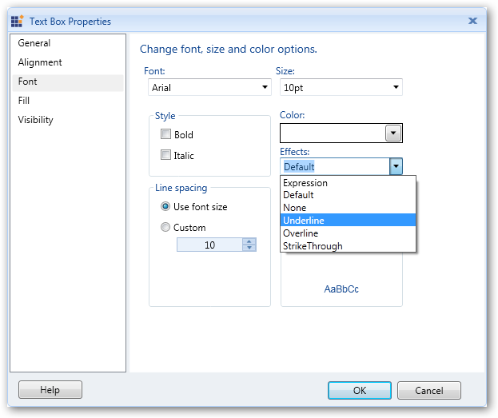
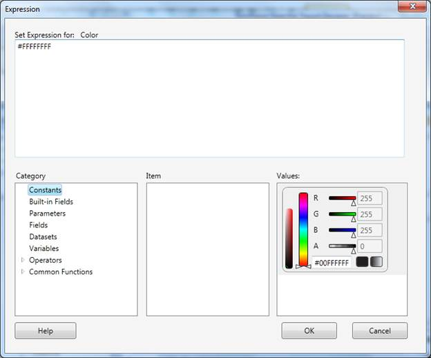
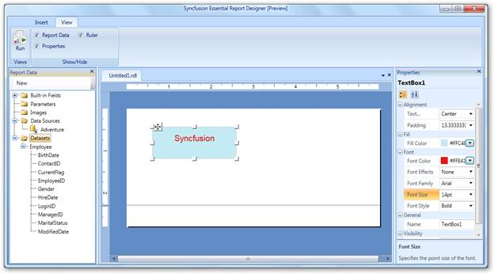
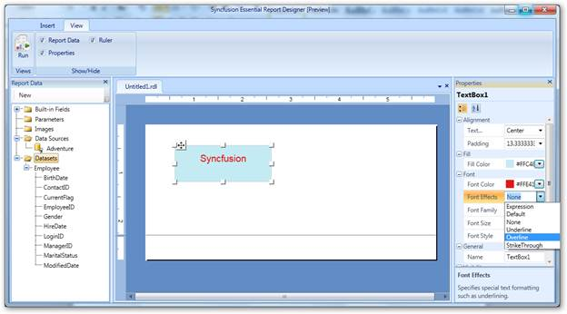
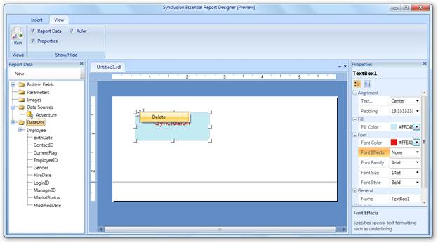

::: {style="DISPLAY: none"}
{#d2h_url_template}{#d2h_package_url style="WIDTH: 0px; DISPLAY: none; HEIGHT: 0px"}
:::

::::: {#nsbanner .d2h_main_nsbanner style="BORDER-BOTTOM: #999999 1px solid; POSITION: relative; PADDING-BOTTOM: 0px; BACKGROUND-COLOR: transparent; PADDING-LEFT: 0px; PADDING-RIGHT: 0px; DISPLAY: none; BORDER-TOP: #999999 1px solid; PADDING-TOP: 0px; LEFT: 0px"}
:::: {#TitleRow .d2h_main_titlerow style="PADDING-BOTTOM: 4px; BACKGROUND-COLOR: transparent; PADDING-LEFT: 22px; WIDTH: 100%; PADDING-RIGHT: 10px; DISPLAY: none; PADDING-TOP: 4px"}
::: {#ienav .d2h_main_ienav style="DISPLAY: none"}
{#D2HPrevious .D2HPreviousEnabled}  {#D2HNext .D2HNextEnabled}
:::
::::
:::::

:::: {#nstext .d2h_main_nstext style="PADDING-BOTTOM: 10px; BACKGROUND-COLOR: transparent; PADDING-LEFT: 22px; PADDING-RIGHT: 10px; HEIGHT: 100%; OVERFLOW: auto; PADDING-TOP: 5px" hasuserbackground="true" valign="bottom"}
### Applying Styles to the Text Box {#applying-styles-to-the-text-box style="tab-stops: 0pt"}

To apply styles to the text box:

1.   Right-click on the text box and select **Text Box Properties**.

 

{border="0"}

Figure 30: Text Box Properties[]{style="FONT-FAMILY: 'Calibri','sans-serif'"}

[]{style="FONT-FAMILY: 'Calibri','sans-serif'"} 

2.   In the **Text Box Properties** dialog, select any of the following:

 

[·      ]{style="FONT-FAMILY: Symbol"}**General** to change the name and value of the text box.

[·      ]{style="FONT-FAMILY: Symbol"}**Alignment** to set the horizontal alignment, vertical alignment, and padding of the text box.

[·      ]{style="FONT-FAMILY: Symbol"}**Font** to set the font family, font size, font color, font style, font effects, and line spacing of the text box.

[·      ]{style="FONT-FAMILY: Symbol"}**Fill** to set the background color of the text box.

[·      ]{style="FONT-FAMILY: Symbol"}**Visibility** to set the visibility of the text box when the report is initially run.

[]{style="FONT-FAMILY: 'Calibri','sans-serif'"} 

{border="0"}

Figure 31: Text Box Properties Dialog[]{style="FONT-FAMILY: 'Calibri','sans-serif'"}

[]{style="FONT-FAMILY: 'Calibri','sans-serif'"} 

3.   Set the desired values, and then click **OK** to update the selected values in the text box.

4.   To set the font color for the text box, click the **Font** tab and select **Expression** from the **Effects** drop-down. It will open the **Expression** window.

 

{border="0"}[]{style="FONT-FAMILY: 'Calibri','sans-serif'"}

Figure 32: Expression Window[]{style="FONT-FAMILY: 'Calibri','sans-serif'"}

[]{style="FONT-FAMILY: 'Calibri','sans-serif'"} 

5.   Set the desired values and click **OK**.

::: {style="BORDER-BOTTOM: windowtext 1pt solid; BORDER-LEFT: medium none; PADDING-BOTTOM: 1pt; MARGIN-TOP: 9pt; PADDING-LEFT: 0pt; PADDING-RIGHT: 0pt; MARGIN-BOTTOM: 9pt; BORDER-TOP: windowtext 1pt solid; BORDER-RIGHT: medium none; PADDING-TOP: 1pt"}
{border="0"}Note: If you set a value that starts with the character "=", then it will assign the default value of that property to the text box.

 
:::

{border="0"}

Figure 33:  Text Box with Applied Styles

[]{style="FONT-FAMILY: 'Calibri','sans-serif'"} 

6.   To change the properties using the **Properties** grid, click on the text box. The **Properties** grid will appear at the right of the Report Designer. Using this, you can set styles to the text box as shown in the following screenshot.

 

{border="0"}

Figure 34: Changing Styles of the Text Box through the Properties Grid[]{style="FONT-FAMILY: 'Calibri','sans-serif'"}

 

Deleting Text Box

To delete the textbox, right-click on the text box to be deleted, and then select **Delete**.

 

{border="0"}

Figure 35: Deleting Text Box[]{style="FONT-FAMILY: 'Calibri','sans-serif'"}

 

[]{#related-topics}
::::
