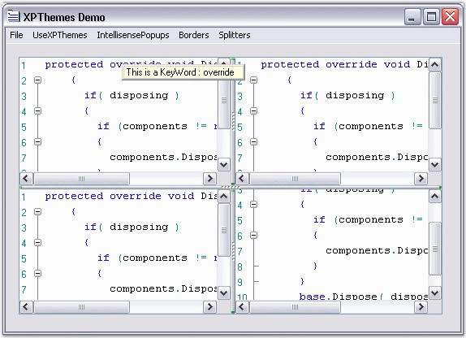

::: {style="DISPLAY: none"}
{#d2h_url_template}{#d2h_package_url style="WIDTH: 0px; DISPLAY: none; HEIGHT: 0px"}
:::

::: {.d2h_secondary_topic style="PADDING-BOTTOM: 10pt; MARGIN: 0pt; PADDING-LEFT: 0pt; PADDING-RIGHT: 0pt; PADDING-TOP: 0pt"}
#### Applying Themes {#applying-themes style="tab-stops: 0pt"}

 

Edit Control has the ability to have Windows XP-like themed appearance. All its features like the scrollbars, splitters, control borders, outlining tooltip, intellisense popups - context tooltip, context choice, and context prompt appear themed. The XP themes support is independent of the underlying operating system, and hence the Edit Control appears themed even on Non-Windows XP systems.

 

The themed appearance can be provided for the Edit Control by setting the **UseXPStyle** property to **True**.

 

+------------------------------------------------------------------------------------------------------------------------------------------------------+
| **[\[C#\]]{style="FONT-FAMILY: 'Courier New'; COLOR: black"}**                                                                                       |
|                                                                                                                                                      |
| []{style="FONT-FAMILY: 'Courier New'; COLOR: black"}                                                                                                 |
|                                                                                                                                                      |
| [this]{style="FONT-FAMILY: 'Courier New'; COLOR: blue"}[.editControl1.UseXPStyle = [true]{style="COLOR: blue"};]{style="FONT-FAMILY: 'Courier New'"} |
+------------------------------------------------------------------------------------------------------------------------------------------------------+

[]{style="FONT-FAMILY: 'Trebuchet MS','sans-serif'; COLOR: #15428b; FONT-SIZE: 9pt"} 

+---------------------------------------------------------------------------------------------------------------------------------------------------+
| **[\[VB.NET\]]{style="FONT-FAMILY: 'Courier New'; COLOR: black"}**                                                                                |
|                                                                                                                                                   |
| []{style="FONT-FAMILY: 'Courier New'; COLOR: black"}                                                                                              |
|                                                                                                                                                   |
| [Me]{style="FONT-FAMILY: 'Courier New'; COLOR: blue"}[.editControl1.UseXPStyle = [True]{style="COLOR: blue"}]{style="FONT-FAMILY: 'Courier New'"} |
+---------------------------------------------------------------------------------------------------------------------------------------------------+

[]{style="FONT-FAMILY: 'Trebuchet MS','sans-serif'; COLOR: #15428b; FONT-SIZE: 9pt"} 

{border="0"}

Figure 64: Edit Control using Windows XP Themes

[]{style="FONT-FAMILY: 'Trebuchet MS','sans-serif'; COLOR: #15428b; FONT-SIZE: 9pt"} 

A sample based on XP Themes is available in the below sample installation path.

 

***..\\My Documents\\Syncfusion\\EssentialStudio\\Version Number\\Windows\\Edit.Windows\\Samples\\2.0\\Appearance\\ XPThemesDemo***

[]{#p96} 

[]{#related-topics}
:::
