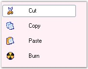

::: {style="DISPLAY: none"}
{#d2h_url_template}{#d2h_package_url style="WIDTH: 0px; DISPLAY: none; HEIGHT: 0px"}
:::

::: {.d2h_secondary_topic style="PADDING-BOTTOM: 10pt; MARGIN: 0pt; PADDING-LEFT: 0pt; PADDING-RIGHT: 0pt; PADDING-TOP: 0pt"}
##### Applying Themes {#applying-themes style="MARGIN-LEFT: 18pt; tab-stops: 18.0pt"}

[]{style="COLOR: #15428b"} 

The Themes Enabled property specifies whether XP Themes should be used for drawing the control. Themes can be enabled by setting the **ThemesEnabled** property of GroupView to \'True\'.

[]{style="COLOR: #15428b"} 

+-------------------------------------------------------------------------------------------------------------------------------------------------------+
| **[\[C#\]]{style="FONT-FAMILY: 'Courier New'; COLOR: black"}**                                                                                        |
|                                                                                                                                                       |
| []{style="FONT-FAMILY: 'Courier New'; COLOR: black"}                                                                                                  |
|                                                                                                                                                       |
| [this]{style="FONT-FAMILY: 'Courier New'; COLOR: blue"}[.groupView1.ThemesEnabled = [true]{style="COLOR: blue"};]{style="FONT-FAMILY: 'Courier New'"} |
+-------------------------------------------------------------------------------------------------------------------------------------------------------+

[]{style="COLOR: #15428b"} 

+----------------------------------------------------------------------------------------------------------------------------------------------------+
| **[\[VB.NET\]]{style="FONT-FAMILY: 'Courier New'; COLOR: black"}**                                                                                 |
|                                                                                                                                                    |
| []{style="FONT-FAMILY: 'Courier New'; COLOR: black"}                                                                                               |
|                                                                                                                                                    |
| [Me]{style="FONT-FAMILY: 'Courier New'; COLOR: blue"}[.groupView1.ThemesEnabled = [True]{style="COLOR: blue"}]{style="FONT-FAMILY: 'Courier New'"} |
+----------------------------------------------------------------------------------------------------------------------------------------------------+

[]{style="COLOR: #15428b"} 

{border="0"}

[]{style="COLOR: #15428b"} 

Figure 920: Themed look of Button View

[]{style="COLOR: #15428b"} 

Refer to [Interactive Features]{style="COLOR: black"} topic for information on Button View.

 

 

[]{#p649} 

 

[]{#related-topics}
:::
