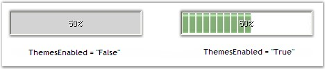

::: {style="DISPLAY: none"}
{#d2h_url_template}{#d2h_package_url style="WIDTH: 0px; DISPLAY: none; HEIGHT: 0px"}
:::

:::: {.d2h_secondary_topic style="PADDING-BOTTOM: 10pt; MARGIN: 0pt; PADDING-LEFT: 0pt; PADDING-RIGHT: 0pt; PADDING-TOP: 0pt"}
##### Applying Themes {#applying-themes style="tab-stops: 0pt"}

[]{style="COLOR: #15428b"} 

The ProgressBarAdv control can now be themed by enabling the **ThemesEnabled** property.

[]{style="COLOR: #15428b"} 

+------------------------------------------------------------------------------------------------------------------------------------------------------------+
| **[\[C#\]]{style="FONT-FAMILY: 'Courier New'; COLOR: black"}**                                                                                             |
|                                                                                                                                                            |
| []{style="FONT-FAMILY: 'Courier New'; COLOR: black"}                                                                                                       |
|                                                                                                                                                            |
| [this]{style="FONT-FAMILY: 'Courier New'; COLOR: blue"}[.progressBarAdv1.ThemesEnabled = [true]{style="COLOR: blue"};]{style="FONT-FAMILY: 'Courier New'"} |
+------------------------------------------------------------------------------------------------------------------------------------------------------------+

[]{style="COLOR: #15428b"} 

+---------------------------------------------------------------------------------------------------------------------------------------------------------+
| **[\[VB.NET\]]{style="FONT-FAMILY: 'Courier New'; COLOR: black"}**                                                                                      |
|                                                                                                                                                         |
| []{style="FONT-FAMILY: 'Courier New'; COLOR: black"}                                                                                                    |
|                                                                                                                                                         |
| [Me]{style="FONT-FAMILY: 'Courier New'; COLOR: blue"}[.progressBarAdv1.ThemesEnabled = [True]{style="COLOR: blue"}]{style="FONT-FAMILY: 'Courier New'"} |
+---------------------------------------------------------------------------------------------------------------------------------------------------------+

[]{style="COLOR: #15428b"} 

{border="0"}

[]{style="COLOR: #15428b"} 

Figure 976: Applying Themes with ProgressStyle set to \"System\"

[]{style="COLOR: #15428b"} 

::: {style="BORDER-BOTTOM: windowtext 1pt solid; BORDER-LEFT: medium none; PADDING-BOTTOM: 1pt; MARGIN: 9pt 0pt 9pt 18pt; PADDING-LEFT: 0pt; PADDING-RIGHT: 0pt; BORDER-TOP: windowtext 1pt solid; BORDER-RIGHT: medium none; PADDING-TOP: 1pt"}
{border="0"} Note: Refer to the [[[Foreground Style Settings]{style="COLOR: windowtext; FONT-SIZE: 9pt; TEXT-DECORATION: none; text-underline: none"}]{.UGHyperlink}](../../../../../../../../Documents%20and%20Settings/sylviap/Desktop/Tools%20-%20Part%202.docx#_Foreground_Style_Settings) topic for more information on ProgressStyle property.
:::

 

 

 

 

[]{#related-topics}
::::
