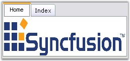

::: {style="DISPLAY: none"}
{#d2h_url_template}{#d2h_package_url style="WIDTH: 0px; DISPLAY: none; HEIGHT: 0px"}
:::

::::: {#nsbanner .d2h_main_nsbanner style="BORDER-BOTTOM: #999999 1px solid; POSITION: relative; PADDING-BOTTOM: 0px; BACKGROUND-COLOR: transparent; PADDING-LEFT: 0px; PADDING-RIGHT: 0px; DISPLAY: none; BORDER-TOP: #999999 1px solid; PADDING-TOP: 0px; LEFT: 0px"}
:::: {#TitleRow .d2h_main_titlerow style="PADDING-BOTTOM: 4px; BACKGROUND-COLOR: transparent; PADDING-LEFT: 22px; WIDTH: 100%; PADDING-RIGHT: 10px; DISPLAY: none; PADDING-TOP: 4px"}
::: {#ienav .d2h_main_ienav style="DISPLAY: none"}
{#D2HPrevious .D2HPreviousEnabled}  {#D2HNext .D2HNextEnabled}
:::
::::
:::::

::::: {#nstext .d2h_main_nstext style="PADDING-BOTTOM: 10px; BACKGROUND-COLOR: transparent; PADDING-LEFT: 22px; PADDING-RIGHT: 10px; HEIGHT: 100%; OVERFLOW: auto; PADDING-TOP: 5px" hasuserbackground="true" valign="bottom"}
::: {#d2h_breadcrumbs .d2h_breadcrumbs}
[Essential Studio User Guide Documentation](ms-xhelp:///?Id=12457748-09e3-4d74-a240-8e049cedf030){.d2h_breadcrumbsNormal}[ \> ]{.d2h_breadcrumbsLinkSeparator}[User Interface Edition](ms-xhelp:///?Id=c29296b7-531c-413b-a0ec-488ca1f7f669){.d2h_breadcrumbsNormal}[ \> ]{.d2h_breadcrumbsLinkSeparator}[Essential Windows](ms-xhelp:///?Id=e60759d8-47a4-4570-9d7a-16a68d63f2ea){.d2h_breadcrumbsNormal}[ \> ]{.d2h_breadcrumbsLinkSeparator}[Essential Tools]{.d2h_breadcrumbsContentsOnly}[ \> ]{.d2h_breadcrumbsLinkSeparator}[Tools Controls](ms-xhelp:///?Id=13c3c4f4-9d16-4b69-93f2-7e98eec67452){.d2h_breadcrumbsNormal}[ \> ]{.d2h_breadcrumbsLinkSeparator}[Tabs Package](ms-xhelp:///?Id=204c37ee-142c-46ef-a1a3-7fdf214b25f9){.d2h_breadcrumbsNormal}
:::

### Applying Themes {#applying-themes style="MARGIN-LEFT: 18pt; tab-stops: 18.0pt"}

**[]{style="COLOR: #15428b"}** 

The TabControlAdv can be themed by enabling the **ThemesEnabled** property.

[]{style="COLOR: #15428b"} 

::: {style="BORDER-BOTTOM: windowtext 1pt solid; BORDER-LEFT: medium none; PADDING-BOTTOM: 1pt; MARGIN: 9pt 0pt 9pt 18pt; PADDING-LEFT: 0pt; PADDING-RIGHT: 0pt; BORDER-TOP: windowtext 1pt solid; BORDER-RIGHT: medium none; PADDING-TOP: 1pt"}
{border="0"} Note:[ ]{style="COLOR: black; FONT-SIZE: 8pt"}On setting this property, all the tabpages will be themed. This can be disabled or enabled for individual pages using the TabPageAdv.ThemesEnabled property.
:::

[]{style="COLOR: #15428b"} 

+-----------------------------------------------------------------------------------------------------------------------------------------------------------+
| **[\[C#\]]{style="FONT-FAMILY: 'Courier New'; COLOR: black"}**                                                                                            |
|                                                                                                                                                           |
| **[]{style="FONT-FAMILY: 'Courier New'; COLOR: black"}**                                                                                                  |
|                                                                                                                                                           |
| [this]{style="FONT-FAMILY: 'Courier New'; COLOR: blue"}[.tabControlAdv1.ThemesEnabled = [true]{style="COLOR: blue"};]{style="FONT-FAMILY: 'Courier New'"} |
+-----------------------------------------------------------------------------------------------------------------------------------------------------------+

[]{style="COLOR: #15428b"} 

+--------------------------------------------------------------------------------------------------------------------------------------------------------+
| **[\[VB.NET\]]{style="FONT-FAMILY: 'Courier New'; COLOR: black"}**                                                                                     |
|                                                                                                                                                        |
| **[]{style="FONT-FAMILY: 'Courier New'; COLOR: black"}**                                                                                               |
|                                                                                                                                                        |
| [Me]{style="FONT-FAMILY: 'Courier New'; COLOR: blue"}[.tabControlAdv1.ThemesEnabled = [True]{style="COLOR: blue"}]{style="FONT-FAMILY: 'Courier New'"} |
+--------------------------------------------------------------------------------------------------------------------------------------------------------+

[]{style="COLOR: #15428b"} 

{border="0"}

[]{style="COLOR: #15428b"} 

Figure 1068: Themes Enabled

 

 

 

 

More:

[ ]{#related-topics}

[{border="0" align="absMiddle"}Interactive Features](ms-xhelp:///?Id=d1bd1141-a8d6-4547-84a2-19a636752c79){style="TEXT-DECORATION: none"}

[{border="0" align="absMiddle"}Advanced Settings](ms-xhelp:///?Id=13835990-ef7c-457e-bae0-16f6ef116802){style="TEXT-DECORATION: none"}
:::::
