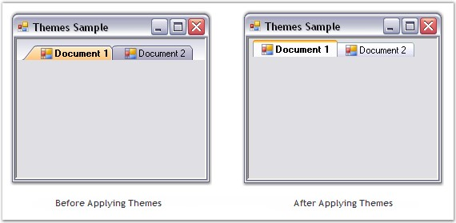

::: {style="DISPLAY: none"}
{#d2h_url_template}{#d2h_package_url style="WIDTH: 0px; DISPLAY: none; HEIGHT: 0px"}
:::

::: {.d2h_secondary_topic style="PADDING-BOTTOM: 10pt; MARGIN: 0pt; PADDING-LEFT: 0pt; PADDING-RIGHT: 0pt; PADDING-TOP: 0pt"}
##### Applying Themes {#applying-themes style="MARGIN-LEFT: 18pt; tab-stops: 18.0pt"}

**[]{style="COLOR: #15428b"}** 

The TabbedMDIManager Control can be themed by enabling the **ThemesEnabled** property.

[]{style="COLOR: #15428b"} 

+--------------------------------------------------------------------------------------------------------------------------------------------------------------+
| **[\[C#\]]{style="FONT-FAMILY: 'Courier New'; COLOR: black"}**                                                                                               |
|                                                                                                                                                              |
| **[]{style="FONT-FAMILY: 'Courier New'; COLOR: black"}**                                                                                                     |
|                                                                                                                                                              |
| [this]{style="FONT-FAMILY: 'Courier New'; COLOR: blue"}[.tabbedMDIManager1.ThemesEnabled = [true]{style="COLOR: blue"};]{style="FONT-FAMILY: 'Courier New'"} |
+--------------------------------------------------------------------------------------------------------------------------------------------------------------+

[]{style="COLOR: #15428b"} 

+-----------------------------------------------------------------------------------------------------------------------------------------------------------+
| **[\[VB.NET\]]{style="FONT-FAMILY: 'Courier New'; COLOR: black"}**                                                                                        |
|                                                                                                                                                           |
| **[]{style="FONT-FAMILY: 'Courier New'; COLOR: black"}**                                                                                                  |
|                                                                                                                                                           |
| [Me]{style="FONT-FAMILY: 'Courier New'; COLOR: blue"}[.tabbedMDIManager1.ThemesEnabled = [True]{style="COLOR: blue"}]{style="FONT-FAMILY: 'Courier New'"} |
+-----------------------------------------------------------------------------------------------------------------------------------------------------------+

[]{style="COLOR: #15428b"} 

{border="0"}

[]{style="COLOR: #15428b"} 

Figure 1100: Themes Enabled Applied to Tabs

 

 

 

[]{#p919} 

[]{#related-topics}
:::
