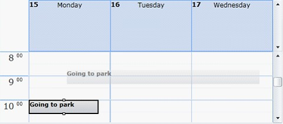
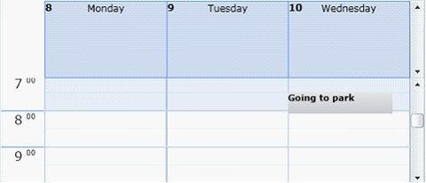
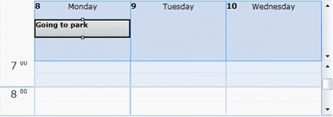
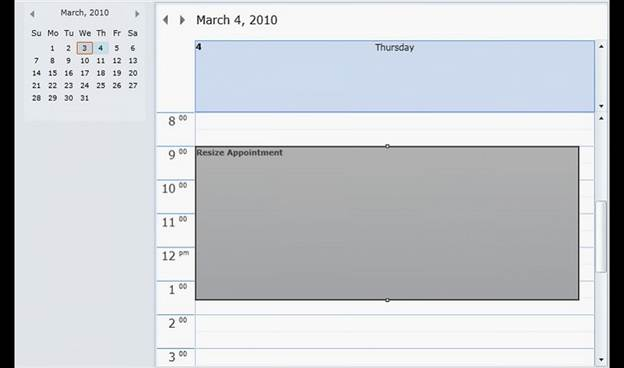

::: {style="DISPLAY: none"}
{#d2h_url_template}{#d2h_package_url style="WIDTH: 0px; DISPLAY: none; HEIGHT: 0px"}
:::

::::: {#nsbanner .d2h_main_nsbanner style="BORDER-BOTTOM: #999999 1px solid; POSITION: relative; PADDING-BOTTOM: 0px; BACKGROUND-COLOR: transparent; PADDING-LEFT: 0px; PADDING-RIGHT: 0px; DISPLAY: none; BORDER-TOP: #999999 1px solid; PADDING-TOP: 0px; LEFT: 0px"}
:::: {#TitleRow .d2h_main_titlerow style="PADDING-BOTTOM: 4px; BACKGROUND-COLOR: transparent; PADDING-LEFT: 22px; WIDTH: 100%; PADDING-RIGHT: 10px; DISPLAY: none; PADDING-TOP: 4px"}
::: {#ienav .d2h_main_ienav style="DISPLAY: none"}
{#D2HPrevious .D2HPreviousEnabled}  {#D2HNext .D2HNextEnabled}
:::
::::
:::::

::::: {#nstext .d2h_main_nstext style="PADDING-BOTTOM: 10px; BACKGROUND-COLOR: transparent; PADDING-LEFT: 22px; PADDING-RIGHT: 10px; HEIGHT: 100%; OVERFLOW: auto; PADDING-TOP: 5px" hasuserbackground="true" valign="bottom"}
::: {#d2h_breadcrumbs .d2h_breadcrumbs}
[Essential Studio User Guide Documentation](ms-xhelp:///?Id=12457748-09e3-4d74-a240-8e049cedf030){.d2h_breadcrumbsNormal}[ \> ]{.d2h_breadcrumbsLinkSeparator}[User Interface Edition](ms-xhelp:///?Id=c29296b7-531c-413b-a0ec-488ca1f7f669){.d2h_breadcrumbsNormal}[ \> ]{.d2h_breadcrumbsLinkSeparator}[Essential WPF](ms-xhelp:///?Id=7f4f82c5-151c-4262-94d0-75c4626c77bc){.d2h_breadcrumbsNormal}[ \> ]{.d2h_breadcrumbsLinkSeparator}[Essential Schedule]{.d2h_breadcrumbsContentsOnly}[ \> ]{.d2h_breadcrumbsLinkSeparator}[Concepts and Features](ms-xhelp:///?Id=7a8d4b17-d8b0-4ff4-a562-1b876329b0f4){.d2h_breadcrumbsNormal}[ \> ]{.d2h_breadcrumbsLinkSeparator}[Basic Features](ms-xhelp:///?Id=ea68be89-135e-489c-9ec3-16f72298a52d){.d2h_breadcrumbsNormal}
:::

### Appointment Drag and Drop and Resizing Appointment {#appointment-drag-and-drop-and-resizing-appointment style="tab-stops: 0pt"}

The appointments in Essential Schedule can be dragged and dropped to any time slot in all four types of views: day, week, workweek and month.

Enabling/Disabling Appointment Drag and Drop in Schedule Control

Users can enable appointment drag-and-drop by setting the **AllowDragAndDrop** property to **true**.

 

::: {style="BORDER-BOTTOM: windowtext 1pt solid; BORDER-LEFT: medium none; PADDING-BOTTOM: 1pt; MARGIN-TOP: 9pt; PADDING-LEFT: 0pt; PADDING-RIGHT: 0pt; MARGIN-BOTTOM: 9pt; BORDER-TOP: windowtext 1pt solid; BORDER-RIGHT: medium none; PADDING-TOP: 1pt"}
[{border="0"}]{style="FONT-FAMILY: 'Trebuchet MS','sans-serif'; COLOR: #15428b"}[***[Note]{style="LAYOUT-GRID-MODE: line"}***]{.NoteChar}[: ]{.NoteChar}Appointment drag-and-drop is enabled by default.

 
:::

Users can disable appointment drag-and-drop by setting the **AllowDragAndDrop** property to **false**.

 

Adding AllowDragAndDrop property

Add the **AllowDragAndDrop** property to a schedule control by using the following code.

[]{style="FONT-FAMILY: 'Trebuchet MS','sans-serif'; COLOR: #15428b; FONT-SIZE: 9pt"} 

+--------------------------------------------------------------------------------------------------------------------------------------------------------------------------------------------------------------------------------------------------------------------------------------------------------------------------------------------------------------------------------------------------------------------------------------------------------------------------------------------------------------------------------------------------------------------------------------------------------+
| **[\[XAML\]]{style="FONT-FAMILY: 'Calibri','sans-serif'"}**                                                                                                                                                                                                                                                                                                                                                                                                                                                                                                                                            |
|                                                                                                                                                                                                                                                                                                                                                                                                                                                                                                                                                                                                        |
| **[]{style="FONT-FAMILY: 'Calibri','sans-serif'"}**                                                                                                                                                                                                                                                                                                                                                                                                                                                                                                                                                    |
|                                                                                                                                                                                                                                                                                                                                                                                                                                                                                                                                                                                                        |
| [\<]{style="FONT-FAMILY: 'Courier New'; COLOR: blue"}[schedule]{style="FONT-FAMILY: 'Courier New'; COLOR: #a31515"}[:]{style="FONT-FAMILY: 'Courier New'; COLOR: blue"}[Schedule]{style="FONT-FAMILY: 'Courier New'; COLOR: #a31515"}[ x]{style="FONT-FAMILY: 'Courier New'; COLOR: red"}[:]{style="FONT-FAMILY: 'Courier New'; COLOR: blue"}[Name]{style="FONT-FAMILY: 'Courier New'; COLOR: red"}[=\"schedule\"]{style="FONT-FAMILY: 'Courier New'; COLOR: blue"}[ AllowDragAndDrop]{style="FONT-FAMILY: 'Courier New'; COLOR: red"}[=\"False\"/\>]{style="FONT-FAMILY: 'Courier New'; COLOR: blue"} |
+--------------------------------------------------------------------------------------------------------------------------------------------------------------------------------------------------------------------------------------------------------------------------------------------------------------------------------------------------------------------------------------------------------------------------------------------------------------------------------------------------------------------------------------------------------------------------------------------------------+

[]{style="FONT-FAMILY: 'Courier New'; COLOR: blue"} 

+----------------------------------------------------------------------------------------------------------------------------------------------------------------------------------+
| **[\[C#\]]{style="FONT-FAMILY: 'Calibri','sans-serif'"}**                                                                                                                        |
|                                                                                                                                                                                  |
| **[]{style="FONT-FAMILY: 'Calibri','sans-serif'"}**                                                                                                                              |
|                                                                                                                                                                                  |
| [Schedule]{style="FONT-FAMILY: 'Courier New'; COLOR: #2b91af"}[ schedule = [new]{style="COLOR: blue"} [Schedule]{style="COLOR: #2b91af"}();]{style="FONT-FAMILY: 'Courier New'"} |
|                                                                                                                                                                                  |
| [schedule.AllowDragAndDrop = [true]{style="COLOR: blue"};]{style="FONT-FAMILY: 'Courier New'"}                                                                                   |
+----------------------------------------------------------------------------------------------------------------------------------------------------------------------------------+

[]{style="FONT-FAMILY: 'Calibri','sans-serif'"} 

Dragging and Dropping Appointments

An appointment can be dragged and dropped in all four types of schedule views within that view.

[]{style="FONT-FAMILY: 'Calibri','sans-serif'"} 

{border="0"}

Figure 14: Appointment dragging

**[]{style="FONT-FAMILY: 'Calibri','sans-serif'"}** 

{border="0"}

Figure 15: Appointment Dropped

Dragging All-Day Appointment

The appointments in time slots and day headers can be dragged to other locations. 

The schedule control will change the appointment to a time-slot or all-day appointment according to where it is dragged.

[]{style="FONT-FAMILY: 'Calibri','sans-serif'"} 

{border="0"}

Figure 16: Appointment Dropped on All Day

[]{style="FONT-FAMILY: 'Trebuchet MS','sans-serif'; COLOR: #15428b; FONT-SIZE: 9pt"} 

Month View Drag and Drop

The appointments in time slots and day headers can be dragged to other locations. 

The schedule control will change the appointment to a time-slot or all-day appointment according to where it is dragged.

 

[]{style="FONT-FAMILY: 'Trebuchet MS','sans-serif'; COLOR: #15428b; FONT-SIZE: 9pt"} 

{border="0"}

Figure 17: Appointment Dragging in Month View

[]{style="FONT-FAMILY: 'Courier New'; COLOR: blue"} 

[{border="0"}]{style="FONT-FAMILY: 'Courier New'; COLOR: blue"}

Figure 18: Appointment Dropped in Month View[]{style="FONT-FAMILY: 'Courier New'; COLOR: blue"}

 

Appointment Drag-Drop Events

Essential Schedule has two set of events for dragging and dropping appointments.

[·      ]{style="FONT-FAMILY: Symbol"}AppointmentDragging, AppointmentDragged

[o  ]{style="FONT-FAMILY: 'Courier New'"}**AppointmentDragging**---Occurs when the drag event begins, but the appointment is not moved.

[o  ]{style="FONT-FAMILY: 'Courier New'"}**AppointmentDragged**---Occurs when the appointment is dragged.

[·      ]{style="FONT-FAMILY: Symbol"}AppointmentDropping, AppointmentDropped

 

[o  ]{style="FONT-FAMILY: 'Courier New'"}**AppointmentDropping**---Occurs when the appointment is about to be dropped on a location.

[o  ]{style="FONT-FAMILY: 'Courier New'"}**AppointmentDropped**---Occurs when the appointment is dropped on a location.

**[]{style="FONT-FAMILY: 'Trebuchet MS','sans-serif'; COLOR: #15428b; FONT-SIZE: 9pt"}** 

Adding Events

Add events to appointments by using the following code.

 

+-----------------------------------------------------------------------------------------------------------------------------------------------------------------------------------------------------------------------------------------------------------------------------------------------------------------------------------------------------------------------------------------------------------------------------------------------------------------------------------------------------------------------------------------------------------------------------------------------------------------------------------------------------------------------------------------------------------------------------------------------------------------------------------------------------------------------------------------------------------------------------------------------------------------------------------------------------------------------------------------------------------------------------------------------------------------------------------------------------------------------------------------------------------------------------------------------------------------------------------------------------------------------------------------------------------------------------------------------------------------------+
| **[\[XAML\]]{style="FONT-FAMILY: 'Calibri','sans-serif'"}**                                                                                                                                                                                                                                                                                                                                                                                                                                                                                                                                                                                                                                                                                                                                                                                                                                                                                                                                                                                                                                                                                                                                                                                                                                                                                                           |
|                                                                                                                                                                                                                                                                                                                                                                                                                                                                                                                                                                                                                                                                                                                                                                                                                                                                                                                                                                                                                                                                                                                                                                                                                                                                                                                                                                       |
| **[]{style="FONT-FAMILY: 'Calibri','sans-serif'"}**                                                                                                                                                                                                                                                                                                                                                                                                                                                                                                                                                                                                                                                                                                                                                                                                                                                                                                                                                                                                                                                                                                                                                                                                                                                                                                                   |
|                                                                                                                                                                                                                                                                                                                                                                                                                                                                                                                                                                                                                                                                                                                                                                                                                                                                                                                                                                                                                                                                                                                                                                                                                                                                                                                                                                       |
| [\<]{style="FONT-FAMILY: 'Courier New'; COLOR: blue"}[schedule]{style="FONT-FAMILY: 'Courier New'; COLOR: #a31515"}[:]{style="FONT-FAMILY: 'Courier New'; COLOR: blue"}[Schedule]{style="FONT-FAMILY: 'Courier New'; COLOR: #a31515"}[ x]{style="FONT-FAMILY: 'Courier New'; COLOR: red"}[:]{style="FONT-FAMILY: 'Courier New'; COLOR: blue"}[Name]{style="FONT-FAMILY: 'Courier New'; COLOR: red"}[=\"schedule\"]{style="FONT-FAMILY: 'Courier New'; COLOR: blue"}[ AppointmentDragged]{style="FONT-FAMILY: 'Courier New'; COLOR: red"}[=\"schedule_AppointmentDragged\"]{style="FONT-FAMILY: 'Courier New'; COLOR: blue"}[ AppointmentDragging]{style="FONT-FAMILY: 'Courier New'; COLOR: red"}[=\"schedule_AppointmentDragging\"]{style="FONT-FAMILY: 'Courier New'; COLOR: blue"}[ AppointmentDropped]{style="FONT-FAMILY: 'Courier New'; COLOR: red"}[=\"schedule_AppointmentDropped\"]{style="FONT-FAMILY: 'Courier New'; COLOR: blue"}[ AppointmentDropping]{style="FONT-FAMILY: 'Courier New'; COLOR: red"}[=\"schedule_AppointmentDropping\"]{style="FONT-FAMILY: 'Courier New'; COLOR: blue"}[ AllowDragAndDrop]{style="FONT-FAMILY: 'Courier New'; COLOR: red"}[=\"True\"]{style="FONT-FAMILY: 'Courier New'; COLOR: blue"}[ ScheduleType]{style="FONT-FAMILY: 'Courier New'; COLOR: red"}[=\"Week\" /\>]{style="FONT-FAMILY: 'Courier New'; COLOR: blue"} |
+-----------------------------------------------------------------------------------------------------------------------------------------------------------------------------------------------------------------------------------------------------------------------------------------------------------------------------------------------------------------------------------------------------------------------------------------------------------------------------------------------------------------------------------------------------------------------------------------------------------------------------------------------------------------------------------------------------------------------------------------------------------------------------------------------------------------------------------------------------------------------------------------------------------------------------------------------------------------------------------------------------------------------------------------------------------------------------------------------------------------------------------------------------------------------------------------------------------------------------------------------------------------------------------------------------------------------------------------------------------------------+

[]{style="FONT-FAMILY: 'Courier New'; COLOR: #a31515"} 

+--------------------------------------------------------------------------------------------------------------------------------------------------------------------------------------------------------------------------------------------------------------+
| **[\[C#\]]{style="FONT-FAMILY: 'Calibri','sans-serif'"}**                                                                                                                                                                                                    |
|                                                                                                                                                                                                                                                              |
| **[]{style="FONT-FAMILY: 'Calibri','sans-serif'"}**                                                                                                                                                                                                          |
|                                                                                                                                                                                                                                                              |
| [private]{style="FONT-FAMILY: 'Courier New'; COLOR: blue"}[ [void]{style="COLOR: blue"} schedule_AppointmentDragged([object]{style="COLOR: blue"} sender, [ScheduleAppointmentEventArgs]{style="COLOR: #2b91af"} args)]{style="FONT-FAMILY: 'Courier New'"}  |
|                                                                                                                                                                                                                                                              |
| [{]{style="FONT-FAMILY: 'Courier New'"}                                                                                                                                                                                                                      |
|                                                                                                                                                                                                                                                              |
| [    MessageBox]{style="FONT-FAMILY: 'Courier New'; COLOR: #2b91af"}[.Show([\"AppointmentDragged\"]{style="COLOR: #a31515"});]{style="FONT-FAMILY: 'Courier New'"}                                                                                           |
|                                                                                                                                                                                                                                                              |
| [}]{style="FONT-FAMILY: 'Courier New'"}                                                                                                                                                                                                                      |
|                                                                                                                                                                                                                                                              |
| []{style="FONT-FAMILY: 'Courier New'"}                                                                                                                                                                                                                       |
|                                                                                                                                                                                                                                                              |
| [private]{style="FONT-FAMILY: 'Courier New'; COLOR: blue"}[ [void]{style="COLOR: blue"} schedule_AppointmentDragging([object]{style="COLOR: blue"} sender, [ScheduleAppointmentEventArgs]{style="COLOR: #2b91af"} args)]{style="FONT-FAMILY: 'Courier New'"} |
|                                                                                                                                                                                                                                                              |
| [{]{style="FONT-FAMILY: 'Courier New'"}                                                                                                                                                                                                                      |
|                                                                                                                                                                                                                                                              |
| [    MessageBox]{style="FONT-FAMILY: 'Courier New'; COLOR: #2b91af"}[.Show([\"AppointmentDragging\"]{style="COLOR: #a31515"});]{style="FONT-FAMILY: 'Courier New'"}                                                                                          |
|                                                                                                                                                                                                                                                              |
| [}]{style="FONT-FAMILY: 'Courier New'"}                                                                                                                                                                                                                      |
|                                                                                                                                                                                                                                                              |
| []{style="FONT-FAMILY: 'Courier New'"}                                                                                                                                                                                                                       |
|                                                                                                                                                                                                                                                              |
| [private]{style="FONT-FAMILY: 'Courier New'; COLOR: blue"}[ [void]{style="COLOR: blue"} schedule_AppointmentDropped([object]{style="COLOR: blue"} sender, [ScheduleAppointmentEventArgs]{style="COLOR: #2b91af"} args)]{style="FONT-FAMILY: 'Courier New'"}  |
|                                                                                                                                                                                                                                                              |
| [{]{style="FONT-FAMILY: 'Courier New'"}                                                                                                                                                                                                                      |
|                                                                                                                                                                                                                                                              |
| [    MessageBox]{style="FONT-FAMILY: 'Courier New'; COLOR: #2b91af"}[.Show([\"AppointmentDropped\"]{style="COLOR: #a31515"});]{style="FONT-FAMILY: 'Courier New'"}                                                                                           |
|                                                                                                                                                                                                                                                              |
| [}]{style="FONT-FAMILY: 'Courier New'"}                                                                                                                                                                                                                      |
|                                                                                                                                                                                                                                                              |
| []{style="FONT-FAMILY: 'Courier New'"}                                                                                                                                                                                                                       |
|                                                                                                                                                                                                                                                              |
| [private]{style="FONT-FAMILY: 'Courier New'; COLOR: blue"}[ [void]{style="COLOR: blue"} schedule_AppointmentDropping([object]{style="COLOR: blue"} sender, [ScheduleAppointmentEventArgs]{style="COLOR: #2b91af"} args)]{style="FONT-FAMILY: 'Courier New'"} |
|                                                                                                                                                                                                                                                              |
| [{]{style="FONT-FAMILY: 'Courier New'"}                                                                                                                                                                                                                      |
|                                                                                                                                                                                                                                                              |
| [    MessageBox]{style="FONT-FAMILY: 'Courier New'; COLOR: #2b91af"}[.Show([\"AppointmentDropping\"]{style="COLOR: #a31515"});]{style="FONT-FAMILY: 'Courier New'"}                                                                                          |
|                                                                                                                                                                                                                                                              |
| [}]{style="FONT-FAMILY: 'Courier New'"}                                                                                                                                                                                                                      |
+--------------------------------------------------------------------------------------------------------------------------------------------------------------------------------------------------------------------------------------------------------------+

**[]{style="FONT-FAMILY: 'Calibri','sans-serif'"}** 

**[]{style="FONT-FAMILY: 'Trebuchet MS','sans-serif'; COLOR: #15428b; FONT-SIZE: 9pt"}** 

Resizing Appointments

The ability to resize appointments in Essential Schedule WPF enables you to extend the time slot of an appointment by dragging its top or bottom sizing handle. The start time and end time of an appointment will change respective to this resizing.

Basic Properties

Essential Schedule WPF exposes the following top-level properties:

[·      ]{style="FONT-FAMILY: Symbol"}To enable all appointments to be resized, set the **AllowResize** property in the **Schedule** class to **true**.

[·      ]{style="FONT-FAMILY: Symbol"}To enable resizing for a particular appointment, set the **AllowResize** property in the **ScheduleAppointment** class to **true**.

[]{style="FONT-FAMILY: 'Times New Roman','serif'"} 

{border="0"}

Figure 19: Resize Appointment

[]{style="FONT-FAMILY: 'Times New Roman','serif'"} 

 

[]{#related-topics}
:::::
