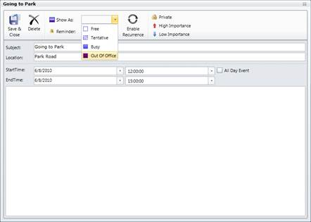
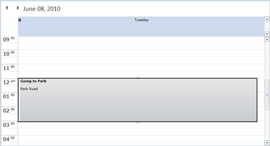
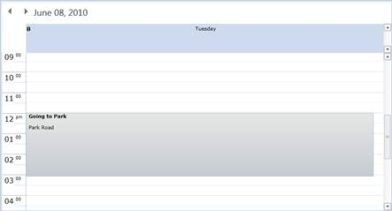
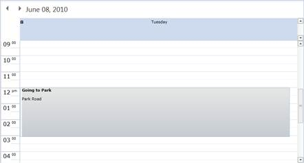
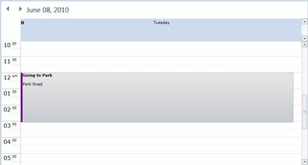

::: {style="DISPLAY: none"}
{#d2h_url_template}{#d2h_package_url style="WIDTH: 0px; DISPLAY: none; HEIGHT: 0px"}
:::

:::: {.d2h_secondary_topic style="PADDING-BOTTOM: 10pt; MARGIN: 0pt; PADDING-LEFT: 0pt; PADDING-RIGHT: 0pt; PADDING-TOP: 0pt"}
##### Appointment Priority {#appointment-priority style="tab-stops: 0pt"}

Essential Schedule for Silverlight provides the priority options for the appointment. The appointments are differentiated based on this Priority Property.

You can set the priority for the appointment by using the **Priority** Property. The values for the Priority Property are as follows:

[·      ]{style="FONT-FAMILY: Symbol"}Free

[·      ]{style="FONT-FAMILY: Symbol"}Busy

[·      ]{style="FONT-FAMILY: Symbol"}Tentative and

[·      ]{style="FONT-FAMILY: Symbol"}Out-of-Office

::: {style="BORDER-BOTTOM: windowtext 1pt solid; BORDER-LEFT: medium none; PADDING-BOTTOM: 1pt; MARGIN-TOP: 9pt; PADDING-LEFT: 0pt; PADDING-RIGHT: 0pt; MARGIN-BOTTOM: 9pt; BORDER-TOP: windowtext 1pt solid; BORDER-RIGHT: medium none; PADDING-TOP: 1pt"}
{border="0"}Note: The default value is Busy

 
:::

You can set the appointment priority in the appointment window also. In the appointment window, the **Show As** combo box contains the priority values.

[]{style="LINE-HEIGHT: 150%; FONT-FAMILY: 'Trebuchet MS','sans-serif'; COLOR: #15428b; FONT-SIZE: 9pt"} 

The following code illustrates this:

+-------------------------------------------------------------------------------------------------------------------------------------------------------------------------------------------------------------------------------------------------------------------------------------------------------------------------------------------------------------------------------------------------------------------------------------------------------------------------------------------------------------------------------------------------------------------------------------------------------------------------------------------------------------------------------------------------------------------------------------------------------------------------------------------------------------------------------------------------------------------------------------------------------------------------------------------------------------------------------------------------------------------------------------------------------------------------------------------------------------+
| **[\[XAML\]]{style="FONT-FAMILY: 'Courier New'"}**[]{style="FONT-FAMILY: 'Courier New'; COLOR: blue"}                                                                                                                                                                                                                                                                                                                                                                                                                                                                                                                                                                                                                                                                                                                                                                                                                                                                                                                                                                                                       |
|                                                                                                                                                                                                                                                                                                                                                                                                                                                                                                                                                                                                                                                                                                                                                                                                                                                                                                                                                                                                                                                                                                             |
| [\<]{style="FONT-FAMILY: 'Courier New'; COLOR: blue"}[schedule]{style="FONT-FAMILY: 'Courier New'; COLOR: #a31515"}[:]{style="FONT-FAMILY: 'Courier New'; COLOR: blue"}[Schedule.Appointments]{style="FONT-FAMILY: 'Courier New'; COLOR: #a31515"}[\>]{style="FONT-FAMILY: 'Courier New'; COLOR: blue"}                                                                                                                                                                                                                                                                                                                                                                                                                                                                                                                                                                                                                                                                                                                                                                                                     |
|                                                                                                                                                                                                                                                                                                                                                                                                                                                                                                                                                                                                                                                                                                                                                                                                                                                                                                                                                                                                                                                                                                             |
| [        ]{style="FONT-FAMILY: 'Courier New'; COLOR: #a31515"}[\<]{style="FONT-FAMILY: 'Courier New'; COLOR: blue"}[schedule]{style="FONT-FAMILY: 'Courier New'; COLOR: #a31515"}[:]{style="FONT-FAMILY: 'Courier New'; COLOR: blue"}[ScheduleAppointment]{style="FONT-FAMILY: 'Courier New'; COLOR: #a31515"}[ StartTime]{style="FONT-FAMILY: 'Courier New'; COLOR: red"}[=\"6/22/2010 09:00:00 AM\"]{style="FONT-FAMILY: 'Courier New'; COLOR: blue"}[ EndTime]{style="FONT-FAMILY: 'Courier New'; COLOR: red"}[=\"6/22/2010 011:00:00 AM\"]{style="FONT-FAMILY: 'Courier New'; COLOR: blue"}[ Subject]{style="FONT-FAMILY: 'Courier New'; COLOR: red"}[=\"Restart my Home Server\" ]{style="FONT-FAMILY: 'Courier New'; COLOR: blue"}[Location]{style="FONT-FAMILY: 'Courier New'; COLOR: red"}[=\"Watling Street\"  ]{style="FONT-FAMILY: 'Courier New'; COLOR: blue"}[Priority]{style="FONT-FAMILY: 'Courier New'; COLOR: red"}[=\"Busy\" ]{style="FONT-FAMILY: 'Courier New'; COLOR: blue"}[  ]{style="FONT-FAMILY: 'Courier New'; COLOR: red"}[/\>]{style="FONT-FAMILY: 'Courier New'; COLOR: blue"} |
|                                                                                                                                                                                                                                                                                                                                                                                                                                                                                                                                                                                                                                                                                                                                                                                                                                                                                                                                                                                                                                                                                                             |
| [\</]{style="FONT-FAMILY: 'Courier New'; COLOR: blue"}[schedule]{style="FONT-FAMILY: 'Courier New'; COLOR: #a31515"}[:]{style="FONT-FAMILY: 'Courier New'; COLOR: blue"}[Schedule.Appointments]{style="FONT-FAMILY: 'Courier New'; COLOR: #a31515"}[\>]{style="FONT-FAMILY: 'Courier New'; COLOR: blue"}                                                                                                                                                                                                                                                                                                                                                                                                                                                                                                                                                                                                                                                                                                                                                                                                    |
+-------------------------------------------------------------------------------------------------------------------------------------------------------------------------------------------------------------------------------------------------------------------------------------------------------------------------------------------------------------------------------------------------------------------------------------------------------------------------------------------------------------------------------------------------------------------------------------------------------------------------------------------------------------------------------------------------------------------------------------------------------------------------------------------------------------------------------------------------------------------------------------------------------------------------------------------------------------------------------------------------------------------------------------------------------------------------------------------------------------+
| **[\[C#\]]{style="FONT-FAMILY: 'Courier New'"}**                                                                                                                                                                                                                                                                                                                                                                                                                                                                                                                                                                                                                                                                                                                                                                                                                                                                                                                                                                                                                                                            |
|                                                                                                                                                                                                                                                                                                                                                                                                                                                                                                                                                                                                                                                                                                                                                                                                                                                                                                                                                                                                                                                                                                             |
| [ScheduleAppointment]{style="FONT-FAMILY: 'Courier New'; COLOR: #2b91af"}[ appointment = [new]{style="COLOR: blue"} [ScheduleAppointment]{style="COLOR: #2b91af"} ();]{style="FONT-FAMILY: 'Courier New'"}                                                                                                                                                                                                                                                                                                                                                                                                                                                                                                                                                                                                                                                                                                                                                                                                                                                                                                  |
|                                                                                                                                                                                                                                                                                                                                                                                                                                                                                                                                                                                                                                                                                                                                                                                                                                                                                                                                                                                                                                                                                                             |
| [Appointment.Priority[ = ]{style="COLOR: black"}[AppointmentPriority]{style="COLOR: #2b91af"}[.Busy;]{style="COLOR: black"}]{style="FONT-FAMILY: 'Courier New'"}                                                                                                                                                                                                                                                                                                                                                                                                                                                                                                                                                                                                                                                                                                                                                                                                                                                                                                                                            |
+-------------------------------------------------------------------------------------------------------------------------------------------------------------------------------------------------------------------------------------------------------------------------------------------------------------------------------------------------------------------------------------------------------------------------------------------------------------------------------------------------------------------------------------------------------------------------------------------------------------------------------------------------------------------------------------------------------------------------------------------------------------------------------------------------------------------------------------------------------------------------------------------------------------------------------------------------------------------------------------------------------------------------------------------------------------------------------------------------------------+

[]{style="LINE-HEIGHT: 150%; FONT-FAMILY: 'Trebuchet MS','sans-serif'; COLOR: #15428b; FONT-SIZE: 9pt"} 

Change the priority using the Appointment window. The following figure shows this:

{border="0"}

Figure 8: Priority changed via Appointment Window[]{style="FONT-FAMILY: 'Trebuchet MS','sans-serif'; COLOR: #15428b"}

[]{style="LINE-HEIGHT: 150%; FONT-FAMILY: 'Trebuchet MS','sans-serif'; COLOR: #15428b; FONT-SIZE: 9pt"} 

The following screenshots show the differentiation of the priority appointments.

[]{style="LINE-HEIGHT: 150%; FONT-FAMILY: 'Trebuchet MS','sans-serif'; COLOR: #15428b; FONT-SIZE: 9pt"} 

[]{style="LINE-HEIGHT: 150%; FONT-FAMILY: 'Trebuchet MS','sans-serif'; COLOR: #15428b; FONT-SIZE: 9pt"} 

{border="0"}

Figure 9: Free Appointment

[]{style="FONT-FAMILY: 'Trebuchet MS','sans-serif'; COLOR: #15428b"} 

{border="0"}

Figure 10: Busy Appointment[]{style="FONT-FAMILY: 'Trebuchet MS','sans-serif'; COLOR: #15428b"}

 

{border="0"}

Figure 11: Tentative Appointment[]{style="FONT-FAMILY: 'Trebuchet MS','sans-serif'; COLOR: #15428b"}

 

{border="0"}

Figure 12: Out of Office Appointment

[]{style="FONT-FAMILY: 'Trebuchet MS','sans-serif'; COLOR: #15428b"} 

[]{#related-topics}
::::
