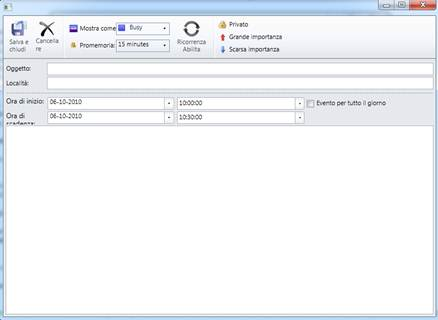

::: {style="DISPLAY: none"}
{#d2h_url_template}{#d2h_package_url style="WIDTH: 0px; DISPLAY: none; HEIGHT: 0px"}
:::

:::: {.d2h_secondary_topic style="PADDING-BOTTOM: 10pt; MARGIN: 0pt; PADDING-LEFT: 0pt; PADDING-RIGHT: 0pt; PADDING-TOP: 0pt"}
##### Appointment Window {#appointment-window style="tab-stops: 0pt"}

**[]{style="COLOR: #4f81bd; FONT-SIZE: 9pt"}** 

Table 6: Appointment window

::: {align="center"}
  Names in Resource File      Values
  --------------------------- ---------------------
  AppWindowSave               Save and Close
  AppWindowDelete             Delete
  AppWindowShowAs             Show As
  AppWindowReminder           Reminder
  AppWindowEnableRecurrence   Enable Recurrence
  AppWindowRemoveRecurrence   Remove Recurrence
  AppWindowPrivate            Private
  AppWindowHighImportance     High Importance
  AppWindowLowImportance      Low Importance
  AppWindowSubject            Subject
  AppWindowLocation           Location
  AppWindowStartTime          StartTime
  AppWindowEndTime            EndTime
  AppWindowAllDay             All day event
  RecurrencePattern           Recurrence Pattern
  RecurrenceDaily             Daily
  RecurrenceWeekly            Weekly
  RecurrenceMonthly           Monthly
  RecurrenceYearly            Yearly
  RecurrenceRange             Range of recurrence
  RecurrenceStart             Start
  RecurrenceNoEndDate         No End Date
  RecurrenceEndAfter          End after
  RecurrenceEndBy             End by
  RecurrenceOccurences        Occurrences
  RecurrenceEvery             Every
  RecurrenceDays              Day(s)
  RecurrenceEveryWeekday      Every Weekday
  RecurrenceRecurEvery        Recur every
  RecurrenceWeeksOn           Week(s)on
  RecurrenceSunday            Sunday
  RecurrenceMonday            Monday
  RecurrenceTuesday           Tuesday
  RecurrenceWednesday         Wednesday
  RecurrenceThursday          Thursday
  RecurrenceFriday            Friday
  RecurrenceSaturday          Saturday
  RecurrenceDay               Day
  RecurrenceOfEvery           Of every
  RecurrenceMonths            Month(s)
  RecurrenceThe               The
  RecurrenceOn                On
  RecurrenceOnThe             On the
  RecurrenceOf                Of
  RecurrenceYears             Year(s)
:::

 

{border="0"}

Figure 32: Appointment Window

**[]{style="COLOR: #4f81bd; FONT-SIZE: 9pt"}** 

[]{#related-topics}
::::
