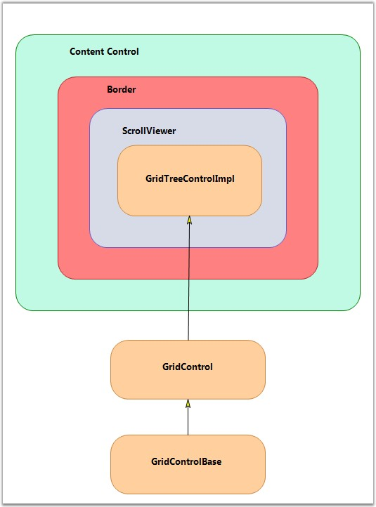

::: {style="DISPLAY: none"}
{#d2h_url_template}{#d2h_package_url style="WIDTH: 0px; DISPLAY: none; HEIGHT: 0px"}
:::

::::: {#nsbanner .d2h_main_nsbanner style="BORDER-BOTTOM: #999999 1px solid; POSITION: relative; PADDING-BOTTOM: 0px; BACKGROUND-COLOR: transparent; PADDING-LEFT: 0px; PADDING-RIGHT: 0px; DISPLAY: none; BORDER-TOP: #999999 1px solid; PADDING-TOP: 0px; LEFT: 0px"}
:::: {#TitleRow .d2h_main_titlerow style="PADDING-BOTTOM: 4px; BACKGROUND-COLOR: transparent; PADDING-LEFT: 22px; WIDTH: 100%; PADDING-RIGHT: 10px; DISPLAY: none; PADDING-TOP: 4px"}
::: {#ienav .d2h_main_ienav style="DISPLAY: none"}
{#D2HPrevious .D2HPreviousEnabled}  {#D2HNext .D2HNextEnabled}
:::
::::
:::::

:::: {#nstext .d2h_main_nstext style="PADDING-BOTTOM: 10px; BACKGROUND-COLOR: transparent; PADDING-LEFT: 22px; PADDING-RIGHT: 10px; HEIGHT: 100%; OVERFLOW: auto; PADDING-TOP: 5px" hasuserbackground="true" valign="bottom"}
::: {#d2h_breadcrumbs .d2h_breadcrumbs}
[Essential Studio User Guide Documentation](ms-xhelp:///?Id=12457748-09e3-4d74-a240-8e049cedf030){.d2h_breadcrumbsNormal}[ \> ]{.d2h_breadcrumbsLinkSeparator}[User Interface Edition](ms-xhelp:///?Id=c29296b7-531c-413b-a0ec-488ca1f7f669){.d2h_breadcrumbsNormal}[ \> ]{.d2h_breadcrumbsLinkSeparator}[Essential Silverlight](ms-xhelp:///?Id=66221bd1-ba2e-43c2-94a7-618f50e01d24){.d2h_breadcrumbsNormal}[ \> ]{.d2h_breadcrumbsLinkSeparator}[Essential Grid]{.d2h_breadcrumbsContentsOnly}[ \> ]{.d2h_breadcrumbsLinkSeparator}[Concepts and Features](ms-xhelp:///?Id=8126789d-b192-4c3c-9e36-f0119f12b8b9){.d2h_breadcrumbsNormal}[ \> ]{.d2h_breadcrumbsLinkSeparator}[Grid Tree control](ms-xhelp:///?Id=7a35cbd2-7c13-4922-9d18-aeecf6280496){.d2h_breadcrumbsNormal}
:::

### Architecture {#architecture style="tab-stops: 0pt"}

[]{style="FONT-FAMILY: 'Trebuchet MS','sans-serif'; COLOR: #15428b; FONT-SIZE: 9pt"} 

The Grid Tree control derives from the WPF ContentControl, which allows it to support a ControlTemplate to define its content. By default, its content includes a Border object, which contains a **ScrollViewer** object that contains a **GridControlImpl** object. **GridControlImpl** is a **GridControlBase** derived class that provides the 'multi-column grid' functionality to the Grid Tree control.

 

For each node in the tree, there is a **GridTreeNode** object that holds the information of the node such as the underlying data item, whether the node is expanded, etc. The GridTreeNodes collection can be accessed by the **GridTreeControl.InternalGrid.Nodes** collection. InternalGrid is the **GridTreeControlImpl** object associated with the Grid Tree control.

 

The following screen shot illustrates the Grid Tree control architecture.

 

{border="0"}

[]{style="FONT-FAMILY: 'Trebuchet MS','sans-serif'; COLOR: #15428b; FONT-SIZE: 9pt"} 

Figure 187: GridTreeControl Architecture

[]{style="FONT-FAMILY: 'Trebuchet MS','sans-serif'; COLOR: #15428b; FONT-SIZE: 9pt"} 

Accessing the Underlying Grid control

[]{style="FONT-FAMILY: 'Trebuchet MS','sans-serif'; COLOR: #15428b; FONT-SIZE: 9pt"} 

The Grid Tree control is a ContentControl derived class. To get its grid-like behavior, the Grid Tree control has a Grid control derived property named **InternalGrid**. InternalGrid is a **GridTreeControlImpl** class, which is derived from the Grid control. The GridTreeControlImpl is a virtual Grid control, which uses the virtual events to bind to the **GridTreeControl.Nodes** collection. So, to access the underlying Grid control associated with the Grid Tree control, you can use the **GridTreeControl.InternalGrid** property.

 

All the properties exposed in Grid Tree control (with the exception of Internal Grid) are mirrored in GridTreeControlImpl. There are methods and properties exposed on the Internal Grid that are not exposed on the Grid Tree control itself. In particular, to control the look of the Expand cell, you need to use the Internal Grid as discussed below. The Internal Grid has many protected methods that provide access to the tree-like functionality. So, deriving GridTreeControlImpl gives you access to this functionality if you need to use it for any reason.

[]{#p269} 

[]{#related-topics}
::::
