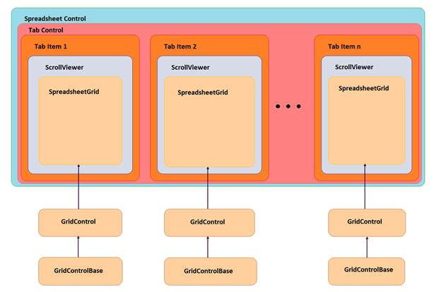

::: {style="DISPLAY: none"}
{#d2h_url_template}{#d2h_package_url style="WIDTH: 0px; DISPLAY: none; HEIGHT: 0px"}
:::

::::: {#nsbanner .d2h_main_nsbanner style="BORDER-BOTTOM: #999999 1px solid; POSITION: relative; PADDING-BOTTOM: 0px; BACKGROUND-COLOR: transparent; PADDING-LEFT: 0px; PADDING-RIGHT: 0px; DISPLAY: none; BORDER-TOP: #999999 1px solid; PADDING-TOP: 0px; LEFT: 0px"}
:::: {#TitleRow .d2h_main_titlerow style="PADDING-BOTTOM: 4px; BACKGROUND-COLOR: transparent; PADDING-LEFT: 22px; WIDTH: 100%; PADDING-RIGHT: 10px; DISPLAY: none; PADDING-TOP: 4px"}
::: {#ienav .d2h_main_ienav style="DISPLAY: none"}
{#D2HPrevious .D2HPreviousEnabled}  {#D2HNext .D2HNextEnabled}
:::
::::
:::::

::: {#nstext .d2h_main_nstext style="PADDING-BOTTOM: 10px; BACKGROUND-COLOR: transparent; PADDING-LEFT: 22px; PADDING-RIGHT: 10px; HEIGHT: 100%; OVERFLOW: auto; PADDING-TOP: 5px" hasuserbackground="true" valign="bottom"}
## Architecture {#architecture style="tab-stops: 0pt"}

The Spreadsheet control supports *ControlTemplate* to define its content. By default, its content includes a *TabControlExt* object that contains number of *TabItemExt* based on sheet count. The *TabItemExt* contains a ScrollViewer object that contains a *SpreadsheetGrid* object.

 

The following sketch illustrates the Spreadsheet control architecture.

 

{border="0"}

Figure 13: Spreadsheet Architecture

*[]{style="FONT-SIZE: 9pt"}* 

Accessing the Underlying Grid control

The Spreadsheet control is a control derived class that has its own properties. You can use Grid control derived property namely *ActiveSpreadsheetGrid to* get its grid-like behavior. To access the underlying Grid control associated with the Spreadsheet control, you can use the *SpreadsheetControl.GridProperties.ActiveSpreadsheetGrid* property.

 

[]{#related-topics}
:::
