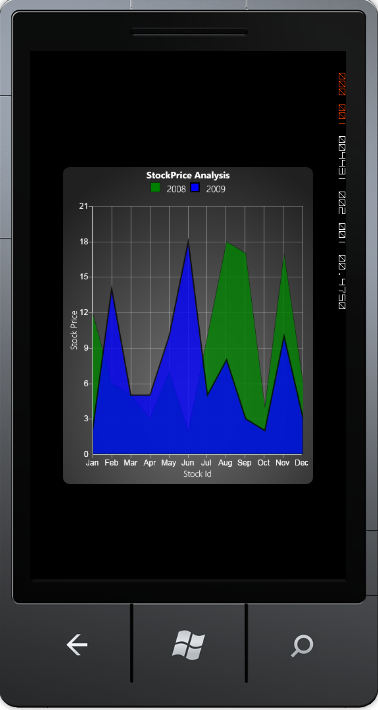

::: {style="DISPLAY: none"}
{#d2h_url_template}{#d2h_package_url style="WIDTH: 0px; DISPLAY: none; HEIGHT: 0px"}
:::

::: {.d2h_secondary_topic style="PADDING-BOTTOM: 10pt; MARGIN: 0pt; PADDING-LEFT: 0pt; PADDING-RIGHT: 0pt; PADDING-TOP: 0pt"}
#### Area Chart {#area-chart style="tab-stops: 0pt"}

[]{style="COLOR: #15428b"} 

An area chart or area graph displays graphically quantitative data. It is based on the line chart. The area between the axis and the line are commonly emphasized with colors, textures and hatching. Usually, one compares two or more quantities using an Area chart.

[]{style="COLOR: #15428b"} 

+---------------------------------------------------------------------------------------------------------------------------------------------------------------------------------------------------------------------------------------------------------------------------------------------------------------------------------------------------------------------------------------------------------------------------------------------------------------------------------------------------------------------------------------------------------------------------------------------------------------------------------------------------+
| [\[XAML\]]{style="FONT-FAMILY: 'Courier New'"}                                                                                                                                                                                                                                                                                                                                                                                                                                                                                                                                                                                                    |
|                                                                                                                                                                                                                                                                                                                                                                                                                                                                                                                                                                                                                                                   |
| []{style="FONT-FAMILY: 'Courier New'; COLOR: blue"}                                                                                                                                                                                                                                                                                                                                                                                                                                                                                                                                                                                               |
|                                                                                                                                                                                                                                                                                                                                                                                                                                                                                                                                                                                                                                                   |
| [\<]{style="FONT-FAMILY: 'Courier New'; COLOR: blue"}[syncfusion:ChartSeries]{style="FONT-FAMILY: 'Courier New'; COLOR: #a31515"}[ ]{style="FONT-FAMILY: 'Courier New'; COLOR: blue"}[Type]{style="FONT-FAMILY: 'Courier New'; COLOR: red"}[=]{style="FONT-FAMILY: 'Courier New'; COLOR: blue"}[\"[Area]{style="COLOR: blue"}\"[ ]{style="COLOR: blue"}[LegendLabel]{style="COLOR: red"}[=]{style="COLOR: blue"}\"[2008]{style="COLOR: blue"}\"[ ]{style="COLOR: blue"}[Foreground]{style="COLOR: red"}[=]{style="COLOR: blue"}\"[{StaticResource Series1}]{style="COLOR: blue"}\"[/\>]{style="COLOR: blue"}]{style="FONT-FAMILY: 'Courier New'"} |
+---------------------------------------------------------------------------------------------------------------------------------------------------------------------------------------------------------------------------------------------------------------------------------------------------------------------------------------------------------------------------------------------------------------------------------------------------------------------------------------------------------------------------------------------------------------------------------------------------------------------------------------------------+

[]{style="COLOR: #15428b"} 

+------------------------------------------------------------------------------------------------+
| [\[C#\]]{style="FONT-FAMILY: 'Courier New'"}                                                   |
|                                                                                                |
| []{style="FONT-FAMILY: 'Courier New'; COLOR: blue"}                                            |
|                                                                                                |
| [series.Type = [ChartTypes]{style="COLOR: #2b91af"}.Area;]{style="FONT-FAMILY: 'Courier New'"} |
+------------------------------------------------------------------------------------------------+

[]{style="COLOR: #15428b"} 

Run the code. The following output is displayed.

[]{style="COLOR: #15428b"} 

[]{style="COLOR: #15428b"} 

{border="0"}

 

Figure 34 : Chart Displaying Area Series \[ChartType=\"Area\"\][]{style="FONT-FAMILY: 'Times New Roman','serif'; FONT-SIZE: 12pt"}

 

[]{#related-topics}
:::
