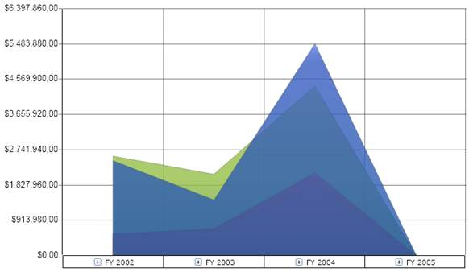

::: {style="DISPLAY: none"}
{#d2h_url_template}{#d2h_package_url style="WIDTH: 0px; DISPLAY: none; HEIGHT: 0px"}
:::

::::: {#nsbanner .d2h_main_nsbanner style="BORDER-BOTTOM: #999999 1px solid; POSITION: relative; PADDING-BOTTOM: 0px; BACKGROUND-COLOR: transparent; PADDING-LEFT: 0px; PADDING-RIGHT: 0px; DISPLAY: none; BORDER-TOP: #999999 1px solid; PADDING-TOP: 0px; LEFT: 0px"}
:::: {#TitleRow .d2h_main_titlerow style="PADDING-BOTTOM: 4px; BACKGROUND-COLOR: transparent; PADDING-LEFT: 22px; WIDTH: 100%; PADDING-RIGHT: 10px; DISPLAY: none; PADDING-TOP: 4px"}
::: {#ienav .d2h_main_ienav style="DISPLAY: none"}
{#D2HPrevious .D2HPreviousEnabled}  {#D2HNext .D2HNextEnabled}
:::
::::
:::::

:::: {#nstext .d2h_main_nstext style="PADDING-BOTTOM: 10px; BACKGROUND-COLOR: transparent; PADDING-LEFT: 22px; PADDING-RIGHT: 10px; HEIGHT: 100%; OVERFLOW: auto; PADDING-TOP: 5px" hasuserbackground="true" valign="bottom"}
::: {#d2h_breadcrumbs .d2h_breadcrumbs}
[Essential Studio User Guide Documentation](ms-xhelp:///?Id=12457748-09e3-4d74-a240-8e049cedf030){.d2h_breadcrumbsNormal}[ \> ]{.d2h_breadcrumbsLinkSeparator}[Business Intelligence Edition](ms-xhelp:///?Id=fdf33dd8-62b2-47b9-ad7b-fc50e590bca5){.d2h_breadcrumbsNormal}[ \> ]{.d2h_breadcrumbsLinkSeparator}[Essential BI Silverlight](ms-xhelp:///?Id=c006b39c-6aa2-4637-b7de-3e7b6cb3f9f9){.d2h_breadcrumbsNormal}[ \> ]{.d2h_breadcrumbsLinkSeparator}[Essential BI Chart]{.d2h_breadcrumbsContentsOnly}[ \> ]{.d2h_breadcrumbsLinkSeparator}[Concepts and Features](ms-xhelp:///?Id=372b5b83-fed0-46d4-831c-b84fe8c18abb){.d2h_breadcrumbsNormal}[ \> ]{.d2h_breadcrumbsLinkSeparator}[Chart Types](ms-xhelp:///?Id=c508d4a2-3f48-4a10-884a-63a1576cf7cd){.d2h_breadcrumbsNormal}
:::

### Area Chart {#area-chart style="tab-stops: 0pt"}

Area charts emphasize the degree of change of the values over a period of time. Instead of rendering data as discreet bars or columns, an Area chart renders them in a continuous ebb and flow pattern as defined against the y-axis.

 

There is support for alpha-blending multiple series areas. The look and feel is also easily customizable by the user.

 

This Area chart connects the y-points by using straight lines and forms, which is an area covered by the above lines and x-axis. This area is then shaded with a specified color or gradient.

Multiple series can be plotted on the same chart and alpha-blended interior color can be used on the exterior chart to make the interior chart show through.

 

The following code snippet shows how to select this chart type.

[]{style="FONT-FAMILY: 'Arial','sans-serif'"} 

+-----------------------------------------------------------------------------------------------------------------------------------------------------------------------------------------------------------------------------------------------------------------------------------------------------------------------------------------------------------------------------------------------------------------+
| **[\[XAML\]]{style="FONT-FAMILY: 'Courier New'"}**                                                                                                                                                                                                                                                                                                                                                              |
|                                                                                                                                                                                                                                                                                                                                                                                                                 |
| **[]{style="FONT-FAMILY: 'Courier New'"}**                                                                                                                                                                                                                                                                                                                                                                      |
|                                                                                                                                                                                                                                                                                                                                                                                                                 |
| [\<]{style="FONT-FAMILY: 'Courier New'; COLOR: blue"}[sfchart]{style="FONT-FAMILY: 'Courier New'; COLOR: #a31515"}[:]{style="FONT-FAMILY: 'Courier New'; COLOR: blue"}[OlapChart]{style="FONT-FAMILY: 'Courier New'; COLOR: #a31515"}[ OlapChartType]{style="FONT-FAMILY: 'Courier New'; COLOR: red"}[=\"Area\" /\>]{style="FONT-FAMILY: 'Courier New'; COLOR: blue"}**[]{style="FONT-FAMILY: 'Courier New'"}** |
|                                                                                                                                                                                                                                                                                                                                                                                                                 |
| []{style="FONT-FAMILY: 'Arial','sans-serif'"}                                                                                                                                                                                                                                                                                                                                                                   |
+-----------------------------------------------------------------------------------------------------------------------------------------------------------------------------------------------------------------------------------------------------------------------------------------------------------------------------------------------------------------------------------------------------------------+

[]{style="FONT-FAMILY: 'Arial','sans-serif'"} 

+---------------------------------------------------------------------------------------------------------------------------------------------------------------------------------------------------------------+
| **[\[C#\]]{style="FONT-FAMILY: 'Courier New'"}**                                                                                                                                                              |
|                                                                                                                                                                                                               |
| []{style="FONT-FAMILY: 'Arial','sans-serif'"}                                                                                                                                                                 |
|                                                                                                                                                                                                               |
| [this]{style="FONT-FAMILY: 'Courier New'; COLOR: blue"}[.olapChart1.OlapChartType = [OlapChartTypes]{style="COLOR: #2b91af"}.Area;]{style="FONT-FAMILY: 'Courier New'"}[]{style="FONT-FAMILY: 'Courier New'"} |
|                                                                                                                                                                                                               |
| []{style="FONT-FAMILY: 'Arial','sans-serif'"}                                                                                                                                                                 |
+---------------------------------------------------------------------------------------------------------------------------------------------------------------------------------------------------------------+

[]{style="FONT-FAMILY: 'Arial','sans-serif'"} 

+------------------------------------------------------------------------------------------------------------------------------------------------------------------------------------------------------------------------------------------------------------------------------+
| **[\[VB\]]{style="FONT-FAMILY: 'Courier New'"}**                                                                                                                                                                                                                             |
|                                                                                                                                                                                                                                                                              |
| []{style="FONT-FAMILY: 'Courier New'; COLOR: blue"}                                                                                                                                                                                                                          |
|                                                                                                                                                                                                                                                                              |
| [Me]{style="FONT-FAMILY: 'Courier New'; COLOR: blue"}[.olapChart1.OlapChartType = ]{style="FONT-FAMILY: 'Courier New'"}[OlapChartTypes]{style="FONT-FAMILY: 'Courier New'; COLOR: #2b91af"}[.Area]{style="FONT-FAMILY: 'Courier New'"}[]{style="FONT-FAMILY: 'Courier New'"} |
|                                                                                                                                                                                                                                                                              |
| []{style="FONT-FAMILY: 'Arial','sans-serif'"}                                                                                                                                                                                                                                |
+------------------------------------------------------------------------------------------------------------------------------------------------------------------------------------------------------------------------------------------------------------------------------+

[]{style="FONT-FAMILY: 'Arial','sans-serif'"} 

The following image shows a simple Area chart:

[]{style="FONT-FAMILY: 'Arial','sans-serif'"} 

{border="0"}

 

Figure 18: Area chart

[]{#related-topics}
::::
