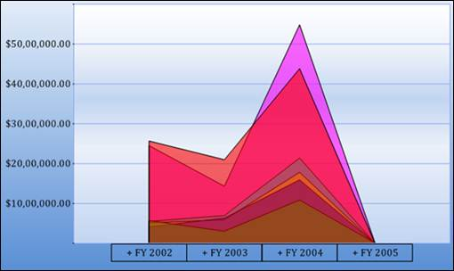
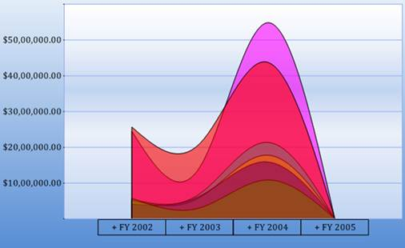
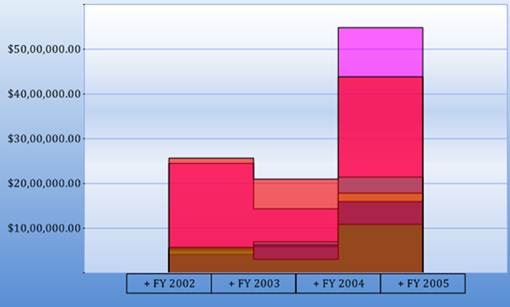
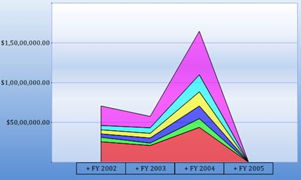

::: {style="DISPLAY: none"}
{#d2h_url_template}{#d2h_package_url style="WIDTH: 0px; DISPLAY: none; HEIGHT: 0px"}
:::

::::: {#nsbanner .d2h_main_nsbanner style="BORDER-BOTTOM: #999999 1px solid; POSITION: relative; PADDING-BOTTOM: 0px; BACKGROUND-COLOR: transparent; PADDING-LEFT: 0px; PADDING-RIGHT: 0px; DISPLAY: none; BORDER-TOP: #999999 1px solid; PADDING-TOP: 0px; LEFT: 0px"}
:::: {#TitleRow .d2h_main_titlerow style="PADDING-BOTTOM: 4px; BACKGROUND-COLOR: transparent; PADDING-LEFT: 22px; WIDTH: 100%; PADDING-RIGHT: 10px; DISPLAY: none; PADDING-TOP: 4px"}
::: {#ienav .d2h_main_ienav style="DISPLAY: none"}
{#D2HPrevious .D2HPreviousEnabled}  {#D2HNext .D2HNextEnabled}
:::
::::
:::::

::::: {#nstext .d2h_main_nstext style="PADDING-BOTTOM: 10px; BACKGROUND-COLOR: transparent; PADDING-LEFT: 22px; PADDING-RIGHT: 10px; HEIGHT: 100%; OVERFLOW: auto; PADDING-TOP: 5px" hasuserbackground="true" valign="bottom"}
::: {#d2h_breadcrumbs .d2h_breadcrumbs}
[Essential Studio User Guide Documentation](ms-xhelp:///?Id=12457748-09e3-4d74-a240-8e049cedf030){.d2h_breadcrumbsNormal}[ \> ]{.d2h_breadcrumbsLinkSeparator}[Business Intelligence Edition](ms-xhelp:///?Id=fdf33dd8-62b2-47b9-ad7b-fc50e590bca5){.d2h_breadcrumbsNormal}[ \> ]{.d2h_breadcrumbsLinkSeparator}[Essential BI ASP.NET](ms-xhelp:///?Id=99c6694e-59c3-4c59-abb5-ce9ce9a948bc){.d2h_breadcrumbsNormal}[ \> ]{.d2h_breadcrumbsLinkSeparator}[Essential BI Chart]{.d2h_breadcrumbsContentsOnly}[ \> ]{.d2h_breadcrumbsLinkSeparator}[Concepts and Features](ms-xhelp:///?Id=be4e11fe-e0a1-44d7-aa3a-05cf8b78bdb8){.d2h_breadcrumbsNormal}[ \> ]{.d2h_breadcrumbsLinkSeparator}[Chart Types](ms-xhelp:///?Id=11a8b8a5-faa3-4a18-ac73-7d73435f1963){.d2h_breadcrumbsNormal}
:::

### Area Chart and its types {#area-chart-and-its-types style="tab-stops: 0pt"}

 

AREA CHART:

Area Charts emphasize the degree of change of the values over a period of time. Instead of rendering data as discreet bars or columns, an Area chart renders them in continuous ebb and flow a pattern as defined against the y-axis.

[]{style="FONT-SIZE: 12pt"} 

+------------------------------------------------------------------------------------------------------------------------------------------------------------------------------------------------------------------+
| **[\[C#\]]{style="FONT-FAMILY: 'Courier New'"}**                                                                                                                                                                 |
|                                                                                                                                                                                                                  |
|                                                                                                                                                                                                                  |
|                                                                                                                                                                                                                  |
| [this]{style="FONT-FAMILY: 'Courier New'; COLOR: blue"}[.olapChart1.ChartSeriesType = [ChartSeriesType]{style="COLOR: #2b91af"}.Area;]{style="FONT-FAMILY: 'Courier New'"}[]{style="FONT-FAMILY: 'Courier New'"} |
+------------------------------------------------------------------------------------------------------------------------------------------------------------------------------------------------------------------+

 

+-------------------------------------------------------------------------------------------------------------------------------------------------------------------------+
| **[\[VB\]]{style="FONT-FAMILY: 'Courier New'"}**                                                                                                                        |
|                                                                                                                                                                         |
| []{style="FONT-FAMILY: 'Courier New'"}                                                                                                                                  |
|                                                                                                                                                                         |
| [Me]{style="FONT-FAMILY: 'Courier New'; COLOR: blue"}[.olapChart1.ChartSeriesType = [ChartSeriesType]{style="COLOR: #2b91af"}.Area]{style="FONT-FAMILY: 'Courier New'"} |
+-------------------------------------------------------------------------------------------------------------------------------------------------------------------------+

[]{style="FONT-FAMILY: 'Courier New'"} 

 

{border="0"}

 

Figure 20: Area Chart

SPLINE AREA:

Spline Area chart is similar to an Area chart with the only difference being the way in which the points of a series are connected. It connects each series of points by a smooth spline curve.

[]{style="FONT-SIZE: 12pt"} 

+------------------------------------------------------------------------------------------------------------------------------------------------------------------------------------------------------------------------+
| **[\[C#\]]{style="FONT-FAMILY: 'Courier New'"}**                                                                                                                                                                       |
|                                                                                                                                                                                                                        |
|                                                                                                                                                                                                                        |
|                                                                                                                                                                                                                        |
| [this]{style="FONT-FAMILY: 'Courier New'; COLOR: blue"}[.olapChart1.ChartSeriesType = [ChartSeriesType]{style="COLOR: #2b91af"}.SplineArea;]{style="FONT-FAMILY: 'Courier New'"}[]{style="FONT-FAMILY: 'Courier New'"} |
+------------------------------------------------------------------------------------------------------------------------------------------------------------------------------------------------------------------------+

 

+-------------------------------------------------------------------------------------------------------------------------------------------------------------------------------------------------------------------------------------------------+
| **[\[VB\]]{style="FONT-FAMILY: 'Courier New'"}**                                                                                                                                                                                                |
|                                                                                                                                                                                                                                                 |
| []{style="FONT-FAMILY: 'Courier New'"}                                                                                                                                                                                                          |
|                                                                                                                                                                                                                                                 |
| [Me]{style="FONT-FAMILY: 'Courier New'; COLOR: blue"}[.olapChart1.ChartSeriesType = ]{style="FONT-FAMILY: 'Courier New'"}[ChartSeriesType]{style="FONT-FAMILY: 'Courier New'; COLOR: #2b91af"}[.SplineArea]{style="FONT-FAMILY: 'Courier New'"} |
+-------------------------------------------------------------------------------------------------------------------------------------------------------------------------------------------------------------------------------------------------+

 

{border="0"}

 

Figure 21: Spline Area

STEP AREA:

Step Area charts are similar to the regular area charts except for a straight line tracing the shortest path between points, the values are connected by continuous vertical and horizontal lines forming a step like progression.

[]{style="FONT-SIZE: 12pt"} 

+--------------------------------------------------------------------------------------------------------------------------------------------------------------------------------+
| **[\[C#\]]{style="FONT-FAMILY: 'Courier New'"}**                                                                                                                               |
|                                                                                                                                                                                |
| []{style="FONT-FAMILY: 'Courier New'"}                                                                                                                                         |
|                                                                                                                                                                                |
| [this]{style="FONT-FAMILY: 'Courier New'; COLOR: blue"}[.olapChart1.ChartSeriesType = [ChartSeriesType]{style="COLOR: #2b91af"}.StepArea;]{style="FONT-FAMILY: 'Courier New'"} |
+--------------------------------------------------------------------------------------------------------------------------------------------------------------------------------+

 

+---------------------------------------------------------------------------------------------------------------------------------------------------------------------------------------------------------------------------------------------------------------------------------------------------------------------------+
| **[\[VB\]]{style="FONT-FAMILY: 'Courier New'"}**                                                                                                                                                                                                                                                                          |
|                                                                                                                                                                                                                                                                                                                           |
| []{style="FONT-FAMILY: 'Courier New'"}                                                                                                                                                                                                                                                                                    |
|                                                                                                                                                                                                                                                                                                                           |
| [Me]{style="FONT-FAMILY: 'Courier New'; COLOR: blue"}[.olapChart1.ChartSeriesType = ]{style="FONT-FAMILY: 'Courier New'"}[ChartSeriesType]{style="FONT-FAMILY: 'Courier New'; COLOR: #2b91af"}[.]{style="FONT-FAMILY: 'Courier New'"}[StepArea]{style="FONT-FAMILY: 'Courier New'"}[]{style="FONT-FAMILY: 'Courier New'"} |
+---------------------------------------------------------------------------------------------------------------------------------------------------------------------------------------------------------------------------------------------------------------------------------------------------------------------------+

 

{border="0"}

 

Figure 22: Step Area

 

STACKING AREA:

Stacking Area chart are similar to regular area charts except that the y values stack on top of each other in the specified series order. This helps visualize the relationship of parts to the whole.

 

+--------------------------------------------------------------------------------------------------------------------------------------------------------------------------------------------------------------------------+
| **[\[C#\]]{style="FONT-FAMILY: 'Courier New'"}**                                                                                                                                                                         |
|                                                                                                                                                                                                                          |
| []{style="FONT-FAMILY: 'Courier New'"}                                                                                                                                                                                   |
|                                                                                                                                                                                                                          |
| [this]{style="FONT-FAMILY: 'Courier New'; COLOR: blue"}[.olapChart1.ChartSeriesType = [ChartSeriesType]{style="COLOR: #2b91af"}.StackingArea;]{style="FONT-FAMILY: 'Courier New'"}[]{style="FONT-FAMILY: 'Courier New'"} |
+--------------------------------------------------------------------------------------------------------------------------------------------------------------------------------------------------------------------------+

 

+-------------------------------------------------------------------------------------------------------------------------------------------------------------------------------------------------------------------------------------------------------------------------------------------------------------------------------+
| **[\[VB\]]{style="FONT-FAMILY: 'Courier New'"}**                                                                                                                                                                                                                                                                              |
|                                                                                                                                                                                                                                                                                                                               |
| []{style="FONT-FAMILY: 'Courier New'"}                                                                                                                                                                                                                                                                                        |
|                                                                                                                                                                                                                                                                                                                               |
| [Me]{style="FONT-FAMILY: 'Courier New'; COLOR: blue"}[.olapChart1.ChartSeriesType = ]{style="FONT-FAMILY: 'Courier New'"}[ChartSeriesType]{style="FONT-FAMILY: 'Courier New'; COLOR: #2b91af"}[.]{style="FONT-FAMILY: 'Courier New'"}[StackingArea]{style="FONT-FAMILY: 'Courier New'"}[]{style="FONT-FAMILY: 'Courier New'"} |
+-------------------------------------------------------------------------------------------------------------------------------------------------------------------------------------------------------------------------------------------------------------------------------------------------------------------------------+

[]{style="FONT-FAMILY: 'Courier New'"} 

{border="0"}

 

Figure 23: Stacking Area

 

Table 5: ChartSeriesType

 

::: {align="center"}
+-----------------+--------------------------------------------------------------------------------------------------------------+-------------+-----------------+----------------+
| Property        | Descriptions                                                                                                 | Type        | Data            | Reference Link |
|                 |                                                                                                              |             |                 |                |
|                 |                                                                                                              |             | type            |                |
+-----------------+--------------------------------------------------------------------------------------------------------------+-------------+-----------------+----------------+
| ChartSeriesType | Different types of charts such as line, area, bar, column and pie chart are implemented using this property. | Server side | ChartSeriesType | \-             |
+-----------------+--------------------------------------------------------------------------------------------------------------+-------------+-----------------+----------------+
:::

 

Sample Link

A sample demo is available at the following location:

 

..\\Syncfusion\\EssentialStudio\\\<Version Number\>\\BI\\Web\\OlapChart.Web\\Samples\\3.5\\Chart Types\\Area Chart\\

[]{#related-topics}
:::::
