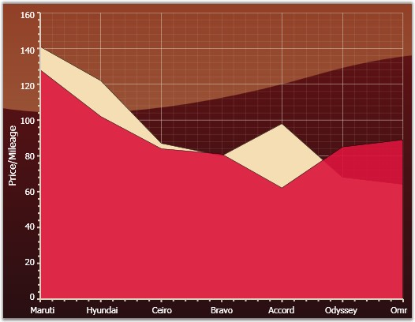
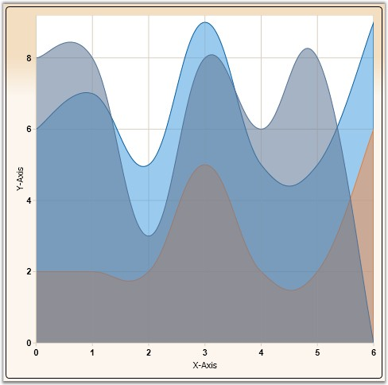
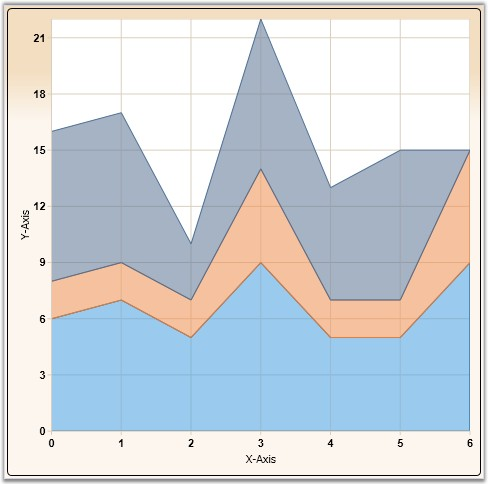
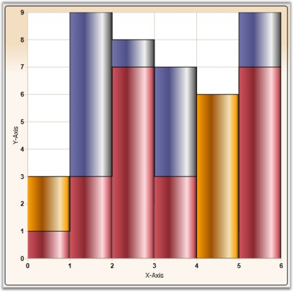
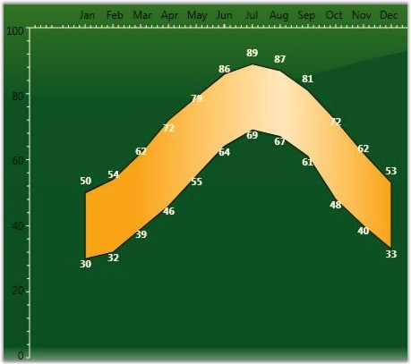

::: {style="DISPLAY: none"}
{#d2h_url_template}{#d2h_package_url style="WIDTH: 0px; DISPLAY: none; HEIGHT: 0px"}
:::

::::::::::::::: {.d2h_secondary_topic style="PADDING-BOTTOM: 10pt; MARGIN: 0pt; PADDING-LEFT: 0pt; PADDING-RIGHT: 0pt; PADDING-TOP: 0pt"}
##### Area Charts {#area-charts style="tab-stops: 0pt"}

###### []{#p91}4.1.1.4.4.1 Area Chart {#area-chart style="tab-stops: 0pt"}

The Area Chart connects the Y-points using straight lines and forms an area covered by the above lines and X-axis. This area is then shaded with a specified color or gradient.

 

Multiple series can be plotted on the same chart and alpha-blended interior color can be used on the exterior chart to make the interior chart show through.

 

The following image shows a multi series Area Chart.

[]{style="FONT-FAMILY: 'Trebuchet MS','sans-serif'; COLOR: #15428b; FONT-SIZE: 9pt"} 

{border="0"}

Figure 133: Area Chart

[]{style="FONT-FAMILY: 'Trebuchet MS','sans-serif'; COLOR: #15428b; FONT-SIZE: 9pt"} 

Data Requirements

**[]{style="FONT-FAMILY: 'Trebuchet MS','sans-serif'; COLOR: #15428b"}** 

Table 64: Data Requirements

::: {align="center"}
+------------------------------+-------------+
| Details                                    |
+------------------------------+-------------+
| Number of y values per point | one         |
+------------------------------+-------------+
| Number of points             | two or more |
+------------------------------+-------------+
| Number of series             | one or more |
+------------------------------+-------------+
:::

**[]{style="FONT-FAMILY: 'Trebuchet MS','sans-serif'; COLOR: #15428b"}** 

Template

The following parameters can be used while specifying template.

[]{style="FONT-FAMILY: 'Trebuchet MS','sans-serif'; COLOR: #15428b; FONT-SIZE: 9pt"} 

Table 65: Template Parameter

::: {align="center"}
  ---------------- ------------- -----------------------------------
  Name             Type          Description
  X1               double        x-coordinate of first point
  Y1               double        y-coordinate of first point
  X2               double        x-coordinate of second point
  Y2               double        y-coordinate of second point
  IsStartSegment   bool          *true* - if this is start segment
  IsEndSegment     bool          *true* - if this is end segment
  Geometry         Geometry      segment geometry
  Interior         Brush         column color
  Series           ChartSeries   reference to series-owner
  ---------------- ------------- -----------------------------------
:::

[]{style="FONT-FAMILY: 'Trebuchet MS','sans-serif'; COLOR: #15428b; FONT-SIZE: 9pt"} 

A sample which demonstrates Area Chart Types is available in the following sample installation path.

 

***..My Documents\\Syncfusion\\EssentialStudio\\\<Version Number\>\\WPF\\Chart.WPF\\Samples\\3.5\\WindowsSamples\\Chart Gallery\\Area Chart Demo***

 

See Also

[[Chart Types]{.UGHyperlink}](ms-xhelp:///?Id=137e357f-58c1-463b-9fb1-c42a058a7844)[]{.UGHyperlink}

[]{#p92} 

###### 4.1.1.4.4.2 Spline Area Chart {#spline-area-chart style="tab-stops: 0pt"}

Spline Area Chart is similar to an Area Chart with the only difference being the way in which the points of a series are connected. It connects each series of points by a smooth spline curve.

 

Multiple series can be plotted on the same chart and alpha-blended interior color can be used on the exterior chart to make the interior chart(s) show through.

 

The following image shows a multi series Spline Area Chart.

 

{border="0"}

Figure 134: Spline Area Chart

[]{style="FONT-FAMILY: 'Trebuchet MS','sans-serif'; COLOR: #15428b; FONT-SIZE: 9pt"} 

Data Requirements

[]{style="FONT-FAMILY: 'Trebuchet MS','sans-serif'; COLOR: #15428b; FONT-SIZE: 9pt"} 

Table 66: Data Requirement

::: {align="center"}
+------------------------------+-------------+
| Details                                    |
+------------------------------+-------------+
| Number of y values per point | one         |
+------------------------------+-------------+
| Number of points             | one or more |
+------------------------------+-------------+
| Number of series             | one or more |
+------------------------------+-------------+
:::

**[]{style="FONT-FAMILY: 'Trebuchet MS','sans-serif'; COLOR: #15428b"}** 

SplineArea Properties

 

Table 67: Spline Area Property

::: {align="center"}
  ----------------------------------- -------- ------------- ----------------------------------
  Name                                Type     Container     Description
  ChartSplineType.SplineCoefficient   double   ChartSeries   responsible for spline curvature
  ----------------------------------- -------- ------------- ----------------------------------
:::

[]{style="FONT-FAMILY: 'Trebuchet MS','sans-serif'; COLOR: #15428b; FONT-SIZE: 9pt"} 

Template

While setting template the following parameters can be used:

[]{style="FONT-FAMILY: 'Trebuchet MS','sans-serif'; COLOR: #15428b; FONT-SIZE: 9pt"} 

Table 68: Template Parameter

::: {align="center"}
  ---------------- ------------- -----------------------------------
  Name             Type          Description
  X1               double        x-coordinate of first point
  Y1               double        y-coordinate of first point
  X2               double        x-coordinate of second point
  Y2               double        y-coordinate of second point
  IsStartSegment   bool          *true* - if this is start segment
  IsEndSegment     bool          *true* - if this is end segment
  Geometry         Geometry      segment geometry
  Interior         Brush         column color
  Series           ChartSeries   reference to series-owner
  ---------------- ------------- -----------------------------------
:::

[]{style="FONT-FAMILY: 'Trebuchet MS','sans-serif'; COLOR: #15428b; FONT-SIZE: 9pt"} 

A sample which demonstrates Area Chart Types is available in the following sample installation path.

 

***..My Documents\\Syncfusion\\EssentialStudio\\\<Version Number\>\\WPF\\Chart.WPF\\Samples\\3.5\\WindowsSamples\\Chart Gallery\\Area Chart Demo***

**** 

See Also

[]{#p93}[[[Chart Types]{style="COLOR: blue"}](ms-xhelp:///?Id=090eefb9-2795-4da0-9063-ee320e7499af)]{.UGHyperlink}

 

###### 4.1.1.4.4.3 Stacking Area Chart {#stacking-area-chart style="tab-stops: 0pt"}

Stacking Area Charts are similar to regular area charts except that the Y values stack on top of each other in the specified series order. This helps visualize the relationship of parts to the whole.

 

The following image shows a sample Stacking Area Chart.

[]{style="COLOR: red; FONT-SIZE: 8pt"} 

{border="0"}

Figure 135: Stacking Area Chart

**[]{style="FONT-FAMILY: 'Trebuchet MS','sans-serif'; COLOR: #15428b"}** 

Data Requirements

[]{style="FONT-FAMILY: 'Trebuchet MS','sans-serif'; COLOR: #15428b; FONT-SIZE: 9pt"} 

Table 69: Data Requirement

::: {align="center"}
+-------------------------------+-------------+
| Details                                     |
+-------------------------------+-------------+
| Number of Y values per point: | one         |
+-------------------------------+-------------+
| Number of points:             | one or more |
+-------------------------------+-------------+
| Number of series:             | one or more |
+-------------------------------+-------------+
:::

 

Template

While setting template the following parameters can be used.

[]{style="FONT-FAMILY: 'Trebuchet MS','sans-serif'; COLOR: #15428b; FONT-SIZE: 9pt"} 

Table 70: Template Parameters

::: {align="center"}
  ---------------- ------------- ------------------------------------
  Name             Type          Description
  X1               double        x-coordinate of first point
  Y1               double        y-coordinate of first point
  X2               double        x-coordinate of second point
  Y2               double        y-coordinate of second point
  IsStartSegment   bool          *true* - if this is start segment
  IsEndSegment     bool          *true* - if this is end segment
  Geometry         Geometry      segment geometry
  IsUpper          bool          *true* -- if this is upper segment
  IsLower          bool          *true* -- if this is lower segment
  Interior         Brush         column color
  Series           ChartSeries   reference to series-owner
  ---------------- ------------- ------------------------------------
:::

[]{style="FONT-FAMILY: 'Trebuchet MS','sans-serif'; COLOR: #15428b; FONT-SIZE: 9pt"} 

Stacking Negative Series

When negative values are added, Stacking Area chart can be made to be stacked separately in the chart area, above and below the x- axis 0.

[]{style="FONT-FAMILY: 'Trebuchet MS','sans-serif'; COLOR: #15428b; FONT-SIZE: 9pt"} 

+----------------------------------------------------------------------------------------------------------------------------------------------------------------------------------+
| **[\[C#\]]{style="FONT-FAMILY: 'Courier New'; FONT-SIZE: 9pt"}**                                                                                                                 |
|                                                                                                                                                                                  |
| []{style="FONT-FAMILY: 'Courier New'; FONT-SIZE: 9pt"}                                                                                                                           |
|                                                                                                                                                                                  |
| [ChartStackingAreaType.SetRequiresNegativeSeriesStack([this]{style="COLOR: blue"}.chartArea1, [true]{style="COLOR: blue"});]{style="FONT-FAMILY: 'Courier New'; FONT-SIZE: 9pt"} |
+----------------------------------------------------------------------------------------------------------------------------------------------------------------------------------+

[]{style="FONT-FAMILY: 'Trebuchet MS','sans-serif'; COLOR: #15428b; FONT-SIZE: 9pt"} 

A sample which demonstrates Area Chart Types is available in the following sample installation path.

 

***..My Documents\\Syncfusion\\EssentialStudio\\\<Version Number\>\\WPF\\Chart.WPF\\Samples\\3.5\\WindowsSamples\\Chart Gallery\\Area Chart Demo***

**** 

See Also

[[Chart Types]{.UGHyperlink}](ms-xhelp:///?Id=7f54d9b2-6e7d-4862-a1a5-7d33255c5716)[]{.UGHyperlink}

[]{#p94} 

###### 4.1.1.4.4.4 StepArea Chart {#steparea-chart style="tab-stops: 0pt"}

Step Area Charts are similar to regular area chart except that instead of a straight line tracing the shortest path between points, the values are connected by continuous vertical and horizontal lines forming a step like progression.

 

{border="0"}

Figure 136: Step Area Chart

[]{style="FONT-FAMILY: 'Trebuchet MS','sans-serif'; COLOR: #15428b"} 

Data Requirements

[]{style="FONT-FAMILY: 'Trebuchet MS','sans-serif'; COLOR: #15428b; FONT-SIZE: 9pt"} 

Table 71: Data Requitement

::: {align="center"}
+------------------------------+-------------+
| Details                                    |
+------------------------------+-------------+
| Number of y values per point | one         |
+------------------------------+-------------+
| Number of points             | one or more |
+------------------------------+-------------+
| Number of series             | one or more |
+------------------------------+-------------+
:::

**[]{style="FONT-FAMILY: 'Trebuchet MS','sans-serif'; COLOR: #15428b"}** 

Template

While setting template the following parameters can be used.

[]{style="FONT-FAMILY: 'Trebuchet MS','sans-serif'; COLOR: #15428b; FONT-SIZE: 9pt"} 

Table 72: Template Parameter

::: {align="center"}
  ---------------- ------------- -----------------------------------
  Name             Type          Description
  X1               double        x-coordinate of first point
  Y1               double        y-coordinate of first point
  X2               double        x-coordinate of second point
  Y2               double        y-coordinate of second point
  StepX            double        x-coordinate of transient point
  StepY            double        y-coordinate of transient point
  Geometry         Geometry      segment geometry
  IsStartSegment   bool          *true* - if this is start segment
  IsEndSegment     bool          *true* - if this is end segment
  Interior         Brush         column color
  Series           ChartSeries   reference to series-owner
  ---------------- ------------- -----------------------------------
:::

[]{style="FONT-FAMILY: 'Trebuchet MS','sans-serif'; COLOR: #15428b; FONT-SIZE: 9pt"} 

A sample which demonstrates Area Chart Types is available in the following sample installation path.

 

***..My Documents\\Syncfusion\\EssentialStudio\\\<Version Number\>\\WPF\\Chart.WPF\\Samples\\3.5\\WindowsSamples\\Chart Gallery\\Area Chart Demo***

 

See Also

[]{#p95}[[[Chart Types]{style="COLOR: blue"}](ms-xhelp:///?Id=21b8eb08-0823-4f8b-9761-34ee211ba346)]{.UGHyperlink}

[]{style="FONT-FAMILY: 'Trebuchet MS','sans-serif'; COLOR: #15428b; FONT-SIZE: 9pt"} 

###### 4.1.1.4.4.5 Range Area Chart {#range-area-chart style="tab-stops: 0pt"}

Range Area Chart is a variation of Area Chart type that lets you plot bands of data in a chart, like Bollinger bands, weather patterns, etc. Each point in the chart is specified by 2 Y values -- the lower and higher end of the band.

 

{border="0"}

Figure 137: Range Area Chart

**[]{style="FONT-FAMILY: 'Trebuchet MS','sans-serif'; COLOR: #15428b; FONT-SIZE: 9pt"}** 

Data Requirements

[]{style="FONT-FAMILY: 'Trebuchet MS','sans-serif'; COLOR: #15428b; FONT-SIZE: 9pt"} 

Table 73: Data Requirement

::: {align="center"}
+------------------------------+-------------+
| Details                                    |
+------------------------------+-------------+
| Number of y values per point | two         |
+------------------------------+-------------+
| Number of points             | one or more |
+------------------------------+-------------+
| Number of series             | one or more |
+------------------------------+-------------+
:::

[]{style="FONT-FAMILY: 'Trebuchet MS','sans-serif'; COLOR: #15428b; FONT-SIZE: 9pt"} 

Custom Properties

[]{style="FONT-FAMILY: 'Trebuchet MS','sans-serif'; COLOR: #15428b; FONT-SIZE: 9pt"} 

Table 74: Custom Property

::: {align="center"}
  -------------------------------------- ------- ------------- ----------------------------------------------------------------------------------------------------------------
  Name                                   Type    Container     Description
  ChartRangeAreaType.HighValueInterior   Brush   ChartSeries   specifies the brush that should be used for the segment where the 2nd y value is greater than the 1st y value
  ChartRangeAreaType.LowValueInterior    Brush   ChartSeries   specifies the brush that should be used for the segment where the 1st  y value is greater than the 2nd y value
  -------------------------------------- ------- ------------- ----------------------------------------------------------------------------------------------------------------
:::

[]{style="FONT-FAMILY: 'Trebuchet MS','sans-serif'; COLOR: #15428b; FONT-SIZE: 9pt"} 

Template

The following parameters can be used while specifying template.

[]{style="FONT-FAMILY: 'Trebuchet MS','sans-serif'; COLOR: #15428b; FONT-SIZE: 9pt"} 

Table 75: Template Parameter

::: {align="center"}
  ----------- ------------- -------------------------------------------------
  Name        Type          Description
  IsHighLow   bool          *true* - if this segment is for a \"high\" area
  Geometry    Geometry      segment geometry
  FillBrush   Brush         interior for this segment
  Series      ChartSeries   reference to series-owner
  ----------- ------------- -------------------------------------------------
:::

[]{style="FONT-FAMILY: 'Trebuchet MS','sans-serif'; COLOR: #15428b; FONT-SIZE: 9pt"} 

A sample which demonstrates Range Area Chart Type is available in the following sample installation path.

 

***..My Documents\\Syncfusion\\EssentialStudio\\\<Version Number\>\\WPF\\Chart.WPF\\Samples\\3.5\\WindowsSamples\\Chart Gallery\\Range-Area Chart Demo***

**** 

See Also

[[Chart Types]{.UGHyperlink}](ms-xhelp:///?Id=7f54d9b2-6e7d-4862-a1a5-7d33255c5716)[]{.UGHyperlink}

[]{style="FONT-FAMILY: 'Trebuchet MS','sans-serif'; COLOR: #15428b; FONT-SIZE: 9pt"} 

[]{#p96} 

[]{#related-topics}
:::::::::::::::
