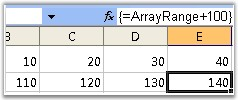

::: {style="DISPLAY: none"}
{#d2h_url_template}{#d2h_package_url style="WIDTH: 0px; DISPLAY: none; HEIGHT: 0px"}
:::

::: {.d2h_secondary_topic style="PADDING-BOTTOM: 10pt; MARGIN: 0pt; PADDING-LEFT: 0pt; PADDING-RIGHT: 0pt; PADDING-TOP: 0pt"}
#### Array Formula {#array-formula style="tab-stops: 0pt"}

 

Array Formula is a special type of formula in Excel. It works with an array or series of data values, rather than a single data value. XlsIO supports the usage of Array formula through the FormulaArray property.

 

Following code example explains how an array of values, from Named Range, is used for computation. For more details on Named Ranges, please refer [[Defined Names]{.UGHyperlink}](ms-xhelp:///?Id=66be49a8-9946-4f9d-87f8-3440491d69fe).

  

+--------------------------------------------------------------------------------------------------------------------------------------------------------+
| **[\[C#\]]{style="FONT-FAMILY: 'Courier New'"}**                                                                                                       |
|                                                                                                                                                        |
| []{style="FONT-FAMILY: 'Courier New'"}                                                                                                                 |
|                                                                                                                                                        |
| [// Insert Array Formula.]{style="FONT-FAMILY: 'Courier New'; COLOR: green"}                                                                           |
|                                                                                                                                                        |
| [sheet.Range\[[\"A1:D1\"]{style="COLOR: #a31515"}\].FormulaArray = [\"{1,2,3,4}\"]{style="COLOR: #a31515"};]{style="FONT-FAMILY: 'Courier New'"}       |
|                                                                                                                                                        |
| [sheet.Names.Add([\"ArrayRange\"]{style="COLOR: #a31515"}, sheet.Range\[[\"A1:D1\"]{style="COLOR: #a31515"}\]);]{style="FONT-FAMILY: 'Courier New'"}   |
|                                                                                                                                                        |
| [sheet.Range\[[\"A2:D2\"]{style="COLOR: #a31515"}\].FormulaArray = [\"ArrayRange+100\"]{style="COLOR: #a31515"}; ]{style="FONT-FAMILY: 'Courier New'"} |
+--------------------------------------------------------------------------------------------------------------------------------------------------------+

[]{style="FONT-FAMILY: 'Trebuchet MS','sans-serif'; COLOR: #15428b; FONT-SIZE: 9pt"} 

+--------------------------------------------------------------------------------------------------------------------------------------------------+
| **[\[VB.NET\]]{style="FONT-FAMILY: 'Courier New'"}**                                                                                             |
|                                                                                                                                                  |
| []{style="FONT-FAMILY: 'Courier New'"}                                                                                                           |
|                                                                                                                                                  |
| [\' Insert Array Formula.]{style="FONT-FAMILY: 'Courier New'; COLOR: green"}                                                                     |
|                                                                                                                                                  |
| [sheet.Range([\"A1:D1\"]{style="COLOR: maroon"}).FormulaArray = [\"{1,2,3,4}\"]{style="COLOR: maroon"}]{style="FONT-FAMILY: 'Courier New'"}      |
|                                                                                                                                                  |
| [sheet.Names.Add([\"ArrayRange\"]{style="COLOR: maroon"},sheet.Range([\"A1:D1\"]{style="COLOR: maroon"}))]{style="FONT-FAMILY: 'Courier New'"}   |
|                                                                                                                                                  |
| [sheet.Range([\"A2:D2\"]{style="COLOR: maroon"}).FormulaArray = [\"ArrayRange+100\"]{style="COLOR: maroon"}]{style="FONT-FAMILY: 'Courier New'"} |
+--------------------------------------------------------------------------------------------------------------------------------------------------+

[]{style="FONT-FAMILY: 'Trebuchet MS','sans-serif'; COLOR: #15428b; FONT-SIZE: 9pt"} 

{border="0"}

Figure 119: XlsIO with Array Formula[]{style="FONT-FAMILY: 'Trebuchet MS','sans-serif'; COLOR: #15428b"}

 

See Also

 

[[External Formula]{.UGHyperlink}](ms-xhelp:///?Id=25923f33-c757-4d84-8650-77869d026667)[]{.UGHyperlink}

 

[]{#related-topics}
:::
