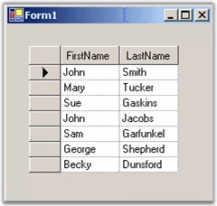

::: {style="DISPLAY: none"}
{#d2h_url_template}{#d2h_package_url style="WIDTH: 0px; DISPLAY: none; HEIGHT: 0px"}
:::

::: {.d2h_secondary_topic style="PADDING-BOTTOM: 10pt; MARGIN: 0pt; PADDING-LEFT: 0pt; PADDING-RIGHT: 0pt; PADDING-TOP: 0pt"}
##### ArrayList Class with IBindingList Support {#arraylist-class-with-ibindinglist-support style="tab-stops: 0pt"}

[]{style="FONT-FAMILY: 'Trebuchet MS','sans-serif'; COLOR: #15428b; FONT-SIZE: 9pt"} 

Any changes that you make to the grid will be posted back to the ArrayList. Keep in mind that you cannot add new items to the ArrayList through the grid. Instead, make sure that your data source supports the IBindingList interface and  that it implements an appropriate **AddNew** method. The IBindingList support determines whether you can add new items and sort items as well as do searching for other basic aspects of list behavior.

[]{style="FONT-FAMILY: 'Trebuchet MS','sans-serif'; COLOR: #15428b; FONT-SIZE: 9pt"} 

{border="0"}

Figure 207: Grid Data Bound Grid Bound to a Simple ArrayList

[]{style="FONT-FAMILY: 'Trebuchet MS','sans-serif'; COLOR: #15428b; FONT-SIZE: 9pt"} 

[]{style="FONT-FAMILY: 'Trebuchet MS','sans-serif'; COLOR: #15428b; FONT-SIZE: 9pt"} 

Here is a minimal implementation of an ArrayList-derived class that also supports IBindingList. If you add this class to the above code and in the Form-Load change the ArrayList to PersonList, then you will be able to add new entries to your underlying PersonList data source by using the AppendRow at the bottom of the grid. Notice that the implementation of **IBindingList.AddNew** as well as the **IBindingList.AllowNew** property will indicate that new rows are allowed.

 

[]{#p366} 

 

[]{#related-topics}
:::
