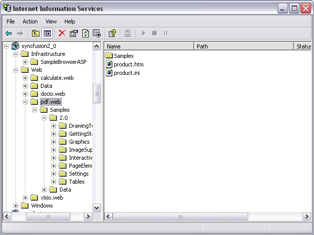

::: {style="DISPLAY: none"}
{#d2h_url_template}{#d2h_package_url style="WIDTH: 0px; DISPLAY: none; HEIGHT: 0px"}
:::

::::: {#nsbanner .d2h_main_nsbanner style="BORDER-BOTTOM: #999999 1px solid; POSITION: relative; PADDING-BOTTOM: 0px; BACKGROUND-COLOR: transparent; PADDING-LEFT: 0px; PADDING-RIGHT: 0px; DISPLAY: none; BORDER-TOP: #999999 1px solid; PADDING-TOP: 0px; LEFT: 0px"}
:::: {#TitleRow .d2h_main_titlerow style="PADDING-BOTTOM: 4px; BACKGROUND-COLOR: transparent; PADDING-LEFT: 22px; WIDTH: 100%; PADDING-RIGHT: 10px; DISPLAY: none; PADDING-TOP: 4px"}
::: {#ienav .d2h_main_ienav style="DISPLAY: none"}
{#D2HPrevious .D2HPreviousEnabled}  {#D2HNext .D2HNextEnabled}
:::
::::
:::::

::::::: {#nstext .d2h_main_nstext style="PADDING-BOTTOM: 10px; BACKGROUND-COLOR: transparent; PADDING-LEFT: 22px; PADDING-RIGHT: 10px; HEIGHT: 100%; OVERFLOW: auto; PADDING-TOP: 5px" hasuserbackground="true" valign="bottom"}
::: {#d2h_breadcrumbs .d2h_breadcrumbs}
[Essential Studio User Guide Documentation](ms-xhelp:///?Id=12457748-09e3-4d74-a240-8e049cedf030){.d2h_breadcrumbsNormal}[ \> ]{.d2h_breadcrumbsLinkSeparator}[Reporting Edition](ms-xhelp:///?Id=027aa5b6-6676-4f93-ad23-c20e8c45792e){.d2h_breadcrumbsNormal}[ \> ]{.d2h_breadcrumbsLinkSeparator}[Essential Pdf](ms-xhelp:///?Id=22756092-3da5-4797-9514-dab0617c6902){.d2h_breadcrumbsNormal}[ \> ]{.d2h_breadcrumbsLinkSeparator}[Getting Started](ms-xhelp:///?Id=c0a3e418-fc0c-4115-9643-310912a817be){.d2h_breadcrumbsNormal}[ \> ]{.d2h_breadcrumbsLinkSeparator}[Deploying Essential PDF](ms-xhelp:///?Id=e00e115b-6c6b-4eb8-977a-aca39abdb560){.d2h_breadcrumbsNormal}
:::

### ASP.NET {#asp.net style="tab-stops: 0pt"}

 

Now, you have created a ASP.NET application (refer [[Creating Platform Application]{.UGHyperlink}](ms-xhelp:///?Id=9dd5909e-f26c-47d9-bff0-6a9bd32f5b6e)). This section covers the following:

 

[·      ]{style="FONT-FAMILY: Symbol"}Deploying Essential PDF in an ASP.NET Application

[·      ]{style="FONT-FAMILY: Symbol"}Create and add a PDF document with pages to the application

[]{style="FONT-FAMILY: 'Trebuchet MS','sans-serif'; COLOR: #15428b; FONT-SIZE: 9pt"} 

Deploying Essential PDF in an ASP.NET Application

[]{style="FONT-FAMILY: 'Trebuchet MS','sans-serif'; COLOR: #15428b; FONT-SIZE: 9pt"} 

This section provides information and instructions for deploying ASP.NET applications that use Essential PDF for ASP.NET. This is in addition to the section on Deploying Essential Studio for ASP.NET (***Common\--\>Deploying Essential Studio for ASP.NET***) in the Getting Started Guide. Essential PDF ships with .NET Framework 2.0 (Visual Studio 2005) version of the C# and VB.NET samples which are installed in 2.0 directories. During installation, application directories are created in IIS for each of the C# and VB.NET samples.

[]{style="FONT-FAMILY: 'Trebuchet MS','sans-serif'; COLOR: #15428b; FONT-SIZE: 9pt"} 

{border="0"}

Figure 20: Sample Application Directories in IIS

 

The following steps will guide you to deploy Essential PDF in an ASP.NET application:

 

1.   **Marking the Application directory**-The appropriate directory, usually where the aspx files are stored, must be marked as Application in IIS.

[]{style="FONT-FAMILY: 'Trebuchet MS','sans-serif'; COLOR: #15428b; FONT-SIZE: 9pt"} 

2.   **Syncfusion Assemblies**-The Syncfusion assemblies need to be in the **bin** folder that is beside the aspx files.

[]{style="FONT-FAMILY: 'Trebuchet MS','sans-serif'; COLOR: #15428b; FONT-SIZE: 9pt"} 

::: {style="BORDER-BOTTOM: windowtext 1pt solid; BORDER-LEFT: medium none; PADDING-BOTTOM: 1pt; MARGIN-TOP: 9pt; PADDING-LEFT: 0pt; PADDING-RIGHT: 0pt; MARGIN-BOTTOM: 9pt; BORDER-TOP: windowtext 1pt solid; BORDER-RIGHT: medium none; PADDING-TOP: 1pt"}
{border="0"}Note:[ ]{style="FONT-SIZE: 8pt"} They can also be in the GAC, in which case, they should be referenced in Web.config file.
:::

[]{style="FONT-FAMILY: 'Trebuchet MS','sans-serif'; COLOR: #15428b; FONT-SIZE: 9pt"} 

+---------------------------------------------------------------------------------------------------------------------------------------------------------------------------------------------------------------------------------------------------------------------------------------------------------------------------------------------------------------------------------------------------------------------------------------------------------------------------------------------------------------------------------+
| **[\[ASPX\]]{style="FONT-FAMILY: 'Courier New'; COLOR: black"}**                                                                                                                                                                                                                                                                                                                                                                                                                                                                |
|                                                                                                                                                                                                                                                                                                                                                                                                                                                                                                                                 |
| []{style="FONT-FAMILY: 'Courier New'; COLOR: maroon"}                                                                                                                                                                                                                                                                                                                                                                                                                                                                           |
|                                                                                                                                                                                                                                                                                                                                                                                                                                                                                                                                 |
| [\<configuration]{style="FONT-FAMILY: 'Courier New'; COLOR: maroon"}[\>]{style="FONT-FAMILY: 'Courier New'; COLOR: blue"}                                                                                                                                                                                                                                                                                                                                                                                                       |
|                                                                                                                                                                                                                                                                                                                                                                                                                                                                                                                                 |
| [   ]{style="FONT-FAMILY: 'Courier New'; COLOR: black"}[\<]{style="FONT-FAMILY: 'Courier New'; COLOR: blue"}[system.web]{style="FONT-FAMILY: 'Courier New'; COLOR: maroon"}[\>]{style="FONT-FAMILY: 'Courier New'; COLOR: blue"}                                                                                                                                                                                                                                                                                                |
|                                                                                                                                                                                                                                                                                                                                                                                                                                                                                                                                 |
| [     \<]{style="FONT-FAMILY: 'Courier New'; COLOR: blue"}[compilation]{style="FONT-FAMILY: 'Courier New'; COLOR: maroon"}[\>]{style="FONT-FAMILY: 'Courier New'; COLOR: blue"}                                                                                                                                                                                                                                                                                                                                                 |
|                                                                                                                                                                                                                                                                                                                                                                                                                                                                                                                                 |
| [      \<]{style="FONT-FAMILY: 'Courier New'; COLOR: blue"}[assemblies]{style="FONT-FAMILY: 'Courier New'; COLOR: maroon"}[\>]{style="FONT-FAMILY: 'Courier New'; COLOR: blue"}                                                                                                                                                                                                                                                                                                                                                 |
|                                                                                                                                                                                                                                                                                                                                                                                                                                                                                                                                 |
| [\<]{style="FONT-FAMILY: 'Courier New'; COLOR: blue"}[add]{style="FONT-FAMILY: 'Courier New'; COLOR: maroon"}[ ]{style="FONT-FAMILY: 'Courier New'; COLOR: blue"}[assembly]{style="FONT-FAMILY: 'Courier New'; COLOR: red"}[=]{style="FONT-FAMILY: 'Courier New'; COLOR: blue"}[\"[Syncfusion.Pdf.Base, Version=x.x.x.x, Culture=neutral, PublicKeyToken=3D67ED1F87D44C89]{style="COLOR: blue"}\"[/\>\</]{style="COLOR: blue"}[assemblies]{style="COLOR: maroon"}[\>]{style="COLOR: blue"}]{style="FONT-FAMILY: 'Courier New'"} |
|                                                                                                                                                                                                                                                                                                                                                                                                                                                                                                                                 |
| [     \</]{style="FONT-FAMILY: 'Courier New'; COLOR: blue"}[compilation]{style="FONT-FAMILY: 'Courier New'; COLOR: maroon"}[\>]{style="FONT-FAMILY: 'Courier New'; COLOR: blue"}                                                                                                                                                                                                                                                                                                                                                |
|                                                                                                                                                                                                                                                                                                                                                                                                                                                                                                                                 |
| [  \...                ]{style="FONT-FAMILY: 'Courier New'; COLOR: black"}                                                                                                                                                                                                                                                                                                                                                                                                                                                      |
|                                                                                                                                                                                                                                                                                                                                                                                                                                                                                                                                 |
| [  ]{style="FONT-FAMILY: 'Courier New'; COLOR: black"}[\</]{style="FONT-FAMILY: 'Courier New'; COLOR: blue"}[system.web]{style="FONT-FAMILY: 'Courier New'; COLOR: maroon"}[\>]{style="FONT-FAMILY: 'Courier New'; COLOR: blue"}                                                                                                                                                                                                                                                                                                |
|                                                                                                                                                                                                                                                                                                                                                                                                                                                                                                                                 |
| [\</]{style="FONT-FAMILY: 'Courier New'; COLOR: blue"}[configuration]{style="FONT-FAMILY: 'Courier New'; COLOR: maroon"}[\>]{style="FONT-FAMILY: 'Courier New'; COLOR: blue"}                                                                                                                                                                                                                                                                                                                                                   |
+---------------------------------------------------------------------------------------------------------------------------------------------------------------------------------------------------------------------------------------------------------------------------------------------------------------------------------------------------------------------------------------------------------------------------------------------------------------------------------------------------------------------------------+

[]{style="FONT-FAMILY: 'Trebuchet MS','sans-serif'; COLOR: #15428b; FONT-SIZE: 9pt"} 

::: {style="BORDER-BOTTOM: windowtext 1pt solid; BORDER-LEFT: medium none; PADDING-BOTTOM: 1pt; MARGIN-TOP: 9pt; PADDING-LEFT: 0pt; PADDING-RIGHT: 0pt; MARGIN-BOTTOM: 9pt; BORDER-TOP: windowtext 1pt solid; BORDER-RIGHT: medium none; PADDING-TOP: 1pt"}
{border="0"}Note:[ ]{style="FONT-SIZE: 8pt"}The version number represented by x.x.x.x in the above code will vary depending on the version you are linking to.
:::

[]{style="FONT-FAMILY: 'Trebuchet MS','sans-serif'; COLOR: #15428b; FONT-SIZE: 9pt"} 

3.   **Data Files**-If you have .xml, .mdb, or other data files, ensure that they have sufficient security permission. Authenticated users should have full control over the files and the directories in order to give ASP.NET code, enough permissions to open the file during runtime.

[]{style="FONT-FAMILY: 'Trebuchet MS','sans-serif'; COLOR: #15428b; FONT-SIZE: 9pt"} 

Refer to the document in the following path, for step by step process of Syncfusion assemblies deployment in ASP.NET.

[]{style="FONT-FAMILY: 'Trebuchet MS','sans-serif'; COLOR: #15428b; FONT-SIZE: 9pt"} 

[[http://www.syncfusion.com/support/user/uploads/webdeployment_c883f681.pdf]{.UGHyperlink}](http://www.syncfusion.com/support/user/uploads/webdeployment_c883f681.pdf)[]{.UGHyperlink}

[]{style="FONT-FAMILY: 'Trebuchet MS','sans-serif'; COLOR: #15428b; FONT-SIZE: 9pt"} 

::: {style="BORDER-BOTTOM: windowtext 1pt solid; BORDER-LEFT: medium none; PADDING-BOTTOM: 1pt; MARGIN-TOP: 9pt; PADDING-LEFT: 0pt; PADDING-RIGHT: 0pt; MARGIN-BOTTOM: 9pt; BORDER-TOP: windowtext 1pt solid; BORDER-RIGHT: medium none; PADDING-TOP: 1pt"}
{border="0"}Note: Application with Essential PDF needs following dependent assemblies for deployment.
:::

[]{style="FONT-FAMILY: 'Trebuchet MS','sans-serif'; COLOR: #15428b; FONT-SIZE: 9pt"} 

[·      ]{style="FONT-FAMILY: Symbol"}Syncfusion.Core.dll

[·      ]{style="FONT-FAMILY: Symbol"}Syncfusion.Compression.Base.dll

[·      ]{style="FONT-FAMILY: Symbol"}Syncfusion.Pdf.Base.dll

 

Essential PDF is now deployed in your ASP.NET application.

 

Create and add a PDF document with pages to the application

 

The following code snippet will guide you to create and add PDF document to this application:

 

+-----------------------------------------------------------------------------------------------------------------------------------------------------------------------------------+
| **[\[C#\]]{style="FONT-FAMILY: 'Courier New'; COLOR: black"}**                                                                                                                    |
|                                                                                                                                                                                   |
| **[]{style="FONT-FAMILY: 'Courier New'; COLOR: black"}**                                                                                                                          |
|                                                                                                                                                                                   |
| [//Create a new document.]{style="FONT-FAMILY: 'Courier New'; COLOR: green"}                                                                                                      |
|                                                                                                                                                                                   |
| [PdfDocument doc = [new]{style="COLOR: blue"} PdfDocument();]{style="FONT-FAMILY: 'Courier New'"}                                                                                 |
|                                                                                                                                                                                   |
| []{style="FONT-FAMILY: 'Courier New'"}                                                                                                                                            |
|                                                                                                                                                                                   |
| [//Add a page]{style="FONT-FAMILY: 'Courier New'; COLOR: green"}                                                                                                                  |
|                                                                                                                                                                                   |
| [PdfPage page = doc.Pages.Add();]{style="FONT-FAMILY: 'Courier New'"}                                                                                                             |
|                                                                                                                                                                                   |
| []{style="FONT-FAMILY: 'Courier New'"}                                                                                                                                            |
|                                                                                                                                                                                   |
| [//Create Pdf graphics for the page]{style="FONT-FAMILY: 'Courier New'; COLOR: green"}                                                                                            |
|                                                                                                                                                                                   |
| [PdfGraphics g = page.Graphics;]{style="FONT-FAMILY: 'Courier New'"}                                                                                                              |
|                                                                                                                                                                                   |
| []{style="FONT-FAMILY: 'Courier New'"}                                                                                                                                            |
|                                                                                                                                                                                   |
| [//Create a solid brush]{style="FONT-FAMILY: 'Courier New'; COLOR: green"}                                                                                                        |
|                                                                                                                                                                                   |
| [PdfBrush brush = [new]{style="COLOR: blue"} PdfSolidBrush([Color]{style="COLOR: #2b91af"}.Black);]{style="FONT-FAMILY: 'Courier New'"}                                           |
|                                                                                                                                                                                   |
| []{style="FONT-FAMILY: 'Courier New'"}                                                                                                                                            |
|                                                                                                                                                                                   |
| [float]{style="FONT-FAMILY: 'Courier New'; COLOR: blue"}[ fontSize = 20f;]{style="FONT-FAMILY: 'Courier New'"}                                                                    |
|                                                                                                                                                                                   |
| []{style="FONT-FAMILY: 'Courier New'"}                                                                                                                                            |
|                                                                                                                                                                                   |
| [//Set the font]{style="FONT-FAMILY: 'Courier New'; COLOR: green"}                                                                                                                |
|                                                                                                                                                                                   |
| [PdfFont font = [new]{style="COLOR: blue"} PdfStandardFont(PdfFontFamily.Helvetica, fontSize);]{style="FONT-FAMILY: 'Courier New'"}                                               |
|                                                                                                                                                                                   |
| []{style="FONT-FAMILY: 'Courier New'"}                                                                                                                                            |
|                                                                                                                                                                                   |
| [//Draw the text]{style="FONT-FAMILY: 'Courier New'; COLOR: green"}                                                                                                               |
|                                                                                                                                                                                   |
| [g.DrawString([\"Hello world!\"]{style="COLOR: #a31515"}, font, brush, [new]{style="COLOR: blue"} [PointF]{style="COLOR: #2b91af"}(20, 20));]{style="FONT-FAMILY: 'Courier New'"} |
|                                                                                                                                                                                   |
| []{style="FONT-FAMILY: 'Courier New'"}                                                                                                                                            |
|                                                                                                                                                                                   |
| [//Stream the output to the browser. ]{style="FONT-FAMILY: 'Courier New'; COLOR: green"}                                                                                          |
|                                                                                                                                                                                   |
| [if]{style="FONT-FAMILY: 'Courier New'; COLOR: blue"}[ ([this]{style="COLOR: blue"}.CheckBox1.Checked)]{style="FONT-FAMILY: 'Courier New'"}                                       |
|                                                                                                                                                                                   |
| [{]{style="FONT-FAMILY: 'Courier New'"}                                                                                                                                           |
|                                                                                                                                                                                   |
| [    doc.Save([\"Sample.pdf\"]{style="COLOR: #a31515"}, Response, HttpReadType.Open);]{style="FONT-FAMILY: 'Courier New'"}                                                        |
|                                                                                                                                                                                   |
| [}]{style="FONT-FAMILY: 'Courier New'"}                                                                                                                                           |
|                                                                                                                                                                                   |
| [else]{style="FONT-FAMILY: 'Courier New'; COLOR: blue"}                                                                                                                           |
|                                                                                                                                                                                   |
| [{]{style="FONT-FAMILY: 'Courier New'"}                                                                                                                                           |
|                                                                                                                                                                                   |
| [    doc.Save([\"Sample.pdf\"]{style="COLOR: #a31515"}, Response, HttpReadType.Save);]{style="FONT-FAMILY: 'Courier New'"}                                                        |
|                                                                                                                                                                                   |
| [}]{style="FONT-FAMILY: 'Courier New'"}                                                                                                                                           |
+-----------------------------------------------------------------------------------------------------------------------------------------------------------------------------------+

 

The sample pdf document created through the above procedure is shown below.

 

{border="0"}

Figure 21: PDF Document with pages

***[]{style="FONT-FAMILY: 'Trebuchet MS','sans-serif'; COLOR: #15428b; FONT-SIZE: 9pt"}*** 

A PDF document is created in the ASP.NET application.

[]{#_WPF} 

 

[]{#related-topics}
:::::::
