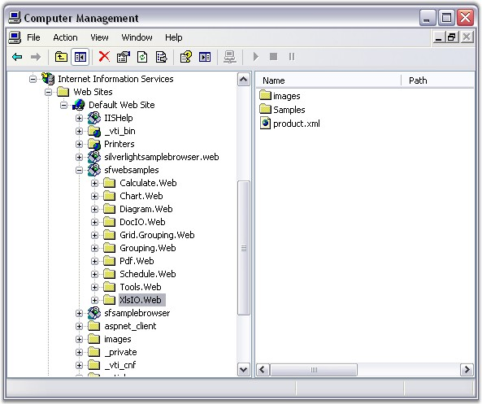

::: {style="DISPLAY: none"}
{#d2h_url_template}{#d2h_package_url style="WIDTH: 0px; DISPLAY: none; HEIGHT: 0px"}
:::

::::: {#nsbanner .d2h_main_nsbanner style="BORDER-BOTTOM: #999999 1px solid; POSITION: relative; PADDING-BOTTOM: 0px; BACKGROUND-COLOR: transparent; PADDING-LEFT: 0px; PADDING-RIGHT: 0px; DISPLAY: none; BORDER-TOP: #999999 1px solid; PADDING-TOP: 0px; LEFT: 0px"}
:::: {#TitleRow .d2h_main_titlerow style="PADDING-BOTTOM: 4px; BACKGROUND-COLOR: transparent; PADDING-LEFT: 22px; WIDTH: 100%; PADDING-RIGHT: 10px; DISPLAY: none; PADDING-TOP: 4px"}
::: {#ienav .d2h_main_ienav style="DISPLAY: none"}
{#D2HPrevious .D2HPreviousEnabled}  {#D2HNext .D2HNextEnabled}
:::
::::
:::::

:::::: {#nstext .d2h_main_nstext style="PADDING-BOTTOM: 10px; BACKGROUND-COLOR: transparent; PADDING-LEFT: 22px; PADDING-RIGHT: 10px; HEIGHT: 100%; OVERFLOW: auto; PADDING-TOP: 5px" hasuserbackground="true" valign="bottom"}
::: {#d2h_breadcrumbs .d2h_breadcrumbs}
[Essential Studio User Guide Documentation](ms-xhelp:///?Id=12457748-09e3-4d74-a240-8e049cedf030){.d2h_breadcrumbsNormal}[ \> ]{.d2h_breadcrumbsLinkSeparator}[Reporting Edition](ms-xhelp:///?Id=027aa5b6-6676-4f93-ad23-c20e8c45792e){.d2h_breadcrumbsNormal}[ \> ]{.d2h_breadcrumbsLinkSeparator}[Essential XlsIO](ms-xhelp:///?Id=b01a1b50-1d7d-40c0-bc83-af67e57c9005){.d2h_breadcrumbsNormal}[ \> ]{.d2h_breadcrumbsLinkSeparator}[Getting Started](ms-xhelp:///?Id=ad99231a-9920-49c5-b9a3-8c0224163396){.d2h_breadcrumbsNormal}[ \> ]{.d2h_breadcrumbsLinkSeparator}[Deploying Essential XlsIO](ms-xhelp:///?Id=12c8a00d-964d-4225-99ec-94a82d3c847c){.d2h_breadcrumbsNormal}
:::

### ASP.NET {#asp.net style="tab-stops: 0pt"}

 

Now, you have created a ASP.NET application (refer to [[Creating a Platform Application]{.UGHyperlink}](ms-xhelp:///?Id=e1ba450f-74e6-4ce2-9100-821f1b29c9a2)). This section covers the following:

**[]{style="BACKGROUND: red; COLOR: white"}** 

[·      ]{style="FONT-FAMILY: Symbol"}Deploying Essential XlsIO in an ASP.NET Application

[·      ]{style="FONT-FAMILY: Symbol"}Creating and adding an Excel document (with worksheets) to the Application

 

Deploying Essential XlsIO in an ASP.NET Application

 

This section provides information and instructions for deploying ASP.NET applications that use Essential XlsIO for ASP.NET. This is in addition to the section on Deploying Essential Studio for ASP.NET (**Common\--\>Deploying Essential Studio for ASP.NET**) in the Getting Started guide. Essential XlsIO ships with .NET Framework 2.0 (Visual Studio 2005) version of the C# and VB.NET samples which are installed beneath 2.0 directories. During installation, application directories are created in IIS for each of the C# and VB.NET samples.

[]{style="FONT-FAMILY: 'Trebuchet MS','sans-serif'; COLOR: #15428b; FONT-SIZE: 9pt"} 

{border="0"}

Figure 20: Sample Application Directories in IIS[]{style="FONT-FAMILY: 'Trebuchet MS','sans-serif'; COLOR: #15428b"}

 

The following steps will guide you to deploy Essential XlsIO in an ASP.NET application:

 

1\. Marking the Application Directory

 

The appropriate directory, usually where the aspx files are stored, must be marked as **Application** in **IIS**.

 

2\. Syncfusion Assemblies

 

The following Syncfusion assemblies need to be in the **bin** folder that is beside the aspx files:

 

[·      ]{style="FONT-FAMILY: Symbol"}Syncfusion.Core.dll

[·      ]{style="FONT-FAMILY: Symbol"}Syncfusion.Compression.Base.dll

[·      ]{style="FONT-FAMILY: Symbol"}Syncfusion.XlsIO.Base.dll

 

They can also be in the GAC, in which case, they should be referenced in the Web.config file, using the code as follows:

 

+-----------------------------------------------------------------------------------------------------------------------------------------------------------------------------------------------------------------------------------------------------------------------------------------------------------------------------------------------------------------------------------------------------------------------------------------------------------------------------------------------------------------------------------+
| **[\[ASPX\]]{style="FONT-FAMILY: 'Courier New'"}**                                                                                                                                                                                                                                                                                                                                                                                                                                                                                |
|                                                                                                                                                                                                                                                                                                                                                                                                                                                                                                                                   |
| **[]{style="FONT-FAMILY: 'Courier New'"}**                                                                                                                                                                                                                                                                                                                                                                                                                                                                                        |
|                                                                                                                                                                                                                                                                                                                                                                                                                                                                                                                                   |
| [\<configuration]{style="FONT-FAMILY: 'Courier New'; COLOR: maroon"}[\>]{style="FONT-FAMILY: 'Courier New'; COLOR: blue"}                                                                                                                                                                                                                                                                                                                                                                                                         |
|                                                                                                                                                                                                                                                                                                                                                                                                                                                                                                                                   |
| [   ]{style="FONT-FAMILY: 'Courier New'; COLOR: black"}[\<]{style="FONT-FAMILY: 'Courier New'; COLOR: blue"}[system.web]{style="FONT-FAMILY: 'Courier New'; COLOR: maroon"}[\>]{style="FONT-FAMILY: 'Courier New'; COLOR: blue"}                                                                                                                                                                                                                                                                                                  |
|                                                                                                                                                                                                                                                                                                                                                                                                                                                                                                                                   |
| [     \<]{style="FONT-FAMILY: 'Courier New'; COLOR: blue"}[compilation]{style="FONT-FAMILY: 'Courier New'; COLOR: maroon"}[\>]{style="FONT-FAMILY: 'Courier New'; COLOR: blue"}                                                                                                                                                                                                                                                                                                                                                   |
|                                                                                                                                                                                                                                                                                                                                                                                                                                                                                                                                   |
| [      \<]{style="FONT-FAMILY: 'Courier New'; COLOR: blue"}[assemblies]{style="FONT-FAMILY: 'Courier New'; COLOR: maroon"}[\>]{style="FONT-FAMILY: 'Courier New'; COLOR: blue"}                                                                                                                                                                                                                                                                                                                                                   |
|                                                                                                                                                                                                                                                                                                                                                                                                                                                                                                                                   |
| [\<]{style="FONT-FAMILY: 'Courier New'; COLOR: blue"}[add]{style="FONT-FAMILY: 'Courier New'; COLOR: maroon"}[ ]{style="FONT-FAMILY: 'Courier New'; COLOR: blue"}[assembly]{style="FONT-FAMILY: 'Courier New'; COLOR: red"}[=]{style="FONT-FAMILY: 'Courier New'; COLOR: blue"}[\"[Syncfusion.XlsIO.Base, Version=x.x.x.x, Culture=neutral, PublicKeyToken=3D67ED1F87D44C89]{style="COLOR: blue"}\"[/\>\</]{style="COLOR: blue"}[assemblies]{style="COLOR: maroon"}[\>]{style="COLOR: blue"}]{style="FONT-FAMILY: 'Courier New'"} |
|                                                                                                                                                                                                                                                                                                                                                                                                                                                                                                                                   |
| [     \</]{style="FONT-FAMILY: 'Courier New'; COLOR: blue"}[compilation]{style="FONT-FAMILY: 'Courier New'; COLOR: maroon"}[\>]{style="FONT-FAMILY: 'Courier New'; COLOR: blue"}                                                                                                                                                                                                                                                                                                                                                  |
|                                                                                                                                                                                                                                                                                                                                                                                                                                                                                                                                   |
| [  \...                ]{style="FONT-FAMILY: 'Courier New'; COLOR: black"}                                                                                                                                                                                                                                                                                                                                                                                                                                                        |
|                                                                                                                                                                                                                                                                                                                                                                                                                                                                                                                                   |
| [  ]{style="FONT-FAMILY: 'Courier New'; COLOR: black"}[\</]{style="FONT-FAMILY: 'Courier New'; COLOR: blue"}[system.web]{style="FONT-FAMILY: 'Courier New'; COLOR: maroon"}[\>]{style="FONT-FAMILY: 'Courier New'; COLOR: blue"}                                                                                                                                                                                                                                                                                                  |
|                                                                                                                                                                                                                                                                                                                                                                                                                                                                                                                                   |
| [\</]{style="FONT-FAMILY: 'Courier New'; COLOR: blue"}[configuration]{style="FONT-FAMILY: 'Courier New'; COLOR: maroon"}[\>]{style="FONT-FAMILY: 'Courier New'; COLOR: blue"}                                                                                                                                                                                                                                                                                                                                                     |
+-----------------------------------------------------------------------------------------------------------------------------------------------------------------------------------------------------------------------------------------------------------------------------------------------------------------------------------------------------------------------------------------------------------------------------------------------------------------------------------------------------------------------------------+

[]{style="FONT-FAMILY: 'Trebuchet MS','sans-serif'; COLOR: #15428b; FONT-SIZE: 9pt"} 

::: {style="BORDER-BOTTOM: windowtext 1pt solid; BORDER-LEFT: medium none; PADDING-BOTTOM: 1pt; MARGIN-TOP: 9pt; PADDING-LEFT: 0pt; PADDING-RIGHT: 0pt; MARGIN-BOTTOM: 9pt; BORDER-TOP: windowtext 1pt solid; BORDER-RIGHT: medium none; PADDING-TOP: 1pt"}
{border="0"}Note: X.X.X.X in the above code corresponds to the correct version number of the Essential Studio version that you are currently using.
:::

[]{style="FONT-FAMILY: 'Trebuchet MS','sans-serif'; COLOR: #15428b; FONT-SIZE: 9pt"} 

{border="0"} Please refer to the document in the following location, for step-by-step process of Syncfusion assemblies deployment in ASP.NET:

[]{style="FONT-FAMILY: 'Trebuchet MS','sans-serif'; COLOR: #15428b; FONT-SIZE: 9pt"} 

[[http://www.syncfusion.com/support/user/uploads/webdeployment_c883f681.pdf]{.UGHyperlink}](http://www.syncfusion.com/support/user/uploads/webdeployment_c883f681.pdf)[]{.UGHyperlink}

[]{style="FONT-FAMILY: 'Trebuchet MS','sans-serif'; COLOR: #15428b; FONT-SIZE: 9pt"} 

::: {style="BORDER-BOTTOM: windowtext 1pt solid; BORDER-LEFT: medium none; PADDING-BOTTOM: 1pt; MARGIN-TOP: 9pt; PADDING-LEFT: 0pt; PADDING-RIGHT: 0pt; MARGIN-BOTTOM: 9pt; BORDER-TOP: windowtext 1pt solid; BORDER-RIGHT: medium none; PADDING-TOP: 1pt"}
{border="0"}Note: 1) Application with Essential XlsIO needs the following dependent assemblies for deployment:
:::

[]{style="FONT-FAMILY: 'Trebuchet MS','sans-serif'; COLOR: #15428b; FONT-SIZE: 9pt"} 

[·      ]{style="FONT-FAMILY: Symbol"}Syncfusion.Core.dll

[·      ]{style="FONT-FAMILY: Symbol"}Syncfusion.Compression.Base.dll

[·      ]{style="FONT-FAMILY: Symbol"}Syncfusion.XlsIO.Base.dll

[]{style="FONT-FAMILY: 'Trebuchet MS','sans-serif'; COLOR: #15428b; FONT-SIZE: 9pt"} 

   2) All the assemblies should be built from the same version.

   3) Missing out Compression.Base will raise **Application Exception - TypeInitialization**.

[]{style="FONT-FAMILY: 'Trebuchet MS','sans-serif'; COLOR: #15428b; FONT-SIZE: 9pt"} 

3\. Data Files

[]{style="FONT-FAMILY: 'Trebuchet MS','sans-serif'; COLOR: #15428b; FONT-SIZE: 9pt"} 

If you have an xml, mdb, or other data files, ensure that they have sufficient security permission. Authenticated users should have full control over the files and directories, in order to give ASP.NET code, enough permission to open files at run time.

 

The following JavaScript files should be added in the ASPX page:

**[]{style="FONT-FAMILY: 'Trebuchet MS','sans-serif'; BACKGROUND: red; COLOR: white; FONT-SIZE: 9pt"}** 

[·      ]{style="FONT-FAMILY: Symbol"}jquery-1.3.2.min.js

[·      ]{style="FONT-FAMILY: Symbol"}MicrosoftAjax.js

 

The above-mentioned script files are added by using the following code:

 

+----------------------------------------------------------------------------------------------------------------------------------------------------------------------------------------------------------------------------------------------------------------------------------------------------------------------------------------------------------------------------------------------------------------------------------------------------------------------------------------------------+
| **[\[ASPX\]]{style="FONT-FAMILY: 'Courier New'; COLOR: black"}**                                                                                                                                                                                                                                                                                                                                                                                                                                   |
|                                                                                                                                                                                                                                                                                                                                                                                                                                                                                                    |
| []{style="FONT-FAMILY: 'Courier New'; COLOR: black"}                                                                                                                                                                                                                                                                                                                                                                                                                                               |
|                                                                                                                                                                                                                                                                                                                                                                                                                                                                                                    |
| [\<]{style="FONT-FAMILY: 'Courier New'; COLOR: blue"}[script]{style="FONT-FAMILY: 'Courier New'; COLOR: maroon"}[ src=\"[\<%]{style="BACKGROUND: yellow"}= Url.Content(\"\~/Scripts/jquery-1.3.2.min.js\") [%\>]{style="BACKGROUND: yellow"}\" type=\"text/javascript\"\>]{style="FONT-FAMILY: 'Courier New'; COLOR: black"}[\</]{style="FONT-FAMILY: 'Courier New'; COLOR: blue"}[script]{style="FONT-FAMILY: 'Courier New'; COLOR: maroon"}[\>]{style="FONT-FAMILY: 'Courier New'; COLOR: blue"} |
|                                                                                                                                                                                                                                                                                                                                                                                                                                                                                                    |
| [\<]{style="FONT-FAMILY: 'Courier New'; COLOR: blue"}[script]{style="FONT-FAMILY: 'Courier New'; COLOR: maroon"}[ src=\"[\<%]{style="BACKGROUND: yellow"}= Url.Content(\"\~/Scripts/MicrosoftAjax.js\") [%\>]{style="BACKGROUND: yellow"}\" type=\"text/javascript\"\>]{style="FONT-FAMILY: 'Courier New'; COLOR: black"}[\</]{style="FONT-FAMILY: 'Courier New'; COLOR: blue"}[script]{style="FONT-FAMILY: 'Courier New'; COLOR: maroon"}[\>]{style="FONT-FAMILY: 'Courier New'; COLOR: blue"}    |
+----------------------------------------------------------------------------------------------------------------------------------------------------------------------------------------------------------------------------------------------------------------------------------------------------------------------------------------------------------------------------------------------------------------------------------------------------------------------------------------------------+

 

With this step, the process of deploying XlsIO in the ASP.NET application gets completed.

 

[]{#p30}Creating and Adding an Excel Document (With Worksheets) to the Application

 

The following code snippet will guide you to create and add an Excel document to this application.

 

+-------------------------------------------------------------------------------------------------------------------------------------------------------------------------------------------------------------------------------------------------------------------------------------------------------------------------------------------------------------------------+
| **[\[C#\]]{style="FONT-FAMILY: 'Courier New'"}**                                                                                                                                                                                                                                                                                                                        |
|                                                                                                                                                                                                                                                                                                                                                                         |
| **[]{style="FONT-FAMILY: 'Courier New'"}**                                                                                                                                                                                                                                                                                                                              |
|                                                                                                                                                                                                                                                                                                                                                                         |
| [// New instance of XlsIO is created.\[Equivalent to launching MS Excel with no workbooks open\].]{style="FONT-FAMILY: 'Courier New'; COLOR: green"}                                                                                                                                                                                                                    |
|                                                                                                                                                                                                                                                                                                                                                                         |
| [// The instantiation process consists of two steps.]{style="FONT-FAMILY: 'Courier New'; COLOR: green"}                                                                                                                                                                                                                                                                 |
|                                                                                                                                                                                                                                                                                                                                                                         |
| []{style="FONT-FAMILY: 'Courier New'; COLOR: green"}                                                                                                                                                                                                                                                                                                                    |
|                                                                                                                                                                                                                                                                                                                                                                         |
| [// Step 1: Instantiate the spreadsheet creation engine.]{style="FONT-FAMILY: 'Courier New'; COLOR: green"}                                                                                                                                                                                                                                                             |
|                                                                                                                                                                                                                                                                                                                                                                         |
| [ExcelEngine]{style="FONT-FAMILY: 'Courier New'; COLOR: #2b91af"}[ excelEngine = ]{style="FONT-FAMILY: 'Courier New'; COLOR: black"}[new]{style="FONT-FAMILY: 'Courier New'; COLOR: blue"}[ ]{style="FONT-FAMILY: 'Courier New'; COLOR: black"}[ExcelEngine]{style="FONT-FAMILY: 'Courier New'; COLOR: #2b91af"}[();]{style="FONT-FAMILY: 'Courier New'; COLOR: black"} |
|                                                                                                                                                                                                                                                                                                                                                                         |
| []{style="FONT-FAMILY: 'Courier New'; COLOR: black"}                                                                                                                                                                                                                                                                                                                    |
|                                                                                                                                                                                                                                                                                                                                                                         |
| [// Step 2: Instantiate the excel application object.]{style="FONT-FAMILY: 'Courier New'; COLOR: green"}                                                                                                                                                                                                                                                                |
|                                                                                                                                                                                                                                                                                                                                                                         |
| [IApplication]{style="FONT-FAMILY: 'Courier New'; COLOR: #2b91af"}[ application = excelEngine.Excel;]{style="FONT-FAMILY: 'Courier New'; COLOR: black"}                                                                                                                                                                                                                 |
|                                                                                                                                                                                                                                                                                                                                                                         |
| []{style="FONT-FAMILY: 'Courier New'; COLOR: black"}                                                                                                                                                                                                                                                                                                                    |
|                                                                                                                                                                                                                                                                                                                                                                         |
| [// A new workbook is created.\[Equivalent to creating a new workbook in MS Excel).]{style="FONT-FAMILY: 'Courier New'; COLOR: green"}                                                                                                                                                                                                                                  |
|                                                                                                                                                                                                                                                                                                                                                                         |
| [// The new workbook will have 3 worksheets.]{style="FONT-FAMILY: 'Courier New'; COLOR: green"}                                                                                                                                                                                                                                                                         |
|                                                                                                                                                                                                                                                                                                                                                                         |
| [IWorkbook]{style="FONT-FAMILY: 'Courier New'; COLOR: #2b91af"}[ workbook = application.Workbooks.Create(3);]{style="FONT-FAMILY: 'Courier New'; COLOR: black"}                                                                                                                                                                                                         |
|                                                                                                                                                                                                                                                                                                                                                                         |
| []{style="FONT-FAMILY: 'Courier New'; COLOR: black"}                                                                                                                                                                                                                                                                                                                    |
|                                                                                                                                                                                                                                                                                                                                                                         |
| [// The first worksheet object in the worksheets collection is accessed.]{style="FONT-FAMILY: 'Courier New'; COLOR: green"}                                                                                                                                                                                                                                             |
|                                                                                                                                                                                                                                                                                                                                                                         |
| [IWorksheet]{style="FONT-FAMILY: 'Courier New'; COLOR: #2b91af"}[ sheet = workbook.Worksheets\[0\];      ]{style="FONT-FAMILY: 'Courier New'; COLOR: black"}[                  ]{style="FONT-FAMILY: 'Courier New'"}                                                                                                                                                    |
|                                                                                                                                                                                                                                                                                                                                                                         |
| [                        ]{style="FONT-FAMILY: 'Courier New'"}                                                                                                                                                                                                                                                                                                          |
|                                                                                                                                                                                                                                                                                                                                                                         |
| [// Inserting sample text into the first cell of the first worksheet.]{style="FONT-FAMILY: 'Courier New'; COLOR: green"}                                                                                                                                                                                                                                                |
|                                                                                                                                                                                                                                                                                                                                                                         |
| [sheet.Range\[]{style="FONT-FAMILY: 'Courier New'; COLOR: black"}[\"A1\"]{style="FONT-FAMILY: 'Courier New'; COLOR: #a31515"}[\].Text = ]{style="FONT-FAMILY: 'Courier New'; COLOR: black"}[\"Hello World\"]{style="FONT-FAMILY: 'Courier New'; COLOR: #a31515"}[;]{style="FONT-FAMILY: 'Courier New'; COLOR: black"}                                                   |
|                                                                                                                                                                                                                                                                                                                                                                         |
| []{style="FONT-FAMILY: 'Courier New'; COLOR: black"}                                                                                                                                                                                                                                                                                                                    |
|                                                                                                                                                                                                                                                                                                                                                                         |
| [// Saving the workbook to disk.]{style="FONT-FAMILY: 'Courier New'; COLOR: green"}                                                                                                                                                                                                                                                                                     |
|                                                                                                                                                                                                                                                                                                                                                                         |
| [workbook.SaveAs(\"Sample.xls\"]{style="FONT-FAMILY: 'Courier New'; COLOR: black"}[, [ExcelSaveType]{style="COLOR: #2b91af"}.SaveAsXLS, Response, [ExcelDownloadType]{style="COLOR: #2b91af"}.Open);]{style="FONT-FAMILY: 'Courier New'"}                                                                                                                               |
|                                                                                                                                                                                                                                                                                                                                                                         |
| []{style="FONT-FAMILY: 'Courier New'"}                                                                                                                                                                                                                                                                                                                                  |
|                                                                                                                                                                                                                                                                                                                                                                         |
| [// Closing the workbook.]{style="FONT-FAMILY: 'Courier New'; COLOR: green"}                                                                                                                                                                                                                                                                                            |
|                                                                                                                                                                                                                                                                                                                                                                         |
| [workbook.Close();]{style="FONT-FAMILY: 'Courier New'; COLOR: black"}                                                                                                                                                                                                                                                                                                   |
|                                                                                                                                                                                                                                                                                                                                                                         |
| []{style="FONT-FAMILY: 'Courier New'; COLOR: black"}                                                                                                                                                                                                                                                                                                                    |
|                                                                                                                                                                                                                                                                                                                                                                         |
| [// Dispose the Excel engine]{style="FONT-FAMILY: 'Courier New'; COLOR: green"}                                                                                                                                                                                                                                                                                         |
|                                                                                                                                                                                                                                                                                                                                                                         |
| [excelEngine.Dispose();]{style="FONT-FAMILY: 'Courier New'; COLOR: black"}                                                                                                                                                                                                                                                                                              |
+-------------------------------------------------------------------------------------------------------------------------------------------------------------------------------------------------------------------------------------------------------------------------------------------------------------------------------------------------------------------------+

 

The sample Excel document created through the above procedure is shown below.

 

{border="0"}

Figure 21: Spreadsheet created in the ASP.NET Application[]{style="FONT-FAMILY: 'Trebuchet MS','sans-serif'; COLOR: #15428b"}

[]{style="FONT-FAMILY: 'Trebuchet MS','sans-serif'; COLOR: #15428b; FONT-SIZE: 9pt"} 

[]{#p16}**[]{style="FONT-FAMILY: 'Segoe UI','sans-serif'; COLOR: black"}** 

[]{#related-topics}
::::::
