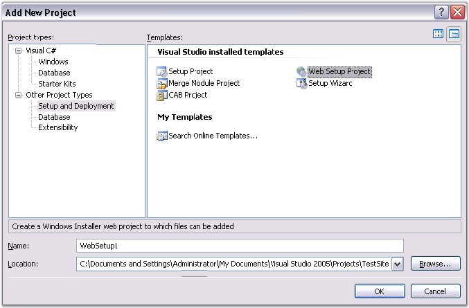
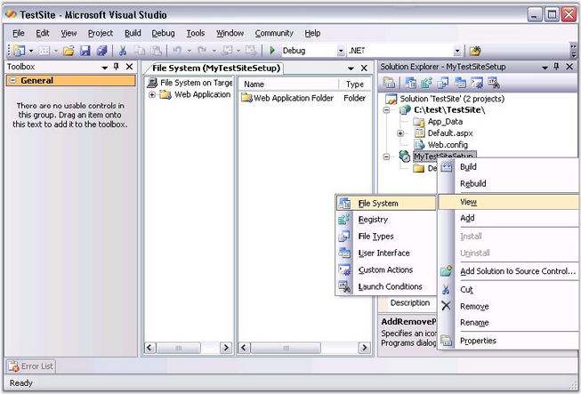
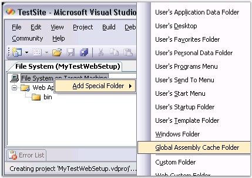
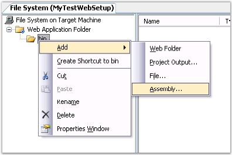
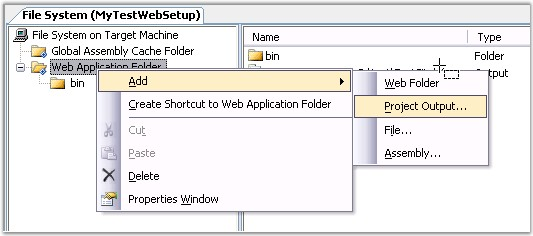

::: {style="DISPLAY: none"}
{#d2h_url_template}{#d2h_package_url style="WIDTH: 0px; DISPLAY: none; HEIGHT: 0px"}
:::

::::: {#nsbanner .d2h_main_nsbanner style="BORDER-BOTTOM: #999999 1px solid; POSITION: relative; PADDING-BOTTOM: 0px; BACKGROUND-COLOR: transparent; PADDING-LEFT: 0px; PADDING-RIGHT: 0px; DISPLAY: none; BORDER-TOP: #999999 1px solid; PADDING-TOP: 0px; LEFT: 0px"}
:::: {#TitleRow .d2h_main_titlerow style="PADDING-BOTTOM: 4px; BACKGROUND-COLOR: transparent; PADDING-LEFT: 22px; WIDTH: 100%; PADDING-RIGHT: 10px; DISPLAY: none; PADDING-TOP: 4px"}
::: {#ienav .d2h_main_ienav style="DISPLAY: none"}
{#D2HPrevious .D2HPreviousEnabled}  {#D2HNext .D2HNextEnabled}
:::
::::
:::::

:::: {#nstext .d2h_main_nstext style="PADDING-BOTTOM: 10px; BACKGROUND-COLOR: transparent; PADDING-LEFT: 22px; PADDING-RIGHT: 10px; HEIGHT: 100%; OVERFLOW: auto; PADDING-TOP: 5px" hasuserbackground="true" valign="bottom"}
::: {#d2h_breadcrumbs .d2h_breadcrumbs}
[Essential Studio User Guide Documentation](ms-xhelp:///?Id=12457748-09e3-4d74-a240-8e049cedf030){.d2h_breadcrumbsNormal}[ \> ]{.d2h_breadcrumbsLinkSeparator}[Essential Common](ms-xhelp:///?Id=2bfe10b6-fac1-4f91-a173-04db314f10c3){.d2h_breadcrumbsNormal}[ \> ]{.d2h_breadcrumbsLinkSeparator}[Installation and Deployment](ms-xhelp:///?Id=edacfc75-68a5-4518-870d-ce716c583177){.d2h_breadcrumbsNormal}[ \> ]{.d2h_breadcrumbsLinkSeparator}[Deployment](ms-xhelp:///?Id=fea9338f-870c-4078-82ab-0b74e2fcfd00){.d2h_breadcrumbsNormal}
:::

### ASP.NET Deployment Using a Setup Project {#asp.net-deployment-using-a-setup-project style="tab-stops: 0pt"}

The following are the steps to deploy the Syncfusion Assemblies along with an ASP.NET Website:

[]{style="FONT-FAMILY: 'Trebuchet MS','sans-serif'; COLOR: #15428b; FONT-SIZE: 9pt"} 

1.   In the **Solution Explorer,** right-click the Solution file and then click **Add New item -\> Add a New Project**. The **Add New Project** dialog box opens.

2.   Select **Setup and Deployment** in the **Other Project Types**.

[]{style="FONT-FAMILY: 'Trebuchet MS','sans-serif'; FONT-SIZE: 9pt"} 

{border="0"}

Figure 66: Add New Project

 

3.   Specify the name and location in the corresponding field and then click **Ok**.

4.   In that **WebSetupProject**, right-click the setup project and then click **View** **-\> File System**.

 

The **FileSystem** is the location you have to specify the files to be deployed when using this setup project in the client machine.

[]{style="FONT-FAMILY: 'Trebuchet MS','sans-serif'; COLOR: #15428b; FONT-SIZE: 9pt"} 

{border="0"}

Figure 67: File System

[]{style="FONT-FAMILY: 'Trebuchet MS','sans-serif'; FONT-SIZE: 9pt"} 

5.   In the **FileSystem**, create the GAC folder and project output folder.

[]{style="FONT-FAMILY: 'Trebuchet MS','sans-serif'; COLOR: #15428b; FONT-SIZE: 9pt"} 

{border="0"}

Figure 68: Create the GAC Folder and Project Output Folder.

[]{style="FONT-FAMILY: 'Trebuchet MS','sans-serif'; COLOR: #15428b; FONT-SIZE: 9pt"} 

 

 

[]{style="FONT-FAMILY: 'Trebuchet MS','sans-serif'; FONT-SIZE: 9pt"} 

6.   Add the assemblies to the bin folder and the GAC folder.

[]{style="FONT-FAMILY: 'Trebuchet MS','sans-serif'; COLOR: #15428b; FONT-SIZE: 9pt"} 

{border="0"}

Figure 69: Add Assemblies

[]{style="FONT-FAMILY: 'Trebuchet MS','sans-serif'"} 

{border="0"}

Figure 70: Add Project Output

[]{style="FONT-FAMILY: 'Trebuchet MS','sans-serif'"} 

7.   Build the project. You will get a **.msi** file and a **.exe** file in the output folder of the **WebSetupProject**.

 

8.   Installing the **.msi** file in the client system will install all the assemblies you need to install in the user\'s machine along with the project files to the Target machine.

 

[]{#related-topics}
::::
