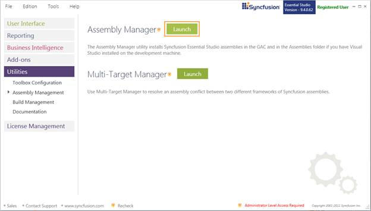
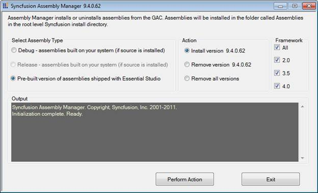
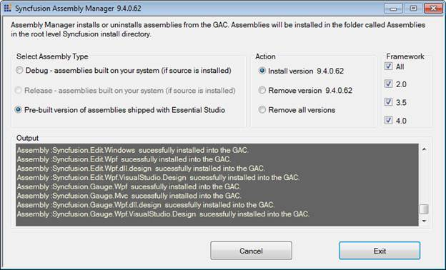
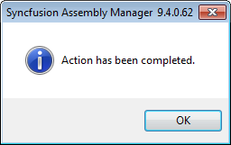
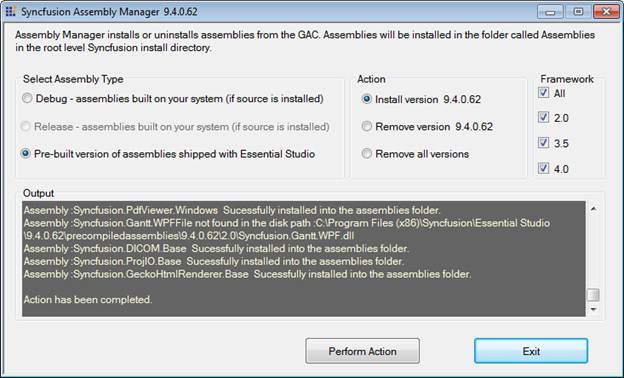

::: {style="DISPLAY: none"}
{#d2h_url_template}{#d2h_package_url style="WIDTH: 0px; DISPLAY: none; HEIGHT: 0px"}
:::

::::: {#nsbanner .d2h_main_nsbanner style="BORDER-BOTTOM: #999999 1px solid; POSITION: relative; PADDING-BOTTOM: 0px; BACKGROUND-COLOR: transparent; PADDING-LEFT: 0px; PADDING-RIGHT: 0px; DISPLAY: none; BORDER-TOP: #999999 1px solid; PADDING-TOP: 0px; LEFT: 0px"}
:::: {#TitleRow .d2h_main_titlerow style="PADDING-BOTTOM: 4px; BACKGROUND-COLOR: transparent; PADDING-LEFT: 22px; WIDTH: 100%; PADDING-RIGHT: 10px; DISPLAY: none; PADDING-TOP: 4px"}
::: {#ienav .d2h_main_ienav style="DISPLAY: none"}
{#D2HPrevious .D2HPreviousEnabled}  {#D2HNext .D2HNextEnabled}
:::
::::
:::::

::::::::::: {#nstext .d2h_main_nstext style="PADDING-BOTTOM: 10px; BACKGROUND-COLOR: transparent; PADDING-LEFT: 22px; PADDING-RIGHT: 10px; HEIGHT: 100%; OVERFLOW: auto; PADDING-TOP: 5px" hasuserbackground="true" valign="bottom"}
::: {#d2h_breadcrumbs .d2h_breadcrumbs}
[Essential Studio User Guide Documentation](ms-xhelp:///?Id=12457748-09e3-4d74-a240-8e049cedf030){.d2h_breadcrumbsNormal}[ \> ]{.d2h_breadcrumbsLinkSeparator}[Essential Common](ms-xhelp:///?Id=2bfe10b6-fac1-4f91-a173-04db314f10c3){.d2h_breadcrumbsNormal}[ \> ]{.d2h_breadcrumbsLinkSeparator}[Dashboard Utilities](ms-xhelp:///?Id=2f121e36-ec61-4721-87d7-ef6b9a6b8c4c){.d2h_breadcrumbsNormal}[ \> ]{.d2h_breadcrumbsLinkSeparator}[Assembly Management](ms-xhelp:///?Id=1d9c1c0b-9932-4f6f-bd89-c4aeafccf534){.d2h_breadcrumbsNormal}
:::

### Assembly Manager {#assembly-manager style="tab-stops: 0pt"}

Assembly Manager is used to install and uninstall the assemblies to and from the GAC and Public Assemblies folder under the installed location. It is used to install and uninstall the assemblies into the GAC.

 

Launching the Assembly Manager

[]{style="FONT-FAMILY: 'Trebuchet MS','sans-serif'; COLOR: #15428b; FONT-SIZE: 9pt"} 

The following are the steps to run the Assembly Manager:

[]{style="FONT-FAMILY: 'Trebuchet MS','sans-serif'; COLOR: #15428b; FONT-SIZE: 9pt"} 

1.   Open Syncfusion **Dashboard.**

2.   Click **Utilities \> Assembly Management**.

3.   Click **Launch** button for **Assembly Manager**.

 

{border="0"}

Figure 118: Lunch Assembly Manager

 

4.   **Syncfusion Assembly Manager x.x.x.x** window opens.

[]{style="FONT-FAMILY: 'Trebuchet MS','sans-serif'; COLOR: black; FONT-SIZE: 9pt"} 

::: {style="BORDER-BOTTOM: windowtext 1pt solid; BORDER-LEFT: medium none; PADDING-BOTTOM: 1pt; MARGIN-TOP: 9pt; PADDING-LEFT: 0pt; PADDING-RIGHT: 0pt; MARGIN-BOTTOM: 9pt; BORDER-TOP: windowtext 1pt solid; BORDER-RIGHT: medium none; PADDING-TOP: 1pt"}
{border="0"}Note: You can also open the Assembly Manager from the following location:

{Installed location}\\Syncfusion\\Essential Studio\\x.x.x.x\\Utilities\\Assembly Manager\\AssemblyManagerWindows.exe
:::

**** 

{border="0"}

Figure 119: Syncfusion Essential Studio Assembly Manager

 

5.  Select the required option for **Select Assembly Type** sections.

 

Select Assembly Type

[]{style="FONT-FAMILY: 'Trebuchet MS','sans-serif'; COLOR: #15428b; FONT-SIZE: 9pt"} 

[·      ]{style="FONT-FAMILY: Symbol; FONT-WEIGHT: normal"}Pre-built Assemblies

These are the assemblies shipped with Essential Studio.  Selecting this mode will trigger the Assembly Manager to install the Pre-built Assemblies.

 

[·      ]{style="FONT-FAMILY: Symbol; FONT-WEIGHT: normal"}Debug and Release Assemblies

Debug or Release mode, will trigger the Assembly Manager to install custom versions built from the source code using [[Build Manager]{.UGHyperlink}](ms-xhelp:///?Id=69a3ad9d-15da-416d-ab28-b7fa302757d4). These assemblies can be used only when the source code for at least one of the Essential Studio products has been installed. This will trigger the Assembly Manager to install custom versions built from source code, installed on your machine (Applies only to versions of the product that comes with the source code).

::: {style="BORDER-BOTTOM: windowtext 1pt solid; BORDER-LEFT: medium none; PADDING-BOTTOM: 1pt; MARGIN-TOP: 9pt; PADDING-LEFT: 0pt; PADDING-RIGHT: 0pt; MARGIN-BOTTOM: 9pt; BORDER-TOP: windowtext 1pt solid; BORDER-RIGHT: medium none; PADDING-TOP: 1pt"}
[{border="0"}]{style="COLOR: black"}Note:[ ]{style="COLOR: black"}The[ ]{style="COLOR: black"}Build Manager application has to be run to build debug or release versions of the assemblies before the Assembly Manager can install the custom built assemblies.  
:::

6.  Select the required option for **Action** sections.

 

Action

 

The Assembly Manager can perform install or uninstall assemblies. To perform this action select the Install version x.x.x.x or remove version x.x.x.x radio button. To remove all select the **Remove All Versions** radio button.

::: {style="BORDER-BOTTOM: windowtext 1pt solid; BORDER-LEFT: medium none; PADDING-BOTTOM: 1pt; MARGIN-TOP: 9pt; PADDING-LEFT: 0pt; PADDING-RIGHT: 0pt; MARGIN-BOTTOM: 9pt; BORDER-TOP: windowtext 1pt solid; BORDER-RIGHT: medium none; PADDING-TOP: 1pt"}
{border="0"}Note: Remove All Versions must be used with caution in scenarios when one has applications depending on certain versions of the Syncfusion assemblies installed in the GAC. They may cease to function.
:::

7.  Select the required option for **Framework** sections.

 

Framework

The Framework group box comprises the checkboxes for the .NET framework versions based on the Visual Studio SDK installed in the machine. The following checkboxes are available:

[·      ]{style="FONT-FAMILY: Symbol"}**4.0** - Selecting 4.0 ensures installation of 4.0 assemblies into the GAC and assemblies folder. In cases where only Visual Studio 2010 SDK is installed, the 4.0 assemblies have to be deployed.

[·      ]{style="FONT-FAMILY: Symbol"}**3.5** - Selecting 3.5 ensures installation of 3.5 assemblies into the GAC and assemblies folder. In cases where only Visual Studio 2008 SDK is installed, the 3.5, 2.0 assemblies can be deployed.

[·      ]{style="FONT-FAMILY: Symbol"}**2.0** - Selecting 2.0 ensures installation of 2.0 assemblies into the GAC and assemblies folder. In cases where only Visual Studio 2005 SDK is installed, the 2.0 assemblies have to be deployed.

[·      ]{style="FONT-FAMILY: Symbol"}**All** -- Selecting All ensures installation of all frameworks (frameworks installed in the machine) assemblies into the GAC and assemblies folder.

 

::: {style="BORDER-BOTTOM: windowtext 1pt solid; BORDER-LEFT: medium none; PADDING-BOTTOM: 1pt; MARGIN-TOP: 9pt; PADDING-LEFT: 0pt; PADDING-RIGHT: 0pt; MARGIN-BOTTOM: 9pt; BORDER-TOP: windowtext 1pt solid; BORDER-RIGHT: medium none; PADDING-TOP: 1pt"}
[{border="0"}]{style="FONT-SIZE: 12pt"}Note: By default 2.0 is enabled in a system where Visual Studio 2008 SDK is installed.
:::

 

8.  Click **Perform Action**. It will start processing.

 

{border="0"}

Figure 120: Log in Output Field

 

9.   Once the action is completed, a confirmation popup will open.

**[]{style="FONT-FAMILY: 'Trebuchet MS','sans-serif'; COLOR: #15428b"}** 

{border="0"}

Figure 121: Syncfusion Assembly Manager Dialog Box**[]{style="FONT-FAMILY: 'Trebuchet MS','sans-serif'; COLOR: #15428b"}**

**[]{style="FONT-FAMILY: 'Trebuchet MS','sans-serif'; COLOR: #15428b"}** 

[10. ]{style="FONT-FAMILY: 'Trebuchet MS','sans-serif'"}Click **OK[. ]{style="FONT-FAMILY: 'Trebuchet MS','sans-serif'; COLOR: #15428b"}**

**[]{style="FONT-FAMILY: 'Trebuchet MS','sans-serif'; COLOR: #15428b"}** 

{border="0"}

Figure 122: Action Completed**[]{style="FONT-FAMILY: 'Trebuchet MS','sans-serif'; COLOR: #15428b"}**

**[]{style="FONT-FAMILY: 'Trebuchet MS','sans-serif'; COLOR: #15428b"}** 

**[]{style="FONT-FAMILY: 'Trebuchet MS','sans-serif'; COLOR: #15428b"}** 

{border="0"}[    ]{style="FONT-WEIGHT: normal"}Important Note

[]{style="FONT-FAMILY: 'Trebuchet MS','sans-serif'; COLOR: #15428b; FONT-SIZE: 9pt"} 

In earlier versions, the Assembly Manager also served as a build manager to build custom versions of the Syncfusion Assemblies. Now, this function has been moved to a separate Build Manager utility. Installation of assemblies to the Visual Studio.NET toolbox is now handled by a separate utility called the[ ]{style="COLOR: black"}ToolboxInstaller. The new Assembly Manager just handles installation of assemblies to the GAC and the assemblies folder (The Assemblies folder is applicable only if Visual Studio.NET is installed).

 

In previous versions, the Assembly Manager allowed switching to any version of the Syncfusion assemblies installed on the system. This causes compatibility issues and also restricts the overall structure of the utility. From the current version, to switch to another version, you will have to run the **Assembly Manager** of the respective version.**[ ]{style="FONT-FAMILY: 'Verdana','sans-serif'; COLOR: black; FONT-SIZE: 8pt"}**It would be preferable to have the Assembly Manager do a **Remove All** operation before it installs the latest assemblies.

 

The console version of the Assembly Manager will run at the end of the install process to add the default pre-built version of the Syncfusion assemblies to the Global Assembly Cache (GAC) and the Visual Studio .NET Public Assemblies folders (if applicable). The need to run the Assembly manager arises only when changes have been made to the GAC or when custom versions have been built for controls for debugging purposes.

::: {style="BORDER-BOTTOM: windowtext 1pt solid; BORDER-LEFT: medium none; PADDING-BOTTOM: 1pt; MARGIN-TOP: 9pt; PADDING-LEFT: 0pt; PADDING-RIGHT: 0pt; MARGIN-BOTTOM: 9pt; BORDER-TOP: windowtext 1pt solid; BORDER-RIGHT: medium none; PADDING-TOP: 1pt"}
{border="0"}Note: The version number in the tags has to be changed to the version you are linking to.
:::

Syncfusion Assemblies

[]{style="FONT-FAMILY: 'Trebuchet MS','sans-serif'; COLOR: #15428b; FONT-SIZE: 9pt"} 

The Syncfusion assemblies are installed in the following two locations:

[]{style="FONT-FAMILY: 'Trebuchet MS','sans-serif'; COLOR: #15428b; FONT-SIZE: 9pt"} 

[·      ]{style="FONT-FAMILY: Symbol"}Assemblies folder

[·      ]{style="FONT-FAMILY: Symbol"}Global Assembly Cache (GAC)

 

The Assemblies folder

11.  In the **Assemblies** folder, the assemblies will be available in the following installation path:

[]{style="FONT-FAMILY: 'Trebuchet MS','sans-serif'; COLOR: #15428b; FONT-SIZE: 9pt"} 

***\[System Drive\]:\\Program Files\\Syncfusion\\Essential Studio\\x.x.x.x\\Assemblies***

[]{style="FONT-FAMILY: 'Trebuchet MS','sans-serif'; COLOR: #15428b; FONT-SIZE: 9pt"} 

::: {style="BORDER-BOTTOM: windowtext 1pt solid; BORDER-LEFT: medium none; PADDING-BOTTOM: 1pt; MARGIN-TOP: 9pt; PADDING-LEFT: 0pt; PADDING-RIGHT: 0pt; MARGIN-BOTTOM: 9pt; BORDER-TOP: windowtext 1pt solid; BORDER-RIGHT: medium none; PADDING-TOP: 1pt"}
{border="0"}Note:
:::

::: {style="BORDER-BOTTOM: windowtext 1pt solid; BORDER-LEFT: medium none; PADDING-BOTTOM: 1pt; MARGIN: 9pt 0pt 9pt 18pt; PADDING-LEFT: 0pt; PADDING-RIGHT: 0pt; BORDER-TOP: windowtext 1pt solid; BORDER-RIGHT: medium none; PADDING-TOP: 1pt"}
***[·    ]{style="FONT-FAMILY: Symbol"}***The sub-folder 3.5 is used with .NET 3.5 and the sub-folder 2.0 is used with .NET 2.0. In most cases, \[System Drive\]:\\ is C:\\.

***[·    ]{style="FONT-FAMILY: Symbol"}***In 2.0 and 3.5 GAC, the assemblies will be available in the installation path \[System Drive\]:\\WINDOWS\\assembly.

***[·    ]{style="FONT-FAMILY: Symbol"}***In 4.0 GAC, the assemblies will be available in the installation path \[System Drive\]:\\WINDOWS\\ Microsoft.NET\\assembly\\GAC_MSIL.
:::

 

[]{style="FONT-FAMILY: 'Trebuchet MS','sans-serif'; COLOR: #15428b; FONT-SIZE: 9pt"} 

Essential Studio ships the pre-built 2.0, 3.5 and 4.0 .NET Framework versions of the Syncfusion assemblies. These assemblies are located in the **PreCompiledAssemblies** folder.

[         ]{style="FONT-FAMILY: 'Trebuchet MS','sans-serif'; COLOR: #15428b; FONT-SIZE: 9pt"}

***\[System Drive\]:\\Program Files\\Syncfusion\\Essential Studio\\x.x.x.x\\PreCompiledAssemblies\\x.x.x.x\\2.0***

[]{style="FONT-FAMILY: 'Trebuchet MS','sans-serif'; COLOR: #15428b; FONT-SIZE: 9pt"} 

If you work with multiple target environments, you will see that each appropriate version is installed in the GAC for true side-by-side use.

Working with Syncfusion assemblies that have been built and tested with specific .NET Framework versions greatly increases the overall reliability. It also allows Syncfusion controls to take advantage of features that may be available in specific environments. For instance .NET 2.0 variants of the control offer features specific to the .NET 2.0 environment.

 

[]{#related-topics}
:::::::::::
