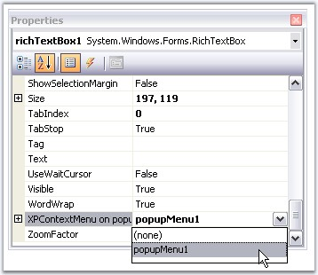
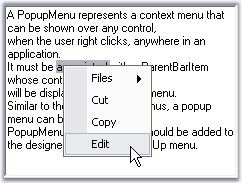

::: {style="DISPLAY: none"}
{#d2h_url_template}{#d2h_package_url style="WIDTH: 0px; DISPLAY: none; HEIGHT: 0px"}
:::

::::: {.d2h_secondary_topic style="PADDING-BOTTOM: 10pt; MARGIN: 0pt; PADDING-LEFT: 0pt; PADDING-RIGHT: 0pt; PADDING-TOP: 0pt"}
##### Associating Popup Menu to a Control {#associating-popup-menu-to-a-control style="tab-stops: 0pt"}

In the previous topic, we saw [how to ]{.UGHyperlink}[add and fill a popup menu]{.UGHyperlink} with menu items. This section will guide you on how to associate a popup menu to a control like RichTextBox (in this example), through designer without a single piece of code.

[]{style="COLOR: #15428b"} 

Drag and Drop a **PopupMenusManager** control onto the form. Also add a RichTextBox control. When PopupMenusManager class is dragged onto the design surface, it will provide an extended property, **XPContextMenu on popupMenusManager1** for all the controls in the form, letting the users to easily associate a popup menu with a control.

[]{style="COLOR: #15428b"} 

{border="0"}

[]{style="COLOR: #15428b"} 

Figure 816: Associating PopupMenu with RichTextBox Control

[]{style="COLOR: #15428b"} 

::: {style="BORDER-BOTTOM: windowtext 1pt solid; BORDER-LEFT: medium none; PADDING-BOTTOM: 1pt; MARGIN-TOP: 9pt; PADDING-LEFT: 0pt; PADDING-RIGHT: 0pt; MARGIN-BOTTOM: 9pt; BORDER-TOP: windowtext 1pt solid; BORDER-RIGHT: medium none; PADDING-TOP: 1pt"}
{border="0"} Note:[ ]{style="COLOR: black; FONT-SIZE: 8pt"}A single PopupMenu can be associated with multiple controls.
:::

[]{style="COLOR: #15428b"} 

+--------------------------------------------------------------------------------------------------------------------------------------------------------------------------------------------------------------------------------------------------------------------------------------------------------------------------------------------------------------------------------------------------------------------------------------------------------------------------------------------------------------+
| **[\[C#\]]{style="FONT-FAMILY: 'Courier New'; COLOR: black"}**                                                                                                                                                                                                                                                                                                                                                                                                                                               |
|                                                                                                                                                                                                                                                                                                                                                                                                                                                                                                              |
| **[]{style="COLOR: #15428b"}**                                                                                                                                                                                                                                                                                                                                                                                                                                                                               |
|                                                                                                                                                                                                                                                                                                                                                                                                                                                                                                              |
| [// Create and initialize a ParentBarItem.]{style="FONT-FAMILY: 'Courier New'; COLOR: green"}                                                                                                                                                                                                                                                                                                                                                                                                                |
|                                                                                                                                                                                                                                                                                                                                                                                                                                                                                                              |
| [this]{style="FONT-FAMILY: 'Courier New'; COLOR: blue"}[.editBarItem = ]{style="FONT-FAMILY: 'Courier New'; COLOR: black"}[new]{style="FONT-FAMILY: 'Courier New'; COLOR: blue"}[ Syncfusion.Windows.Forms.Tools.ParentBarItem();]{style="FONT-FAMILY: 'Courier New'; COLOR: black"}                                                                                                                                                                                                                         |
|                                                                                                                                                                                                                                                                                                                                                                                                                                                                                                              |
| [this]{style="FONT-FAMILY: 'Courier New'; COLOR: blue"}[.editBarItem.Text = \"&Edit\";]{style="FONT-FAMILY: 'Courier New'; COLOR: black"}                                                                                                                                                                                                                                                                                                                                                                    |
|                                                                                                                                                                                                                                                                                                                                                                                                                                                                                                              |
| [this]{style="FONT-FAMILY: 'Courier New'; COLOR: blue"}[.editBarItem.Items.AddRange(]{style="FONT-FAMILY: 'Courier New'; COLOR: black"}[new]{style="FONT-FAMILY: 'Courier New'; COLOR: blue"}[ BarItem\[\] { ]{style="FONT-FAMILY: 'Courier New'; COLOR: black"}[this]{style="FONT-FAMILY: 'Courier New'; COLOR: blue"}[.cutItem, ]{style="FONT-FAMILY: 'Courier New'; COLOR: black"}[this]{style="FONT-FAMILY: 'Courier New'; COLOR: blue"}[.copyItem});]{style="FONT-FAMILY: 'Courier New'; COLOR: black"} |
|                                                                                                                                                                                                                                                                                                                                                                                                                                                                                                              |
| []{style="FONT-FAMILY: 'Courier New'; COLOR: black"}                                                                                                                                                                                                                                                                                                                                                                                                                                                         |
|                                                                                                                                                                                                                                                                                                                                                                                                                                                                                                              |
| [// Associate the ParentBarItem with the PopupMenu.]{style="FONT-FAMILY: 'Courier New'; COLOR: green"}                                                                                                                                                                                                                                                                                                                                                                                                       |
|                                                                                                                                                                                                                                                                                                                                                                                                                                                                                                              |
| [this]{style="FONT-FAMILY: 'Courier New'; COLOR: blue"}[.popupMenu1 = ]{style="FONT-FAMILY: 'Courier New'; COLOR: black"}[new]{style="FONT-FAMILY: 'Courier New'; COLOR: blue"}[ Syncfusion.Windows.Forms.Tools.PopupMenu();]{style="FONT-FAMILY: 'Courier New'; COLOR: black"}                                                                                                                                                                                                                              |
|                                                                                                                                                                                                                                                                                                                                                                                                                                                                                                              |
| [this]{style="FONT-FAMILY: 'Courier New'; COLOR: blue"}[.popupMenu1.ParentBarItem = ]{style="FONT-FAMILY: 'Courier New'; COLOR: black"}[this]{style="FONT-FAMILY: 'Courier New'; COLOR: blue"}[.editBarItem;]{style="FONT-FAMILY: 'Courier New'; COLOR: black"}                                                                                                                                                                                                                                              |
|                                                                                                                                                                                                                                                                                                                                                                                                                                                                                                              |
| []{style="FONT-FAMILY: 'Courier New'; COLOR: black"}                                                                                                                                                                                                                                                                                                                                                                                                                                                         |
|                                                                                                                                                                                                                                                                                                                                                                                                                                                                                                              |
| [// Then associate it with a RichTextBox.]{style="FONT-FAMILY: 'Courier New'; COLOR: green"}                                                                                                                                                                                                                                                                                                                                                                                                                 |
|                                                                                                                                                                                                                                                                                                                                                                                                                                                                                                              |
| [this]{style="FONT-FAMILY: 'Courier New'; COLOR: blue"}[.popupMenusManager = ]{style="FONT-FAMILY: 'Courier New'; COLOR: black"}[new]{style="FONT-FAMILY: 'Courier New'; COLOR: blue"}[ PopupMenusManager();]{style="FONT-FAMILY: 'Courier New'; COLOR: black"}                                                                                                                                                                                                                                              |
|                                                                                                                                                                                                                                                                                                                                                                                                                                                                                                              |
| [this]{style="FONT-FAMILY: 'Courier New'; COLOR: blue"}[.popupMenusManager.SetXPContextMenu(]{style="FONT-FAMILY: 'Courier New'; COLOR: black"}[this]{style="FONT-FAMILY: 'Courier New'; COLOR: blue"}[.richTextBox1, ]{style="FONT-FAMILY: 'Courier New'; COLOR: black"}[this]{style="FONT-FAMILY: 'Courier New'; COLOR: blue"}[.popupMenu1);]{style="FONT-FAMILY: 'Courier New'; COLOR: black"}                                                                                                            |
+--------------------------------------------------------------------------------------------------------------------------------------------------------------------------------------------------------------------------------------------------------------------------------------------------------------------------------------------------------------------------------------------------------------------------------------------------------------------------------------------------------------+

[]{style="COLOR: #15428b"} 

+-------------------------------------------------------------------------------------------------------------------------------------------------------------------------------------------------------------------------------------------------------------------------------------------------------------------------------------------------------------------------------------------------------------------------------------------------------------------------------------------------+
| **[\[VB.NET\]]{style="FONT-FAMILY: 'Courier New'; COLOR: black"}**                                                                                                                                                                                                                                                                                                                                                                                                                              |
|                                                                                                                                                                                                                                                                                                                                                                                                                                                                                                 |
| **[]{style="COLOR: #15428b"}**                                                                                                                                                                                                                                                                                                                                                                                                                                                                  |
|                                                                                                                                                                                                                                                                                                                                                                                                                                                                                                 |
| [\' Create and initialize a ParentBarItem.]{style="FONT-FAMILY: 'Courier New'; COLOR: green"}                                                                                                                                                                                                                                                                                                                                                                                                   |
|                                                                                                                                                                                                                                                                                                                                                                                                                                                                                                 |
| [Me]{style="FONT-FAMILY: 'Courier New'; COLOR: blue"}[.editBarItem = ]{style="FONT-FAMILY: 'Courier New'; COLOR: black"}[New]{style="FONT-FAMILY: 'Courier New'; COLOR: blue"}[ Syncfusion.Windows.Forms.Tools.ParentBarItem()]{style="FONT-FAMILY: 'Courier New'; COLOR: black"}                                                                                                                                                                                                               |
|                                                                                                                                                                                                                                                                                                                                                                                                                                                                                                 |
| [Me]{style="FONT-FAMILY: 'Courier New'; COLOR: blue"}[.editMenu.Text = \"&Edit\"]{style="FONT-FAMILY: 'Courier New'; COLOR: black"}                                                                                                                                                                                                                                                                                                                                                             |
|                                                                                                                                                                                                                                                                                                                                                                                                                                                                                                 |
| [Me]{style="FONT-FAMILY: 'Courier New'; COLOR: blue"}[.editMenu.Items.AddRange(]{style="FONT-FAMILY: 'Courier New'; COLOR: black"}[New]{style="FONT-FAMILY: 'Courier New'; COLOR: blue"}[ BarItem() {]{style="FONT-FAMILY: 'Courier New'; COLOR: black"}[Me]{style="FONT-FAMILY: 'Courier New'; COLOR: blue"}[.cutItem, ]{style="FONT-FAMILY: 'Courier New'; COLOR: black"}[Me]{style="FONT-FAMILY: 'Courier New'; COLOR: blue"}[.copyItem})]{style="FONT-FAMILY: 'Courier New'; COLOR: black"} |
|                                                                                                                                                                                                                                                                                                                                                                                                                                                                                                 |
| []{style="FONT-FAMILY: 'Courier New'; COLOR: black"}                                                                                                                                                                                                                                                                                                                                                                                                                                            |
|                                                                                                                                                                                                                                                                                                                                                                                                                                                                                                 |
| [\' Associate the ParentBarItem with the PopupMenu.]{style="FONT-FAMILY: 'Courier New'; COLOR: green"}                                                                                                                                                                                                                                                                                                                                                                                          |
|                                                                                                                                                                                                                                                                                                                                                                                                                                                                                                 |
| [Me]{style="FONT-FAMILY: 'Courier New'; COLOR: blue"}[.popupMenu1 = ]{style="FONT-FAMILY: 'Courier New'; COLOR: black"}[New]{style="FONT-FAMILY: 'Courier New'; COLOR: blue"}[ Syncfusion.Windows.Forms.Tools.PopupMenu()]{style="FONT-FAMILY: 'Courier New'; COLOR: black"}                                                                                                                                                                                                                    |
|                                                                                                                                                                                                                                                                                                                                                                                                                                                                                                 |
| [Me]{style="FONT-FAMILY: 'Courier New'; COLOR: blue"}[.popupMenu1.ParentBarItem = ]{style="FONT-FAMILY: 'Courier New'; COLOR: black"}[Me]{style="FONT-FAMILY: 'Courier New'; COLOR: blue"}[.editBarItem]{style="FONT-FAMILY: 'Courier New'; COLOR: black"}                                                                                                                                                                                                                                      |
|                                                                                                                                                                                                                                                                                                                                                                                                                                                                                                 |
| []{style="FONT-FAMILY: 'Courier New'; COLOR: black"}                                                                                                                                                                                                                                                                                                                                                                                                                                            |
|                                                                                                                                                                                                                                                                                                                                                                                                                                                                                                 |
| [\' Then associate it with a RichTextBox.]{style="FONT-FAMILY: 'Courier New'; COLOR: green"}                                                                                                                                                                                                                                                                                                                                                                                                    |
|                                                                                                                                                                                                                                                                                                                                                                                                                                                                                                 |
| [Me]{style="FONT-FAMILY: 'Courier New'; COLOR: blue"}[.popupMenusManager =]{style="FONT-FAMILY: 'Courier New'; COLOR: black"}[ New]{style="FONT-FAMILY: 'Courier New'; COLOR: blue"}[ PopupMenusManager()]{style="FONT-FAMILY: 'Courier New'; COLOR: black"}                                                                                                                                                                                                                                    |
|                                                                                                                                                                                                                                                                                                                                                                                                                                                                                                 |
| [Me]{style="FONT-FAMILY: 'Courier New'; COLOR: blue"}[.popupMenusManager.SetXPContextMenu(]{style="FONT-FAMILY: 'Courier New'; COLOR: black"}[Me]{style="FONT-FAMILY: 'Courier New'; COLOR: blue"}[.richTextBox1, ]{style="FONT-FAMILY: 'Courier New'; COLOR: black"}[Me]{style="FONT-FAMILY: 'Courier New'; COLOR: blue"}[.popupMenu1)]{style="FONT-FAMILY: 'Courier New'; COLOR: black"}                                                                                                      |
+-------------------------------------------------------------------------------------------------------------------------------------------------------------------------------------------------------------------------------------------------------------------------------------------------------------------------------------------------------------------------------------------------------------------------------------------------------------------------------------------------+

[]{style="COLOR: #15428b"} 

{border="0"}

[]{style="COLOR: #15428b"} 

Figure 817: A PopupMenu Item added Programmatically

**[]{style="COLOR: #15428b"}** 

::: {style="BORDER-BOTTOM: windowtext 1pt solid; BORDER-LEFT: medium none; PADDING-BOTTOM: 1pt; MARGIN-TOP: 9pt; PADDING-LEFT: 0pt; PADDING-RIGHT: 0pt; MARGIN-BOTTOM: 9pt; BORDER-TOP: windowtext 1pt solid; BORDER-RIGHT: medium none; PADDING-TOP: 1pt"}
{border="0"} Note: We can even show the popup menu without implementing the PopupMenusManager class by calling PopupMenu.Show method. Click [here]{style="COLOR: black"} for more details.
:::

[]{style="COLOR: #15428b"} 

See Also

[]{style="COLOR: black"} 

[[·      ]{style="FONT-FAMILY: Symbol; TEXT-DECORATION: none; text-underline: none"}]{.UGHyperlink}[Adding and filling a popup menu]{.UGHyperlink}[]{.UGHyperlink}

[[·      ]{style="FONT-FAMILY: Symbol; TEXT-DECORATION: none; text-underline: none"}]{.UGHyperlink}[Grouping Items in a Popup Menu]{.UGHyperlink}[]{.UGHyperlink}

[[·      ]{style="FONT-FAMILY: Symbol; TEXT-DECORATION: none; text-underline: none"}]{.UGHyperlink}[How to programmatically show a Popup Menu]{.UGHyperlink}[]{.UGHyperlink}

[]{#related-topics}
:::::
