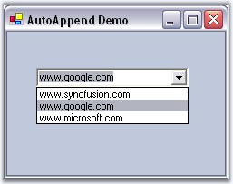
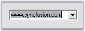

::: {style="DISPLAY: none"}
{#d2h_url_template}{#d2h_package_url style="WIDTH: 0px; DISPLAY: none; HEIGHT: 0px"}
:::

:::: {.d2h_secondary_topic style="PADDING-BOTTOM: 10pt; MARGIN: 0pt; PADDING-LEFT: 0pt; PADDING-RIGHT: 0pt; PADDING-TOP: 0pt"}
##### AutoAppend {#autoappend style="tab-stops: 0pt"}

[]{style="COLOR: #15428b"} 

**Combo box controls** are commonly used to select from a particular value from a list of items. In several instances, the developer is not aware of the contents of the combo box before the application is being used.

 

For instance, in an FTP client application, if the user is allowed to enter the FTP address of the servers in a combo box, it is not possible to provide a complete list of all possible FTP servers. When the user enters a FTP server into a combo box, the value is lost unless the developer writes additional code to persist the user entries in the registry or in a file. Also, at initialization, the combo box should be reinitialized with the saved items from the registry or file into which the values were saved.

 

The **AutoAppend** class provides auto persisting of previously entered items in a Windows Forms combo box based on a category keyword and also populates the combo box control\'s items collection with the persisted list.

 

The AutoAppend class provides this service for any combo box control without the developer having to write any code for the persisting and reading of the values.

 

The following screen shot illustrates the usage of the AutoAppend class to persist items previously entered in a combo box and add them to the items collection of the combo box.

**[]{style="COLOR: #15428b"}** 

{border="0"}

Figure 144: AutoAppend functionality at RunTime

**[]{style="COLOR: #15428b"}** 

 

###### []{#p203}3.3.1.2.4.1 Features {#features style="tab-stops: 0pt"}

 

AutoAppend provides an auto persisting of previously entered items in a Windows Forms combo box based on a category keyword and also populates the combo box control\'s items collection with the persisted list. It has following features.

[]{style="COLOR: #15428b"} 

[·      ]{style="FONT-FAMILY: Symbol"}New entries can be added to control\'s AutoAppend list programmatically.

[[·      ]{style="FONT-FAMILY: Symbol; COLOR: windowtext; TEXT-DECORATION: none; text-underline: none"}]{.MsoHyperlink}It can be used with AutoComplete control.[[]{style="COLOR: windowtext; TEXT-DECORATION: none; text-underline: none"}]{.MsoHyperlink}

 

###### []{#p204}[]{#_Associating_AutoAppend_with}3.3.1.2.4.2 Associating AutoAppend with a control {#associating-autoappend-with-a-control style="tab-stops: 0pt"}

[]{style="COLOR: #15428b"} 

We can associate AutoAppend class to a ComboBox control by following the below steps.

[]{style="COLOR: #15428b"} 

1.   Open a Visual Studio project and include the required namespace.

[]{style="COLOR: #15428b"} 

+----------------------------------------------------------------------------------------------------------------------------------------------+
| **[\[C#\]]{style="FONT-FAMILY: 'Courier New'; COLOR: black"}**                                                                               |
|                                                                                                                                              |
| []{style="FONT-FAMILY: 'Courier New'; COLOR: black"}                                                                                         |
|                                                                                                                                              |
| [using]{style="FONT-FAMILY: 'Courier New'; COLOR: blue"}[ Syncfusion.Windows.Forms.Tools;]{style="FONT-FAMILY: 'Courier New'; COLOR: black"} |
+----------------------------------------------------------------------------------------------------------------------------------------------+

[]{style="COLOR: #15428b"} 

+---------------------------------------------------------------------------------------------------------------------------------+
| **[\[VB.NET\]]{style="FONT-FAMILY: 'Courier New'; COLOR: black"}**                                                              |
|                                                                                                                                 |
| []{style="COLOR: #15428b"}                                                                                                      |
|                                                                                                                                 |
| [Imports]{style="FONT-FAMILY: 'Courier New'; COLOR: blue"}[ Syncfusion.Windows.Forms.Tools]{style="FONT-FAMILY: 'Courier New'"} |
+---------------------------------------------------------------------------------------------------------------------------------+

[]{style="COLOR: #15428b"} 

2.   Drag and drop a ComboBox control from the Toolbox onto the form.

3.   Create and instance of the AutoAppend class as follows.

[]{style="COLOR: #15428b"} 

+--------------------------------------------------------------------------------------------------------------------------+
| **[\[C#\]]{style="FONT-FAMILY: 'Courier New'; COLOR: black"}**                                                           |
|                                                                                                                          |
| []{style="COLOR: #15428b"}                                                                                               |
|                                                                                                                          |
| [// Creating an instance of the AutoAppend Class.]{style="FONT-FAMILY: 'Courier New'; COLOR: green"}                     |
|                                                                                                                          |
| [private]{style="FONT-FAMILY: 'Courier New'; COLOR: blue"}[ AutoAppend autoAppend1;]{style="FONT-FAMILY: 'Courier New'"} |
|                                                                                                                          |
| [autoappend1 = [new]{style="COLOR: blue"} AutoAppend();]{style="FONT-FAMILY: 'Courier New'"}                             |
+--------------------------------------------------------------------------------------------------------------------------+

[]{style="COLOR: #15428b"} 

+--------------------------------------------------------------------------------------------------------------------------------------------------------+
| **[\[VB.NET\]]{style="FONT-FAMILY: 'Courier New'; COLOR: black"}**                                                                                     |
|                                                                                                                                                        |
| []{style="COLOR: #15428b"}                                                                                                                             |
|                                                                                                                                                        |
| [\' Creating an instance of the AutoAppend Class.]{style="FONT-FAMILY: 'Courier New'; COLOR: green"}                                                   |
|                                                                                                                                                        |
| [Private]{style="FONT-FAMILY: 'Courier New'; COLOR: blue"}[ autoAppend1 [As]{style="COLOR: blue"} AutoAppend]{style="FONT-FAMILY: 'Courier New'"}      |
|                                                                                                                                                        |
| [Private]{style="FONT-FAMILY: 'Courier New'; COLOR: blue"}[ autoappend1 = [New]{style="COLOR: blue"} AutoAppend()]{style="FONT-FAMILY: 'Courier New'"} |
+--------------------------------------------------------------------------------------------------------------------------------------------------------+

[]{style="COLOR: #15428b"} 

4.   After creating the AutoAppend instance we need to associate it with an edit control. To achieve this use the **AutoAppend.SetAutoAppend** method. This method takes an object of **AutoAppendInfo** class which is used to hold the details of the data associated.

[]{style="COLOR: #15428b"} 

::: {align="center"}
+-----------------------------------+--------------------------------------------------------------------------------------+
| Method                            | Description                                                                          |
+-----------------------------------+--------------------------------------------------------------------------------------+
| SetAutoAppend                     | Sets AutoAppend behavior for the control specified. The parameters are,              |
|                                   |                                                                                      |
|                                   |                                                                                      |
|                                   |                                                                                      |
|                                   | *control* - control to which auto append class has to be associated.                 |
|                                   |                                                                                      |
|                                   |                                                                                      |
|                                   |                                                                                      |
|                                   | *autoAppendInfo* - Initializes an AutoAppendInfo class which  has three parameters - |
|                                   |                                                                                      |
|                                   |                                                                                      |
|                                   |                                                                                      |
|                                   | *AutoAppend* - specifies whether autoappend is enabled or not (true or false)        |
|                                   |                                                                                      |
|                                   | *categoryName* - category to which contents in this control belong to.               |
|                                   |                                                                                      |
|                                   | *items* - Reference to an item list.                                                 |
|                                   |                                                                                      |
|                                   | *maxItems* - specifies maximum number of items.                                      |
+-----------------------------------+--------------------------------------------------------------------------------------+
| GetAutoAppend                     | Returns the AutoAppend info associated with the control. The parameter is control.   |
+-----------------------------------+--------------------------------------------------------------------------------------+
:::

[]{style="COLOR: #15428b"} 

+----------------------------------------------------------------------------------------------------------------------------------------------------------------------------------------------------+
| **[\[C#\]]{style="FONT-FAMILY: 'Courier New'; COLOR: black"}**                                                                                                                                     |
|                                                                                                                                                                                                    |
| []{style="COLOR: #15428b"}                                                                                                                                                                         |
|                                                                                                                                                                                                    |
| [// Calling this will enable AutoAppend behavior in the control.]{style="FONT-FAMILY: 'Courier New'; COLOR: green"}                                                                                |
|                                                                                                                                                                                                    |
| [autoappend1.SetAutoAppend(cmbBox,[new]{style="COLOR: blue"} AutoAppendInfo(true,\"category name\", al, 10)); [//al is an IList object]{style="COLOR: green"}]{style="FONT-FAMILY: 'Courier New'"} |
+----------------------------------------------------------------------------------------------------------------------------------------------------------------------------------------------------+

[]{style="COLOR: #15428b"} 

+-----------------------------------------------------------------------------------------------------------------------------------------------------------------------------------------------------+
| **[\[VB.NET\]]{style="FONT-FAMILY: 'Courier New'; COLOR: black"}**                                                                                                                                  |
|                                                                                                                                                                                                     |
| []{style="COLOR: #15428b"}                                                                                                                                                                          |
|                                                                                                                                                                                                     |
| [\' Calling this will enable AutoAppend behavior in the control.]{style="FONT-FAMILY: 'Courier New'; COLOR: green"}                                                                                 |
|                                                                                                                                                                                                     |
| [autoappend1.SetAutoAppend(cmbBox,[New]{style="COLOR: blue"} AutoAppendInfo(True, \"category name\", al, 10)) [\' al is an IList object]{style="COLOR: green"}]{style="FONT-FAMILY: 'Courier New'"} |
+-----------------------------------------------------------------------------------------------------------------------------------------------------------------------------------------------------+

[]{style="COLOR: #15428b"} 

See Also

[]{style="COLOR: #15428b"} 

[Adding New Entries Programmatically]{.UGHyperlink}[]{.UGHyperlink}

###### []{#_Adding_New_Entries}3.3.1.2.4.3 Adding New Entries Programmatically[]{#p205} {#adding-new-entries-programmatically style="tab-stops: 0pt"}

[]{style="COLOR: #15428b"} 

1.   To add or move an item to the top of controls\' AutoAppend list, call the method **InsertOrMoveToTop**. If the item is already present, it will be moved to the first place otherwise it will be added.

2.   It takes 2 arguments. First one is the associated control and the second is the value in string.

[]{style="COLOR: #15428b"} 

+--------------------------------------------------------------------------------------------------------------------------------------------------------------------------------------------+
| **[\[C#\]]{style="FONT-FAMILY: 'Courier New'; COLOR: black"}**                                                                                                                             |
|                                                                                                                                                                                            |
| []{style="COLOR: #15428b"}                                                                                                                                                                 |
|                                                                                                                                                                                            |
| [this]{style="FONT-FAMILY: 'Courier New'; COLOR: blue"}[.autoAppend1.InsertOrMoveToTop([this]{style="COLOR: blue"}.comboBox1,\"www.syncfusion.com\");]{style="FONT-FAMILY: 'Courier New'"} |
+--------------------------------------------------------------------------------------------------------------------------------------------------------------------------------------------+

[]{style="COLOR: #15428b"} 

+---------------------------------------------------------------------------------------------------------------------------------------------------------------------------------------+
| **[\[VB.NET\]]{style="FONT-FAMILY: 'Courier New'; COLOR: black"}**                                                                                                                    |
|                                                                                                                                                                                       |
| []{style="COLOR: #15428b"}                                                                                                                                                            |
|                                                                                                                                                                                       |
| [Me]{style="FONT-FAMILY: 'Courier New'; COLOR: blue"}[.autoAppend1.InsertOrMoveToTop([Me]{style="COLOR: blue"}.comboBox1,\"www.syncfusion.com\")]{style="FONT-FAMILY: 'Courier New'"} |
+---------------------------------------------------------------------------------------------------------------------------------------------------------------------------------------+

[]{style="COLOR: #15428b"} 

{border="0"}

Figure 145: ComboBox added with AutoAppend Text

 

 

[]{#related-topics}
::::
