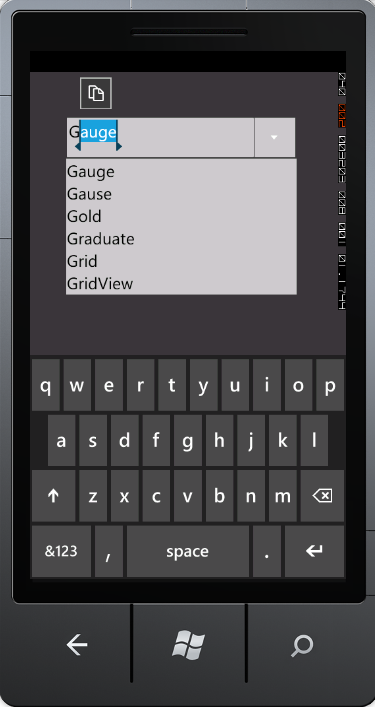

::: {style="DISPLAY: none"}
{#d2h_url_template}{#d2h_package_url style="WIDTH: 0px; DISPLAY: none; HEIGHT: 0px"}
:::

::: {.d2h_secondary_topic style="PADDING-BOTTOM: 10pt; MARGIN: 0pt; PADDING-LEFT: 0pt; PADDING-RIGHT: 0pt; PADDING-TOP: 0pt"}
#### Auto Append Support {#auto-append-support style="tab-stops: 0pt"}

Auto Append is used to guide the complete text by appending the entered text with suitable text from the data source, when a text is entered in the AutoComplete textbox. AutoComplete allows you to enable Auto Append using the *IsAutoAppend* property.

 

 

{border="0"}

Figure 19: Auto Append

 

Adding Auto Append Support to an Application

Set the *IsAutoAppend* property to True. The AutoComplete will guide you to complete the text, by appending the entered text with suitable text from the data source. If this property is set to False, the matched suitable text will not be appended with the entered text.

The following code illustrates how to enable Auto Append support to an Application: 

 

+----------------------------------------------------------------------------------------------------------------------------------------------------------------------------------------------------------------------------------------------------------------------------------------------------------------------------------------------------------------------------------------------------------------------------------------------------------------------------------------------------------------------------------------------------------------------------------------------------------------------------------------------------+
| **[\[XAML\]]{style="FONT-FAMILY: 'Courier New'"}**                                                                                                                                                                                                                                                                                                                                                                                                                                                                                                                                                                                                 |
|                                                                                                                                                                                                                                                                                                                                                                                                                                                                                                                                                                                                                                                    |
| [\<]{style="FONT-FAMILY: 'Courier New'; COLOR: blue"}[syncfusion]{style="FONT-FAMILY: 'Courier New'; COLOR: #a31515"}[:]{style="FONT-FAMILY: 'Courier New'; COLOR: blue"}[AutoComplete]{style="FONT-FAMILY: 'Courier New'; COLOR: #a31515"}[ x]{style="FONT-FAMILY: 'Courier New'; COLOR: red"}[:]{style="FONT-FAMILY: 'Courier New'; COLOR: blue"}[Name]{style="FONT-FAMILY: 'Courier New'; COLOR: red"}[=\"AutoComplete1\"]{style="FONT-FAMILY: 'Courier New'; COLOR: blue"}[ IsAutoAppend]{style="FONT-FAMILY: 'Courier New'; COLOR: red"}[=\"true\"/\>]{style="FONT-FAMILY: 'Courier New'; COLOR: blue"}[]{style="FONT-FAMILY: 'Courier New'"} |
+----------------------------------------------------------------------------------------------------------------------------------------------------------------------------------------------------------------------------------------------------------------------------------------------------------------------------------------------------------------------------------------------------------------------------------------------------------------------------------------------------------------------------------------------------------------------------------------------------------------------------------------------------+

 

+----------------------------------------------------------------------------------------------------------------------------------------------------------------------------------------------------------------------------------------+
| **[\[C#\]]{style="FONT-FAMILY: 'Courier New'"}**                                                                                                                                                                                       |
|                                                                                                                                                                                                                                        |
| [AutoComplete]{style="FONT-FAMILY: 'Courier New'; COLOR: teal"}[ autoComplete1 = [new]{style="COLOR: blue"} [AutoComplete]{style="COLOR: teal"}();]{style="FONT-FAMILY: 'Courier New'"}                                                |
|                                                                                                                                                                                                                                        |
| [this]{style="FONT-FAMILY: 'Courier New'; COLOR: blue"}[.]{style="FONT-FAMILY: 'Courier New'"}[autoComplete1]{style="FONT-FAMILY: 'Courier New'"}[.IsAutoAppend = [true]{style="COLOR: #2b91af"};]{style="FONT-FAMILY: 'Courier New'"} |
+----------------------------------------------------------------------------------------------------------------------------------------------------------------------------------------------------------------------------------------+

 

 

Tables for Property, and Event

 

Property

          Table 7: Property Table for Auto Append

  -------------- ------------------------------------------------------------- -------------------- ------------ -----------------
  Property       Description                                                   Type                 Data Type    Reference links
  IsAutoAppend   Gets or sets the value of IsAutoAppend in the AutoComplete.   DependencyProperty   bool(true)   
  -------------- ------------------------------------------------------------- -------------------- ------------ -----------------

 

 

Event

Table 8: Event Table for Auto Append

+---------------------+-------------------------------------------------------------------------+------------------------------------+-----------------------------------+-----------------+
| Event               | Description                                                             | Arguments                          | Type                              | Reference links |
+---------------------+-------------------------------------------------------------------------+------------------------------------+-----------------------------------+-----------------+
| IsAutoAppendChanged | When the value of IsAutoAppend is changed this event will be triggered. | DependencyObject,                  | DependencyPropertyChangedCallBack |                 |
|                     |                                                                         |                                    |                                   |                 |
|                     | This cannot be cancelled.                                               | DependencyPropertyChangedEventArgs |                                   |                 |
+=====================+=========================================================================+====================================+===================================+=================+

 

Sample Link

To access a Basic Core Features demo:

1.  Open the Syncfusion Dashboard.

2.  Click the **Windows Phones** drop-down list and select **Explore Samples**.

3.  Navigate to **WindowsPhoneSampleBrowser-\> Tools -\> AutoComplete Demo**

[]{#related-topics}
:::
