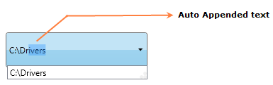

::: {style="DISPLAY: none"}
{#d2h_url_template}{#d2h_package_url style="WIDTH: 0px; DISPLAY: none; HEIGHT: 0px"}
:::

::::: {.d2h_secondary_topic style="PADDING-BOTTOM: 10pt; MARGIN: 0pt; PADDING-LEFT: 0pt; PADDING-RIGHT: 0pt; PADDING-TOP: 0pt"}
#### Auto Append Support {#auto-append-support style="tab-stops: 0pt"}

Auto Append is used to guide the complete text by appending the entered text with suitable text from the data source, when a text is entered in the AutoComplete textbox. AutoComplete allows you to enable Auto Append using **IsAutoAppend** property.

 

{border="0"}

Figure 29: Auto Append

 

 

Adding Auto Append Support to an Application

If the **IsAutoAppend** property is set as True, once you enter the text the AutoComplete guides you to complete text, by appending the entered text with suitable text from the data source. If this property is set as False the matched suitable text will not append with the entered text.

 

+----------------------------------------------------------------------------------------------------------------------------------------------------------------------------------------------------------------------------------------------------------------------------------------------------------------------------------------------------------------------------------------------------------------------------------------------------------------------------------------------------------------------------------------------------------------------------------------------------------------------------------------------------+
| **[\[XAML\]]{style="FONT-FAMILY: 'Courier New'"}**                                                                                                                                                                                                                                                                                                                                                                                                                                                                                                                                                                                                 |
|                                                                                                                                                                                                                                                                                                                                                                                                                                                                                                                                                                                                                                                    |
| [\<]{style="FONT-FAMILY: 'Courier New'; COLOR: blue"}[syncfusion]{style="FONT-FAMILY: 'Courier New'; COLOR: #a31515"}[:]{style="FONT-FAMILY: 'Courier New'; COLOR: blue"}[AutoComplete]{style="FONT-FAMILY: 'Courier New'; COLOR: #a31515"}[ x]{style="FONT-FAMILY: 'Courier New'; COLOR: red"}[:]{style="FONT-FAMILY: 'Courier New'; COLOR: blue"}[Name]{style="FONT-FAMILY: 'Courier New'; COLOR: red"}[=\"AutoComplete1\"]{style="FONT-FAMILY: 'Courier New'; COLOR: blue"}[ IsAutoAppend]{style="FONT-FAMILY: 'Courier New'; COLOR: red"}[=\"true\"/\>]{style="FONT-FAMILY: 'Courier New'; COLOR: blue"}[]{style="FONT-FAMILY: 'Courier New'"} |
+----------------------------------------------------------------------------------------------------------------------------------------------------------------------------------------------------------------------------------------------------------------------------------------------------------------------------------------------------------------------------------------------------------------------------------------------------------------------------------------------------------------------------------------------------------------------------------------------------------------------------------------------------+

 

+-------------------------------------------------------------------------------------------------------------------------------------------------------------------------------------------------------------------------------------------------------------------------------------------+
| **[\[C#\]]{style="FONT-FAMILY: 'Courier New'"}**                                                                                                                                                                                                                                          |
|                                                                                                                                                                                                                                                                                           |
| [AutoComplete]{style="FONT-FAMILY: 'Courier New'; COLOR: teal"}[ autoComplete1 = [new]{style="COLOR: blue"} [AutoComplete]{style="COLOR: teal"}();]{style="FONT-FAMILY: 'Courier New'"}                                                                                                   |
|                                                                                                                                                                                                                                                                                           |
| [this]{style="FONT-FAMILY: 'Courier New'; COLOR: blue"}[.]{style="FONT-FAMILY: 'Courier New'"}[autoComplete1]{style="FONT-FAMILY: 'Courier New'"}[.IsAutoAppend = [true]{style="COLOR: #2b91af"};]{style="FONT-FAMILY: 'Courier New'"}[]{style="FONT-FAMILY: Consolas; FONT-SIZE: 9.5pt"} |
+-------------------------------------------------------------------------------------------------------------------------------------------------------------------------------------------------------------------------------------------------------------------------------------------+

 

Tables for properties, and events

Properties

Table 9: Property Table for Auto Append

::: {align="center"}
  -------------- ------------------------------------------------------------- -------------------- ------------ -----------------
  Property       Description                                                   Type                 Data Type    Reference links
  IsAutoAppend   Gets or sets the value of IsAutoAppend in the AutoComplete.   DependencyProperty   bool(true)   
  -------------- ------------------------------------------------------------- -------------------- ------------ -----------------
:::

**[]{style="FONT-FAMILY: 'Trebuchet MS','sans-serif'; COLOR: #15428b; FONT-SIZE: 9pt"}** 

Events

Table 10: Event Table for Auto Append

::: {align="center"}
+---------------------+-----------------------------------------------------------------------+------------------------------------+-------------------+---------------------------------+
| Event               | Description                                                           | Arguments                          | Type              | Reference links                 |
+---------------------+-----------------------------------------------------------------------+------------------------------------+-------------------+-------------------+-------------+
| IsAutoAppendChanged |  When the value of IsAutoAppend changed this event will be triggered. | DependencyObject,                  | DependencyPropertyChangedCallBack     |             |
|                     |                                                                       |                                    |                                       |             |
|                     | It cannot be cancelled.                                               | DependencyPropertyChangedEventArgs |                                       |             |
+=====================+=======================================================================+====================================+===================+===================+=============+
|                     |                                                                       |                                    |                   |                   |             |
+---------------------+-----------------------------------------------------------------------+------------------------------------+-------------------+-------------------+-------------+
:::

**[]{style="FONT-FAMILY: 'Trebuchet MS','sans-serif'; COLOR: #15428b; FONT-SIZE: 9pt"}** 

Sample Link

WPF Sample Browser-\> Tools -\> Editors -\> AutoComplete Demo

 

[]{#related-topics}
:::::
