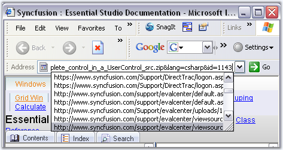
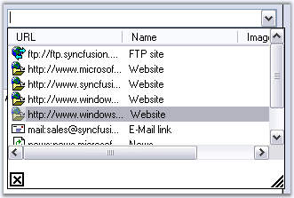

::: {style="DISPLAY: none"}
{#d2h_url_template}{#d2h_package_url style="WIDTH: 0px; DISPLAY: none; HEIGHT: 0px"}
:::

::: {.d2h_secondary_topic style="PADDING-BOTTOM: 10pt; MARGIN: 0pt; PADDING-LEFT: 0pt; PADDING-RIGHT: 0pt; PADDING-TOP: 0pt"}
#### AutoComplete {#autocomplete style="tab-stops: 0pt"}

 

The AutoComplete control is an extender control that provides AutoCompletion services to any edit control on the same form as the AutoComplete control.

 

AutoCompletion can be defined as prompting the user with probable matches during data entry. This feature is similar to the AutoCompletion of the web addresses in the Internet Explorer address box.

[]{style="COLOR: #15428b"} 

{border="0"}

***[]{style="COLOR: #15428b"}*** 

Figure 110: AutoCompletion in Internet Explorer

**[]{style="COLOR: #15428b"}** 

**AutoCompletion** is a feature enhancement for edit controls. It expands strings that have been partially entered in an edit control into complete strings based on a list of previously specified strings.

 

[]{#p161}{border="0"}

***[]{style="COLOR: #15428b"}*** 

Figure 111: AutoComplete Control Implemented on a ComboBox

***[]{style="COLOR: #15428b"}*** 

For example, when a user starts to enter an URL in the Address edit control that is embedded in the Microsoft Internet Explorer navigation toolbar, autocompletion expands the string into one or more complete URLs that are consistent with the existing partial string. A partial URL string such as \"sync\" might be expanded to \"http://www.syncfusion.com\" or \"http://www.syncfusion.com/faq/winforms\". This feature will be useful in windows applications that require collecting frequently repeated input from the user.

 

The .NET framework does not provide any built-in support for providing autocompletion in the System.Windows.Forms.Textbox or System.Windows.Forms.Combobox classes. The Essential Tools **AutoComplete class** provides an easy way of adding autocompletion to edit controls in an application. Autocompletion is typically used with edit controls (text box controls) or with controls that have an embedded edit control (such as combo box controls).

 

The AutoComplete class is implemented as an **Extender Provider** similar to the **ToolTip control** in the Windows Forms package.

[]{style="COLOR: #15428b"} 

See Also

[]{style="COLOR: #15428b"} 

[ComboBoxAutoComplete]{.UGHyperlink}[, ]{.UGHyperlink}[[Auto Append]{style="COLOR: blue"}]{.UGHyperlink}

More:

[ ]{#related-topics}

[{border="0" align="absMiddle"}Features](ms-xhelp:///?Id=760291b4-0749-4f4d-a5d6-7c137373dc86){style="TEXT-DECORATION: none"}

[{border="0" align="absMiddle"}Creating AutoComplete Control](ms-xhelp:///?Id=c9bf4fd6-eb14-4df3-bcee-c4a873589cbf){style="TEXT-DECORATION: none"}

[{border="0" align="absMiddle"}Concepts and Features](ms-xhelp:///?Id=777a4a54-3c5d-4b8d-a3e7-06afec5a915a){style="TEXT-DECORATION: none"}

[{border="0" align="absMiddle"}AutoComplete Events](ms-xhelp:///?Id=fe1e3a5c-300e-4045-ab32-870b91e2937e){style="TEXT-DECORATION: none"}

[{border="0" align="absMiddle"}Frequently Asked Questions](ms-xhelp:///?Id=5216e8f5-e5f2-4611-90ac-6d7cb9aa2229){style="TEXT-DECORATION: none"}
:::
