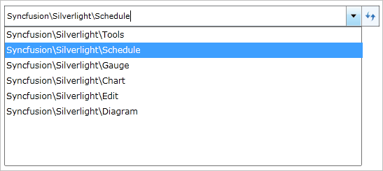

::: {style="DISPLAY: none"}
{#d2h_url_template}{#d2h_package_url style="WIDTH: 0px; DISPLAY: none; HEIGHT: 0px"}
:::

::: {.d2h_secondary_topic style="PADDING-BOTTOM: 10pt; MARGIN: 0pt; PADDING-LEFT: 0pt; PADDING-RIGHT: 0pt; PADDING-TOP: 0pt"}
##### AutoComplete {#autocomplete style="tab-stops: 0pt"}

1.   Click the **HierarchyNavigatorItemsControl**, to start the Edit mode, which enables the AutoComplete function.

2.   Type a navigation path to display a list of navigation items below the HierarchyNavigatorItemsControl from which you can select.

 

{border="0"}

 

Figure 576: Navigation items list in Edit mode

[]{#related-topics}
:::
